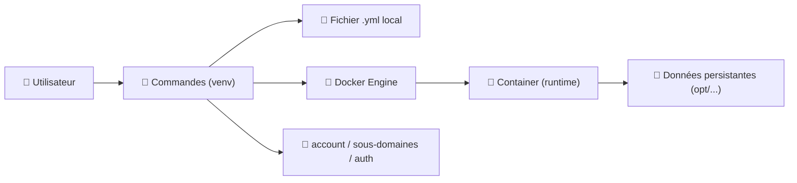
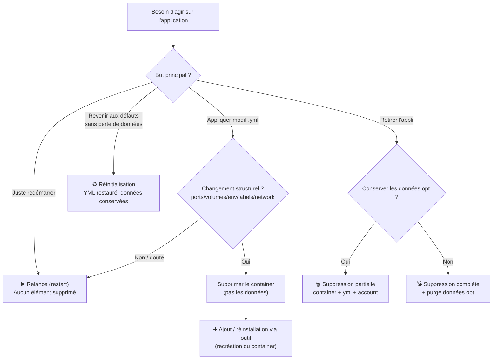
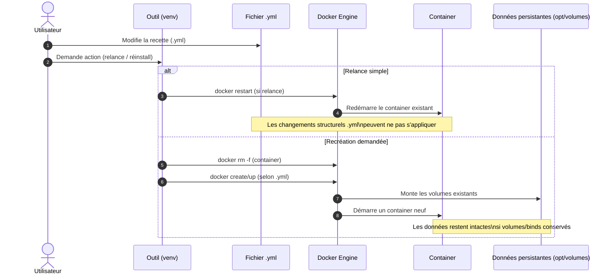

!!! abstract "Abstract"
    Ce guide clarifie **sans ambiguïté** la différence entre : **➕ Ajout**, **🗑 Suppression**, **♻️ Réinitialisation** et **▶️ Relance** d’une application Docker.  
    Il formalise le modèle “Application = 4 briques” (**container**, **.yml**, **données persistantes**, **account/auth/DNS**) et donne une méthode fiable pour appliquer les changements `.yml` **sans perdre de données**.

---

## TL;DR

- ✅ Une “application” Docker = **4 briques** : **container** + **.yml** + **données** + **account/auth/DNS**
- ✅ **Relance** = redémarrer le runtime (safe)
- ✅ **Réinitialisation** = revenir aux défauts (safe, données conservées)
- ✅ **Ajout** = (ré)installer en **recréant** le container (utile après modif `.yml`)
- ✅ **Suppression** = retirer l’appli (destructif partiel ou total)

??? tip "Raccourci mental (ultra simple)"
    - **Container** = exécution (ce qui tourne)
    - **YML** = intention / recette (comment recréer)
    - **Données** = précieux (à protéger)
    - **Account** = intégration (DNS/auth/métadonnées)

---

## Pourquoi ce guide est critique

Comprendre précisément la différence entre **AJOUT**, **SUPPRESSION**, **RÉINITIALISATION** et **RELANCE** permet d’éviter :

- 💥 Perte de données involontaire
- 🧨 Config écrasée sans retour arrière
- 🔁 Réinstallations inutiles
- 🧩 Changements `.yml` non appliqués (container non recréé)

!!! info "Objectif"
    Savoir **exactement** quelle brique tu touches **avant** d’exécuter une commande.

---

## Vision moderne : “Application” = 4 briques

Une application Docker dans ton écosystème, c’est :

1) 🧱 **Container (runtime)**
   - ce qui tourne
   - stoppable / relançable / supprimable

2) 📄 **Fichier `.yml` local (recette)**
   - ports, volumes, variables, labels, réseau, règles proxy
   - sert à recréer le container proprement

3) 💾 **Données persistantes** (ex. `opt/seedbox/docker/${USER}…`)
   - volumes / bind mounts
   - config applicative, DB, fichiers, état

4) 🔐 **Account / Auth / DNS**
   - sous-domaines
   - identifiants / tokens
   - métadonnées liées à l’appli

!!! example "Mini-exemple (à retenir)"
    - Tu modifies un port dans le `.yml` → c’est **la recette** → il faut **recréer** le container  
    - Tu modifies un réglage “dans l’UI” de l’appli → ça finit souvent dans **les données persistantes** → attention aux suppressions “complètes”

---

## Architecture globale (cycle de vie)



---

## Philosophie “Premium” (5 règles)

- ✅ Distinguer **CONFIG** (`.yml`) vs **DONNÉES** (volumes/`opt`)
- ✅ Ne jamais “réinstaller” quand un simple **restart** suffit
- ✅ Si tu changes le `.yml` : **recrée le container**
- ✅ **Réinitialiser** = revenir aux défauts **sans toucher aux données**
- ✅ **Supprimer** = destructif (partiel ou total selon mode)

!!! warning "Piège n°1 (le plus fréquent)"
    Modifier le `.yml` puis faire uniquement une **relance** :  
    Docker redémarre souvent **le même container**, et tes changements structurels peuvent **ne pas s’appliquer**.

---

## 1) ➕ Ajout d’une application (installation / réinstallation propre)

### Objectif

- Installer une application de zéro
- OU réinstaller proprement après modification du `.yml`

### Fonctionnement

- Déploie l’application selon le `.yml` local
- Applique les changements du `.yml` **uniquement si** le container est **recréé**

!!! info "Quand l’utiliser"
    - première installation
    - après un changement structurel : ports, volumes, variables, labels, réseau

### Bonne pratique (standard)

Avant de relancer une installation après modification du `.yml`, supprime le container existant :

```bash
docker rm -f nom_du_container
```

Puis relance l’installation (via ton outil) :

```bash
launch_service app
```

??? example "Exemple concret"
    Tu changes `ports:` ou `environment:` dans le `.yml` → fais :
    1) `docker rm -f nom_du_container`
    2) `launch_service app`

---

## 2) 🗑 Suppression d’une application

### Objectif

Retirer l’application de l’écosystème en supprimant les éléments associés.

### Supprime (selon la commande)

- le fichier `.yml` local
- le container
- les informations d’authentification
- les sous-domaines dans le fichier account
- les données sous `opt/seedbox/docker/${USER}` (**uniquement en mode complet**)

!!! danger "Destructif"
    Une suppression **complète** peut supprimer aussi les données persistantes (`opt/…`).  
    Sans backup, c’est **irréversible**.

### Impact

- **PARTIELLE** : supprime container + yml + account, conserve les données `opt`
- **COMPLÈTE** : supprime aussi les données `opt`

??? tip "Règle de survie"
    Si tu as un doute : commence par une **suppression partielle**.  
    Tu peux toujours supprimer les données ensuite, mais pas l’inverse.

---

## 3) ♻️ Réinitialisation d’un container

### Objectif

Revenir à une base “propre” sans perdre les données utilisateurs.

### Action

- restaure le fichier `.yml` d’origine
- applique les paramètres par défaut

### Données conservées

- données utilisateurs **conservées**
- fichier account **non modifié**

!!! info "Cas d’usage"
    - annuler une config “tordue”
    - repartir “clean” sans toucher au stockage persistant

---

## 4) ▶️ Relance d’un container

### Objectif

Redémarrer l’application sans rien supprimer.

### Action

- arrête puis relance un container existant
- ne supprime aucun paramètre personnalisé

### Données conservées

- données utilisateurs
- paramètres personnalisés
- fichier account

!!! info "Cas d’usage"
    - service bloqué/instable → restart
    - maintenance simple
    - petits changements ne touchant pas la structure

!!! warning "Quand ça ne suffit pas"
    Si tu as modifié le `.yml` et que le changement est **structurel**, une relance peut ne pas suffire : il faut souvent **recréer** le container.

---

## Commandes rapides (depuis le venv)

=== "Suppression standard"
    ```bash
    suppression_appli app
    ```

    Supprime :
    - le container
    - les informations dans account
    - le fichier `.yml` local

=== "Suppression complète"
    ```bash
    suppression_appli app 1
    ```

    Supprime :
    - le container
    - les informations dans account
    - le fichier `.yml` local
    - les données sous `opt`

=== "Installation rapide"
    ```bash
    launch_service app
    ```

    Installe l’application demandée.

---

## Résumé comparatif

| Action | Supprime données | Supprime yml | Supprime account | Conserve config |
|--------|------------------|--------------|------------------|----------------|
| Ajout | NON | NON | NON | NON |
| Suppression | OUI (selon mode) | OUI | OUI | NON |
| Réinitialisation | NON | Restaure origine | NON | NON |
| Relance | NON | NON | NON | OUI |

!!! success "Lecture instantanée"
    - **Relance** = *safe*  
    - **Réinitialisation** = *safe + retour défauts*  
    - **Ajout** = *recrée (applique le yml)*  
    - **Suppression** = *destructif (partiel/total)*

---

## Bonne pratique (ultra simple)

Avant d’agir, pose-toi **UNE** question :

> “Je veux appliquer une modif de config, revenir à l’origine, juste redémarrer, ou tout supprimer ?”

- Appliquer modif `.yml` → **supprime le container** → relance installation
- Revenir à l’origine sans perdre données → **réinitialisation**
- Juste redémarrer → **relance**
- Tout effacer → **suppression complète**

---

## Erreurs fréquentes

- ❌ Modifier le `.yml` et penser qu’un restart suffit
- ❌ Lancer une suppression complète au lieu d’un reset
- ❌ Confondre “réinitialisation” (safe) et “suppression” (destructif)
- ❌ Oublier que les données sous `opt` sont la partie critique

!!! tip "Antidote"
    Si tu hésites : identifie **la brique** que tu veux toucher (container / yml / données / account) avant toute commande.

---

## Conclusion

Une gestion premium, c’est :
- savoir ce que tu touches (**container / yml / données / account**)
- choisir l’action adaptée
- éviter les destructions involontaires

Résultat :
- 🧠 Moins d’erreurs
- 💾 Zéro perte de données surprise
- ⚡ Maintenance plus rapide
- 🛡 Exploitation propre et fiable

---

## Diagramme de décision (Ajout vs Relance vs Reset vs Suppression)



---

## Diagramme de séquence (application d’un changement `.yml`)

