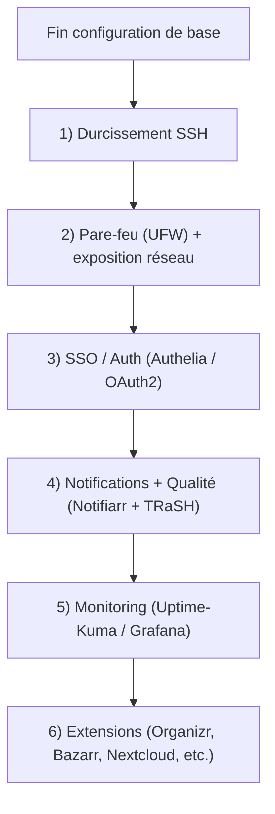
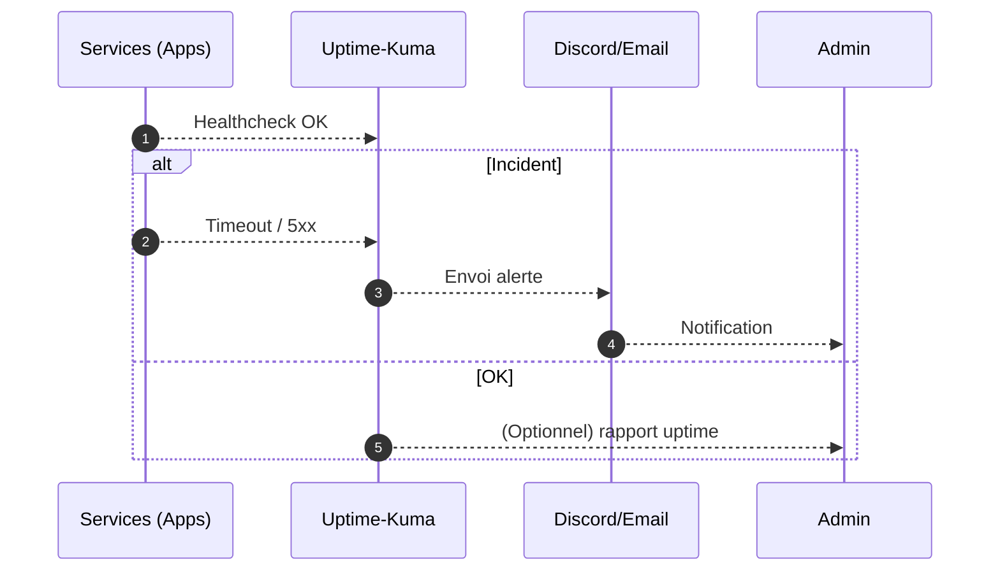

!!! abstract "Abstract"
    La configuration initiale est terminée. Cette section propose une **feuille de route ULTRA premium** pour renforcer la **sécurité**, augmenter la **fiabilité** et améliorer l’**expérience utilisateur** :  
    - durcissement SSH (sans lock-out)  
    - pare-feu (UFW) + bonnes pratiques d’exposition réseau  
    - authentification/SSO (Authelia/OAuth2)  
    - optimisation Cloudflare (perf + sécurité)  
    - notifications & qualité (TRaSH + Notifiarr)  
    - monitoring (Uptime-Kuma, Grafana/Prometheus)  
    - extensions (Organizr, Bazarr, Readarr, Nextcloud, Home Assistant…)

---

## TL;DR (ce qu’il faut faire ensuite)

1) 🔐 **SSH** : root off + clés + tests + reload sécurisé  
2) 🧱 **UFW** : n’exposer que le nécessaire + valider l’accès SSH  
3) 🪪 **SSO** : Authelia/OAuth2 pour centraliser et durcir les accès web  
4) 🔔 **Notifs** : Notifiarr / Discord / alerting services  
5) 📈 **Monitoring** : Uptime-Kuma + (option) Grafana/Prometheus  
6) 🧩 **Qualité média** : TRaSH-Guides + sync cohérente

??? tip "Raccourci mental"
    Sécurité d’abord (**SSH + UFW**) → puis **SSO** → puis **alertes/monitoring** → puis **confort média** (TRaSH/Notifiarr).

---

## Recommandations prioritaires (ordre conseillé)



---

## Pré-checklist (avant de toucher à la sécurité)

- [ ] Vous avez **un accès console** / KVM / panel VPS (au cas où)
- [ ] Vous avez **au moins une clé SSH** fonctionnelle sur votre utilisateur
- [ ] Vous gardez **une session SSH ouverte** pendant les changements
- [ ] Vous notez votre IP / réseau d’administration (si vous restreignez UFW)

!!! danger "Risque principal (lock-out)"
    Les seules opérations réellement dangereuses ici sont celles qui peuvent vous **verrouiller l’accès** (SSH/UFW).  
    **Règle d’or : tester avant d’appliquer définitivement.**

---

## Amélioration de la sécurité SSH (durcissement propre)

### Objectifs

- Interdire le login root
- Privilégier les **clés** (et éventuellement couper le mot de passe)
- Optionnel : changer le port (utile surtout contre le bruit de scan)

---

### Étape 1 — Modifier `sshd_config`

```bash
sudo nano /etc/ssh/sshd_config
```

Appliquez ces changements **minimaux** :

```text
PermitRootLogin no
PubkeyAuthentication yes
PermitEmptyPasswords no
```

Option **ULTRA** (si votre clé est OK) :

```text
PasswordAuthentication no
MaxAuthTries 3
```

Option port non-standard (ex : 2222) :

```text
Port 2222
```

!!! warning "Avant de désactiver le mot de passe"
    Vérifiez qu’une connexion par clé fonctionne déjà :
    - ouvrez un **nouveau terminal** et testez une connexion SSH
    - ne fermez pas votre session actuelle

---

### Étape 2 — Valider la config et recharger (moins risqué qu’un restart)

Test de syntaxe :

```bash
sudo sshd -t
```

Rechargez la configuration :

```bash
sudo systemctl reload sshd
```

Si `reload` n’est pas disponible :

```bash
sudo systemctl restart sshd
```

---

### Étape 3 — Test de connexion (obligatoire)

- Port standard :
  ```bash
  ssh user@host
  ```
- Port changé :
  ```bash
  ssh -p 2222 user@host
  ```

!!! success "Critère de réussite"
    Vous devez pouvoir ouvrir **une nouvelle session** SSH après modification.

??? example "Scénario safe (sans stress)"
    1) Vous gardez une session ouverte  
    2) Vous modifiez `sshd_config`  
    3) `sshd -t` → OK  
    4) `systemctl reload sshd`  
    5) Vous testez une **nouvelle** connexion  
    6) Seulement ensuite : vous désactivez `PasswordAuthentication` (si voulu)

---

## Pare-feu (UFW) — baseline

### Principes

- Autoriser **SSH** (sinon lock-out)
- N’ouvrir que ce qui doit être exposé (souvent : 80/443 via reverse proxy)
- Tout le reste doit rester interne (Docker networks, LAN, etc.)

!!! warning "Ordre critique"
    Autorisez SSH **avant** d’activer UFW.

---

### Baseline (exemple générique)

```bash
sudo apt update && sudo apt install -y ufw
sudo ufw default deny incoming
sudo ufw default allow outgoing
```

Autoriser SSH (adapter le port) :

```bash
# Port standard
sudo ufw allow 22/tcp

# Si SSH sur 2222
sudo ufw allow 2222/tcp
```

Autoriser web (si reverse proxy) :

```bash
sudo ufw allow 80/tcp
sudo ufw allow 443/tcp
```

Activer et vérifier :

```bash
sudo ufw enable
sudo ufw status verbose
```

!!! success "Critère de réussite"
    - `ufw status verbose` = **active**
    - une **nouvelle** connexion SSH fonctionne

??? tip "Bon pattern (exposition minimale)"
    Expose publiquement **80/443** (reverse proxy)  
    et évite d’exposer directement des ports applicatifs (Portainer, DB, admin panels…).

---

## Auth / SSO (sécurisation des accès web)

### Pourquoi

- Centraliser les accès
- Ajouter 2FA / policies
- Réduire l’exposition d’interfaces admin

Options typiques :
- **Authelia** (SSO/2FA/policies)
- **OAuth2** (selon stack)

!!! tip "Pattern recommandé"
    Reverse proxy + SSO devant toutes les apps sensibles (Portainer, dashboards, outils admin).

??? example "Ordre efficace"
    1) Mettre SSO sur Traefik  
    2) Protéger Portainer / panels  
    3) Étendre progressivement à toutes les apps exposées

---

## Cloudflare (optimisation + sécurité)

Objectifs :
- Performance (cache, routage)
- Sécurité (règles, protections brute-force, bot fight)

!!! info "Référence SSDV2"
    Utilisez la page `Installation/optimisation-cloudflare.md` de votre doc.

!!! warning "Streaming & cache"
    Pour Plex/Emby/Jellyfin, appliquez des règles de bypass cache (page rules / règles équivalentes), sinon vous risquez des comportements anormaux et des soucis de conformité.

---

## Notifications & qualité (TRaSH + Notifiarr)

### TRaSH-Guides

- Standards de qualité, profils, scores, indexeurs
- Base incontournable pour Sonarr/Radarr “propres”

### Notifiarr

- Sync de configurations (alignée TRaSH)
- Notifications (Discord, événements, santé)
- Moins d’erreurs silencieuses

!!! tip "Valeur ajoutée"
    La combo TRaSH + Notifiarr = cohérence + moins de drift + meilleur feedback (alertes).

---

## Monitoring & exploitation

### Simple (recommandé)

- **Uptime-Kuma** : disponibilité + alertes
- **Glances** : vue ressources rapide

### Avancé

- **Prometheus** : collecte de métriques
- **Grafana** : dashboards, alerting, observabilité



!!! success "Critère de réussite"
    Vous recevez une alerte **utile** (et pas du spam) quand un service tombe, et vous pouvez réagir vite.

---

## Applications complémentaires (selon besoins)

- **Organizr** : portail unifié
- **Bazarr** : sous-titres automatiques
- **Lidarr** : musique
- **Readarr** : livres/ebooks *(nom courant : Readarr)*
- **Mylar** : comics
- **Calibre-Web** : ebooks via web
- **Requestrr** : demandes via Discord/Telegram
- **Jackett** : indexeurs/trackers (alt/complément)
- **Jellyfin** : alternative open-source à Plex
- **Whisparr** : gestion adulte *(isolation recommandée)*

!!! info "Ressource"
    `https://github.com/Ravencentric/awesome-arr`

??? tip "Hygiène d’exploitation"
    Ajoutez des apps **une par une** :
    - installe → configure → valide → monitor → seulement ensuite la suivante.

---

## Validation & rollback (ULTRA pro)

### Validation rapide (après changements SSH/UFW)

- [ ] Nouvelle connexion SSH OK
- [ ] UFW actif + statut cohérent
- [ ] Reverse proxy accessible (si exposé)
- [ ] Apps admin non exposées directement (si SSO en place)

!!! success "Definition of Done"
    Si SSH et UFW sont validés **sans lock-out**, le socle sécurité est en place.

---

### Rollback SSH (si problème)

Si vous avez accès console :
- Remettre temporairement le port / `PasswordAuthentication`
- `sudo sshd -t` puis `sudo systemctl restart sshd`

!!! danger "Plan de secours"
    Sans console/panel VPS, un mauvais réglage SSH peut vous bloquer.  
    Gardez **toujours** une session ouverte tant que ce n’est pas validé.

---

### Rollback UFW (si lock-out via console)

```bash
sudo ufw disable
```

---

## Feuille de route 30 / 60 / 90 jours

=== "J+30 — Sécurité & stabilité"
    - SSH durci + UFW baseline
    - Uptime-Kuma + alertes
    - Sauvegardes (configs + données critiques)

=== "J+60 — Confort & cohérence"
    - TRaSH appliqué + Notifiarr
    - Portail (Organizr)
    - Sous-titres (Bazarr) si besoin

=== "J+90 — Observabilité & évolutions"
    - Grafana/Prometheus (si utile)
    - Nextcloud (sauvegarde/partage)
    - Home Assistant (automatisations)

---

## Félicitations 🎉

Vous avez maintenant un socle solide et extensible.  
Le “vrai luxe” en self-hosting, c’est : **sécurité maîtrisée**, **monitoring**, **alertes utiles**, et **automatisations fiables**.

!!! success "Prochaine étape"
    Appliquez d’abord **SSH + UFW**, validez, puis ajoutez **SSO** et enfin **notifications/monitoring**.