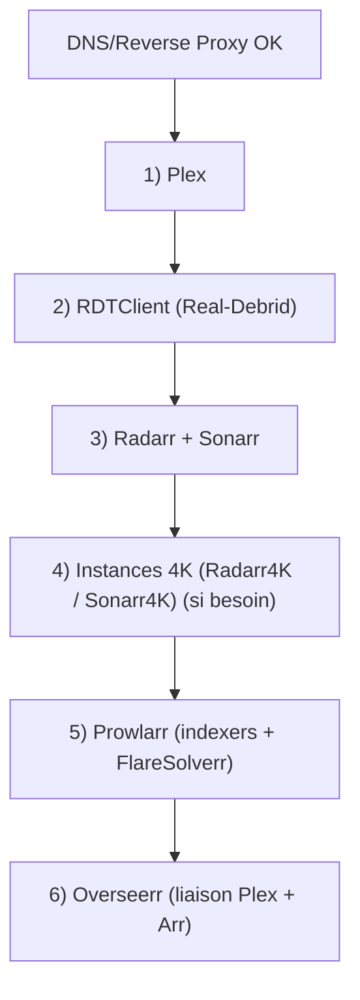
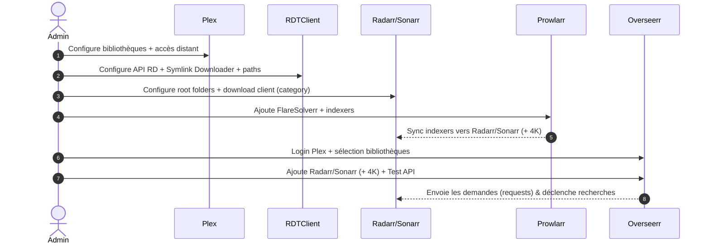

!!! abstract "Abstract"
    Cette page décrit l’ordre **recommandé** et les étapes **exactes** pour configurer les applications principales d’un serveur SSDV2 :  
    **Plex → RDTClient → Radarr/Sonarr (et 4K) → Prowlarr → Overseerr**.  
    Vous y trouverez : prérequis, checklists, chemins standardisés, paramètres clés, et diagrammes Mermaid (flow + séquence) afin d’assurer une intégration fiable et une gestion média sans friction.

---

## TL;DR

1) ✅ **DNS/Reverse proxy** OK (tous les sous-domaines accessibles)  
2) ✅ **Plex** : bibliothèques + accès distant validé  
3) ✅ **RDTClient** : API RD + paths corrects  
4) ✅ **Radarr/Sonarr** : root folders + download client (catégories)  
5) ✅ **(Option) 4K** : instances + staging `local/<category>`  
6) ✅ **Prowlarr** : FlareSolverr + indexers + sync apps  
7) ✅ **Overseerr** : Plex + bibliothèques + Arr (+ 4K) + tests API

??? tip "Principe premium"
    Si une étape échoue, **ne saute pas la suivante** : corrige et re-teste immédiatement.  
    90% des problèmes viennent de : **DNS**, **API keys**, **paths**, **categories**.

---

## Pré-requis (avant de commencer)

- Remplacez systématiquement `VOTRE_USER` par votre utilisateur Linux.
- Vérifiez que vos DNS / reverse-proxy sont opérationnels pour :
  - `plex.votre_domaine.fr`
  - `rdtclient.votre_domaine.fr`
  - `radarr.votre_domaine.fr`
  - `sonarr.votre_domaine.fr`
  - `prowlarr.votre_domaine.fr`
  - `overseerr.votre_domaine.fr`

Chemins utilisés dans ce guide (référence) :

- Médias :
  - `/home/VOTRE_USER/Medias/Films/`
  - `/home/VOTRE_USER/Medias/Series/`
  - `/home/VOTRE_USER/Medias/Films4K/`
  - `/home/VOTRE_USER/Medias/Series4K/`
- RDTClient (symlinks & mount) :
  - `Mapped path` : `/home/VOTRE_USER/local`
  - `Rclone mount path` : `/home/VOTRE_USER/seedbox/zurg/torrents`

!!! tip "Convention recommandée (zéro friction)"
    - **Root Folders** = dossiers finaux (Films/Series/4K)
    - **Download staging** = `/home/VOTRE_USER/local/<category>`
    - **Mount** = `/home/VOTRE_USER/seedbox/zurg/torrents`

??? example "Exemple de mapping mental"
    - Radarr télécharge en catégorie `radarr` → staging : `/home/VOTRE_USER/local/radarr`  
    - Sonarr télécharge en catégorie `sonarr` → staging : `/home/VOTRE_USER/local/sonarr`

---

## Ordre recommandé (très important)



---

## Checklist de validation (à cocher au fur et à mesure)

- [ ] Plex accessible et bibliothèques créées
- [ ] Accès distant Plex validé
- [ ] RDTClient configuré + API Real-Debrid OK
- [ ] Radarr root folder + download client OK
- [ ] Sonarr root folder + download client OK
- [ ] (Option) Radarr4K/Sonarr4K OK + dossiers `local` créés
- [ ] Prowlarr : FlareSolverr + indexers + sync apps OK
- [ ] Overseerr : Plex + bibliothèques + Radarr/Sonarr (et 4K) OK

---

## Plex

Accédez à Plex via `plex.votre_domaine.fr`, nommez votre serveur et assurez-vous que la case :

- **“M'autoriser à accéder à mes médias en dehors de ma maison”** est **cochée**.

### Ajouter les bibliothèques (Films / Séries / 4K)

**Médiathèque** : ajoutez vos dossiers de médias sous `/home/VOTRE_USER/Medias/`.

!!! tip "Optimisation stockage/CPU"
    Désactivez la **création de miniatures vidéo** (très coûteux) dans les options avancées de la bibliothèque.

#### Étape par étape

1. Dans Plex : `Ajouter une bibliothèque`
2. Choisissez `Films` ou `Séries TV`
3. Renommez si besoin (ex. “Films 4K”, “Séries 4K”)
4. `Ajouter des dossiers`
5. `Parcourir` → sélectionnez le dossier média  
   Exemple : `/home/VOTRE_USER/Medias/Films`
6. Confirmez avec `Ajouter`
7. `Avancé`
8. Décochez `Activer les miniatures des vidéos`
9. Ajustez selon préférences
10. `Suivant` → `Terminé`

### Paramètres serveur Plex recommandés

Une fois sur l’accueil Plex : **Paramètres serveur** → menu latéral gauche :

- **Accès à distance**
  - Cochez **“Spécifier un port public manuellement”** (32400 par défaut)
  - Cliquez sur **“Réessayer”**

- **Bibliothèque**
  - ✅ *Analyser ma bibliothèque automatiquement* : **coché**
  - ✅ *Lancer un scan partiel quand un changement est détecté* : **coché**
  - ⛔ *Vider la corbeille automatiquement après chaque scan* : **décoché**  
    (laisse du temps à Zurg de retrouver des contenus manquants en cas de suppressions RD)
  - ✅ *Autoriser la suppression de media* : **coché**
  - *Générer les aperçus vidéo miniatures* : **jamais**
  - *Générer les miniatures pour les chapitres* : **jamais**

!!! success "Validation Plex"
    - Bibliothèques visibles et indexées
    - Accès distant : **OK** (ou statut cohérent si réseau spécifique)

---

## RDTClient

Rendez-vous sur `rdtclient.votre_domaine.fr`, créez votre compte et saisissez votre **clé API Real-Debrid** disponible sur `http://real-debrid/api`.

Une fois sur la page d’accueil : **Settings**.

### General

- **Maximum parallel downloads** : `100`
- **Maximum unpack processes** : `100`
- Sauvegardez (bouton en bas)

### Download Client

- **Download client** : `Symlink Downloader`
- **Mapped path** : `/home/VOTRE_USER/local`
- **Rclone mount path** : `/home/VOTRE_USER/seedbox/zurg/torrents`
- Sauvegardez

### qBittorrent / *darr

- **Post Torrent Download Action** : `Download all files to host`
- **Post Download Action** : `Remove Torrent From Client`
- Décochez **Only download available files on debrid provider**
- **Minimum file size to download** : `10`
- Sauvegardez

!!! warning "Point critique (paths)"
    Les chemins `Mapped path` et `Rclone mount path` doivent correspondre **exactement** à votre installation (et à `VOTRE_USER`).  
    Sinon Radarr/Sonarr verront des chemins invalides → imports cassés.

??? tip "Test rapide"
    Si un import échoue : re-vérifiez d’abord **VOTRE_USER** et les paths RDTClient, avant de toucher à Radarr/Sonarr.

---

## Radarr

Allez sur `radarr.votre_domaine.fr` et définissez une authentification.

### Gestion des médias

`Settings` → `Media Management` → `Add Root Folder` :

- `/home/VOTRE_USER/Medias/Films/`

### Client de téléchargement (RDTClient)

`Settings` → `Download Clients` → ajouter qBittorrent avec :

- **Name**: `RDTClient`
- **Host**: `rdtclient`
- **Port**: `6500`
- **Username**: identifiant `rdtclient.votre_domaine.fr`
- **Password**: mot de passe `rdtclient.votre_domaine.fr`
- **Category**: `radarr`

!!! success "Validation Radarr"
    - Root folder ajouté
    - Download client “Test” OK

---

## Sonarr

Rendez-vous sur `sonarr.votre_domaine.fr` et configurez une authentification.

### Gestion des médias

`Settings` → `Media Management` → `Add Root Folder` :

- `/home/VOTRE_USER/Medias/Series/`

### Client de téléchargement (RDTClient)

Ajoutez qBittorrent comme pour Radarr mais avec :

- **Category**: `sonarr`

!!! success "Validation Sonarr"
    - Root folder ajouté
    - Download client “Test” OK

---

## Setups 4K (Radarr4K / Sonarr4K)

Répétez les étapes Radarr/Sonarr en ajustant :

- **Root Folder** :
  - Radarr4K → `/home/VOTRE_USER/Medias/Films4K/`
  - Sonarr4K → `/home/VOTRE_USER/Medias/Series4K/`
- **Category** :
  - Radarr4K → `radarr4k`
  - Sonarr4K → `sonarr4k`

### Créer les répertoires de staging RDTClient (obligatoire)

```bash
mkdir -p /home/VOTRE_USER/local/radarr4k
mkdir -p /home/VOTRE_USER/local/sonarr4k
```

!!! tip "Bon pattern"
    Un dossier `local/<category>` par instance évite les collisions et simplifie le troubleshooting.

!!! success "Validation 4K"
    - Root folders 4K configurés
    - Dossiers `local/radarr4k` et `local/sonarr4k` créés

---

## Prowlarr

Rendez-vous sur `prowlarr.votre_domaine.fr` et définissez une authentification.

### 1) Configurer FlareSolverr

`Settings` → `Indexers` → Ajouter FlareSolverr :

- **Tags**: `flaresolverr`  
  *(appuyer sur Entrée pour valider la création du tag, il doit apparaître comme une étiquette)*
- **Host**: `http://flaresolverr:8191/`

### 2) Configurer les indexers

Retournez à la page d’accueil Prowlarr et ajoutez vos indexers.

Si vous voyez un message indiquant que FlareSolverr est requis, ajoutez le **tag** créé :

- Exemple de message :
  

- Ajout du tag :
  

!!! warning "Symptôme"
    Un indexer qui échoue systématiquement “JS challenge / Cloudflare / captcha” nécessite souvent FlareSolverr.

### 3) Lier les applications (Radarr/Sonarr + 4K)

`Settings` → `Apps` → Ajoutez vos instances :

=== "Radarr"
    - **Prowlarr Server**: `http://prowlarr:9696/`
    - **Radarr Server**: `http://radarr:7878`
    - **API Key**: `Radarr` → `Settings` → `General`

=== "Radarr4K"
    - **Prowlarr Server**: `http://prowlarr:9696`
    - **Radarr Server**: `http://radarr4k:7878`
    - **API Key**: `Radarr4K` → `Settings` → `General`

=== "Sonarr"
    - **Prowlarr Server**: `http://prowlarr:9696`
    - **Sonarr Server**: `http://sonarr:8989`
    - **API Key**: `Sonarr` → `Settings` → `General`

=== "Sonarr4K"
    - **Prowlarr Server**: `http://prowlarr:9696`
    - **Sonarr Server**: `http://sonarr4k:8989`
    - **API Key**: `Sonarr4K` → `Settings` → `General`

Ensuite cliquez sur :

- `Sync App Indexers`

!!! success "Objectif"
    Un seul endroit (Prowlarr) pour gérer les indexers, synchronisé automatiquement vers toutes vos instances.

---

## Overseerr

Rendez-vous sur `overseerr.votre_domaine.fr` et connectez-vous avec votre compte Plex.

### Configuration du serveur Plex

Renseignez :

- **Hostname or IP Address**: `plex`
- **Port**: `32400`
- `Save Changes`

### Sélection des bibliothèques

- Cochez **toutes** vos bibliothèques Plex
- `Continue`

### Ajouter Radarr / Sonarr (instances par défaut)

#### Radarr (Default)

- ✅ **Default Server** : coché
- ⛔ **4K Server** : décoché

Paramètres :

- **Server Name**: `Radarr`
- **Hostname or IP Address**: `radarr`
- **Port**: `7878`
- **Use SSL**: décoché
- **API Key**: `radarr.votre_domaine.fr/settings/general`
  - Cliquez **Test** (obligatoire pour débloquer la suite)
- **URL Base**: vide
- **Quality Profile**: selon préférence
- **Root Folder**: choix proposé
- **Minimum Availability**: selon préférence
- **Tags**: vide
- ✅ **Enable Scan**
- ✅ **Enable Automatic Search**
- ⛔ **Tag Requests** : décoché

#### Sonarr (Default)

- ✅ **Default Server** : coché
- ⛔ **4K Server** : décoché

Paramètres :

- **Server Name**: `Sonarr`
- **Hostname or IP Address**: `sonarr`
- **Port**: `8989`
- **Use SSL**: décoché
- **API Key**: `sonarr.votre_domaine.fr/settings/general`
  - Cliquez **Test**
- **URL Base**: vide
- **Quality Profile**: selon préférence
- **Root Folder**: choix proposé
- **Language Profile**: Deprecated
- **Tags**: vide
- **Anime Quality Profile**: selon préférence
- **Anime Root Folder**: choix proposé
- ✅ **Season Folders**
- ✅ **Enable Scan**
- ✅ **Enable Automatic Search**
- ⛔ **Tag Requests** : décoché

!!! warning "Point critique (Overseerr)"
    Si **Test** échoue :
    - vérifiez `Hostname` interne (`radarr`, `sonarr`, etc.)
    - vérifiez le port
    - vérifiez l’API key (copie exacte)
    - assurez-vous que le service est **UP**

---

## Overseerr — Ajouter les instances 4K (si présentes)

Si vous utilisez des instances 4K :

- ✅ **Default Server** : coché
- ✅ **4K Server** : coché

Recommandations de nommage :

- Radarr4K → **Server Name** : `Radarr 4K`
- Sonarr4K → **Server Name** : `Sonarr 4K`

Connexions :

- Radarr4K :
  - **Hostname or IP Address** : `radarr4k`
  - **Port** : `7878`
  - **API Key** : `radarr4k.votre_domaine.fr/settings/general`
- Sonarr4K :
  - **Hostname or IP Address** : `sonarr4k`
  - **Port** : `8989`
  - **API Key** : `sonarr4k.votre_domaine.fr/settings/general`

!!! tip "Validation"
    Après chaque ajout d’application dans Overseerr, utilisez **Test** avant de continuer.

---

## Overseerr — Paramètres généraux

`Paramètres` :

- **Display Language** : `Français`
- **Discover Region** : `France`
- **Discover Language** : `all languages`
- `Sauvegarder les changements`

### Validation automatique des demandes (optionnel)

`Utilisateurs` :

- ✅ *Valider automatiquement*
- (Optionnel) ✅ *Signaler des problèmes*
- `Sauvegarder`

---

## Diagramme de séquence (intégration globale)



---

## Dépannage rapide (symptômes → cause probable)

!!! warning "RDTClient / Arr ne voit pas les fichiers"
    Cause fréquente : `Mapped path` / `Rclone mount path` incorrects (ou `VOTRE_USER` oublié).

!!! warning "Overseerr n’arrive pas à tester Radarr/Sonarr"
    Vérifiez :
    - host interne (`radarr`, `sonarr`) et port
    - API key correcte
    - reverse-proxy OK côté domaine (pour récupérer la clé)
    - service UP

!!! warning "Prowlarr : indexer bloqué sans FlareSolverr"
    Ajoutez le tag **flaresolverr** sur l’indexer concerné.

---

## Fin — état attendu

- Plex : bibliothèques OK + accès distant OK
- RDTClient : chemins OK + actions post-download OK
- Radarr/Sonarr : root folders + categories OK (+ 4K si besoin)
- Prowlarr : indexers gérés centralement + sync OK
- Overseerr : demandes unifiées (users) + routage vers Arr OK

!!! success "Done ✅"
    Si tout est validé ici, vous avez une chaîne complète :
    **Plex ↔ Overseerr ↔ Radarr/Sonarr ↔ Prowlarr ↔ RDTClient**, stable et maintenable.