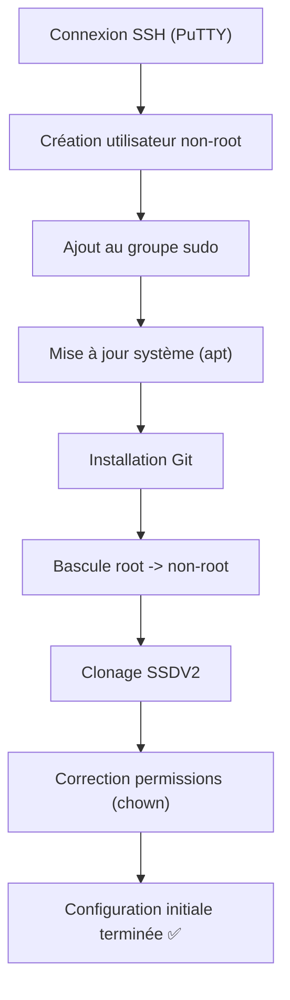
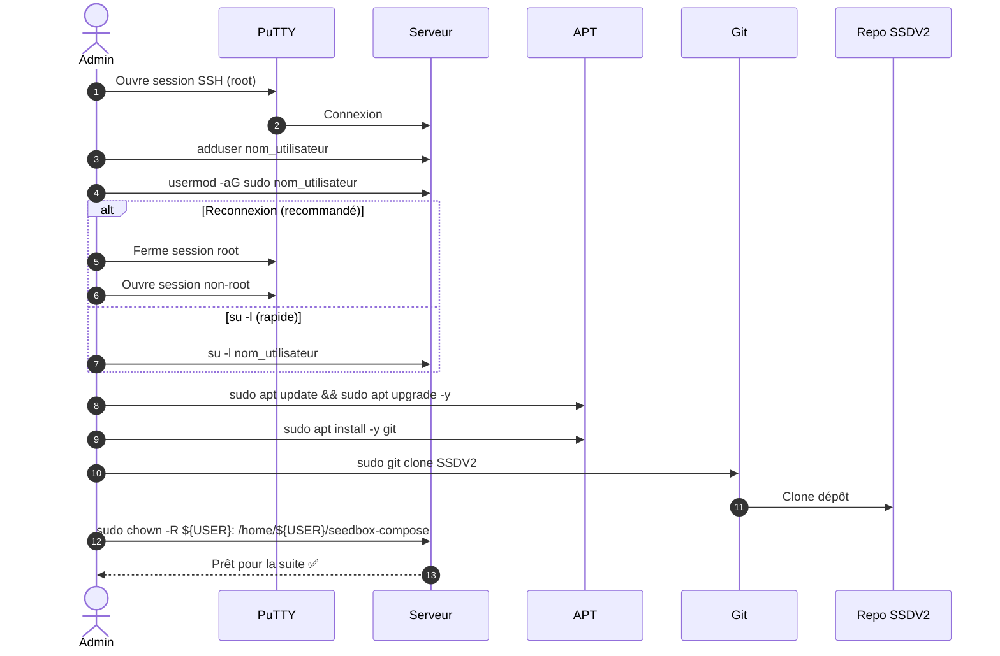

!!! abstract "Abstract"
    Cette section couvre la **configuration initiale** d’un serveur avant d’installer/administrer SSDV2 :  
    connexion SSH via **PuTTY**, création d’un **utilisateur non-root** (avec sudo), mise à jour du système, installation de **Git**, bascule propre de root vers non-root, puis clonage et correction des permissions du dépôt SSDV2.

---

## TL;DR

1) Se connecter en SSH (PuTTY)  
2) Créer un utilisateur **non-root** + l’ajouter à `sudo`  
3) Mettre à jour le système + installer Git  
4) Quitter root (reconnexion non-root ou `su -l`)  
5) Cloner SSDV2 + corriger les permissions (`chown`)

??? tip "Raccourci mental"
    **Root = dépannage ponctuel** • **Non-root + sudo = exploitation normale** • **Session root fermée dès que possible**

---

## Objectif & règles d’or

- ✅ Se connecter au serveur en SSH
- ✅ Créer un utilisateur **non-root** et lui donner les droits sudo
- ✅ Mettre à jour le système et installer Git
- ✅ **Arrêter d’utiliser root** pour la suite du guide
- ✅ Cloner SSDV2 et corriger les permissions

!!! danger "Sécurité"
    Pour la suite du guide, il est **impératif** de ne plus utiliser le compte **root** :  
    risque d’erreurs destructives, permissions incohérentes, et mauvaises pratiques d’exploitation.

---

## Vue d’ensemble (ordre recommandé)



---

## Connexion SSH

### Étape 1 — Installer PuTTY

1. Rendez-vous sur le site officiel : `https://www.putty.org/`
2. Téléchargez la version correspondant à votre OS
3. Exécutez l’installateur

??? tip "Alternative (optionnel)"
    Sur Windows 10/11, vous pouvez aussi utiliser **Windows Terminal** + `ssh` natif.  
    PuTTY reste parfaitement valide et très courant.

### Étape 2 — Se connecter au serveur

1. Ouvrez **PuTTY**
2. **Host Name (or IP address)** : IP ou hostname du serveur
3. **Port** :
   - par défaut : `22` (peut varier)
4. Protocole : **SSH**
5. (Optionnel) **Saved Sessions** : enregistrez la session
6. Cliquez **Open**
7. Alerte “clé inconnue” : cliquez **Yes**
8. Entrez **login** + **mot de passe**
9. Shell obtenu : SSH OK ✅

!!! warning "Bon réflexe sécurité"
    Si vous avez un accès console/panel VPS, vérifiez l’empreinte de la clé SSH lors de la première connexion (MITM rare, mais bon réflexe).

---

## Création d’un utilisateur non-root

Remplacez `nom_utilisateur` par le nom choisi.

### Créer un utilisateur standard

```bash
adduser nom_utilisateur
```

### Ajouter l’utilisateur au groupe sudo

```bash
usermod -aG sudo nom_utilisateur
```

!!! success "Validation rapide"
    Une fois connecté avec l’utilisateur :
    - exécutez `sudo -v`  
    - si un mot de passe est demandé et accepté, vos droits sudo sont OK.

---

## Mise à jour des paquets

```bash
sudo apt update && sudo apt upgrade -y
```

!!! info "Pourquoi maintenant ?"
    Installer SSDV2 sur une base à jour réduit les surprises (sécurité, compatibilité, versions).

---

## Installation de Git

```bash
sudo apt install -y git
```

---

## Passage de root à non-root (obligatoire)

Pour la suite du guide : **n’utilisez plus root**.

=== "Méthode 1 — Reconnexion (recommandée)"
    1. Fermez la session PuTTY root
    2. Ouvrez PuTTY à nouveau
    3. Connectez-vous avec `nom_utilisateur`

=== "Méthode 2 — Bascule dans la même session"
    Dans la session actuelle :

    ```bash
    su -l nom_utilisateur
    ```

    Puis saisissez le mot de passe de `nom_utilisateur`.

    !!! tip "Pourquoi `su -l` ?"
        `su -l` simule une vraie connexion (environnement propre), ce qui évite des incohérences de chemins/permissions.

!!! danger "Risque (permissions)"
    Continuer en root entraîne souvent des permissions incohérentes et des erreurs difficiles à diagnostiquer.  
    **Passez non-root maintenant**, pas “plus tard”.

---

## Clonage du script SSDV2

Une fois connecté en **non-root**, clonez le dépôt SSDV2 :

```bash
sudo git clone https://github.com/projetssd/ssdv2.git /home/${USER}/seedbox-compose
```

!!! info "Pourquoi `sudo` ici ?"
    Selon le système, l’écriture dans le chemin cible peut nécessiter des droits élevés.  
    L’étape suivante remet tout proprement au bon propriétaire.

---

## Appropriation des droits sur le dossier SSDV2

```bash
sudo chown -R ${USER}: /home/${USER}/seedbox-compose
```

!!! success "Validation"
    Votre utilisateur doit être propriétaire du dossier : plus de galères de permissions lors de l’exécution.

---

## Checklist finale (validation)

- [ ] Connexion SSH OK
- [ ] Utilisateur non-root créé
- [ ] Utilisateur ajouté à `sudo`
- [ ] Système à jour (`apt update/upgrade`)
- [ ] Git installé
- [ ] Session root abandonnée (vous travaillez en non-root)
- [ ] Dépôt SSDV2 cloné dans `/home/${USER}/seedbox-compose`
- [ ] Permissions corrigées (`chown` effectué)

---

## Diagramme de séquence (résumé)



---

## Félicitations 🎉

La configuration initiale est terminée ✅  
Vous pouvez maintenant continuer SSDV2 dans de bonnes conditions : **sécurité**, **permissions propres**, **base système saine**.