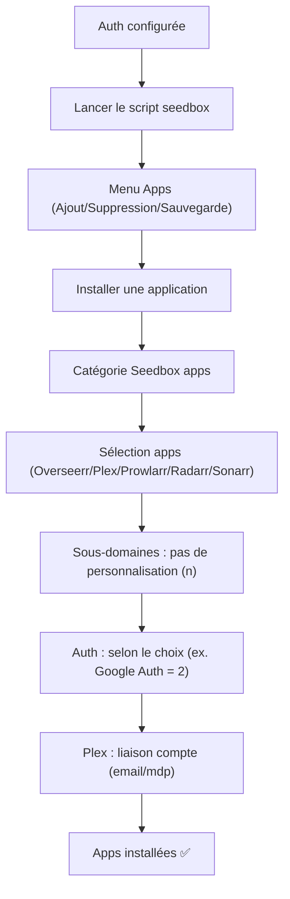
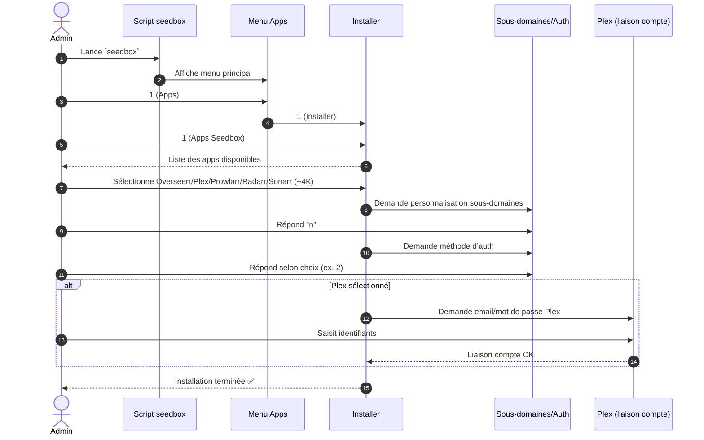

!!! abstract "Abstract"
    Après la configuration du type d’authentification, cette section décrit l’installation des applications **cœur** via le script `seedbox`.  
    Vous apprendrez à : relancer le script, naviguer dans les menus, sélectionner les apps à installer (Overseerr, Plex, Prowlarr, Radarr/Sonarr + 4K), gérer la personnalisation des sous-domaines et finaliser l’authentification.  
    Un focus est inclus sur Plex (liaison compte) et la conduite à tenir en cas d’erreur.

---

## TL;DR

1) Lancez `seedbox`  
2) Menu : **Apps** → **Installer** → **Apps Seedbox**  
3) Sélectionnez : Overseerr + Plex + Prowlarr + Radarr/Sonarr (+ 4K si besoin)  
4) Sous-domaines : répondez `n` (pas de personnalisation)  
5) Auth : répondez selon votre choix (ex. Google Auth = `2`)  
6) Plex : saisissez vos identifiants pour lier le serveur (sinon réinstall nécessaire)

??? tip "Principe premium"
    Installez d’abord le socle (**Plex + Arr + Prowlarr + Overseerr**) puis configurez les apps dans l’ordre recommandé.  
    Évitez de “tuner” les sous-domaines au début : vous gagnerez du temps sur l’intégration.

---

## Objectif

Installer les applications clés qui seront au cœur de votre serveur :

- **Overseerr**
- **Plex**
- **Prowlarr**
- **Radarr** (+ **Radarr4K** si setup 4K)
- **Sonarr** (+ **Sonarr4K** si setup 4K)

---

## Pré-requis

- Vous avez déjà configuré votre **type d’authentification**
- Vous êtes connecté sur le serveur avec l’utilisateur attendu (**non-root recommandé**)
- Vos DNS / reverse-proxy sont prêts pour les sous-domaines

!!! tip "Confort d’exploitation"
    Installez d’abord le socle, puis faites la configuration applicative (Plex → RDTClient → Arr → Prowlarr → Overseerr).

---

## Vue d’ensemble (workflow)



---

## Démarrage du script d’installation

Normalement vous êtes déjà dans le script. Sinon, lancez-le :

```bash
seedbox
```

!!! warning "Si la commande n’existe pas"
    Vous n’êtes probablement pas dans le bon environnement (alias non chargé / install incomplète).  
    Revenez à l’étape de configuration SSDV2, puis relancez la procédure standard.

??? example "Diagnostic express"
    - Si vous deviez utiliser un environnement `venv` : rechargez-le (selon votre doc) puis retestez `seedbox`.
    - Si vous êtes sur un shell root : reconnectez en **non-root**, puis retentez.

---

## Navigation dans le menu d’installation

### Sélection des applications à installer

1. **Accès au menu d'installation**  
   Répondez `1` pour accéder à l’ajout, la suppression ou la sauvegarde d’applications.

2. **Installation d'applications**  
   Choisissez `1` pour installer une application.

3. **Choix des applications Seedbox**  
   Sélectionnez `1` pour les applications dédiées à la Seedbox.

!!! info "Pourquoi ce chemin ?"
    Le menu “Seedbox apps” regroupe les services cœur (Plex/Arr/Prowlarr/Overseerr) prêts à être intégrés ensemble.

---

## Sélection des applications (liste recommandée)

À partir du menu de sélection, choisissez :

- **Overseerr**
- **Plex**
- **Prowlarr**
- **Radarr** *(+ Radarr4K si setup 4K)*
- **Sonarr** *(+ Sonarr4K si setup 4K)*

Confirmez la sélection et suivez les instructions affichées pour chaque application (sous-domaines + authentification).

---

## Sous-domaines (personnalisation)

Concernant la personnalisation des sous-domaines, répondez :

- `n`

!!! tip "Pourquoi répondre `n` ?"
    Conserver les sous-domaines standards simplifie :
    - la documentation,
    - le support,
    - les intégrations (Overseerr ↔ Arr ↔ Prowlarr),
    - et les migrations futures.

---

## Authentification

Pour l’authentification, la valeur dépend de ce que vous avez choisi précédemment.

Exemple :
- Si vous suivez le guide avec **Google Auth** : `2`

!!! warning "Cohérence"
    Utilisez le **même mode d’auth** pour les apps exposées, sinon vous risquez des comportements inattendus (redirections, accès partiels).

---

## Focus : configuration spécifique de Plex

Lors de l’installation de Plex, vous devrez fournir :

- votre e-mail / identifiant Plex
- votre mot de passe Plex

Objectif : lier automatiquement votre serveur Plex à votre compte.

!!! warning "En cas d’erreur d’identifiants"
    Si les identifiants Plex sont incorrects lors de l’installation, il faudra généralement :
    1) **supprimer** Plex  
    2) puis **réinstaller** Plex  
    afin de relancer correctement l’association.

??? tip "Bon réflexe"
    Préparez vos identifiants Plex à l’avance (gestionnaire de mots de passe).  
    Ça évite la réinstall “bête” juste pour une faute de frappe.

---

## Checklist (fin d’installation)

- [ ] Overseerr installé
- [ ] Plex installé + liaison compte OK
- [ ] Prowlarr installé
- [ ] Radarr installé (+ Radarr4K si besoin)
- [ ] Sonarr installé (+ Sonarr4K si besoin)
- [ ] Sous-domaines standards conservés (`n`)
- [ ] Auth configurée selon votre choix (ex. Google Auth = `2`)

!!! success "Done ✅"
    Si cette checklist est validée, vous pouvez passer à la **configuration applicative** (Plex/Arr/Prowlarr/Overseerr) sans friction.

---

## Diagramme de séquence (installation via script)

