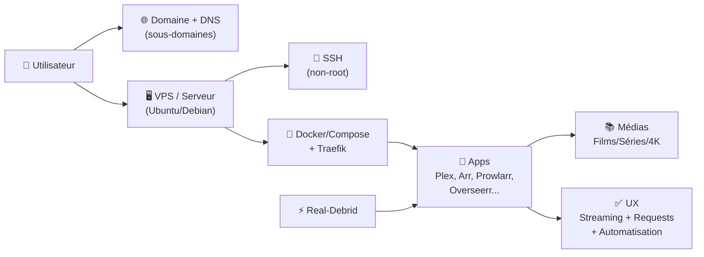
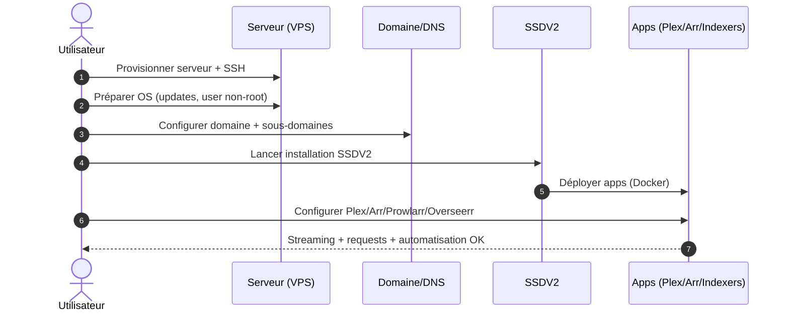

!!! abstract "Abstract"
    SSDV2 vous guide de **zéro à un serveur opérationnel** : préparation (SSH, sécurité, environnement) → déploiement (Docker/Traefik) → intégrations (Plex, Arr, indexers, requêtes).  
    Le document est conçu pour être **suivi dans l’ordre**, avec des choix clairs et des garde-fous (anti lock-out, bonnes pratiques).

---

## TL;DR

- ✅ **Préparez** un serveur (≥ 4 vCPU / 8 Go RAM) + OS compatible
- ✅ **Prenez** un **nom de domaine** + (recommandé) **Cloudflare**
- ✅ **Créez** vos comptes : Real-Debrid (+ Plex Pass optionnel)
- ✅ **Suivez** l’ordre du guide : **sécurité → installation → configuration apps → optimisation**

!!! tip "Raccourci mental"
    **Domaine** = accès propre (sous-domaines) • **Serveur** = exécution (Docker) • **Apps** = services • **RD** = source contenu

---

## Introduction

Bienvenue dans ce guide complet d’installation et de configuration d’un serveur avec **SSDV2**.

Il est pensé pour :
- 👶 Débutants : étapes guidées, décisions simplifiées
- 🧠 Avancés : options, optimisations, bonnes pratiques

Objectif : un serveur **sécurisé**, **performant** et **personnalisé** pour :
- streaming,
- stockage,
- automatisation de médias.

---

## Aperçu (vidéo)

---

## Architecture globale

!!! info "Lecture rapide"
    - Le **domaine** sert à exposer des sous-domaines (panels/apps) proprement.
    - Le **serveur** héberge Docker et orchestre les stacks.
    - **Real-Debrid** alimente la chaîne selon votre pipeline.
    - Les apps s’interconnectent (Overseerr ↔ Arr ↔ Prowlarr ↔ client).

---

## Prérequis

Cette section couvre :
- 🖥️ serveur (ressources & réseau),
- 🧩 compatibilité OS/CPU,
- 🔑 comptes/services,
- 💶 estimation budgétaire.

---

## Serveur

### Recommandations (confort)

| Composant | Recommandé | Pourquoi |
|---|---:|---|
| CPU | **≥ 4 vCores** | indexations / scans / services multiples |
| RAM | **≥ 8 Go** | marge pour Docker + monitoring |
| Réseau | **1 Gb/s** | accès rapide + stabilité |
| Stockage | selon usage | dépend de vos besoins et stratégie |

!!! info "Direct play"
    Pour une expérience fluide, surtout en direct play, ces specs offrent un bon équilibre performance/coût.

### Pare-feu / ports

- Plex utilise classiquement **32400**
- Selon votre architecture (reverse proxy / tunnel), l’exposition peut varier

!!! warning "Exposition réseau"
    N’exposez jamais “tout”.  
    Ouvrez uniquement le nécessaire et privilégiez **80/443** via reverse proxy quand possible.

---

## Compatibilité processeurs & OS

### Cible principale

- **Ubuntu Server 20.04 (amd64)**

### Compatibilités annoncées

- Ubuntu Server **18.04 → 22.04**
- Debian **9 → 12**
- Architectures : **amd64** et **arm64**

!!! tip "Choix recommandé"
    Si vous partez de zéro : privilégiez une version stable et largement supportée (Ubuntu 20.04/22.04 ou Debian 11/12).

---

## Comptes & services

| Service | Obligatoire | Coût estimé | Rôle |
|---|:---:|---:|---|
| Real-Debrid | ✅ | ~32 €/an | source/accès contenus selon pipeline |
| Nom de domaine | ✅ | ~15 €/an | sous-domaines (apps/panels) |
| Plex Pass | ❌ | ~60 €/an | confort mobile Plex (selon usage) |

!!! tip "Priorité"
    Si vous devez arbitrer : **domaine + RD** en priorité. Plex Pass est un bonus.

---

## Coûts estimés

- **~21,41 € / mois**
- **~257 € / an**

!!! info "Variables"
    Le coût réel dépend surtout :
    - du VPS (principal poste),
    - du domaine,
    - des options (Plex Pass),
    - et de votre hébergement (payant vs free tier).

---

## Checklist “prêt à commencer” ✅

- [ ] Serveur prêt (≥ **4 vCores / 8 Go RAM**)
- [ ] OS compatible (Ubuntu/Debian, amd64/arm64)
- [ ] Compte **Real-Debrid**
- [ ] **Nom de domaine** + accès DNS
- [ ] Accès **SSH** fonctionnel
- [ ] Je suis prêt à suivre l’ordre : **sécurité → installation → intégrations**

---

## Onboarding (séquence)

!!! success "Résultat attendu"
    Une plateforme stable :
    - accessible via sous-domaines,
    - sécurisée,
    - prête pour l’automatisation (qualité, indexers, notifications).