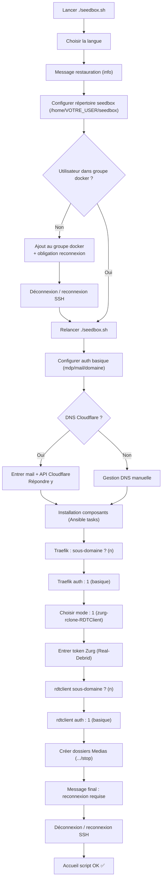

!!! abstract "Abstract"
    Cette section couvre le **premier lancement** du script SSDV2 (`seedbox.sh`) et les choix de configuration initiaux :  
    langue, chemins de stockage, ajout de l’utilisateur au groupe Docker (avec reconnexion obligatoire), configuration de l’authentification (basique/OAuth/Authelia), intégration Cloudflare, installation des composants (Traefik, zurg, rclone, RDTClient) et création des dossiers médias (incl. setup 4K).

---

## TL;DR

1) Lancez `./seedbox.sh` → choisissez la langue  
2) Définissez le répertoire seedbox (`/home/VOTRE_USER/seedbox`)  
3) Si ajout au groupe `docker` → **reconnexion obligatoire** → relancez `./seedbox.sh`  
4) Renseignez auth (mdp/mail/domaine)  
5) Cloudflare (recommandé) : `y` + email + API key  
6) Traefik : sous-domaine `n`, auth `1` (basique)  
7) Mode : `1) zurg - rclone - RDTClient` + token RD  
8) RDTClient : sous-domaine `n`, auth `1`  
9) Créez les dossiers `Medias` → reconnexion finale → OK ✅

??? tip "Principe premium"
    Dès qu’on touche à **permissions/groupe Docker**, on applique :  
    **changer → reconnecter → relancer**.  
    Ça évite 80% des “ça marche pas” liés au groupe `docker`.

---

## Soyez attentif aux instructions (très important)

Le script vous guide à travers plusieurs étapes, notamment :
- choix de la langue,
- configuration des dossiers,
- gestion des permissions,
- installation des composants.

Des messages d’alerte peuvent apparaître (restauration, permissions, groupe Docker).  
**Lisez-les attentivement** et appliquez les actions demandées.

!!! warning "Point critique : groupe Docker"
    Quand votre utilisateur est ajouté au groupe `docker`, une **déconnexion / reconnexion** est nécessaire.  
    Si vous continuez sans reconnecter, vous risquez des erreurs (Docker inaccessible) ou un comportement incohérent.

---

## Vue d’ensemble (workflow)



---

## Lancement du script

Naviguez dans le répertoire du script et exécutez-le :

```bash
cd /home/${USER}/seedbox-compose && ./seedbox.sh
```

---

## Choix de la langue

Vous serez invité à choisir la langue pour l’interface :

```bash
1. Anglais/English
2. Français/French
```

Choisissez `2` pour Français.

---

## Message relatif à une éventuelle restauration

Vous verrez ce message :

```bash
Actuellement, la restauration ne fonctionne que si le script a été installé depuis le même répertoire que celui qui a servi à faire la sauvegarde, et a été installé sur la même destination.
```

Appuyez sur **Entrée** pour continuer.

!!! info "Pourquoi ce message ?"
    La restauration dépend du **chemin d’installation** et de la **destination** de sauvegarde : même répertoire, même cible.

---

## Configuration des répertoires

Le script demande le répertoire de stockage pour les réglages des containers.  
Utilisez le chemin par défaut (ou adaptez selon vos besoins) :

```bash
/home/VOTRE_USER/seedbox
```

!!! tip "Rappel"
    Remplacez `VOTRE_USER` par votre utilisateur Linux créé au préalable.

---

## Ajout de votre utilisateur au groupe Docker

Vous pouvez voir ce message :

```bash
IMPORTANT !
===================================================
Votre utilisateur n'était pas dans le groupe docker
Il a été ajouté, mais vous devez vous déconnecter/reconnecter pour que la suite du process puisse fonctionner
```

Le script a ajouté votre utilisateur au groupe `docker`.  
Pour que la modification prenne effet : **déconnexion / reconnexion obligatoire**.

!!! danger "Risque (Docker KO)"
    Si vous ne reconnectez pas, votre session ne prendra pas le nouveau groupe en compte → Docker peut refuser certaines actions.

### Comment faire (PuTTY)

- Fermez la fenêtre PuTTY
- Ouvrez PuTTY à nouveau
- Reconnectez-vous avec votre utilisateur **non-root**

---

## Relancer le script (après reconnexion)

Relancez :

```bash
cd /home/${USER}/seedbox-compose && ./seedbox.sh
```

Vous verrez :

```bash
Certains composants doivent encore être installés/réglés
Cette opération va prendre plusieurs minutes selon votre système
```

Appuyez sur **Entrée**.

---

## Configuration de l’authentification basique

Suivez les prompts :

```bash
↘️ Mot de passe | Appuyer sur [Enter] :
```

Entrez un mot de passe puis **Entrée**.

```bash
↘️ Mail | Appuyer sur [Enter] :
```

Entrez votre email puis **Entrée**.

```bash
↘️ Domaine | Appuyer sur [Enter] :
```

Entrez votre domaine **sans** `https://` (ex : `domaine.fr`) puis **Entrée**.

---

## Gestion des DNS avec Cloudflare (recommandé)

Le script demande :

```bash
Souhaitez vous utiliser les DNS Cloudflare ? (y/n)
```

Répondez :

- `y`

Puis fournissez :
- votre email Cloudflare
- votre API key Cloudflare

!!! tip "Pourquoi Cloudflare ?"
    Le script peut automatiser la gestion DNS, ce qui réduit fortement les erreurs et accélère l’installation.

---

## Installation des composants (phase longue)

Pendant l’exécution, le script peut sembler “bloqué” sur :

```
TASK [Add Debian repositories] ***************************************************************
TASK [Install common packages] ***************************************************************
```

C’est normal : laissez-le s’exécuter.

!!! info "Comportement attendu"
    La durée dépend de la puissance du serveur.  
    Une phase silencieuse peut être normale : ne stoppez pas le script.

---

## Traefik — sous-domaine et authentification

Sous-domaine :

```bash
Adresse par défault: https://traefik.cinecast.tv

Souhaitez-vous personnaliser le sous-domaine ? (y/n)
```

Répondez :

- `n`

Authentification Traefik :

```bash
Choix de l'authentification pour Traefik [ Entrée ] : 1 => basique | 2 => oauth | 3 => authelia
```

Choisissez :

- `1` (basique)

??? tip "Recommandation"
    Gardez “basique” au début pour suivre le guide sans divergence.  
    Vous pourrez migrer vers OAuth Google ou Authelia ensuite.

---

## Choix du type d’installation

```bash
Les composants sont maintenants tous installés/réglés, poursuite de l'installation

 1) Installation zurg - rclone - RDTclient
 2) Installation Minimale sans zurg
 3) Restauration Seedbox

Votre choix :
```

Choisissez :

- `1`

---

## Zurg — token Real-Debrid

```bash
Token API pour Zurg (https://real-debrid.com/apitoken) | Appuyez sur [Entrée]:
```

Collez votre token (ex. `http://real-debrid.com/apitoken`) puis **Entrée**.

!!! warning "Copier/coller"
    Un token incomplet (espace, retour ligne) = erreurs plus tard.  
    Copiez-collez proprement, puis validez.

---

## RDTClient — sous-domaine et authentification

Sous-domaine :

```bash
Personnaliser le sous-domaine pour rdtclient : (y/n) ?
```

Répondez :

- `n`

Authentification :

```bash
Authentification rdtclient [ Entrée ] : 1 => basique (par défaut) | 2 => oauth | 3 => authelia | 4 => aucune
```

Choisissez :

- `1`

---

## Création des dossiers médias

Le script demande :

```bash
Noms de dossiers à créer dans Medias (ex : Films, Series, Films d'animation, etc.) | Appuyez sur [Entrée] | Tapez "stop" une fois terminé.
```

=== "Configuration classique"
    - `Films`
    - `Series`
    - `stop`

=== "Configuration 4K (si bibliothèques séparées)"
    - `Films`
    - `Series`
    - `Films4K`
    - `Series4K`
    - `stop`

> Entrez un nom, **Entrée**, puis le suivant… jusqu’à `stop`.


---

## Fin de l’installation : reconnexion obligatoire

Vous verrez un message similaire :

```
Pour bénéficier des changements, vous devez vous déconnecter/reconnecter.
L'installation est maintenant terminée.
Pour le configurer ou modifier les applications, vous pouvez le relancer :
cd /home/ubuntu/seedbox-compose
./seedbox.sh
```

Appliquez la reconnexion :

- Fermez PuTTY
- Reconnectez-vous avec votre utilisateur **non-root**

!!! success "Résultat attendu"
    Après reconnexion, vous accédez à l’accueil du script sans erreur et Docker fonctionne correctement.

---

## Checklist finale ✅

- [ ] Script lancé (`./seedbox.sh`)
- [ ] Langue choisie
- [ ] Répertoire seedbox défini (`/home/VOTRE_USER/seedbox`)
- [ ] Utilisateur ajouté au groupe docker + reconnexion effectuée
- [ ] Auth basique saisie (mdp/mail/domaine)
- [ ] Cloudflare DNS activé (`y`) (si applicable)
- [ ] Traefik : sous-domaine non personnalisé (`n`)
- [ ] Traefik : auth basique (`1`)
- [ ] Mode install : `1) zurg - rclone - RDTClient`
- [ ] Token Zurg saisi
- [ ] rdtclient : sous-domaine non personnalisé (`n`)
- [ ] rdtclient : auth basique (`1`)
- [ ] Dossiers médias créés (incl. 4K si besoin)
- [ ] Reconnexion finale effectuée

---

## Bravo 👍

Vous avez accès à l’accueil du script : vous êtes prêt pour l’installation des applications et la configuration (Plex/Arr/Prowlarr/Overseerr).