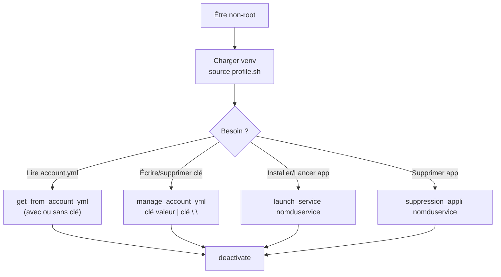
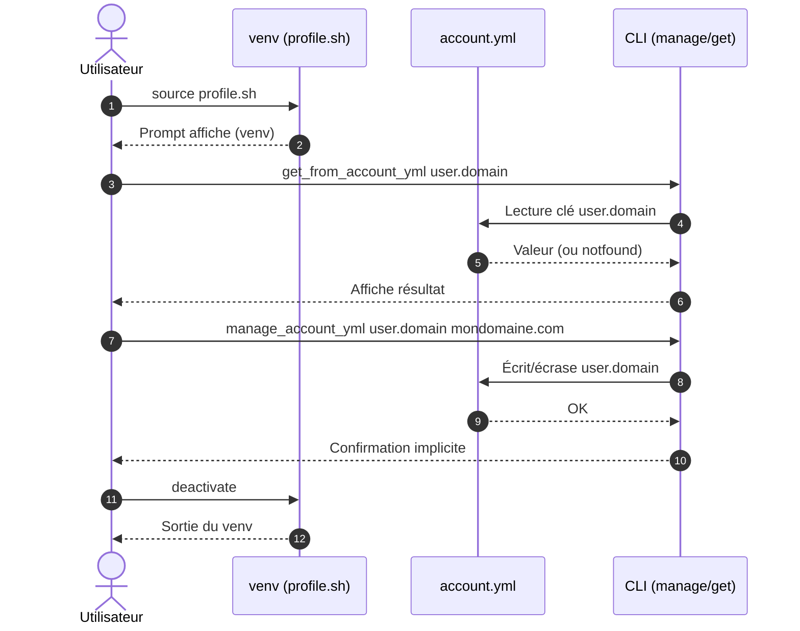

!!! abstract "Abstract"
    Cette page décrit les **manipulations manuelles** SSDV2 :  
    - chargement de l’environnement (`profile.sh`) et vérification du prompt `(venv)`  
    - lecture/écriture/suppression de clés dans `account.yml` via `get_from_account_yml` et `manage_account_yml`  
    - installation/désinstallation directe d’une application via `launch_service` et `suppression_appli`  
    - sortie propre de l’environnement avec `deactivate`  
    ⚠️ Toutes les opérations doivent être effectuées **hors root**.

---

## TL;DR

1) ✅ **Non-root uniquement**  
2) `source profile.sh` → vous voyez `(venv)`  
3) Lire : `get_from_account_yml [clé]`  
4) Écrire : `manage_account_yml clé valeur`  
5) Supprimer : `manage_account_yml clé " "` (suppression récursive)  
6) Installer : `launch_service service`  
7) Désinstaller : `suppression_appli service`  
8) Quitter : `deactivate`

??? tip "Principe premium"
    **Toujours auditer avant de modifier** : un `get_from_account_yml` rapide évite d’écraser une valeur sensible.

---

## Règle absolue : ne pas être root

Pour toute opération, assurez-vous de **ne pas** être root.

!!! danger "Pourquoi ?"
    Exécuter ces commandes en root peut :
    - casser les permissions,
    - créer des fichiers appartenant à root,
    - provoquer des comportements inattendus (venv/Docker/scripts),
    - compliquer les corrections (chown à répétition).

---

## Charger l’environnement (venv)

Exécutez :

```bash
cd /opt/seedbox-compose
source profile.sh
```

Après cela, vous devriez voir **`(venv)`** devant l’invite de commande.

!!! success "Validation"
    Si le prompt affiche `(venv)`, l’environnement est chargé.

!!! warning "Si `(venv)` n’apparaît pas"
    - Vérifiez le chemin : `/opt/seedbox-compose`
    - Relancez `source profile.sh`
    - Évitez de lancer le script en root (permissions cassées)

---

## Comprendre `account.yml` (structure et clés)

Les clés sont séparées par des points.

Exemple YAML :

```yaml
user:
  domain: mydomain.net
```

La clé sera :

- `user.domain`  
et sa valeur :
- `mydomain.net`

!!! info "Pourquoi cette notation ?"
    Elle permet de manipuler le YAML facilement depuis la CLI, sans éditer le fichier à la main.

---

## Afficher tout le contenu de `account.yml`

Pour afficher dans le shell tout le contenu du fichier :

```bash
get_from_account_yml
```

??? tip "Bon usage"
    Avant une modification, faites toujours un dump complet (ou un dump du bloc parent) pour éviter les surprises.

---

## Manipuler `account.yml`

### Écrire une clé (create/overwrite)

Crée la clé si elle n’existe pas, ou l’écrase si elle existe :

```bash
manage_account_yml cle valeur
```

Exemple :

```bash
manage_account_yml user.domain mondomaine.com
```

!!! warning "Écrasement"
    Si la clé existe, la valeur précédente est remplacée (pas de merge).  
    Faites un `get_from_account_yml` avant si vous n’êtes pas sûr.

??? example "Pattern safe (lecture → écriture → relecture)"
    ```bash
    get_from_account_yml user.domain
    manage_account_yml user.domain mondomaine.com
    get_from_account_yml user.domain
    ```

### Effacer une clé (et ses sous-clés)

Efface la clé **et toutes les sous-clés associées** :

```bash
manage_account_yml cle " "
```

Exemple :

```bash
manage_account_yml user.domain " "
```

!!! danger "Suppression récursive"
    En supprimant une clé “parent”, vous supprimez aussi toute son arborescence.  
    Exemple : supprimer `user` peut supprimer **domain/mail/pass/etc.**

??? tip "Avant suppression"
    Affichez d’abord l’arbre :
    ```bash
    get_from_account_yml user
    ```

### Obtenir la valeur d’une clé

```bash
get_from_account_yml cle
```

Exemple :

```bash
get_from_account_yml user.domain
```

Retour attendu :

```text
mondomaine.com
```

Si la valeur n’est pas trouvée :

```text
notfound
```

### Obtenir une clé et toutes ses sous-clés

```bash
get_from_account_yml user
```

Exemple de retour :

```text
domain: mondomaine.com group: null groupid: 1001 htpwd: seed:xxxxxxxxxxxxxx mail: moi@mondomaine.com name: seed pass: xxxxxxxxxxxxxx userid: 1001
```

!!! tip "Usage"
    Pratique pour auditer rapidement un bloc (ex. `user`, `traefik`, `apps`, etc.).

---

## Installer / lancer une application sans passer par le menu

```bash
launch_service nomduservice
```

??? example "Exemples"
    ```bash
    launch_service plex
    launch_service radarr
    launch_service sonarr
    ```

!!! success "Résultat attendu"
    Le service est déployé/démarré conformément à la recette (yml + account).

---

## Désinstaller une application sans passer par le menu

```bash
suppression_appli nomduservice
```

??? example "Exemples"
    ```bash
    suppression_appli plex
    suppression_appli radarr
    suppression_appli sonarr
    ```

!!! warning "Impact"
    Selon le mode de suppression et l’implémentation, des éléments peuvent être retirés :
    - container,
    - fichiers `.yml`,
    - entrées `account.yml`,
    - et parfois données persistantes (selon options).

!!! tip "Avant suppression"
    Si vous avez un doute : privilégiez la **réinitialisation** (quand disponible) plutôt qu’une suppression destructrice.

---

## Quitter l’environnement de manipulation

Pour sortir du venv :

```bash
deactivate
```

!!! success "Validation"
    Le préfixe `(venv)` disparaît : vous êtes sorti de l’environnement.

---

## Diagramme de flux (opérations manuelles)



---

## Diagramme de séquence (édition account.yml)

