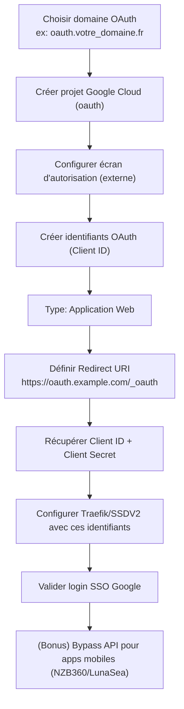
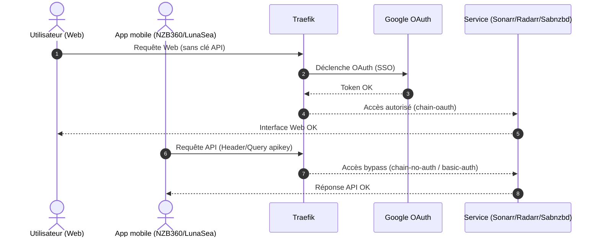

!!! abstract "Abstract"
    Google OAuth2 permet d’utiliser un compte Google pour accéder à vos services via Traefik, avec **SSO** et **2FA** (selon votre compte).  
    Cette page détaille : la création d’un projet Google Cloud, la configuration de l’écran d’autorisation, la génération d’un **Client ID / Client Secret** (application Web), et un **bonus avancé** : bypass d’auth via headers/query pour conserver l’accès depuis **NZB360 / LunaSea** tout en gardant une sécurité élevée.

---

## TL;DR

1) Créez un projet Google Cloud `oauth`  
2) Configurez l’écran d’autorisation (Externe)  
3) Créez un **Client OAuth (Web)** avec redirect URI : `https://oauth.example.com/_oauth`  
4) Récupérez **Client ID** + **Client Secret** → configurez SSDV2/Traefik  
5) Validez le SSO  
6) (Bonus) Ajoutez un router **bypass API** (Header/Query) pour NZB360/LunaSea

??? tip "Principe premium"
    **Web = OAuth** • **Mobile/API = bypass strict** (apikey)  
    → 2 routes, 2 priorités, 2 middlewares.

---

## Pourquoi Google OAuth2 ?

Google OAuth2 vous permet d’utiliser votre compte Google pour vous connecter à vos services.

Avec Traefik, cela permet :
- ✅ Authentification unique (**SSO**)
- ✅ 2FA Google (selon votre configuration)
- ✅ Liste blanche de comptes autorisés
- ✅ Moins de demandes de connexion répétitives
- ✅ Sécurité renforcée

---

## Pré-requis

- Un nom de domaine opérationnel
- Traefik déployé via SSDV2
- Accès à la Google Cloud Console avec le **bon compte Google**
- (Option) Cloudflare pour automatiser les enregistrements DNS via le script

!!! warning "Compte Google"
    Assurez-vous d’être connecté au **bon compte** (Gsuite si applicable).  
    Si vous avez plusieurs comptes : utilisez une fenêtre de navigation privée.

---

## DNS (CNAME) — note Cloudflare

!!! info "DNS"
    - Si vous utilisez **Cloudflare**, la création du CNAME est **automatisée** par le script.
    - Sinon, créez le CNAME chez votre registrar / DNS provider.


---

## Vue d’ensemble (workflow)



---

## Configuration Google OAuth2 (Traefik)

### 1) Créer un projet Google Cloud

Console (resource manager) :

- `https://console.cloud.google.com/cloud-resource-manager`

Étapes :

1. Cliquez sur **Créer un projet**  
   

2. Nom du projet : `oauth` → **Créer**  
   

3. Dans la notification, cliquez sur **“sélectionner un projet”**  
   

!!! success "Résultat attendu"
    Le projet `oauth` est sélectionné en haut de la console Google Cloud.

---

### 2) Accéder aux identifiants

Après sélection du projet, cliquez sur **Identifiants** :


Puis :

- **Créer des identifiants**
- **ID client OAuth**


---

### 3) Configurer l’écran d’autorisation (obligatoire)

Cliquez sur **Configurer l’écran d’autorisation** :


Choisissez :

- **Externe** → **Créer**


Renseignez :

- **Nom de l’application** : identique au projet (ex : `oauth`)
- **Email support** : celui du compte Google
- **Email développeur** : votre email

À chaque étape : **Enregistrer**.


!!! success "Résultat attendu"
    L’écran d’autorisation est configuré et vous pouvez créer un client OAuth.

---

### 4) Créer l’ID client OAuth (Application Web)

Retournez à **Identifiants**, puis :

- **Créer des identifiants**
- **ID client OAuth**
- **Type** : `Application web`
- **Nom** : identique au projet (ex : `oauth`)
- **URI de redirection** :
  - `https://oauth.example.com/_oauth`


Vous obtenez :

- **CLIENT ID**
- **CLIENT SECRET**


Copiez-les dans un bloc-notes :


!!! success "Conservez ces identifiants"
    Vous en aurez besoin pour activer OAuth2 côté SSDV2/Traefik (et parfois Rclone selon setup).

---

## Retrouver les identifiants si vous avez fermé la fenêtre

Console des identifiants :

- `https://console.developers.google.com`


!!! info "Astuce"
    Cherchez la section **Identifiants** du projet `oauth` pour revoir Client ID / Secret.

---

## BONUS — OAuth + apps mobiles (NZB360, LunaSea, etc.)

### Objectif

Permettre :
- accès web via OAuth (SSO Google)
- accès “API” via NZB360 / LunaSea sans blocage OAuth

Principe :
- **2 routers Traefik** :
  - **bypass** (priorité haute) : match API key (header/query) → **no-auth**
  - **auth** (priorité basse) : tout le reste → **oauth**

!!! warning "Sécurité"
    Le bypass doit être **strict** (clé API exacte) et limité au nécessaire.  
    Considérez une API key comme un **secret** au même niveau qu’un mot de passe.

---

## Exemple : Sabnzbd (labels Traefik)

### Avant

```yaml
traefik.enable: 'true'
## HTTP Routers
traefik.http.routers.sabnzbd-rtr.entrypoints: 'https'
traefik.http.routers.sabnzbd-rtr.rule: 'Host(`sabnzbd.domain`)'
traefik.http.routers.sabnzbd-rtr.tls: 'true'
## Middlewares
traefik.http.routers.sabnzbd-rtr.middlewares: "{{ 'chain-oauth@file' if oauth_enabled | default(false) else 'chain-basic-auth@file' }}"
## HTTP Services
traefik.http.routers.sabnzbd-rtr.service: 'sabnzbd-svc'
traefik.http.services.sabnzbd-svc.loadbalancer.server.port: '8080'
```

### Après (bypass + oauth)

```yaml
traefik.enable: 'true'
traefik.http.routers.sabnzbd-rtr-bypass.entrypoints: 'https'
traefik.http.routers.sabnzbd-rtr-bypass.rule: 'Query(`apikey`, `api_de_sabnzbd`)'
traefik.http.routers.sabnzbd-rtr-bypass.priority: '100'
traefik.http.routers.sabnzbd-rtr-bypass.tls: 'true'
## HTTP Routers Auth
traefik.http.routers.sabnzbd-rtr.entrypoints: 'https'
traefik.http.routers.sabnzbd-rtr.rule: 'Host(`sabnzbd.domain`)'
traefik.http.routers.sabnzbd-rtr.priority: '99'
traefik.http.routers.sabnzbd-rtr.tls: 'true'
## Middlewares
traefik.http.routers.sabnzbd-rtr-bypass.middlewares: 'chain-no-auth@file'
traefik.http.routers.sabnzbd-rtr.middlewares: 'chain-oauth@file'
## HTTP Services
traefik.http.routers.sabnzbd-rtr.service: 'sabnzbd-svc'
traefik.http.routers.sabnzbd-rtr-bypass.service: 'sabnzbd-svc'
traefik.http.services.sabnzbd-svc.loadbalancer.server.port: '8080'
```

!!! warning "À faire absolument"
    Remplacez `api_de_sabnzbd` par votre **vraie** clé API Sabnzbd.  
    Ensuite, **réinitialisez** l’application avec le script SSDV2 (pour réappliquer la recette).

---

## Sonarr / Radarr / Lidarr (bypass via header)

Même procédure, mais la règle de bypass devient :

```yaml
traefik.http.routers.sonarr-rtr-bypass.rule: 'Headers(`X-Api-Key`, `api_sonarr`)'
```

---

## RuTorrent (bypass Path + double couche)

Remplacez vos middlewares par :

```yaml
traefik.enable: 'true'
traefik.http.routers.rutorrent-rtr-bypass.entrypoints: 'https'
traefik.http.routers.rutorrent-rtr-bypass.rule: 'Path(`/RPC2`)'
traefik.http.routers.rutorrent-rtr-bypass.priority: '100'
traefik.http.routers.rutorrent-rtr-bypass.tls: 'true'
## HTTP Routers Auth
traefik.http.routers.rutorrent-rtr.entrypoints: 'https'
traefik.http.routers.rutorrent-rtr.rule: 'Host(`rutorrent.domain`)'
traefik.http.routers.rutorrent-rtr.priority: '99'
traefik.http.routers.rutorrent-rtr.tls: 'true'
## Middlewares
traefik.http.routers.rutorrent-rtr-bypass.middlewares: 'chain-basic-auth@file'
traefik.http.routers.rutorrent-rtr.middlewares: 'chain-oauth@file'
## HTTP Services
traefik.http.routers.rutorrent-rtr.service: 'rutorrent-svc'
traefik.http.routers.rutorrent-rtr-bypass.service: 'rutorrent-svc'
traefik.http.services.rutorrent-svc.loadbalancer.server.port: '8080'
```

!!! info "Pourquoi basic auth en bypass ?"
    On ajoute une couche basique pour limiter l’accès “API-like” tout en gardant OAuth pour le web.

---

## Exemple combiné (Header OU Query) — Sonarr/Radarr/Lidarr

Pour permettre le fonctionnement via NZB360 et LunaSea, vous pouvez combiner :

```yaml
traefik.http.routers.sonarr-rtr-bypass.rule: 'Headers(`X-Api-Key`, `b12d1732186a4376b80bdb3875a0f39d`) || Query(`apikey`, `b12d1732186a4376b80bdb3875a0f39d`)'
```

!!! danger "Confidentialité"
    Une API key exposée = accès potentiellement total au service.  
    Ne la publiez jamais (repo public, captures, logs). Traitez-la comme un mot de passe.

---

## Checklist (validation)

- [ ] Projet Google Cloud `oauth` créé et sélectionné
- [ ] Écran d’autorisation configuré (Externe)
- [ ] Client OAuth (Web) créé
- [ ] Redirect URI correct : `https://oauth.example.com/_oauth`
- [ ] Client ID + Secret copiés et stockés
- [ ] OAuth activé côté SSDV2/Traefik
- [ ] Connexion SSO OK avec compte autorisé
- [ ] (Bonus) Bypass API strict appliqué pour mobile (si nécessaire)

!!! success "Résultat attendu"
    Le web passe par OAuth (SSO Google) et vos apps mobiles continuent de fonctionner via un bypass **strict**.

---

## Diagramme de séquence (web OAuth vs bypass API)

