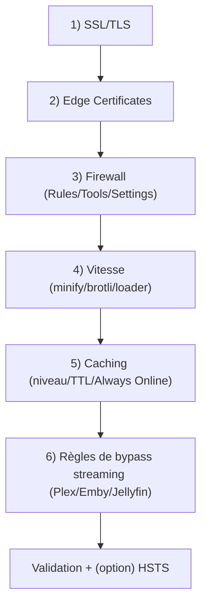
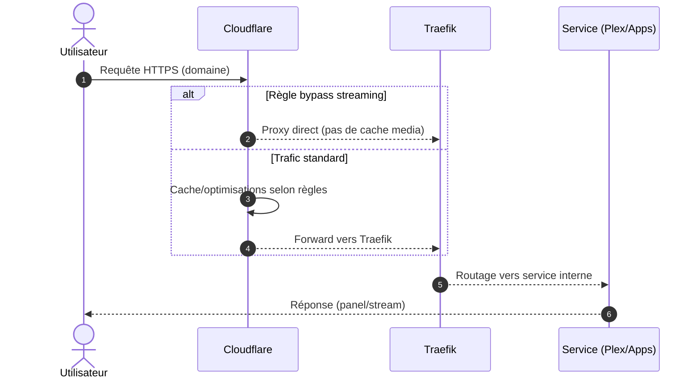

!!! abstract "Abstract"
    Cette page propose une configuration Cloudflare **recommandée** pour un environnement SSDV2 (Traefik/Docker) :  
    **SSL/TLS (Full)**, durcissement TLS (1.2+ / TLS 1.3), options de certificats de périphérie, règles firewall (pays/IP), réglages de sécurité (Bot Fight Mode, Browser Integrity Check) et surtout des **règles de contournement du cache** pour les services de streaming (Plex/Emby/Jellyfin).  
    Objectif : **sécurité + stabilité + conformité** (notamment sur le plan gratuit).

---

## TL;DR

1) 🔐 SSL/TLS = **Full**  
2) 🔁 Always Use HTTPS = **ON**  
3) 🧊 Cache = **Standard**, mais **bypass streaming** (Plex/Emby/Jellyfin)  
4) 🧱 Firewall = règles simples + whitelist IP maison/VPN  
5) ⚠️ HSTS = **uniquement après validation complète**

??? tip "Principe premium"
    Cloudflare = **edge security & TLS**.  
    Traefik = **routage & contrôle d’accès**.  
    Streaming = **pas de cache** côté Cloudflare.

---

## Objectif

- 🔐 Sécuriser les accès (TLS, HTTPS forcé, protections Cloudflare)
- 🧱 Réduire le trafic malveillant (firewall rules, bot protections)
- ⚡ Améliorer la performance quand pertinent (Brotli, optimisations)
- 🎬 Éviter les problèmes de cache/proxy sur les médias (Plex, etc.)
- ✅ Rester conforme aux règles Cloudflare (notamment en plan gratuit)

---

## Vue d’ensemble (ordre conseillé)

---

## 1) SSL/TLS Options

### Mode SSL/TLS

Activez **Full SSL mode**.

!!! tip "Pourquoi Full ?"
    Le trafic est chiffré :
    - entre l’utilisateur et Cloudflare,
    - et entre Cloudflare et votre serveur.

---

## 2) Edge Certificates (Certificats de périphérie)

Dans **Certificats de périphérie**, appliquez :

- **Always Use HTTPS** : **ON**
- **Minimum TLS Version** : **1.2**
- **TLS 1.3** : **ON**
- **Automatic HTTPS Rewrites** : **ON**
- **Certificate Transparency Monitoring** : **ON**

### HSTS (avec prudence)

- **HTTP Strict Transport Security (HSTS)** : **Enable** *(seulement quand stable)*

!!! danger "HSTS : risque de lock-out (web)"
    Activez HSTS **uniquement après** validation complète :
    - tous les sous-domaines OK,
    - certificats OK,
    - aucun besoin “temporaire” de repasser en HTTP,
    - plan de secours prêt (accès direct `IP:PORT` si nécessaire).

---

## 3) Firewall

### Firewall Rules (plan gratuit : 5 règles)

Sous **Règles de pare-feu**, le plan gratuit permet jusqu’à 5 règles.

Cas d’usage typiques :
- bloquer des pays à fort bruit (si cohérent avec votre usage)
- autoriser uniquement les pays où vous vous connectez
- bloquer le reste

!!! tip "Stratégie premium"
    **Whitelist** (IP maison/VPN) + **restrictions pays** (si applicable) = grosse réduction du bruit et des scans.

---

### Firewall Tools (whitelist IP)

Dans **Outils**, vous pouvez whitelist une IP (ex : IP WAN de votre domicile).

!!! warning "IP dynamique"
    Si votre IP WAN change souvent, privilégiez :
    - un VPN à IP fixe,
    - ou une plage IP (si dispo),
    - ou adaptez la whitelist quand nécessaire.

---

### Firewall Settings (réglages recommandés)

- **Security Level** : **High**
- **Bot Fight Mode** : **ON**
- **Challenge Passage** : **30 Minutes**
- **Browser Integrity Check** : **ON**

!!! warning "Compatibilité clients"
    Un niveau de challenge trop agressif peut perturber certains clients/applications.  
    En cas de souci : baissez le niveau ou whitelist votre IP.

---

## 4) Vitesse

Impact généralement modéré pour une seedbox/Traefik.

Réglages recommandés :

- **Auto Minify** : **OFF**
- **Brotli** : **ON**
- **Rocket Loader** : **OFF**

!!! info "Pourquoi Minify OFF ?"
    Sur des apps web “complexes”, minifier côté Cloudflare peut parfois casser JS/CSS.

---

## 5) Caching

- **Caching Level** : **Standard**
- **Browser Cache TTL** : **1 hour**
- **Always Online** : **OFF**

!!! tip "Pattern recommandé"
    Cache standard global + exceptions via règles/bypass pour les apps sensibles (notamment streaming).

---

## 6) Règles de bypass streaming (indispensable)

Pour Docker + Traefik, surtout en serveur média (Plex / Emby / Jellyfin), c’est un réglage majeur.

Objectif :
- éviter cache/proxy “inadaptés” sur le streaming
- éviter bugs de lecture et comportements inattendus
- préserver la conformité Cloudflare (plan gratuit)

Illustrations :

### Recommandation (à appliquer)

Créez des règles (Page Rules ou équivalents selon l’UI Cloudflare) pour **désactiver cache / optimiser** sur :

- `plex.votre_domaine.fr/*`
- `emby.votre_domaine.fr/*`
- `jellyfin.votre_domaine.fr/*`

!!! danger "Conformité Cloudflare (plan gratuit)"
    Utiliser Cloudflare comme proxy/caching pour du streaming média sans exceptions adaptées peut être incompatible avec les conditions Cloudflare et vous exposer à un **ban**.  
    La règle pratique : **bypass cache** sur les services de streaming.

---

## Checklist (validation)

- [ ] SSL/TLS mode = **Full**
- [ ] Always Use HTTPS = **ON**
- [ ] Minimum TLS = **1.2**
- [ ] TLS 1.3 = **ON**
- [ ] Automatic HTTPS Rewrites = **ON**
- [ ] CT Monitoring = **ON**
- [ ] Firewall Security Level = **High**
- [ ] Bot Fight Mode = **ON**
- [ ] Browser Integrity Check = **ON**
- [ ] Brotli = **ON**
- [ ] Auto Minify = **OFF**
- [ ] Rocket Loader = **OFF**
- [ ] Cache Level = **Standard**
- [ ] Browser Cache TTL = **1 hour**
- [ ] Bypass streaming actif (Plex/Emby/Jellyfin)
- [ ] HSTS activé **uniquement** après validation complète

!!! success "Résultat attendu"
    - Navigation HTTPS stable (apps/panels)  
    - Moins de bruit/attaques  
    - Aucun effet de bord sur le streaming  
    - Posture “clean” côté Cloudflare

---

## Diagramme de séquence (requête via Cloudflare)

