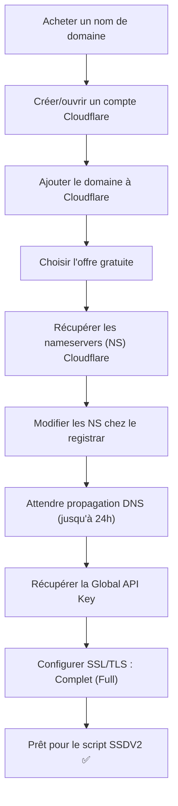
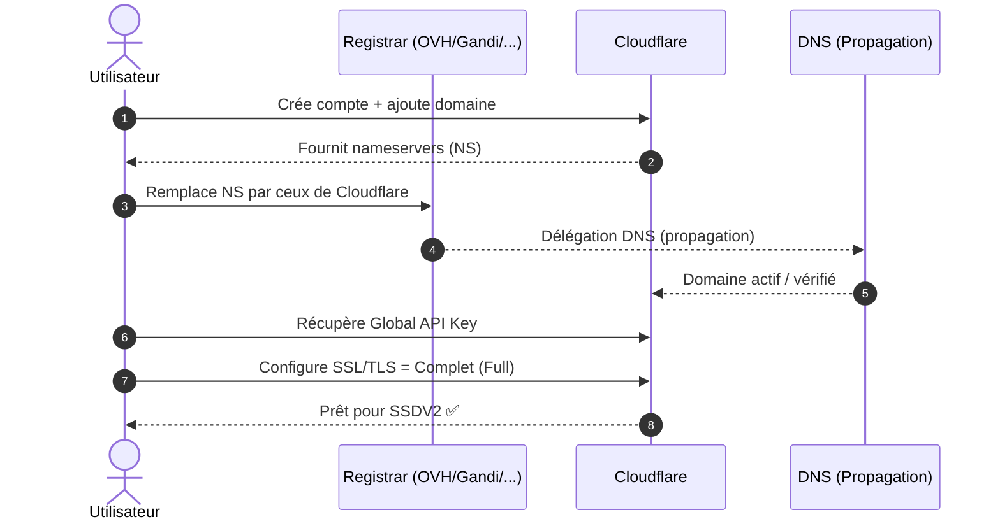

!!! abstract "Abstract"
    Pour suivre le guide SSDV2, vous avez besoin d’un **nom de domaine** et (recommandé) d’une configuration **Cloudflare** pour gérer DNS et sécurité.  
    Cette page explique : comment choisir un registrar compatible, pourquoi Cloudflare est utile, comment ajouter votre domaine, changer les **nameservers (NS)**, récupérer la **Global API Key**, puis régler SSL/TLS en mode **Complet (Full)**.

---

## TL;DR

- Achetez un **domaine fiable** (registrar classique)
- Ajoutez le domaine dans **Cloudflare** (plan gratuit OK)
- Remplacez les **NS** chez le registrar par ceux fournis par Cloudflare
- Attendez la propagation (jusqu’à 24h)
- Récupérez la **Global API Key**
- Réglez **SSL/TLS = Complet (Full)**

??? tip "Raccourci mental"
    **Domaine** = URL propres (sous-domaines) • **Cloudflare** = DNS + sécurité edge • **API key** = automatisation SSDV2

---

## Objectif

- 🌐 Disposer d’un **nom de domaine** pour accéder à vos applications via sous-domaines
- 🧭 Centraliser et automatiser la gestion DNS (idéalement via Cloudflare)
- 🔐 Activer un chiffrement SSL/TLS cohérent pour Traefik et vos services

---

## Vue d’ensemble (workflow)

---

## Nom de domaine

L’accès à vos applications nécessite un nom de domaine. Le script SSDV2 facilite l’ajout et la personnalisation du sous-domaine pour chaque application.

Exemple :

- `https://rutorrent.mondomaine.com`

!!! warning "Compatibilité Cloudflare"
    Certains fournisseurs de domaines gratuits (ex : Freenom) sont souvent **incompatibles** ou instables avec Cloudflare.  
    Pour un setup fiable, privilégiez un registrar “classique”.

### Fournisseurs recommandés (exemples)

- Gandi
- LWS
- OVH
- Ionos
- InternetBS
- Et bien d’autres…

!!! tip "Critère premium"
    Choisissez un registrar qui permet :
    - de modifier facilement les **nameservers**,
    - d’avoir un contrôle DNS propre,
    - d’éviter les limitations liées aux offres “gratuites”.

---

## Configurer Cloudflare

### Présentation

Cloudflare n’est pas “juste” un CDN : c’est un **réseau edge** qui peut améliorer :

- la **sécurité** (TLS, WAF, règles)
- la **performance** (compression, cache ciblé)
- la **fiabilité** (protection DDoS, routage)

---

## Étapes de configuration

### 1) Créer ou se connecter à un compte Cloudflare

- Rendez-vous sur :
  - `https://dash.cloudflare.com/sign-up`
- Créez un compte (email + mot de passe)
- Cliquez sur **Ajouter un site**

Ajoutez votre site :
- entrez le **domaine racine** (ex : `mondomaine.com`)
- cliquez sur **Ajouter un site**

Cloudflare tentera d’importer les enregistrements DNS existants.

Choisissez :
- l’offre **gratuite**
- confirmez

!!! success "Résultat attendu"
    Le domaine apparaît dans votre dashboard Cloudflare et vous pouvez accéder à sa zone DNS.

---

### 2) Changer les Nameservers (NS) vers Cloudflare

- Récupérez les **nameservers** fournis par Cloudflare (NS1/NS2)
- Allez sur la console d’administration de votre registrar (ex : OVH)
- Remplacez les nameservers actuels par ceux de Cloudflare
- Appliquez la configuration

Attendez la propagation :
- jusqu’à **24h** (souvent bien moins)

!!! tip "Validation rapide"
    Quand la délégation est OK, Cloudflare indique généralement que le domaine est **actif** (status “Active”).

---

### 3) Récupération de la Global API Key Cloudflare

Dans Cloudflare :

1. Cliquez sur **Aperçu**
2. Cliquez sur **Obtenir votre jeton d’API**
3. À côté de **Global API Key**, cliquez sur **Afficher**
4. Conservez cette clé pour l’installation SSDV2

!!! danger "Secret"
    La **Global API Key** donne un pouvoir élevé sur votre compte.  
    Ne la publiez jamais (repo, paste, captures, logs) et évitez de la copier dans un historique partagé.

---

### 4) Configuration SSL/TLS (mode Full)

Dans Cloudflare, réglez SSL/TLS sur :

- **Complet (Full)**

!!! info "Pourquoi Full ?"
    Cloudflare chiffre aussi la liaison **Cloudflare → serveur** :  
    - meilleure sécurité,
    - moins d’erreurs TLS,
    - posture cohérente avec Traefik.

---

## Checklist “prêt à suivre le guide” ✅

- [ ] J’ai un domaine (registrar fiable)
- [ ] Mon domaine est ajouté dans Cloudflare
- [ ] Mes nameservers pointent vers Cloudflare
- [ ] La propagation DNS est terminée
- [ ] J’ai récupéré la **Global API Key**
- [ ] SSL/TLS Cloudflare est réglé sur **Complet (Full)**

!!! success "Résultat attendu"
    Vous êtes prêt à lancer SSDV2 avec une base DNS/SSL stable et “automation-friendly”.

---

## Diagramme de séquence (mise en place DNS)

