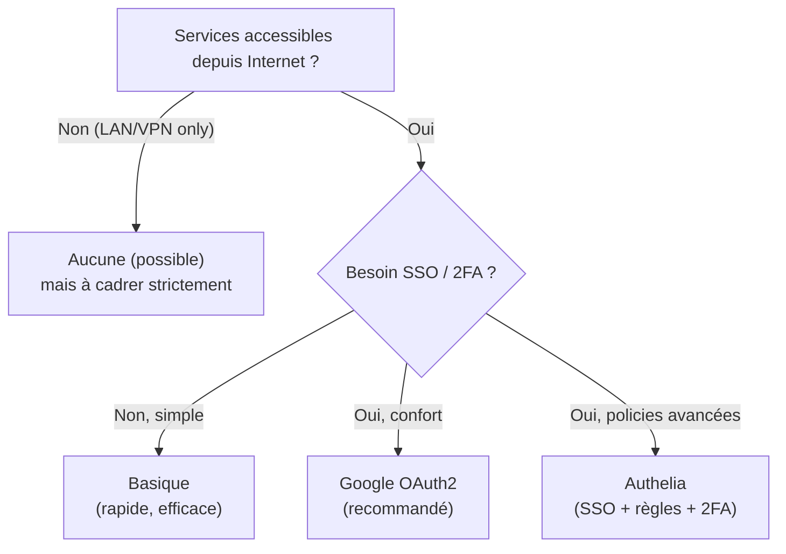
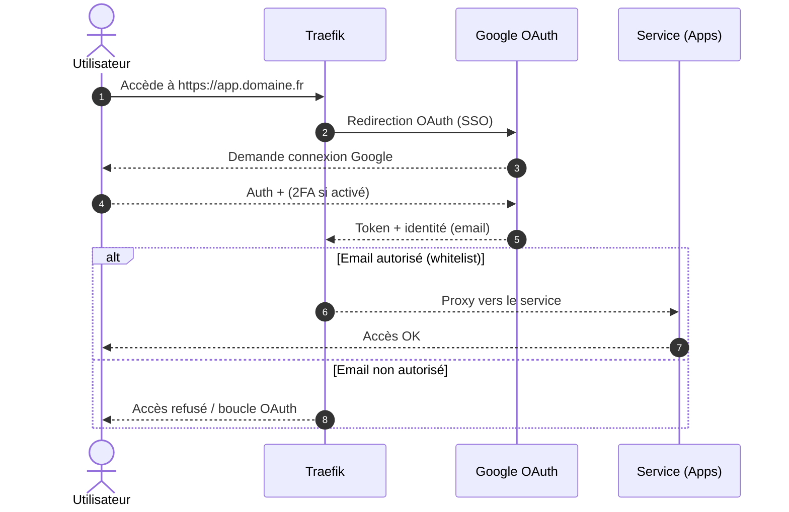

!!! abstract "Abstract"
    Sécuriser l’accès à vos services est une étape **prioritaire**. SSDV2 propose plusieurs méthodes : **Basique**, **Google OAuth2**, **Authelia**, ou **Aucune**.  
    Cette page recommande de configurer l’authentification **avant** d’exposer/installer les applications, puis détaille la procédure **Google Auth (OAuth2)** : activation via le menu du script, saisie `Oauth_client`/`Oauth_secret`, whitelist Gmail, sous-domaines standard, message de confirmation, puis **réinitialisation de RDTClient** pour appliquer la nouvelle méthode.

---

## TL;DR

- ✅ Choisissez une méthode d’auth **avant** d’exposer vos apps
- ✅ Recommandé : **Google OAuth2** (SSO + 2FA Google)
- ✅ Évitez **Aucune** si accessible depuis Internet
- ✅ Après passage à Google Auth : **réinitialisez RDTClient**

??? tip "Raccourci mental"
    **Traefik** = “porte d’entrée” • **Auth** = “contrôle d’accès” • **Whitelist** = “qui a le droit” • **Reset RDTClient** = “application de la nouvelle auth”

---

## Pourquoi sécuriser maintenant ?

Sécuriser l'accès à votre serveur est une étape cruciale pour protéger vos données et vos applications.

Méthodes disponibles :

- **Basique**
- **Google Auth (OAuth2)**
- **Authelia**
- **Aucune**

!!! tip "Recommandation"
    Configurez l’authentification **avant** d’installer les applications exposées (ou avant de les rendre accessibles publiquement).  
    Vous évitez les reconfigurations et réduisez le risque d’exposition involontaire.

---

## Choisir la méthode d’authentification (guide rapide)



!!! warning "Option “Aucune”"
    N’utilisez “Aucune” que si :
    - services non exposés (LAN/VPN),
    - ou protections très strictes (IP allowlist, tunnels, etc.).  
    Sinon vous augmentez fortement la surface d’attaque.

---

## Configuration de Google Auth (OAuth2)

Dans ce guide, nous illustrons la procédure avec **Google Auth**.

Bénéfices :
- ✅ SSO (auth unique)
- ✅ 2FA (selon votre compte Google)
- ✅ whitelist de comptes autorisés
- ✅ meilleure expérience (moins de logins)

---

### 1) Préparation (obtenir Client/Secret)

Commencez par consulter le guide OAuth SSDV2 :

- `https://projetssd.github.io/ssdv2_docs/Installation/oauth/`

Objectif : récupérer :
- `Oauth_client` (Client ID)
- `Oauth_secret` (Client Secret)

!!! info "Bon réflexe"
    Conservez ces valeurs dans un gestionnaire de secrets (ou au minimum un endroit privé), et évitez les captures d’écran.

---

### 2) Lancer le script

Vous pouvez utiliser l’alias :

```bash
seedbox
```

---

### 3) Navigation dans le menu (sécuriser Traefik)

Sélectionnez :

1. **Gestion** : `2`
2. **Sécurisation du système** : `1`
3. **Sécuriser Traefik avec Google OAuth2** : `1`

---

### 4) Configuration OAuth (paramètres)

Renseignez :

- `Oauth_client`
- `Oauth_secret`
- Liste des comptes Gmail autorisés (whitelist)

!!! tip "Whitelist (méthode premium)"
    Commencez avec **1 seul compte** (votre principal) pour valider le fonctionnement.  
    Ajoutez ensuite d’autres emails une fois la connexion confirmée.

---

### 5) Sous-domaines + méthode d’auth

- Refusez la personnalisation des sous-domaines
- Choisissez **Google Auth** quand le script vous le propose :

- **Google Auth** : `2`

Cette configuration :
- met à jour Traefik pour utiliser Google OAuth2
- installe **Watchtower** (mise à jour automatique des containers Docker)

!!! warning "Watchtower"
    Les mises à jour automatiques sont pratiques, mais peuvent introduire des changements.  
    Si vous préférez contrôler les versions : documentez votre stratégie de MAJ (fenêtre de maintenance, tests, rollback).

---

## Message de confirmation (attendu)

Vous verrez :

```bash
---------------------------------------------------------------
MISE A JOUR DU SERVEUR EFFECTUEE AVEC SUCCES
---------------------------------------------------------------

---------------------------------------------------------------
 IMPORTANT: Avant la 1ere connexion
 - Nettoyer l'historique de votre navigateur
 - déconnection de tout compte google
---------------------------------------------------------------
```

Ensuite :

- Nettoyez l’historique (ou utilisez une fenêtre privée)
- Déconnectez-vous de tous les comptes Google
- Puis reconnectez-vous uniquement avec le compte autorisé

!!! warning "Pourquoi nettoyer/déconnecter ?"
    Si votre navigateur est connecté au “mauvais” compte Google, vous pouvez :
    - vous retrouver bloqué (compte non whitelisté),
    - ou tourner en boucle sur l’OAuth.

---

## Réinitialisation de RDTClient (obligatoire)

Pour que RDTClient utilise correctement la nouvelle méthode :

```bash
cd /home/${USER}/seedbox-compose && ./seedbox.sh
```

Dans le menu :

1. `1` → ajout/suppression/sauvegarde
2. `3` → **réinitialiser** une application
3. Sélectionnez **RDTClient** (flèches)
4. Confirmez avec **Entrée**
5. Refusez la personnalisation du sous-domaine
6. Choisissez **Google Auth (2)** à l’étape d’authentification

!!! success "Pourquoi ce reset ?"
    Il force l’application à être redéployée avec les bons middlewares/labels et la méthode d’auth mise à jour.

---

## Checklist de validation ✅

- [ ] Traefik est passé en **Google OAuth2**
- [ ] `Oauth_client` / `Oauth_secret` sont saisis correctement
- [ ] Votre compte Gmail est dans la whitelist
- [ ] Première connexion : navigateur “propre” / bon compte Google connecté
- [ ] Watchtower installé (si prévu par la procédure)
- [ ] RDTClient réinitialisé avec Google Auth (2)

!!! success "État attendu"
    Les services exposés via Traefik demandent une authentification Google, et seuls les comptes whitelistés passent.

---

## Diagramme de séquence (auth Google via Traefik)



---

## Fin — état attendu

Votre accès aux services via Traefik est désormais protégé par Google OAuth2.  
Continuez l’installation et la configuration des applications (Plex/Arr/Prowlarr/Overseerr) en restant cohérent : **Google Auth (2)** partout où le script vous le demande.

!!! success "Prochaine étape"
    Installez/configurez vos apps (Plex → RDTClient → Arr → Prowlarr → Overseerr) en conservant la même stratégie d’auth.