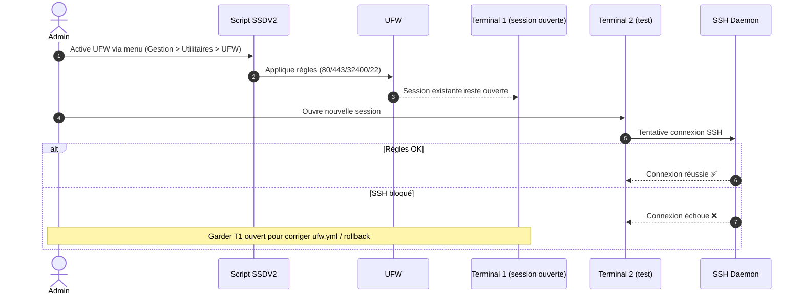

!!! abstract "Abstract"
    UFW (*Uncomplicated Firewall*) simplifie la configuration d’un pare-feu (front-end iptables).  
    Cette page décrit : l’activation via le menu SSDV2, les ports ouverts par défaut (**80/443/32400/22**), une procédure **anti lock-out** (tester SSH sur un second terminal), les commandes UFW les plus utiles, et la méthode officielle SSDV2 pour ajouter des ports/IP via `/opt/seedbox/conf/ufw.yml` **sans modifier les lignes existantes**.

---

## TL;DR

- ✅ Activez UFW via le menu SSDV2 (profil de base : 80/443/32400/22)
- ✅ Gardez votre session SSH ouverte
- ✅ Testez une **deuxième connexion SSH** avant de fermer quoi que ce soit
- ✅ Pour ajouter des exceptions : **éditez** `/opt/seedbox/conf/ufw.yml` en **ajoutant** des lignes

??? tip "Raccourci mental"
    **UFW** = “porte réseau” • **SSH** = “corde de secours” • **2e terminal** = “test anti lock-out” • **ufw.yml** = “source de vérité SSDV2”

---

## Présentation

UFW (Uncomplicated Firewall) est une interface conçue pour simplifier la configuration d’un pare-feu (basé sur iptables).

Objectifs :
- limiter l’exposition réseau aux ports **vraiment nécessaires**
- réduire la surface d’attaque
- conserver un accès administrateur fiable (SSH)

!!! info "Ce que UFW ne fait pas"
    UFW filtre le trafic réseau **au niveau du serveur**.  
    Il ne remplace pas :
    - les protections applicatives (SSO/OAuth/Authelia),
    - ni les bonnes pratiques Docker (ports non exposés inutilement).

---

## 1) Installation / Activation via SSDV2

Pour l’activer, passez par le menu :

- `3) Gestion`
- `2) Utilitaires`
- `8) Bloquer les ports non vitaux avec UFW`

Ports ouverts **par défaut** après installation :

- **http** (80)
- **https** (443)
- **plex** (32400)
- **ssh** (22 si vous avez laissé la valeur par défaut)


!!! tip "Pourquoi ces ports ?"
    - **80/443** : reverse proxy / accès web
    - **32400** : Plex (si exposé)
    - **22** : SSH (administration)

!!! warning "Cas particulier : SSH non-standard"
    Si vous avez changé le port SSH (ex. `2222`), vérifiez que votre configuration UFW autorise ce port, sinon risque de lock-out.

---

## 2) Conseil important (anti lock-out)

Une fois l’installation terminée :

- ❌ Ne fermez **surtout pas** votre terminal actuel
- ✅ Ouvrez **un second terminal**
- ✅ Testez une nouvelle connexion SSH

!!! danger "Risque"
    Un pare-feu mal réglé peut vous **couper l’accès SSH**.  
    Garder une session ouverte est votre filet de sécurité.

!!! success "Critère de réussite"
    Vous devez pouvoir ouvrir **une seconde session SSH** (nouvelle fenêtre/onglet) sans erreur.

---

## 3) Commandes UFW utiles

### Vérifier le statut et les règles

```bash
ufw status verbose
```

Exemple de sortie :

```text
Status: active
To                         Action      From
--                         ------      ----
8398                       ALLOW       Anywhere
Anywhere                   ALLOW       176.189.55.227
Anywhere                   ALLOW       172.16.0.0/12
Anywhere                   ALLOW       127.0.0.1
80                         ALLOW       Anywhere
443                        ALLOW       Anywhere
8080                       ALLOW       Anywhere
45000                      ALLOW       Anywhere
plexmediaserver-all        ALLOW       Anywhere
Anywhere                   ALLOW       182.122.87.111
8398 (v6)                  ALLOW       Anywhere (v6)
80 (v6)                    ALLOW       Anywhere (v6)
443 (v6)                   ALLOW       Anywhere (v6)
8080 (v6)                  ALLOW       Anywhere (v6)
45000 (v6)                 ALLOW       Anywhere (v6)
plexmediaserver-all (v6)   ALLOW       Anywhere (v6)
```

!!! info "Lecture rapide"
    - `To` = port/service ciblé  
    - `Action` = **ALLOW** / **DENY**  
    - `From` = source autorisée (IP, plage, Anywhere)

---

## 4) Ajouter des ports et/ou des IP (méthode SSDV2)

Si vous devez autoriser un port spécifique et/ou une IP non affectée par le filtrage UFW, éditez :

- `/opt/seedbox/conf/ufw.yml`

!!! warning "Règle SSDV2"
    **Ne modifiez pas** les lignes existantes : **ajoutez** uniquement des lignes supplémentaires.

Exemple de structure :

```yaml
hosts: localhost
gather_facts: true
vars:
  opened_ports:
    - 80
    - 443
    - 8080
    - 45000
    # Ajoutez les ports nécessaires ici :
    # - 25 # smtp
  allow_ips:
    - 172.17.0.1/12 # réseau docker, ne pas supprimer !
    - 127.0.0.1
    - 188.13.87.111
    # Ajoutez des IP ou plages supplémentaires ici :
    # - 123.456.789.123
    # - fe20:abcd::
```

!!! danger "Ne supprimez pas Docker/loopback"
    Les exceptions Docker (`172.17.0.1/12`) et loopback (`127.0.0.1`) sont critiques.  
    Les retirer peut casser des communications internes et/ou des services.

??? tip "Pattern premium (exploitation)"
    - **Ports** : n’ouvrez que ce qui est nécessaire (principe du moindre privilège)
    - **IPs** : whitelist votre IP WAN (maison/VPN) si vous durcissez fort
    - **Apps** : préférez exposer via Traefik (80/443) plutôt que d’ouvrir des ports bruts

---

## Checklist de validation ✅

- [ ] UFW activé via le menu SSDV2
- [ ] Session SSH principale gardée ouverte
- [ ] Une seconde connexion SSH fonctionne
- [ ] `ufw status verbose` affiche des règles cohérentes
- [ ] Les ports nécessaires (80/443/SSH/Plex) sont autorisés
- [ ] Toute extension (ports/IP) a été ajoutée dans `/opt/seedbox/conf/ufw.yml` **sans modifier l’existant**

!!! success "État attendu"
    UFW est actif, votre accès SSH est garanti, et seuls les ports nécessaires sont exposés.

---

## Diagramme de séquence (activation + test SSH)

