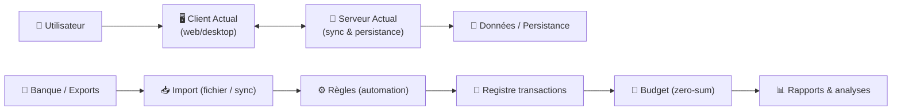
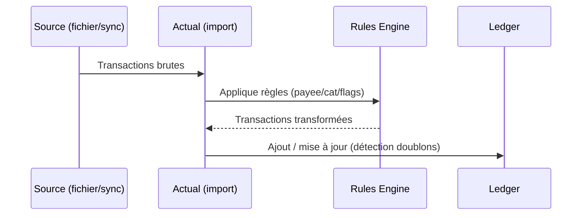

# 💸 Actual Budget — Présentation & Exploitation Premium (Self-host “local-first”)

### Budgeting moderne (zero-sum), sync multi-appareils, règles puissantes, import bancaire
Optimisé pour reverse proxy existant • Gouvernance & sécurité d’accès • Qualité des données • Exploitation durable

---

## TL;DR

- **Actual Budget** est un outil de finances personnelles **local-first** : tes données restent chez toi, avec une expérience moderne et rapide. :contentReference[oaicite:0]{index=0}  
- Le projet se compose d’un **client** et d’un **serveur** : le serveur n’est pas strictement obligatoire, mais **fortement recommandé** pour la sync et des fonctionnalités avancées. :contentReference[oaicite:1]{index=1}  
- La puissance “premium” vient de : **structure du budget**, **qualité des imports**, **règles d’automatisation**, **discipline de catégorisation**, **backups & rollback**.

---

## ✅ Checklists

### Pré-mise en service (qualité de base)
- [ ] Définir ta méthode (zero-sum / enveloppes) + périodes (mensuel recommandé)
- [ ] Définir la nomenclature de catégories (stable, non ambiguë)
- [ ] Décider la stratégie d’import : manuel (CSV/QIF/OFX/QFX) vs bank sync (selon pays) :contentReference[oaicite:2]{index=2}  
- [ ] Définir la stratégie de “payees” (normalisation via règles)
- [ ] Plan backups : **données + config** + test de restauration

### Post-mise en service (stabilité opérationnelle)
- [ ] Import test sur 30 jours : rapprochement soldes OK
- [ ] Règles anti-doublons (transferts) en place si bank sync des deux côtés :contentReference[oaicite:3]{index=3}  
- [ ] Revue “qualité de données” (payees/catégories) : < 2% d’“Uncategorized”
- [ ] Procédure “rollback” documentée + testée

---

> [!TIP]
> La meilleure façon de réussir Actual : **démarrer avec une date récente** (solde d’ouverture correct), puis importer/synchroniser seulement après. Ça évite des heures de nettoyage. :contentReference[oaicite:4]{index=4}

> [!WARNING]
> La sync bancaire n’est pas forcément “automatique” : selon le provider, tu peux devoir déclencher la récupération de transactions (ex: via l’UI). :contentReference[oaicite:5]{index=5}

> [!DANGER]
> La vraie dette technique d’un budget, ce n’est pas l’outil : c’est une taxonomie floue (catégories), des imports sales, et zéro règles. Fixer ça tôt = confort durable.

---

# 1) Actual Budget — Vision moderne

Actual, ce n’est pas “une app de dépenses”.

C’est :
- 🧠 Un **système de décision** (zero-sum) : chaque euro reçoit un job
- 🔄 Une **sync** multi-appareils sans friction (avec serveur) :contentReference[oaicite:6]{index=6}  
- 🧩 Un **pipeline d’import** (manuel + bank sync selon providers) :contentReference[oaicite:7]{index=7}  
- ⚙️ Un moteur de **règles** pour automatiser (payee, catégorie, transferts, etc.) :contentReference[oaicite:8]{index=8}  

---

# 2) Architecture globale (fonctionnelle)



Serveur recommandé pour sync et fonctionnalités associées. :contentReference[oaicite:9]{index=9}  

---

# 3) Les piliers “Premium” (ce qui change vraiment)

1. 🧾 **Budget zero-sum** propre (catégories stables, objectifs réalistes)
2. 📥 **Imports maîtrisés** (sources, cadence, nettoyage minimal)
3. ⚙️ **Règles** (normalisation payees, catégorisation auto, anti-doublons)
4. 🧠 **Rapprochement & contrôle** (soldes, transferts, anomalies)
5. 🛟 **Backups / tests / rollback** (zéro panique en prod perso)

---

# 4) Imports & Bank Sync (qualité des transactions)

## 4.1 Import manuel
Actual supporte plusieurs voies d’import de transactions (fichiers et/ou sync). :contentReference[oaicite:10]{index=10}  

## 4.2 Bank sync (selon providers)
La doc mentionne le support de **SimpleFIN**, **GoCardless** et **Pluggy.ai** (selon zones/pays), et précise comment récupérer les transactions. :contentReference[oaicite:11]{index=11}  

> [!TIP]
> Stratégie “propre” : solde d’ouverture récent → sync/import uniquement après cette date (reco FAQ). :contentReference[oaicite:12]{index=12}

---

# 5) Règles (automation) — le cœur premium

Les **règles** s’appliquent lors de l’import/sync pour transformer tes transactions : normalisation du payee, catégorie, notes, transferts, etc. :contentReference[oaicite:13]{index=13}  

## 5.1 Logique d’un pipeline d’import (conceptuel)



## 5.2 Anti-doublons transferts (cas classique)
Si tu fais du bank sync sur **les deux comptes** d’un transfert, la doc recommande de créer une règle pour **chaque côté** afin d’éviter des doublons. :contentReference[oaicite:14]{index=14}  

---

# 6) API & intégrations (automation “propre”)

Actual fournit une API ; par exemple, `importTransactions` ajoute des transactions en passant par le même pipeline que l’import/sync, donc **les règles s’appliquent**. :contentReference[oaicite:15]{index=15}  

Idées d’usage premium :
- Importer depuis un outil perso (banque exotique) → pousser vers Actual via API
- Enrichir automatiquement notes/tags
- Contrôles qualité : détecter catégories “Other/Uncategorized”

---

# 7) Workflows premium (habitudes qui paient)

## 7.1 Routine hebdo (10–15 min)
- Import/sync
- “Inbox” transactions : payees normalisés, catégories complétées
- Rapprochement : vérifier soldes et transferts
- Ajuster 1–2 règles si répétitions

## 7.2 “Mois parfait” (sans douleur)
- Créer le budget du mois (enveloppes)
- Fin de mois : revue rapide (écarts, tops dépenses)
- Ajuster objectifs (réalistes) + supprimer catégories inutiles

---

# 8) Validation / Tests / Rollback

## 8.1 Tests fonctionnels (check rapide)
```bash
# Vérifier que l'URL répond (si exposée via ton reverse proxy existant)
curl -I https://budget.example.tld | head

# Vérifier que la doc/endpoint répond (selon ton setup)
curl -s https://budget.example.tld | head -n 20
```

## 8.2 Validation “qualité de données”
- Sur 30 jours : taux “Uncategorized” < 2–5%
- Payees récurrents normalisés (pas 15 variantes d’Amazon)
- Transferts sans doublons (règles en place)

## 8.3 Rollback (principes)
- Restaurer la donnée (backup) puis revalider : soldes, imports, règles
- Garder une copie “avant upgrade” + “après upgrade”
- Documenter : où est le backup, comment restaurer, combien de temps

---

# 9) Erreurs fréquentes (et fixes)

- ❌ **Catégories instables** (doublons, noms ambigus) → figer une taxonomie + renommer tôt
- ❌ **Imports sales** (payees illisibles) → règles de normalisation (contient “amazon” → “Amazon”) :contentReference[oaicite:16]{index=16}  
- ❌ **Doublons transferts** → règles sur les deux comptes si sync des deux côtés :contentReference[oaicite:17]{index=17}  
- ❌ **Attendre que tout soit parfait** → commencer petit, itérer (règles + routine)

---

# 10) Sources — Images Docker (comme demandé)

## Images officielles Actual (server)
- Doc Docker : l’image est publiée sur Docker Hub en `actualbudget/actual-server` et aussi sur GHCR (`ghcr.io/actualbudget/actual`). :contentReference[oaicite:18]{index=18}  
- Docker Hub (actualbudget/actual-server) : :contentReference[oaicite:19]{index=19}  
- Repo / référence projet (monorepo Actual) : :contentReference[oaicite:20]{index=20}  
- Note “repo move” (historique actual-server → actual) : :contentReference[oaicite:21]{index=21}  

## LinuxServer.io (LSIO)
- À date, **pas d’image officielle LinuxServer “Actual Budget”** publiée ; on trouve plutôt une demande/fil de discussion de la communauté (request). :contentReference[oaicite:22]{index=22}  

---

# ✅ Conclusion

Actual Budget est excellent quand tu le traites comme un **système** :
- des catégories stables,
- des imports maîtrisés,
- des règles qui font le sale boulot,
- et une exploitation sérieuse (tests + backups + rollback).

Le résultat : un budget lisible, fiable, et durable — sans dépendre d’un SaaS.