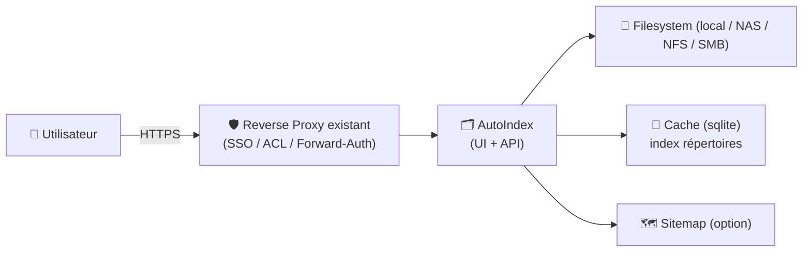
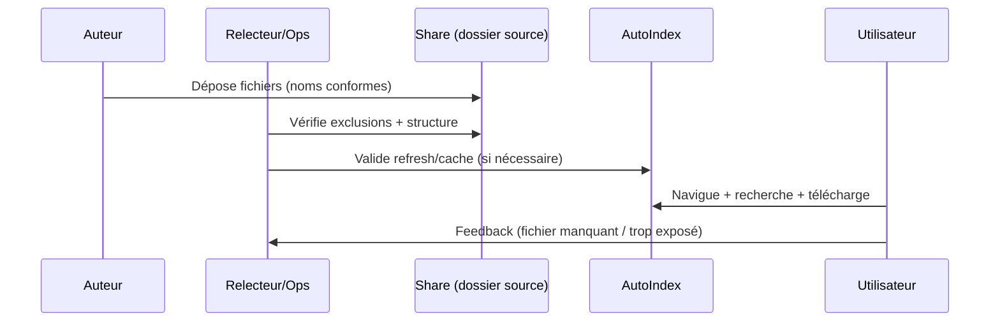

# 🗂️ AutoIndex (nielsAD) — Présentation & Exploitation Premium (Index de répertoires + recherche)

### Serveur web léger pour exposer un dossier en “directory index” moderne : cache, search récursive, sitemap
Optimisé pour reverse proxy existant • Gros volumes (100k+ fichiers) • FS distants • Exploitation durable

---

## TL;DR

- **AutoIndex (nielsAD/autoindex)** est un serveur web **léger** (Go) qui génère un **index de répertoires consultable** avec **recherche récursive**, pensé pour **beaucoup de fichiers** et/ou des **stockages lents** grâce à un **cache (sqlite)**. :contentReference[oaicite:0]{index=0}  
- Il sert une UI très compacte (SPA) et peut fournir un **sitemap** pour l’indexation. :contentReference[oaicite:1]{index=1}  
- Une config “premium” = **périmètre clair**, **conventions de nommage**, **cache maîtrisé**, **contrôle d’accès**, **tests + rollback**.

---

## ✅ Checklists

### Pré-mise en service (qualité de base)
- [ ] Définir le périmètre exact (un dossier “public”, pas un home complet)
- [ ] Définir la politique : lecture seule / téléchargement autorisé / indexation
- [ ] Définir les exclusions (temp, backups, fichiers sensibles)
- [ ] Conventions de noms (dossiers stables, tri cohérent)
- [ ] Stratégie d’accès : auth via reverse proxy existant (SSO/ACL) ou réseau privé
- [ ] Stratégie “cache” : où, combien, invalidation/refresh

### Post-configuration (validation opérationnelle)
- [ ] Navigation rapide (latence stable) même avec 100k+ fichiers
- [ ] Recherche récursive pertinente (résultats attendus, pas de bruit)
- [ ] Pas de fuite : aucune arborescence sensible visible
- [ ] Sitemap (si activé) cohérent et limité au périmètre
- [ ] Procédure rollback documentée (désactiver index, revenir à config précédente)

---

> [!TIP]
> AutoIndex est idéal quand tu veux une **“vitrine fichiers”** propre (docs, releases internes, dumps, partages contrôlés) sans stack lourde. :contentReference[oaicite:2]{index=2}

> [!WARNING]
> L’indexation de répertoires révèle de la **métadonnée** (noms, structure). Même sans contenus sensibles, le simple listing peut être critique.

> [!DANGER]
> “Je partage juste un dossier” → souvent faux : un mauvais mapping/exclusion expose des backups, clés, exports, logs. Réduis le périmètre au strict nécessaire.

---

# 1) Vision moderne

AutoIndex n’est pas “un listing HTML basique”.

C’est :
- 🔎 Une **recherche récursive** à l’échelle (gros volumes)
- 🧠 Un **cache** pour éviter de rescanner en permanence (sqlite)
- 🗺️ Un **sitemap** pour l’indexation
- ⚡ Une UI web minimale et rapide (SPA très légère)

Features (officiel) : :contentReference[oaicite:3]{index=3}

---

# 2) Architecture globale



---

# 3) Principes premium (5 piliers)

1. 🧭 **Périmètre minimal** (un dossier dédié “export”)
2. 🏷️ **Nommage & structure stables** (tri, lisibilité, search)
3. 🧠 **Cache maîtrisé** (performance, refresh contrôlé)
4. 🔐 **Accès contrôlé** (auth via proxy existant / réseau privé)
5. 🧪 **Validation + rollback** (tests simples, retour arrière rapide)

---

# 4) Design du contenu (ce qui fait la différence)

## 4.1 Structure recommandée
- Un root dédié (ex: `public-downloads/`)
- Sous-dossiers par domaine :
  - `docs/`
  - `releases/`
  - `exports/`
  - `tools/`

## 4.2 Conventions de nommage (anti-chaos)
- Versions : `app-1.2.3/` et fichiers `app-1.2.3-linux-amd64.tar.gz`
- Dates ISO : `2026-02-26_report.pdf` (tri naturel)
- Éviter : espaces multiples, accents aléatoires, “final_v2_ok”…

> [!TIP]
> Une arborescence stable = cache efficace = navigation rapide. :contentReference[oaicite:4]{index=4}

---

# 5) Performance & cache (gros volumes / FS distants)

AutoIndex est explicitement conçu pour :
- **beaucoup de fichiers (100k+)**
- **FS distants / haute latence**
grâce à un **cache de répertoires** (sqlite) continuellement mis à jour. :contentReference[oaicite:5]{index=5}

## Bonnes pratiques premium
- Éviter les “dossiers temp” dans le périmètre (churn = cache instable)
- Grouper les fichiers (éviter 200k fichiers dans un seul dossier)
- Définir une politique de refresh : fréquence raisonnable (selon ton usage)
- Sur FS distants : préférer une arborescence “large mais pas plate”

---

# 6) Sécurité d’accès (sans recettes infra)

## Objectif
- Personnes autorisées seulement
- Périmètre exact
- Pas de fuite de structure

## Contrôles recommandés
- Auth via reverse proxy existant (SSO/ACL/forward-auth)
- Limitation par réseau (LAN/VPN)
- Désactiver l’indexation publique si c’est un partage interne
- Revue régulière : “qu’est-ce qu’on expose réellement ?”

---

# 7) Workflows premium (ops)

## 7.1 Publication de fichiers (pipeline)


## 7.2 “Incident” (fuite / mauvais périmètre)
- couper l’accès (ACL proxy)
- vérifier le root exposé
- corriger exclusions / structure
- invalider/rafraîchir cache si besoin
- ré-ouvrir l’accès

---

# 8) Validation / Tests / Rollback

## Smoke tests
```bash
# 1) L’URL répond
curl -I https://files.example.tld | head

# 2) Vérifier que la page charge
curl -s https://files.example.tld | head -n 20

# 3) Vérifier qu’un fichier “sentinelle” est trouvable (manuel ou via recherche UI)
# Exemple sentinelle : README_PUBLIC.txt
```

## Tests de sécurité (indispensables)
- compte “lecteur” :
  - ✅ voit uniquement le dossier prévu
  - ❌ ne voit aucun backup/secret/log
- vérifier que la recherche ne révèle pas des chemins hors périmètre

## Rollback (simple)
- désactiver l’accès côté reverse proxy (interrupteur “safe”)
- revenir à la config précédente (root/exclusions/cache)
- revalider via smoke tests + test sécurité

---

# 9) Erreurs fréquentes (et fixes)

- ❌ Dossier trop large → réduire à un root dédié “public”
- ❌ Arborescence plate gigantesque → restructurer (par version/date/domaine)
- ❌ Recherche “bruyante” → conventions de noms + nettoyage
- ❌ FS distant lent → tirer parti du cache + limiter churn + structure adaptée :contentReference[oaicite:6]{index=6}
- ❌ Exposition involontaire → ACL stricte + revue périodique

---

# 10) Sources — Images Docker (comme demandé)

## Projet (source de vérité)
- Repo officiel & features (cache sqlite, recherche récursive, sitemap, focus 100k+ fichiers) : :contentReference[oaicite:7]{index=7}

## Images Docker “officielles”
- À partir des sources consultées ici, **je ne vois pas d’image Docker officielle clairement référencée** pour `nielsAD/autoindex` (type Docker Hub/GHCR documentée dans le README). La référence principale reste le repo. :contentReference[oaicite:8]{index=8}

## LinuxServer.io (LSIO)
- Pas d’image LSIO “autoindex” listée dans les catalogues officiels (à vérifier si tu as un nom exact différent). :contentReference[oaicite:9]{index=9}

> [!TIP]
> Si tu me donnes le **lien exact** (Docker Hub / GHCR) de l’image que tu utilises pour AutoIndex, je te mets la section “Sources images” au format premium, 100% alignée sur ton image réelle.

---

# ✅ Conclusion

AutoIndex (nielsAD) est une solution “premium” pour servir un dossier comme un **catalogue web** :
- rapide même à grande échelle (cache sqlite),
- recherche récursive,
- et exploitable proprement si tu appliques : périmètre minimal + conventions + contrôle d’accès + tests/rollback. :contentReference[oaicite:10]{index=10}