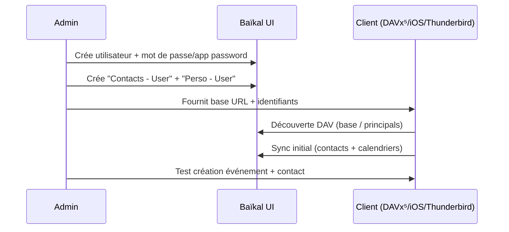

# 🗓️📇 Baïkal — Présentation & Configuration Premium (CalDAV + CardDAV)

### Calendriers & contacts auto-hébergés, simples, rapides, gouvernables
Optimisé pour reverse proxy existant • Multi-clients (iOS/macOS/Android/Thunderbird) • Permissions & partage • Exploitation durable

---

## TL;DR

- **Baïkal** est un serveur **CalDAV + CardDAV** léger, basé sur **sabre/dav**, avec une **interface web** pour gérer utilisateurs, carnets d’adresses et calendriers.  
- Valeur : **centraliser** contacts + agendas, **sync multi-appareils**, **partage** (famille/équipe), **contrôle** des données.  
- En “premium ops” : **URL DAV propres**, **gouvernance (naming/partages)**, **sauvegardes DB+fichiers**, **tests clients**, **rollback**.

Référence produit : https://sabre.io/baikal/  
Source projet : https://github.com/sabre-io/Baikal

---

## ✅ Checklists

### Pré-configuration (avant d’onboard des clients)
- [ ] URL externe stable (HTTPS via ton reverse proxy existant)
- [ ] Choix base URL DAV : `/dav.php/` ou `/html/dav.php/` (selon version/packaging)
- [ ] Stratégie d’identités : comptes par personne + conventions de noms
- [ ] Stratégie de partage : calendriers “perso” vs “partagés”
- [ ] Sauvegardes planifiées (DB + répertoires Baïkal) + test de restauration
- [ ] Règles “hygiene” : pas de secrets dans les descriptions d’événements / notes

### Post-configuration (validation)
- [ ] Android (DAVx⁵) : découverte OK + sync OK (contacts + calendriers)
- [ ] iOS/macOS : ajout de compte OK (Contacts & Calendrier)
- [ ] Thunderbird : CalDAV + CardDAV OK
- [ ] Partage testé (lecture seule vs édition) sur 2 comptes
- [ ] Restore test (au moins 1 fois) validé

---

> [!TIP]
> Baïkal est souvent idéal quand tu veux une solution **simple** avec **UI de gestion**, sans vouloir une suite collaborative complète.

> [!WARNING]
> Le “99% des soucis” vient d’une **mauvaise URL DAV** (base path) ou d’un **subpath mal géré** derrière le reverse proxy.

> [!DANGER]
> Un serveur DAV expose des données personnelles (contacts, anniversaires, rendez-vous). Traite l’accès comme **sensibilisé** : auth forte, HTTPS obligatoire, logs prudents.

---

# 1) Baïkal — Vision moderne

Baïkal n’est pas “un calendrier web”.

C’est :
- 🧩 un **serveur de synchronisation** standard (CalDAV/CardDAV)
- 🧠 une **source de vérité** pour clients (mobiles, desktop)
- 🛠️ une **console web** pour gérer users + carnets + calendriers
- 🔄 une **brique de partage** (famille / petite équipe)

Description officielle : https://sabre.io/baikal/

---

# 2) Architecture globale

```mermaid
flowchart LR
    Clients["Clients DAV (iOS/macOS, DAVx5, Thunderbird, etc.)"] -->|HTTPS (DAV)| RP["Reverse Proxy"]
    RP --> Baikal["Baikal (UI Admin + DAV endpoints)"]
    Baikal --> DB["DB (SQLite or MySQL/MariaDB)"]
    Baikal --> Storage["Storage (config, Specific, logs)"]
    Admin["Admin"] --> Baikal
    Backup["Backups"] --> DB
    Backup --> Storage
```
---

# 3) Concepts clés (ce qui fait une config “premium”)

## 3.1 CalDAV vs CardDAV
- **CalDAV** : calendriers (événements, parfois tâches selon clients)
- **CardDAV** : contacts (vCards, groupes selon implémentations)

## 3.2 Identité & “principal”
Dans DAV, chaque utilisateur a un espace “principal” (racine logique) qui contient :
- ses calendriers
- ses carnets de contacts
- ses partages

---

# 4) URL DAV (la partie la plus importante)

Baïkal est souvent utilisé avec ces bases :
- Base URL : `/dav.php/` (exemples DAVx⁵)  
- ou `/html/dav.php/` (certaines versions/packagings)

Références clients :
- DAVx⁵ “tested with Baikal” : https://www.davx5.com/tested-with/baikal
- Notes macOS Contacts.app : https://sabre.io/dav/clients/osx-addressbook/

## 4.1 Exemples d’URL (patterns utiles)

### Base (discovery)
- `https://dav.example.tld/dav.php/`
- `https://dav.example.tld/baikal/dav.php/`
- `https://dav.example.tld/baikal/html/dav.php/`

### Principal (quand un client le demande)
- `https://dav.example.tld/dav.php/principals/<username>/`

> [!TIP]
> Beaucoup de clients savent “découvrir” automatiquement si tu donnes la **base URL** + identifiants.  
> Si ça échoue, essaie l’URL “principals”.

---

# 5) Gouvernance (naming & partage qui tiennent dans le temps)

## 5.1 Convention de nommage (recommandée)
- Calendriers :
  - `Perso - <Prénom>`
  - `Famille`
  - `Equipe - Ops`
  - `Astreintes`
- Carnets :
  - `Contacts - <Prénom>`
  - `Famille`
  - `Clients` (si usage pro)

## 5.2 Modèle de partage simple
- Calendriers partagés “groupe” (Famille/Equipe)
- Calendriers perso non partagés (ou lecture seule à un conjoint si besoin)
- Évite la multiplication de micro-calendriers au début

> [!WARNING]
> Trop de calendriers = confusion côté clients (iOS/macOS affichent souvent tout, et l’utilisateur se perd vite).

---

# 6) Clients (recettes de connexion “premium”)

## 6.1 Android (DAVx⁵)
- Base URL recommandée : `/dav.php/` ou `/html/dav.php/`  
Référence : https://www.davx5.com/tested-with/baikal

Checklist :
- [ ] Ajout compte → découverte OK
- [ ] Sync Contacts + Calendriers
- [ ] Vérifier permissions (création d’un événement/ contact)

## 6.2 macOS / iOS
- Contacts.app / Calendrier.app : utiliser HTTPS, et parfois un “Server Path” de type `/baikal/html/dav.php/principals/` selon cas.  
Référence : https://sabre.io/dav/clients/osx-addressbook/

## 6.3 Thunderbird
- CalDAV : ajouter l’agenda via l’URL DAV (base/principal)
- CardDAV : carnet d’adresses via l’URL DAV correspondante (selon découverte)

---

# 7) Exploitation premium (backups, maintenance, hygiène)

## 7.1 Ce qu’il faut sauvegarder (toujours)
- **DB** (SQLite ou MySQL/MariaDB)
- répertoires Baïkal “données/config” (souvent `Specific` + `config`, selon installation/packaging)  
Indication générale côté docs d’installation : https://sabre.io/baikal/install/

> [!DANGER]
> Sauvegarder uniquement la DB **ou** uniquement les fichiers = restauration incomplète.

## 7.2 Politique de sauvegarde recommandée
- Quotidien : DB + fichiers (snapshot)
- Rétention : 7 jours + 4 semaines + 6 mois (adapter)
- Offsite : au moins 1 copie hors machine

## 7.3 Journalisation (prudence)
- Ne pas conserver trop longtemps des logs contenant des chemins/identités
- Surveiller erreurs 500 (souvent liées à données spécifiques ou clients agressifs)

Exemples d’incidents (réels) : issue 500 (DAVx⁵/Evolution)  
https://github.com/sabre-io/Baikal/issues/1197

---

# 8) Workflows premium

## 8.1 Onboarding d’un utilisateur


## 8.2 Partage “Famille / Équipe”
- Admin crée calendrier `Famille` / `Equipe`
- Ajoute permissions :
  - certains : lecture/écriture
  - d’autres : lecture seule
- Test : un membre crée un événement, l’autre le voit en < 1 min

---

# 9) Validation / Tests / Rollback

## 9.1 Smoke tests (réseau & endpoints)
```bash
# 1) Vérifier que l’endpoint répond
curl -I https://dav.example.tld/dav.php/ | head

# 2) Vérifier que le principal est accessible (auth requise)
curl -I -u "user:pass" https://dav.example.tld/dav.php/principals/user/ | head
```

## 9.2 Tests fonctionnels (minimum)
- créer un événement sur mobile → apparaît sur desktop
- créer un contact sur desktop → apparaît sur mobile
- modifier / supprimer (bidirectionnel)

## 9.3 Rollback (restauration)
- Restaurer DB + répertoires Baïkal depuis un snapshot cohérent
- Re-tester la découverte DAV (base URL identique)
- Vérifier sur 1 client Android + 1 client Apple

---

# 10) Sources — Images Docker (comme demandé)

> Baïkal n’annonce **pas** fournir d’image Docker officielle ; la doc mentionne une image **communautaire**.

## 10.1 Image communautaire la plus citée
- `ckulka/baikal` (Docker Hub) : https://hub.docker.com/r/ckulka/baikal  
- Doc Baïkal “Installation using Docker” (mentionne ckulka/baikal) : https://sabre.io/baikal/docker-install/  
- Repo de packaging (référence de l’image) : https://github.com/ckulka/baikal-docker

## 10.2 LinuxServer.io (LSIO)
- À ce jour, **pas d’image Baïkal officielle LSIO** ; on retrouve surtout des demandes/threads de request.  
  - Thread request : https://discourse.linuxserver.io/t/request-baikal-caldav-server-including-inflcoud-web-interface-or-agendav-web-interface/833
  - Catalogue images LSIO : https://www.linuxserver.io/our-images

---

# ✅ Conclusion

Baïkal est une excellente brique **CalDAV/CardDAV** quand tu veux :
- une solution légère,
- une UI admin simple,
- une compatibilité large clients,
- une exploitation sérieuse (backups + tests + rollback).

Le vrai “premium” se joue sur :
✅ URL DAV correctes • ✅ conventions de nommage • ✅ partage maîtrisé • ✅ sauvegardes restaurables • ✅ tests clients