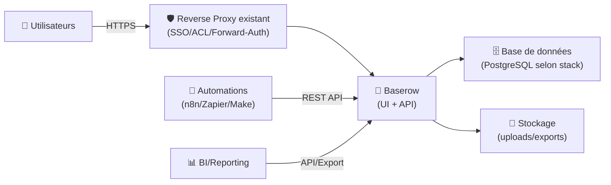
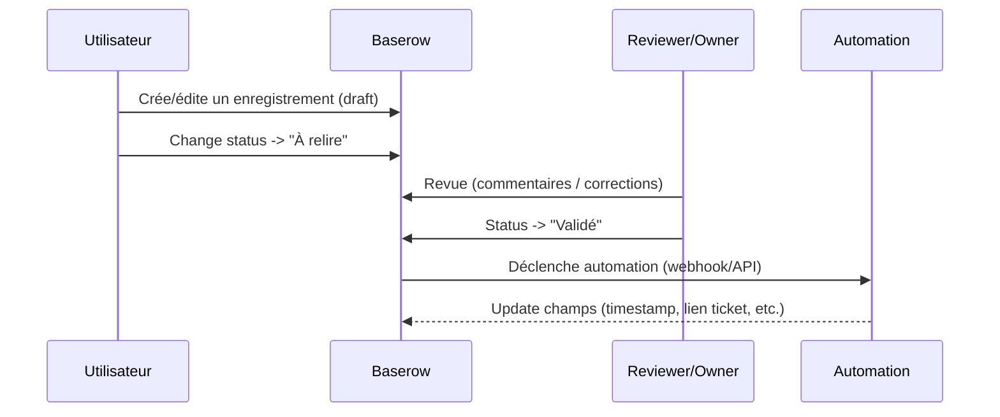

# 🧱 Baserow — Présentation & Exploitation Premium (No-code database “Airtable-like”)

### Construire des bases, vues, formulaires et automations — avec gouvernance, API, et usage durable
Optimisé pour reverse proxy existant • Permissions & rôles • API-first • Workflows d’équipe • Exploitation pro

---

## TL;DR

- **Baserow** = plateforme **open-source** de base de données no-code type tableur, alternative à Airtable.
- Tu crées des **tables** + **relations**, puis des **vues** (grid/kanban/calendar…), des **formulaires**, et tu consommes l’**API**.
- Une config premium = **gouvernance des espaces**, **modélisation propre**, **naming**, **permissions**, **export/backups**, **tests** et **rollback**.

Référence produit : docs & repo Baserow. :contentReference[oaicite:0]{index=0}

---

## ✅ Checklists

### Pré-usage (avant d’embarquer une équipe)
- [ ] Définir l’objectif : CRM léger / Inventaire / Runbooks / Suivi projets / Data catalog
- [ ] Définir les **workspaces** (équipes) + owners + règles d’accès
- [ ] Définir une convention de **naming** (tables/champs/relations)
- [ ] Définir la stratégie **API** (clé, rôles, scopes, rotation)
- [ ] Définir la stratégie “source of truth” (Baserow vs autre système)
- [ ] Définir le standard d’exports/backups (format, fréquence, restauration)

### Post-configuration (qualité opérationnelle)
- [ ] Permissions testées avec 2 comptes (owner vs lecteur)
- [ ] Vues “métier” prêtes (grid + filtres + tri)
- [ ] Une page “README” par base (modèle de données + règles)
- [ ] Tests API (CRUD minimal) validés
- [ ] Procédure de rollback documentée (restore exports/DB)

---

> [!TIP]
> Baserow est excellent pour des **outils internes** : inventaires, catalogues, pipelines éditoriaux, CRM simple, suivi incidents, etc.  
> Le secret = **modèle de données clair + vues “métier”** + conventions.

> [!WARNING]
> Le piège #1 du no-code : “on ajoute des champs partout”.  
> Fix : **normaliser** (relations) + conventions + champs calculés/choix plutôt que texte libre.

> [!DANGER]
> Un outil no-code finit par contenir des données sensibles (emails, tokens, notes).  
> Traite Baserow comme une app critique : accès restreint + audit permissions + hygiène API.

---

# 1) Baserow — Vision moderne

Baserow n’est pas “un tableur en ligne”.

C’est :
- 🧱 un **modélisateur** de données (tables, relations, types de champs),
- 👀 un **moteur de vues** (affichages adaptés au métier),
- 🧩 une **brique API-first** pour alimenter d’autres systèmes,
- 🤝 un **outil collaboratif** gouverné (workspaces + rôles).

Positionnement (open-source, API, self-host possible) : Docker Hub + docs. :contentReference[oaicite:1]{index=1}

---

# 2) Architecture globale (référence)



> [!TIP]
> Baserow = “UI + API”. Même si l’équipe ne touche pas à l’API, **l’API te sauve** pour migrations, intégrations, audits.

---

# 3) Modèle de données premium (ce qui évite le chaos)

## 3.1 Tables & relations (règles simples)
- 1 table = 1 “entité” (Clients, Tickets, Assets, Articles…)
- Relations :
  - **1-N** (Client → Tickets)
  - **N-N** (Articles ↔ Tags)
- Champs :
  - préférer **Select / Multi-select** à texte libre pour les statuts
  - préférer **relations** aux duplications

## 3.2 Conventions de naming (très efficace)
- Tables : `Clients`, `Tickets`, `Assets`
- Champs :
  - `status` (select), `owner` (user), `created_at` (date), `source` (select)
  - relations : `client` (ticket → client), `tags` (n-n)

> [!WARNING]
> Les champs “notes” et “commentaires” deviennent vite des fourre-tout.  
> Mets des champs structurants (statut, priorité, catégorie) pour préserver le tri.

---

# 4) Gouvernance & permissions (propre et maintenable)

## 4.1 Stratégie “workspaces”
- 1 workspace par équipe (Infra / Produit / Support / Ops…)
- owner clairement identifié
- règles de partage :
  - lecture inter-équipes si nécessaire
  - écriture limitée au domaine

## 4.2 Stratégie “rôles” (simple au départ)
- 👑 Owner/Admin workspace : modèle, permissions, intégrations
- ✍️ Editor : CRUD selon besoin
- 👀 Viewer : lecture

> [!TIP]
> La gouvernance se fait mieux par **espaces (workspaces)** que par micro-rôles complexes.

---

# 5) Vues & UX métier (le vrai “no-code”)

## 5.1 Vues recommandées (pack standard)
- **Grid** : vue “source of truth”
- **Kanban** : status → visual management
- **Calendar** : dates clés (échéances)
- **Filtered views** : par équipe/owner/priorité

## 5.2 Filtres & tri (premium)
- tri stable (ex: `priority desc`, puis `updated_at desc`)
- filtres sauvegardés :
  - “Mes tickets”
  - “Bloquants”
  - “À valider”
  - “Retard”

---

# 6) API & intégrations (le levier pro)

Baserow fournit des endpoints REST pour automatiser :
- imports/exports
- synchronisation avec d’autres outils
- provisioning de tables/données
- extraction vers BI

Docs d’installation mentionnant Baserow “API-first” + ressources associées : :contentReference[oaicite:2]{index=2}

### Patterns d’intégration premium
- n8n/Make : “quand statut passe à DONE → notifier + archiver”
- CI/CD : publier un changelog dans une table “Releases”
- Inventaire : synchroniser actifs depuis un CMDB/source externe

> [!WARNING]
> L’API devient vite critique : applique une hygiène “prod”  
> (rotation des clés, droits minimaux, logs d’accès si possible).

---

# 7) Workflows premium (collaboration & revue)



---

# 8) Validation / Tests / Rollback

## 8.1 Tests “fonctionnels” (UI)
- [ ] Créer un enregistrement, modifier, filtrer, exporter
- [ ] Vérifier une relation (1-N) + cohérence des vues
- [ ] Tester permissions avec un compte Viewer (pas d’édition)

## 8.2 Tests API (smoke tests)
> Exemple générique : adapte l’URL et le token.

```bash
# 1) Ping API (exemple)
curl -sS -H "Authorization: Token YOUR_TOKEN" \
  "https://baserow.example.tld/api/" | head

# 2) Lire quelques lignes d’une table (exemple placeholder)
curl -sS -H "Authorization: Token YOUR_TOKEN" \
  "https://baserow.example.tld/api/database/rows/table/TABLE_ID/?size=5" | head
```

## 8.3 Rollback (principes simples)
- Rollback “données” :
  - restaurer depuis export/backup validé
- Rollback “modèle” :
  - revenir à une version précédente (via duplication de base/table avant refactor)
- Rollback “intégrations” :
  - désactiver automations en premier (éviter la boucle)

> [!TIP]
> Avant une refonte de schéma : **duplique** la base/table et valide sur copie.  
> Le rollback devient “on repointe les vues”.

---

# 9) Templates premium (prêts à l’emploi)

## 9.1 Base “Tickets / Incidents”
Tables :
- `Tickets` : title, status(select), priority(select), owner(user), service(select), due_date, link
- `Services` : name, tier(select), oncall, docs_link
- `Postmortems` : ticket(relation), summary, timeline, actions

Vues :
- “Triage” (status in New/In progress)
- “SLA / Retards” (due_date < today)
- “Par service” (group by service)

## 9.2 Base “Inventaire”
Tables :
- `Assets` : type(select), hostname, owner(team), env(select), ip, serial, status
- `Changes` : asset(relation), date, change_type, author, notes

---

# 10) Sources — Images Docker (comme demandé)

## Image officielle Baserow (Docker Hub)
- `baserow/baserow` : image all-in-one officielle. :contentReference[oaicite:3]{index=3}  
- Images “standalone” (ex: backend) : `baserow/backend` (usage avancé). :contentReference[oaicite:4]{index=4}  
- Doc officielle “Install with Docker” (référence des images/approche). :contentReference[oaicite:5]{index=5}  
- Historique : annonce d’images officielles Docker Hub à partir d’une release (thread communauté). :contentReference[oaicite:6]{index=6}

## LinuxServer.io (LSIO)
- Pas d’image LSIO “Baserow” listée comme officielle ; on retrouve une **demande** de container LSIO (request) côté forum. :contentReference[oaicite:7]{index=7}