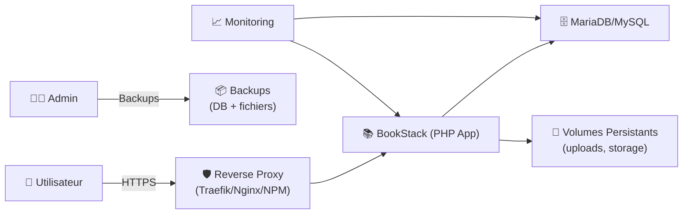
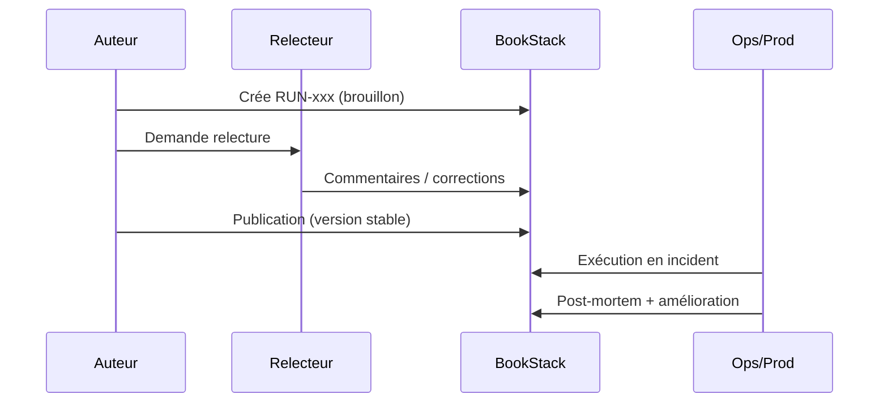

# 📚 BookStack — Présentation & Déploiement Premium (Architecture + Sécurité + Exploitation)

### Wiki “books-first” pour une documentation claire, durable et gouvernée
Optimisé pour Docker • Reverse Proxy • SSO/LDAP possible • Permissions fines • Backups & Rollback

---

## TL;DR (exécutable mentalement)

- **BookStack** = documentation structurée en **Étagères → Livres → Chapitres → Pages**
- Déploie-le en **Docker Compose** avec **DB dédiée**, **volumes persistants**, **reverse proxy HTTPS**
- Sécurise : **pas d’exposition directe**, **UFW baseline**, **SSO/LDAP (option)**, **backups automatisés**
- Exploite : **monitoring**, **tests**, **plan de rollback**, **priorités 30/60/90 jours**

---

## ✅ Checklists

### Pré-déploiement (préflight)
- [ ] DNS prêt (ex: `docs.domaine.tld`)
- [ ] Machine avec Docker + Compose installés
- [ ] Stockage persistant (SSD recommandé) + backups (local + offsite)
- [ ] Reverse proxy opérationnel (Traefik / Nginx / NPM)
- [ ] SMTP (optionnel) pour invitations + notifications
- [ ] Stratégie d’auth (local / SSO / LDAP) définie

### Post-déploiement (go-live)
- [ ] `APP_URL` correct (HTTPS + FQDN)
- [ ] Compte admin créé + roles ajustés
- [ ] Permissions par espace (étagère/livre) posées
- [ ] Sauvegardes testées + restauration validée
- [ ] Monitoring minimal (logs + uptime) en place
- [ ] Politique de mise à jour (mensuelle) fixée

---

> [!TIP]
> **BookStack brille** quand on l’utilise comme “source de vérité” : procédures, runbooks, post-mortems, onboarding, KB support, inventaires.

> [!WARNING]
> **Ne l’expose jamais directement** sur Internet sans reverse proxy + HTTPS + contrôle d’accès (SSO/forward-auth/VPN).

> [!DANGER]
> Éviter la configuration “vite fait” : DB sans mot de passe, volumes non persistés, `APP_URL` faux, backups inexistants → perte de données assurée.

---

# 1) Vision & Positionnement

## Pourquoi BookStack (au-delà d’un wiki classique)
- 🧱 **Structure naturelle** (Shelf/Book/Chapter/Page) → meilleure gouvernance
- ✍️ **Éditeur WYSIWYG** (simple) + **Markdown** (pour power users)
- 🔐 **Permissions** globales via rôles + overrides par contenu (shelves/books/pages)
- 🔎 **Recherche** efficace (contenu + structure)
- 🧩 **API REST** (intégrations, automatisations, exports)

---

# 2) Architecture globale (référence)



---

# 3) Modèle de contenu (pour une doc qui tient 5 ans)

## Hiérarchie
- **Étagère (Shelf)** : domaine / équipe (ex: “Infra”, “Produit”, “Support”)
- **Livre (Book)** : ensemble cohérent (ex: “Runbooks Linux”, “Onboarding”)
- **Chapitre (Chapter)** : section logique
- **Page (Page)** : unité de connaissance (procédure, standard, fiche)

## Taxonomie premium (recommandée)
- **Runbooks** (actions) vs **Standards** (règles) vs **Référentiels** (sources)
- Préfixes simples :
  - `RUN-` (Runbook)
  - `STD-` (Standard)
  - `REF-` (Référence)
  - `PM-` (Post-mortem)

---

# 4) Gouvernance & Permissions (propre et maintenable)

## Stratégie “3 rôles” (base saine)
- 👑 **Admins** : config système, users, rôles
- ✍️ **Editors** : créer/modifier dans leurs espaces
- 👀 **Readers** : lecture seule

## Stratégie “par équipe”
- Une étagère par équipe, permissions strictes :
  - Équipe A → write sur Shelf A
  - Autres → read ou none

> [!TIP]
> Évite 50 rôles dès le début. Commence simple, puis spécialise par **espaces** plutôt que par micro-permissions.

---

# 5) Sécurité “baseline” (sans se lock-out)

## SSH — config sûre (anti lock-out)
1) Crée un nouveau user admin, ajoute ta clé, teste, ensuite seulement durcis.

```bash
# 1) user + sudo
adduser ops
usermod -aG sudo ops

# 2) clé SSH
mkdir -p /home/ops/.ssh
nano /home/ops/.ssh/authorized_keys
chmod 700 /home/ops/.ssh
chmod 600 /home/ops/.ssh/authorized_keys
chown -R ops:ops /home/ops/.ssh
```

Durcissement progressif (après test) :
```bash
sudo nano /etc/ssh/sshd_config

# Recommandé (après avoir validé accès clé)
PasswordAuthentication no
PermitRootLogin no
PubkeyAuthentication yes
```

```bash
sudo systemctl reload ssh
```

> [!DANGER]
> Ne coupe pas `PasswordAuthentication` avant d’avoir validé **une session SSH fonctionnelle** avec clé.

## UFW — baseline
```bash
sudo ufw default deny incoming
sudo ufw default allow outgoing
sudo ufw allow OpenSSH

# Si reverse proxy sur la machine (80/443)
sudo ufw allow 80/tcp
sudo ufw allow 443/tcp

sudo ufw enable
sudo ufw status verbose
```

---

# 6) Backups & Restauration (c’est là que “pro” se voit)

## Ce qu’il faut sauvegarder
- **DB** (MariaDB/MySQL)
- **Volumes BookStack** (uploads + storage/config dans `/config` chez linuxserver)

## Script backup (DB + fichiers)
```bash
cat >/opt/bookstack/backups/backup.sh <<'EOF'
#!/usr/bin/env bash
set -euo pipefail

TS="$(date +%F_%H%M%S)"
BASE="/opt/bookstack"
OUT="$BASE/backups/$TS"
mkdir -p "$OUT"

# DB dump
docker exec bookstack_db mariadb-dump -u root -p"${MARIADB_ROOT_PASSWORD:-CHANGE_ME_ROOT_STRONG}" bookstack > "$OUT/bookstack.sql"

# Files (config/uploads)
tar -C "$BASE" -czf "$OUT/bookstack_config.tgz" data

# Checksums
sha256sum "$OUT"/* > "$OUT/SHA256SUMS.txt"

echo "Backup OK: $OUT"
EOF

chmod +x /opt/bookstack/backups/backup.sh
```

> [!TIP]
> Stocke les backups **offsite** (S3/Backblaze/rsync) + teste une restauration 1 fois par mois.

## Restauration (rollback)
```bash
# Stop app
docker compose down

# Restore files
tar -C /opt/bookstack -xzf /opt/bookstack/backups/<TS>/bookstack_config.tgz

# Restore DB
docker compose up -d bookstack_db
cat /opt/bookstack/backups/<TS>/bookstack.sql | docker exec -i bookstack_db mariadb -u root -pCHANGE_ME_ROOT_STRONG bookstack

# Restart app
docker compose up -d
```

---

# 7) Monitoring & Observabilité (minimum viable)

## Indispensables
- Logs container (`docker logs`, rotation)
- Uptime check (HTTP 200 + login page)
- Santé DB (espace disque, errors)
- Alerting email/Slack (option)

## Commandes utiles
```bash
docker stats
docker compose ps
docker logs --tail=200 bookstack
docker logs --tail=200 bookstack_db
df -h
```

> [!WARNING]
> Surveiller **l’espace disque** : DB + uploads peuvent exploser vite (images, pièces jointes).

---

# 8) Workflows premium (comment on “industrialise” la doc)

## Cycle de vie d’une procédure (runbook)


## Modèle de page “RUN- incident”
- Contexte
- Impact
- Prérequis
- Procédure pas-à-pas
- Validation
- Rollback
- “Quoi surveiller ensuite”
- Liens vers dashboards/logs

---

# 9) Validation / Tests / Rollback (section opérationnelle)

## Tests de validation
```bash
# 1) Service up
curl -I https://docs.example.com | head

# 2) Accès app (depuis reverse proxy)
curl -s https://docs.example.com | grep -i -E "bookstack|login" || true

# 3) DB reachable (depuis container app)
docker exec -it bookstack sh -lc "nc -zv bookstack_db 3306"
```

## Rollback plan (simple)
- A) Rollback **contenu** : restaurer DB + volumes depuis backup
- B) Rollback **version** : pinner une image (`:x.y.z`) au lieu de `latest`
- C) Rollback **infra** : revenir à l’ancienne conf reverse proxy

> [!TIP]
> Pour les upgrades : **snapshot backup**, upgrade, smoke tests, sinon rollback immédiat.

---

# 10) Priorités 30 / 60 / 90 jours (vraie feuille de route)

## 0–30 jours : stabilité & adoption
- [ ] Déploiement HTTPS + `APP_URL` correct
- [ ] Modèle de rôles minimal (Admins/Editors/Readers)
- [ ] 3 étagères (Infra / Produit / Support) + permissions
- [ ] Modèles de pages (RUN/STD/REF/PM)
- [ ] Backups automatisés + test de restauration

## 31–60 jours : gouvernance & intégrations
- [ ] SSO/LDAP si nécessaire
- [ ] “Definition of Done” : toute procédure doit avoir validation+rollback
- [ ] Process relecture (review) + owners par espace
- [ ] API : export/automations (si besoin)
- [ ] Monitoring + alerting (uptime + disque)

## 61–90 jours : excellence opérationnelle
- [ ] Nettoyage & standardisation (tags, conventions, nomenclature)
- [ ] Tableaux de bord (liens vers Grafana/ELK)
- [ ] Audit permissions (moindre privilège)
- [ ] DR plan (restauration sur machine neuve)
- [ ] Cadence de mises à jour (mensuelle) + changelog interne

---

# 11) Erreurs fréquentes (et comment les éviter)

- ❌ `APP_URL` faux (HTTP au lieu de HTTPS) → liens/cookies cassés
- ❌ Volumes non persistants → perte de données au redeploy
- ❌ DB root password faible → compromission
- ❌ Exposition directe sans auth → attaque brute force
- ❌ Aucun test de restore → “backup fantôme”

---

# 12) Conclusion (la “doc qui tient”)

BookStack devient une **plateforme de connaissance** :
- 📌 structurée (books-first)
- 🔐 gouvernée (permissions + rôles)
- ⚙️ opérable (backups, tests, rollback)
- 🧠 vivante (runbooks + post-mortems + standards)

---

## Références utiles (officielles & images)
- https://www.bookstackapp.com/docs/
- https://www.bookstackapp.com/docs/admin/installation/
- https://www.bookstackapp.com/docs/user/roles-and-permissions/
- https://www.bookstackapp.com/docs/admin/subdirectory-setup/
- https://www.bookstackapp.com/docs/admin/hacking-bookstack/
- https://docs.linuxserver.io/images/docker-bookstack/
- https://hub.docker.com/r/linuxserver/bookstack