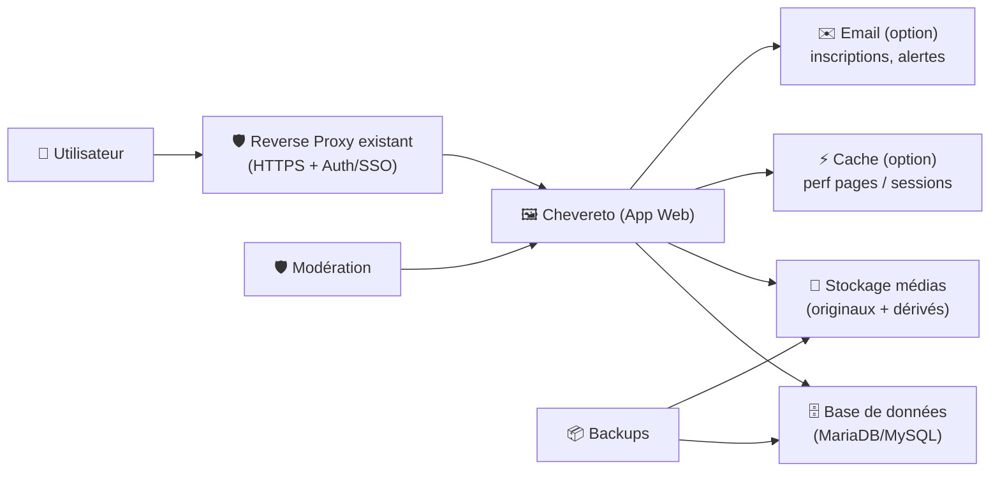
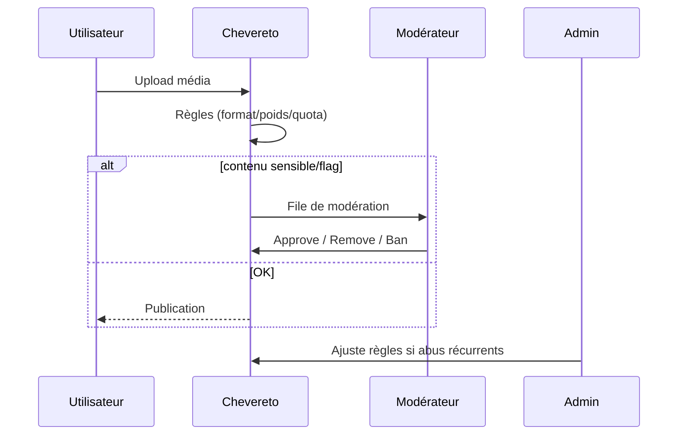

# 🖼️ Chevereto — Présentation & Exploitation Premium

### Plateforme self-hosted de partage médias (images/vidéos) : multi-utilisateurs, albums, modération, API
Optimisé pour reverse proxy existant • Contrôle • Gouvernance • Exploitation durable

---

## TL;DR

- **Chevereto** sert à construire un site de **media hosting** self-hosted (style “votre Imgur/Flickr”), avec **comptes**, **albums**, **permissions**, **thèmes** et **API**. :contentReference[oaicite:0]{index=0}  
- La version **V4** est la référence actuelle côté documentation ; **V3** est indiquée comme **EOL**. :contentReference[oaicite:1]{index=1}  
- “Premium ops” = **gouvernance**, **médias & stockage**, **modération**, **rétention**, **observabilité**, **tests/rollback**.

---

## ✅ Checklists

### Pré-prod (avant ouverture aux utilisateurs)
- [ ] Objectif clair : “public” vs “privé/équipe” vs “communauté”
- [ ] Politique de contenu : NSFW, DMCA, modération, abus
- [ ] Stratégie storage : capacité, rétention, thumbnails, sauvegarde
- [ ] Gouvernance : rôles, permissions, espaces/collections (selon ta structure)
- [ ] Stratégie URL : domaine/sous-domaine stable (pour liens permanents)
- [ ] Contrôle d’accès : SSO/auth externe ou auth interne + règles d’accès

### Post-config (qualité opérationnelle)
- [ ] Upload, affichage, pagination, recherche : OK
- [ ] Thumbnails et conversions : OK (CPU/IO maîtrisés)
- [ ] Permissions vérifiées par comptes “test” (reader/uploader/mod)
- [ ] Modération/Signalement fonctionnels (workflow clair)
- [ ] Backups testés + restauration validée
- [ ] Runbook incident “upload down / DB down / storage full” prêt

---

> [!TIP]
> Chevereto est “premium” quand tu **standardises** : conventions albums, limites d’upload, règles de modération, et que tu sais **restaurer** vite.

> [!WARNING]
> Les médias (originaux + dérivés) coûtent cher en **disque**, **IO** et parfois **CPU** (thumbnails/transcodage). Mesure tôt.

> [!DANGER]
> Toute plateforme d’upload publique attire spam/abus. Sans gouvernance + contrôles, tu te crées une bombe opérationnelle.

---

# 1) Chevereto — Vision moderne

Chevereto n’est pas un simple “uploader”.

C’est :
- 🧑‍🤝‍🧑 **Multi-utilisateurs** (comptes, profils)
- 🗂️ **Organisation** (albums, collections, tags selon usage)
- 🧾 **Gouvernance** (rôles, permissions, modération)
- 🖌️ **Personnalisation** (thème, routes, branding)
- 🔌 **Intégration** via API (automatisation, uploads, clients)

Positionnement officiel : plateforme self-hosted orientée contrôle et autonomie. :contentReference[oaicite:2]{index=2}

---

# 2) Architecture globale (référence)



---

# 3) Modèle produit (comment organiser pour que ça scale)

## 3.1 Structures recommandées (simples et durables)
- **Espace “Communauté”** : albums par thématique
- **Espace “Équipe”** : albums par projet / sprint / client
- **Espace “Archives”** : lecture seule (gel)

## 3.2 Conventions de nommage (premium)
- Albums : `TEAM - Projet - YYYY-MM` (ex: `OPS - Runbooks - 2026-02`)
- Media : nom “lisible” + source (ex: `incident-502-nginx-2026-02-26.png`)
- Tags : `env:prod`, `app:api`, `type:schema`, `topic:incident`

> [!TIP]
> La recherche devient instantanée si tes tags portent “env/app/type/topic”.

---

# 4) Gouvernance & Permissions (le cœur “pro”)

## 4.1 Rôles recommandés (starter pack)
- 👑 **Admin** : système, sécurité, paramètres, users
- 🛡️ **Moderator** : signalements, suppression, validation contenu
- ✍️ **Uploader** : upload + gestion de ses albums
- 👀 **Reader** : lecture uniquement (ou accès restreint)

## 4.2 Stratégie d’accès (selon ton cas)
- **Privé** (entreprise) : accès via SSO/VPN + comptes internes
- **Communautaire** : inscriptions + limites strictes + modération renforcée
- **Public** : lecture publique, upload restreint (invitation/approval)

---

# 5) Qualité média (règles qui évitent le chaos)

## 5.1 Limites recommandées
- Taille max upload : adaptée à ton storage/IO
- Formats autorisés : réduire la surface (ex: images, éventuellement vidéos)
- Quotas : par user/groupe (si possible)
- Rétention : définir une politique (ex: purge au-delà de N mois sur certains espaces)

## 5.2 Dérivés (thumbnails/preview)
- Objectif : UX rapide + économie de bande passante
- Risque : explosion du nombre de fichiers (originaux + dérivés)

> [!WARNING]
> Calcule le stockage : “1 original” peut devenir “1 + N dérivés”.

---

# 6) Modération (anti-abus, anti-dette)

## 6.1 Workflow premium (simple)


## 6.2 Règles “anti spam” (pragmatiques)
- limiter création de compte (invitation / domaine email / CAPTCHA selon contexte)
- limiter upload (rate limiting / quotas)
- audit des actions (logs d’admin/mod)

---

# 7) API & Intégrations (quand Chevereto devient une brique)

Chevereto expose des API (V4 et aussi API v1/compat selon docs). :contentReference[oaicite:3]{index=3}

Cas d’usage :
- upload automatisé depuis CI (captures, artefacts)
- publication depuis scripts internes
- intégration portail interne / KB

> [!WARNING]
> API = surface d’attaque. Utilise clés/permissions minimales, et journalise.

---

# 8) Validation / Tests / Rollback

## 8.1 Tests de validation (smoke tests)
```bash
# HTTP répond
curl -I https://TON_DOMAINE | head

# Page d’upload accessible (selon droits)
curl -s https://TON_DOMAINE | head -n 20

# Vérification simple (manuel)
# 1) upload image test
# 2) vérifier thumbnail + page média
# 3) vérifier suppression/modération selon rôle
```

## 8.2 Tests “qualité ops”
- Compte **Reader** : ne peut pas upload / modifier
- Compte **Uploader** : upload OK, quota respecté
- Compte **Moderator** : voit file modération, actions tracées
- Test “storage nearly full” : comportement attendu (message, arrêt uploads, alerte)

## 8.3 Rollback (principes)
- **Rollback contenu** : restaurer DB + médias (synchronisés)
- **Rollback applicatif** : revenir à une version précédente (si déploiement versionné)
- Toujours : snapshot backup **avant** changement

> [!DANGER]
> Restaurer uniquement la DB sans les médias (ou l’inverse) crée un système incohérent.

---

# 9) Pièges fréquents (et comment les éviter)

- ❌ “Tout le monde peut uploader” sans garde-fous → spam/abus
- ❌ Pas de politique de rétention → stockage hors de contrôle
- ❌ Permissions mal testées → fuite de médias privés
- ❌ Backups non testés → faux sentiment de sécurité
- ❌ Trop de formats/vidéos sans budget CPU/IO → perf instable

---

# 10) Sources (adresses vérifiées) — en bash

```bash
# Documentation Chevereto V4 (officiel)
https://v4-docs.chevereto.com/

# Documentation Chevereto V3 (indique EOL)
https://v3-docs.chevereto.com/

# API v1 (docs V3 ; utile pour compat/repères)
https://v3-docs.chevereto.com/api/

# Image Docker officielle Chevereto (Docker Hub)
https://hub.docker.com/r/chevereto/chevereto

# LinuxServer.io — image Chevereto (DEPRECATION NOTICE indiqué)
https://hub.docker.com/r/linuxserver/chevereto
https://docs.linuxserver.io/deprecated_images/docker-chevereto/

# Chevereto-Free (référence historique / repo)
https://github.com/rodber/chevereto-free
https://chevereto-free.github.io/
```