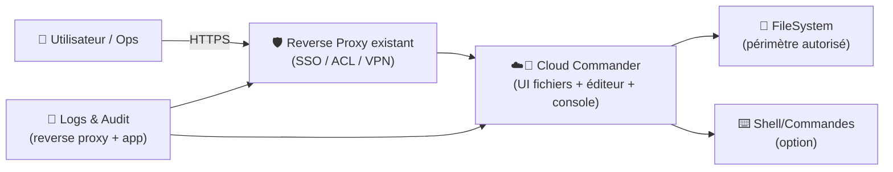
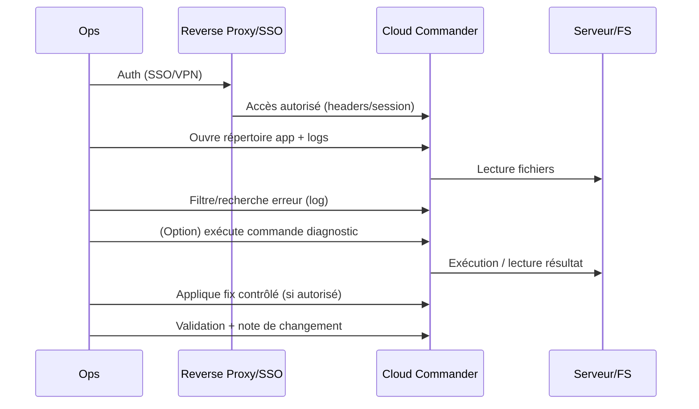

# ☁️📁 Cloud Commander (cloudcmd) — Présentation & Exploitation Premium

### File manager web “orthodox” avec console + éditeur, pour gérer un serveur depuis le navigateur
Optimisé pour reverse proxy existant • Contrôle d’accès • Multi-utilisateurs • Exploitation durable

---

## TL;DR

- **Cloud Commander (cloudcmd)** = **gestionnaire de fichiers web** avec **console** et **éditeur** intégrés.
- Usage idéal : **ops rapides**, maintenance, navigation serveur, edits contrôlés, petites interventions.
- Une approche premium = **accès fortement sécurisé**, **périmètres limités**, **journalisation**, **procédures de validation & rollback**.
- ⚠️ Par nature, c’est un outil puissant (fichiers + commandes) → traite-le comme un **accès privilégié**.

Sources produit : site + repo officiel. (voir section “Sources” en bas) :contentReference[oaicite:0]{index=0}

---

## ✅ Checklists

### Pré-usage (avant de le donner à une équipe)
- [ ] Définir le périmètre : quel dossier racine autorisé (ex: `/srv/projects`), quels chemins interdits
- [ ] Définir le mode d’accès : VPN / SSO / auth externe via reverse proxy
- [ ] Définir le modèle d’autorisations : lecture seule vs édition vs console
- [ ] Vérifier la journalisation (logs d’accès, reverse proxy, audit)
- [ ] Rédiger une page “Runbook incident” (quoi faire si compte compromis)

### Post-configuration (qualité opérationnelle)
- [ ] Test : un utilisateur “non-admin” ne peut pas sortir du périmètre prévu
- [ ] Test : l’éditeur et/ou la console sont désactivés si non nécessaires
- [ ] Test : accès indirect uniquement (reverse proxy), jamais d’exposition brute
- [ ] Test : rollback documenté (désactivation rapide, rotation secrets, invalidation sessions)

---

> [!TIP]
> Le meilleur modèle : **Cloud Commander pour les actions rapides**, et une vraie stack pour l’historique (git, CI/CD, logs centralisés).

> [!WARNING]
> Même en lecture seule, le contenu peut être sensible (configs, secrets). Applique **moindre privilège**.

> [!DANGER]
> Console web + accès fichiers = surface critique. Sans contrôle d’accès fort (SSO/VPN/ACL), c’est un risque majeur.

---

# 1) Vision moderne

Cloud Commander n’est pas “un explorateur de fichiers”.

C’est :
- 📁 Un **file manager web** (copy/move/rename, permissions selon config)
- 🧾 Un **éditeur** (modifs rapides, hotfix contrôlés)
- ⌨️ Une **console** intégrée (diagnostic, commandes)
- 🌐 Une **interface d’administration** légère pour agir depuis partout

Présentation officielle : :contentReference[oaicite:1]{index=1}

---

# 2) Architecture globale



---

# 3) “Premium mindset” (5 piliers)

1. 🔐 **Contrôle d’accès** (SSO/VPN/ACL) + pas d’exposition directe
2. 🧭 **Périmètre strict** (dossier racine, pas de “/” en libre service)
3. ✂️ **Réduction des capacités** (désactiver console/édition si inutile)
4. 🧾 **Audit & traçabilité** (logs d’accès + conservation)
5. 🧪 **Validation & rollback** (tests systématiques + plan d’urgence)

---

# 4) Gouvernance & Sécurité d’accès (sans recettes reverse proxy)

## Modèles recommandés

### Modèle A — “Ops-only”
- Accès uniquement via VPN + SSO
- Console autorisée (contrôlée)
- Périmètre : dossiers ops (scripts, logs non sensibles, configs filtrées)

### Modèle B — “Équipe produit”
- Accès via SSO, sans console
- Éditeur autorisé seulement sur certains chemins (docs, conf non sensibles)
- Périmètre : répertoires projet

### Modèle C — “Read-only”
- Lecture seule (idéal pour support / observation)
- Pas de console, pas d’édition
- Périmètre strict

> [!TIP]
> **Désactive la console** si tu n’en as pas besoin. C’est souvent la meilleure “feature” sécurité.

---

# 5) Organisation & conventions (pour éviter le chaos)

## Convention de dossiers “propre”
- `/srv/apps/<app>/` : runtime applicatif
- `/srv/config/<app>/` : configurations (droits serrés)
- `/srv/shared/` : ressources partagées
- `/srv/docs/` : docs internes (safe)

## Convention “safe edit”
- Tout changement manuel → doit produire une trace :
  - soit commit Git (si dossier versionné),
  - soit note dans BookStack,
  - soit commentaire en page “Changelog ops”.

> [!WARNING]
> Édition web “à chaud” = utile, mais sans process tu crées des “snowflakes servers”.

---

# 6) Workflows premium (ops & incidents)

## 6.1 Triage incident (séquence)


## 6.2 “Changement contrôlé” (pattern)
- Préparer : identifier fichier + backup local (copie)
- Modifier : changement minimal
- Valider : test rapide (service, endpoint, logs)
- Documenter : “quoi/qui/quand/pourquoi”
- Rollback prêt : restaurer copie précédente

---

# 7) Validation / Tests / Rollback

## Smoke tests (fonctionnels)
```bash
# Vérifier l'accès HTTP(S) depuis le réseau autorisé
# (adapter l’URL)
curl -I https://cloudcmd.example.tld | head

# Vérifier que le périmètre est respecté (test manuel UI)
# - l'utilisateur ne doit PAS pouvoir naviguer hors du dossier autorisé
# - console/éditeur doivent être absents si non autorisés
```

## Tests sécurité (indispensables)
- utilisateur “standard” :
  - ✅ accès au dossier prévu
  - ❌ pas d’accès aux secrets (`/etc`, `/root`, clés privées, env files)
- rotation session :
  - déconnexion invalide bien l’accès
- logs :
  - les accès apparaissent côté reverse proxy

## Rollback (plan d’urgence)
- **Niveau 1** : couper l’accès (ACL/SSO) immédiatement
- **Niveau 2** : rotation secrets exposés potentiellement (tokens, clés)
- **Niveau 3** : vérifier intégrité (diff fichiers sensibles, audit)

> [!DANGER]
> Si suspicion de compromission : coupe l’accès d’abord, enquête ensuite.

---

# 8) Limitations (à connaître)

- Outil orienté **action immédiate**, pas gouvernance long terme
- Ne remplace pas :
  - Git + PR reviews
  - CI/CD
  - observabilité logs historisée
- Risque principal : “outil pratique” qui devient un “backdoor opérationnel” si mal géré

---

# 9) Sources (adresses vérifiées) — en Bash comme demandé

```bash
# Site officiel Cloud Commander (cloudcmd)
https://cloudcmd.io/

# GitHub (repo principal)
https://github.com/coderaiser/cloudcmd

# Docker Hub (image upstream maintenue par l'auteur)
https://hub.docker.com/r/coderaiser/cloudcmd/

# Docker Hub (tags)
https://hub.docker.com/r/coderaiser/cloudcmd/tags

# LinuxServer.io (LSIO) — collection d'images (référence générale)
https://www.linuxserver.io/our-images
```

> [!NOTE]
> Je n’ai trouvé **aucune image LSIO dédiée “cloudcmd”** dans leurs listes officielles ; l’image la plus référencée publiquement pour Cloud Commander est **`coderaiser/cloudcmd`**. :contentReference[oaicite:2]{index=2}