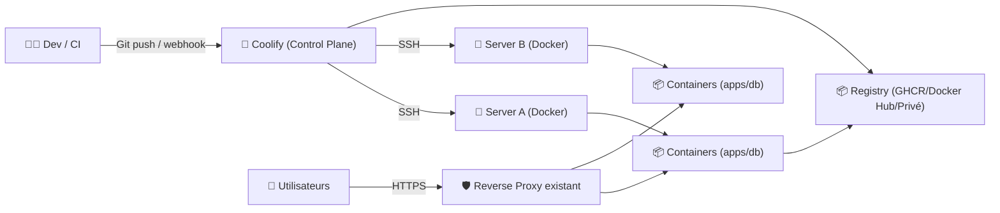
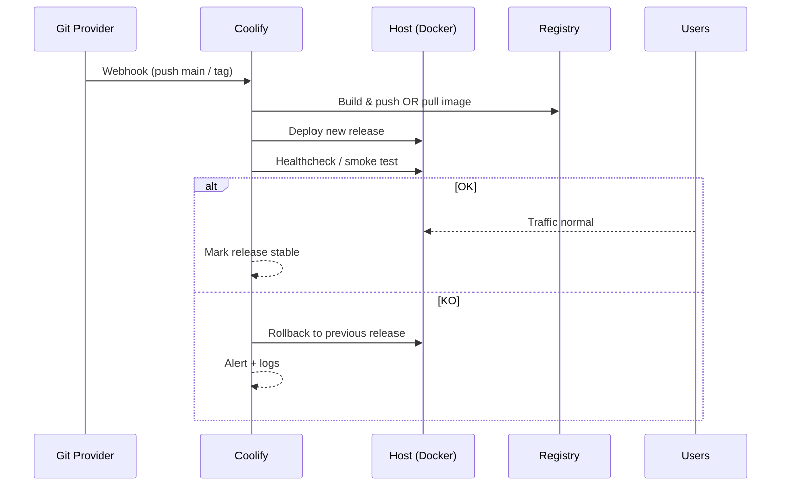

# 🚀 Coolify — Présentation & Exploitation Premium (PaaS self-hosted)

### Alternative open-source à Heroku/Netlify/Vercel pour déployer apps, DB, services et sites
Optimisé pour reverse proxy existant • GitOps possible • Multi-projets • Secrets • Observabilité “ops-ready”

---

## TL;DR

- **Coolify** est une **plateforme self-hosted** pour déployer et gérer des applications (Dockerfile, images, services) sur tes serveurs via **SSH + Docker**. :contentReference[oaicite:0]{index=0}
- “Premium” = **modèle de projets**, **environnements**, **secrets**, **réseaux**, **politiques de déploiement**, **tests**, **rollback**, et **contrôle d’accès**.
- Coolify utilise des **images/assistants** (registry GHCR/Docker Hub) selon la config, et peut être configuré pour tirer depuis `ghcr.io` ou `docker.io`. :contentReference[oaicite:1]{index=1}

---

## ✅ Checklists

### Pré-usage (gouvernance & modèle)
- [ ] Définir la structure : **Teams / Projets / Environnements** (dev/staging/prod)
- [ ] Convention de nommage : `app-env` (ex: `api-prod`, `web-staging`)
- [ ] Stratégie secrets : variables chiffrées + rotation
- [ ] Politique de déploiement : auto sur `main` vs manuel
- [ ] Règles réseau : isolation par projet + ports minimaux
- [ ] Stratégie logs : “live” vs agrégation (Loki/ELK/Cloud)

### Post-configuration (qualité opérationnelle)
- [ ] Déploiement d’une app “hello” validé sur dev + prod
- [ ] Rollback testé (redeploy build précédent)
- [ ] Sauvegarde DB testée (restore réel)
- [ ] Accès équipes vérifié (droits minimaux)
- [ ] Alerting (au moins échec déploiement / indispo)

---

> [!TIP]
> Coolify est le plus rentable quand tu standardises **une seule façon de déployer** par type d’app :  
> **Dockerfile** (build) / **Image registry** (pull) / **Compose** (stack).  
> Même si tu supportes plusieurs modes, impose une “voie royale” par équipe.

> [!WARNING]
> La surface d’attaque d’un PaaS est “réelle” : tokens Git, variables, registres, webhooks.  
> Mets le paquet sur **contrôle d’accès**, **audit**, et **mises à jour**. :contentReference[oaicite:2]{index=2}

> [!DANGER]
> Évite la dérive “tout le monde admin” : c’est la cause #1 des fuites de secrets et des suppressions accidentelles.  
> Sépare : **Platform Admin** vs **Project Maintainer** vs **Read-only**.

---

# 1) Coolify — Vision moderne

Coolify n’est pas “juste un dashboard Docker”.

C’est :
- 🧩 Un **orchestrateur de déploiement** (build/pull/run) piloté par Git/SSH
- 🗂️ Un **modèle de projets** (apps + DB + services + domaines)
- 🔐 Un **gestionnaire de secrets & variables** par environnement
- 🔁 Un **moteur de cycles de vie** : deploy, redeploy, rollback, logs, monitoring de base
- 🌐 Un **gestionnaire de domaines** (via ton reverse proxy existant / intégrations selon setup)

Référence produit : description officielle + docs. :contentReference[oaicite:3]{index=3}

---

# 2) Architecture globale (modèle mental)



---

# 3) Les 5 piliers d’une config “premium”

1. 🧱 **Standardisation des déploiements** (Dockerfile vs image vs stack)
2. 🔐 **Secrets & RBAC** (moindre privilège, audit, rotation)
3. 🌍 **Environnements** (dev/staging/prod) + promotion contrôlée
4. 🧭 **Réseau & isolation** (par projet, ports minimaux, dépendances explicites)
5. 🧪 **Validation + rollback** (tests, canary léger si besoin, retour arrière rapide)

---

# 4) Modèle Projets / Environnements (pour éviter le chaos)

## Structure recommandée
- **Team** (ou espace) = ownership
- **Project** = produit (ex: `billing`, `media`, `docs`)
- **Environment** = `dev`, `staging`, `prod`
- **Resources** = `app`, `db`, `redis`, `worker`, `cron`, etc.

## Règles simples qui tiennent dans le temps
- Une app = un repo = un pipeline de déploiement
- Une DB = sauvegarde + test restore + owner
- Secrets : jamais en dur dans Git, jamais dans logs

---

# 5) Déploiements (modes) — et “voie royale”

Coolify peut piloter des déploiements basés sur :
- **Dockerfile** (Coolify build puis run)
- **Image** (pull depuis registry)
- **Compose** (stack déclarative) :contentReference[oaicite:4]{index=4}

> [!TIP]
> Choisis une “voie royale” par équipe :
> - Apps web : Dockerfile
> - Services internes : image pull (versionnée)
> - Stacks : compose (mais gouverné)

---

# 6) Secrets & Variables (sain, testable, auditable)

## Stratégie premium
- Variables **par environnement**
- Secrets séparés (tokens, DB passwords, API keys)
- Rotation planifiée (mensuelle/trimestrielle selon criticité)
- “No secret in logs” : réduire verbosity + masquer si possible

> [!WARNING]
> Les problèmes de registry (auth GHCR/Docker) arrivent souvent quand un token expire.  
> Coolify a une doc de troubleshooting sur ces cas. :contentReference[oaicite:5]{index=5}

---

# 7) Observabilité “ops-ready” (sans vendre du rêve)

Ce que tu veux en prod :
- ✅ logs applicatifs exploitables (niveau INFO, erreurs actionnables)
- ✅ visibilité déploiement (succès/échec + cause)
- ✅ healthchecks / endpoints de statut
- ✅ corrélation (timestamp + request id si possible)

> [!TIP]
> Ajoute un `REQUEST_ID` (ou trace id) dans tes apps : c’est le multiplicateur x10 pour debug.

---

# 8) Workflow premium (déploiement + rollback)



---

# 9) Validation / Tests / Rollback (section exécutable)

## Smoke tests (exemples)
```bash
# 1) Le service répond (adapté à ton domaine)
curl -I https://app.example.tld | head

# 2) Endpoint health (si disponible)
curl -s https://app.example.tld/health || true

# 3) Vérifier une réponse applicative simple
curl -s https://app.example.tld | head -n 20
```

## Tests de déploiement (discipline)
- Déployer d’abord en **staging**
- Vérifier : login, page clé, appel API, job background
- Puis promouvoir en prod

## Rollback “propre”
- Re-déployer la **release précédente** (image tag / build id)
- Si DB migrée :
  - rollback schema (si prévu) OU
  - stratégie “forward fix” documentée (souvent plus réaliste)

> [!WARNING]
> Les migrations DB “non réversibles” doivent être traitées comme des changements à risque : fenêtre, backups, plan.

---

# 10) Points d’attention récurrents (ce qui casse en vrai)

- ❌ Secrets exposés dans logs (stack traces + env dump)
- ❌ Versions non pin (latest partout) → déploiements non reproductibles
- ❌ Absence de healthchecks → trafic envoyé vers une app cassée
- ❌ Droits trop larges → suppressions accidentelles / fuites
- ❌ Registry auth instable (tokens expirés) :contentReference[oaicite:6]{index=6}

---

# 11) Sources — Images Docker (demandé) + adresses en bash

> Note : je ne mets **aucun lien “cliquable”** dans le texte.  
> Ci-dessous, uniquement des **adresses** dans un bloc `bash`.

```bash
# --- Coolify : sources officielles / images ---
# Docs (installation / base produit)
https://coolify.io/docs/get-started/installation

# Repo officiel (source de vérité)
https://github.com/coollabsio/coolify

# Image Docker Hub (Coolify)
https://hub.docker.com/r/coollabsio/coolify

# Docs : registry (GHCR vs Docker Hub) / config REGISTRY_URL
https://coolify.io/docs/knowledge-base/custom-docker-registry

# Docs : Docker Compose (référence produit, même si tu n'utilises pas Compose)
https://coolify.io/docs/knowledge-base/docker/compose

# Troubleshoot : erreurs GHCR / token expiré
https://coolify.io/docs/troubleshoot/docker/expired-github-personal-access-token

# --- LinuxServer.io (vérifier existence image) ---
# Catalogue officiel des images LinuxServer (Coolify n'y apparaît pas comme image dédiée)
https://www.linuxserver.io/our-images
```

Constats “LinuxServer image” : le catalogue officiel LSIO ne liste pas Coolify comme image dédiée. :contentReference[oaicite:7]{index=7}

---

# ✅ Conclusion

Coolify est un **PaaS pragmatique** : tu gardes tes serveurs, mais tu récupères l’ergonomie “plateforme”.
Une config premium = **standardisation**, **RBAC**, **secrets propres**, **environnements**, **tests**, **rollback** — et une gouvernance qui empêche le chaos.