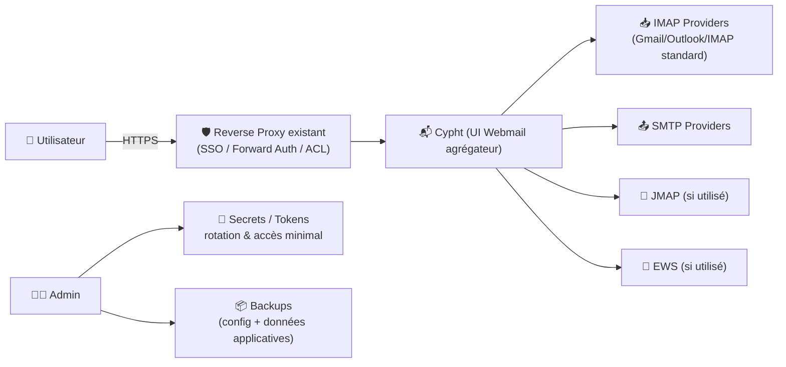
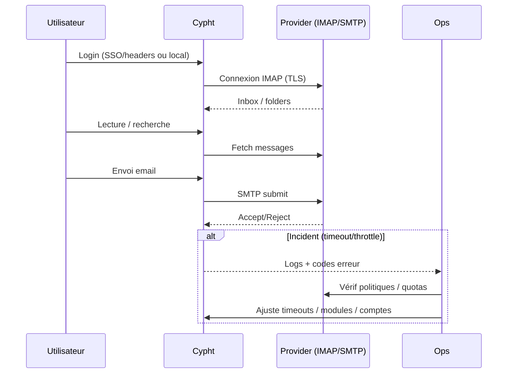

# 📬 Cypht — Présentation & Exploitation Premium (Webmail “agrégateur”)

### Tous vos comptes (IMAP/SMTP, JMAP, EWS…) dans une seule interface
Optimisé pour reverse proxy existant • Sécurité & gouvernance • Exploitation durable

---

## TL;DR

- **Cypht** est un **agrégateur webmail** : il **n’héberge pas** vos boîtes, il **se connecte** à vos comptes existants et les regroupe. :contentReference[oaicite:0]{index=0}  
- Objectif “premium” : **auth forte**, **sessions propres**, **périmètres**, **hygiène des secrets**, **tests** + **rollback**.
- À traiter comme un **outil sensible** : il manipule des identifiants, des tokens, et affiche des emails.

---

## ✅ Checklists

### Pré-usage (avant ouverture aux utilisateurs)
- [ ] Définir le modèle : comptes perso, comptes partagés, boîtes support, etc.
- [ ] Définir l’auth : SSO / headers proxy / comptes locaux (selon ton contexte)
- [ ] Politique de sécurité : HTTPS, durée session, 2FA/SSO si possible
- [ ] Règles de confidentialité : qui peut voir quels comptes / alias / boîtes partagées
- [ ] Stratégie “secrets” : stockage, rotation, accès admin minimal

### Post-configuration (qualité opérationnelle)
- [ ] Test connexion IMAP/SMTP (au moins 2 providers différents)
- [ ] Test JMAP/EWS si utilisé
- [ ] Test lecture / envoi / pièces jointes / recherche
- [ ] Vérifier logs : pas de fuite de secrets (tokens / passwords)
- [ ] Runbook “incident mail” (latence, auth, throttling, timeouts)
- [ ] Procédure de rollback documentée

---

> [!TIP]
> Cypht est idéal si tu as **plusieurs boîtes** (perso + pro + support) et que tu veux une **vue unifiée** sans migrer ton mail.

> [!WARNING]
> Les providers mail appliquent souvent du **throttling** et des politiques de sécurité (OAuth2, “app passwords”, blocage IMAP). Prévois un plan pour ces cas.

> [!DANGER]
> Considère Cypht comme “haute sensibilité” : il centralise l’accès à tes emails. Accès strict + journaux maîtrisés + mise à jour régulière.

---

# 1) Cypht — Vision moderne

Cypht est une interface web qui :
- regroupe plusieurs comptes email dans une seule UI (“news reader for email”)
- supporte des protocoles modernes selon les modules : **IMAP/SMTP**, **JMAP**, **EWS** (selon usage) :contentReference[oaicite:1]{index=1}
- vise une expérience simple et rapide, orientée agrégation plutôt que “groupware”

Docs & présentation : :contentReference[oaicite:2]{index=2}

---

# 2) Architecture globale



---

# 3) Philosophie “premium” (5 piliers)

1. 🔐 **Auth & sessions** (SSO si possible, durée de session maîtrisée)
2. 🧭 **Périmètres** (comptes partagés, boîtes support, accès admin rare)
3. 🧩 **Connecteurs** robustes (IMAP/SMTP + OAuth2 si disponible)
4. 🧪 **Validation** (tests envoi/lecture + pièces jointes + recherche)
5. 🔄 **Rollback** rapide (retour config, retour version, restauration)

---

# 4) Connectivité & Providers (ce qui casse le plus souvent)

## 4.1 IMAP/SMTP : points durs réels
- Auth “classique” parfois bloquée (ex: restrictions IMAP, politiques de sécurité)
- Limites de débit (throttling)
- Certificats / TLS (mauvais chain, SNI)
- Timeouts réseau / DNS

## 4.2 OAuth2 (quand c’est possible)
Certains providers permettent OAuth2 sur IMAP (souvent plus sûr : pas de mot de passe stocké). La doc Cypht aborde ce sujet côté intégrations. :contentReference[oaicite:3]{index=3}

> [!TIP]
> En prod : préfère OAuth2 quand dispo, sinon “app passwords” dédiés + rotation.

---

# 5) Gouvernance (comptes, boîtes partagées, usage équipe)

## Stratégie recommandée
- **Comptes personnels** : ajout par l’utilisateur (self-service)
- **Boîtes partagées** (support@, noc@) :
  - accès restreint (groupe)
  - rotation des secrets/tokens
  - journalisation des accès (au niveau proxy/SSO si possible)

## “Do / Don’t”
- ✅ documenter qui possède le compte, qui le maintient, où sont les secrets
- ✅ séparer environnements (dev/staging/prod)
- ❌ mettre un compte “admin-mail” utilisé par tout le monde

---

# 6) Workflow premium (debug & incident)



---

# 7) Validation / Tests / Rollback

## 7.1 Tests de validation (smoke + fonctionnels)
```bash
# 1) Santé HTTP (exemple)
curl -I https://mail.example.tld | head

# 2) Contrôle que la page de login répond (selon ton setup)
curl -s https://mail.example.tld | head -n 20

# 3) Tests fonctionnels (manuel, indispensable)
# - ajouter un compte IMAP de test
# - lire 3 emails, ouvrir 1 PJ
# - envoyer 1 email (SMTP)
# - vérifier réception + dossier "Sent"
```

## 7.2 Indicateurs “ça sent mauvais”
- pics de timeouts
- erreurs TLS / auth répétées
- throttling provider
- recherche lente / UI qui freeze
- logs qui contiennent des secrets (à corriger immédiatement)

## 7.3 Rollback (principes)
- rollback **config** : revenir au dernier snapshot “known good”
- rollback **version** : revenir au tag/version précédente de l’image
- rollback **exposition** : limiter l’accès (SSO/VPN only) en cas de doute

---

# 8) Erreurs fréquentes (et correctifs)

- ❌ “Connexion refusée / auth fail” → vérifier politique provider (OAuth2/app password/IMAP activé)
- ❌ “TLS handshake” → chaîne cert/CA, SNI, horloge système, TLS min
- ❌ “Boîte partagée incontrôlée” → mettre ownership + rotation secrets + groupe d’accès
- ❌ “Recherche lente” → réduire périmètre, vérifier ressources, index/requêtes provider

---

# 9) Sources — Images Docker & Docs (adresses en bash, vérifiées)

> Conformément à ta consigne : **adresses en bash**, et uniquement des sources connues/valides ici.

```bash
# Site officiel
https://www.cypht.org/
https://www.cypht.org/documentation

# Code source (GitHub)
https://github.com/cypht-org/cypht

# Docker (image officielle)
https://hub.docker.com/r/cypht/cypht
https://hub.docker.com/r/cypht/cypht/tags

# Ancienne image (historique / legacy)
https://hub.docker.com/r/sailfrog/cypht-docker

# Info "cypht-docker" déprécié / transition vers hub.docker.com/u/cypht
https://github.com/cypht-org/cypht-docker

# LinuxServer.io : pas d'image Cypht officielle listée (vérification via liste + discussion request)
https://www.linuxserver.io/our-images
https://discourse.linuxserver.io/t/request-cypht/3796
```

Sources citées : :contentReference[oaicite:4]{index=4}