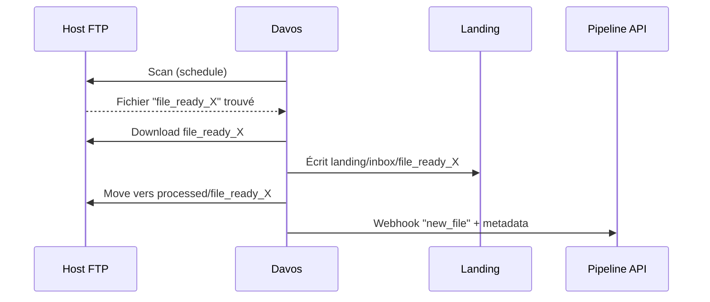

# 📥 Davos (LinuxServer.io) — Présentation & Configuration Premium

### Automatisation FTP “feeds → actions” : détecter, télécharger, déplacer, notifier, déclencher des webhooks
Optimisé pour reverse proxy existant • Workflows robustes • Fiabilité & observabilité • Rollback prêt

---

## TL;DR

- **Davos** est un outil d’automatisation FTP : il **scanne périodiquement** des emplacements distants (hosts) pour repérer des fichiers “attendus”, puis peut **télécharger**, **déplacer**, **notifier** et lancer des **appels API** pour enchaîner un workflow. :contentReference[oaicite:0]{index=0}
- Une config premium = **feeds bien définis**, **règles de matching strictes**, **idempotence**, **notifications**, **tests**, **rollback**.
- C’est une brique idéale quand tu as des dépôts FTP “source” (partenaires, legacy, export automates) et que tu veux industrialiser l’ingestion.

---

## ✅ Checklists

### Pré-configuration (design)
- [ ] Définir la **source** (hosts) : FTP/FTPS/SFTP selon ton contexte
- [ ] Définir les **feeds** : quels fichiers, quelle fréquence, quelles règles
- [ ] Définir les **actions** : download, move/rename côté host, notifications, webhooks
- [ ] Définir la **destination** (stockage) + conventions de noms + atomicité
- [ ] Définir la stratégie **anti-doublon** (idempotence)
- [ ] Définir le plan d’accès : outil “ops”, pas public

### Post-configuration (qualité)
- [ ] Un feed “test” passe de bout en bout (détection → download → move → notif)
- [ ] Les erreurs réseau n’entraînent pas de duplicats
- [ ] Les logs sont lisibles et corrélables (timestamps, feed name)
- [ ] Rollback documenté (désactiver schedule / restaurer config)

---

> [!TIP]
> Davos est excellent pour “**ingérer automatiquement**” des fichiers qui apparaissent sur un FTP (exports, drops partenaires) et déclencher ensuite un traitement (webhook/API). :contentReference[oaicite:1]{index=1}

> [!WARNING]
> Le danger classique : un matching trop large (ex: `*.zip`) + une fréquence trop élevée ⇒ tu télécharges n’importe quoi et tu stresses le host.

> [!DANGER]
> Ne traite jamais des identifiants FTP comme “non sensibles”. Mets-les dans un secret manager / variables d’environnement et limite les droits du compte FTP (lecture seule si possible).

---

# 1) Davos — Vision moderne

Davos n’est pas juste “un script cron qui fait wget”.

C’est :
- 🧠 un **moteur de “feeds”** (détecter des patterns de fichiers)
- 🔁 un **scheduler** (polling périodique sur des hosts)
- 📦 un **orchestrateur d’actions** (download + move + notif + appels API downstream)
- 🧰 une brique d’intégration dans un workflow plus large :contentReference[oaicite:2]{index=2}

---

# 2) Architecture globale

```mermaid
flowchart LR
    Source["🗄️ Host FTP/FTPS/SFTP\n(partenaire / legacy / export)"] -->|scan périodique| Davos["📥 Davos\nfeeds + schedules"]
    Davos -->|download| Landing["📦 Landing zone\n(inbox/staging)"]
    Davos -->|move/rename (option)| Source
    Davos -->|notify| Notify["📣 Notifications\n(email/webhook)"]
    Davos -->|API calls| Pipeline["⚙️ Pipeline downstream\n(ETL, import, indexation)"]
    Landing --> Processing["🧪 Traitement\n(validation, dézip, checksum)"]
    Processing --> Archive["🧾 Archivage\n(normalisation, rétention)"]
```

---

# 3) Concepts clés (le vocabulaire qui compte)

## Hosts
- Définissent **où** Davos va scanner (serveur, chemin, protocole, creds).
- Bonnes pratiques :
  - compte dédié
  - droits minimaux
  - répertoires “drop” séparés (in/processed/error)

## Feeds
- Définissent **quoi** chercher (patterns, conditions) et **quoi faire** quand trouvé.
- Un feed premium doit être :
  - **spécifique** (pattern précis)
  - **prévisible** (peu de faux positifs)
  - **idempotent** (ne pas retraiter un fichier déjà géré)

## Schedules
- Définissent **quand** scanner.
- Stratégie recommandée :
  - plus la source est instable/chargée, plus on espace
  - on préfère la stabilité à la “quasi-temps-réel”

> [!TIP]
> Dans la FAQ, Davos indique démarrer avec un pool de threads et l’étendre selon le nombre de schedules : évite de créer 200 schedules “micro” si 10 suffisent. :contentReference[oaicite:3]{index=3}

---

# 4) Stratégies premium de matching (éviter le chaos)

## 4.1 Matching strict
Au lieu de :
- `*.zip`

Préférer :
- `export_clientA_YYYYMMDD_HHMM.csv.gz`
- regex/pattern ciblé
- inclusion + exclusions

### Checklist “matching propre”
- [ ] Le pattern ne match pas des fichiers temporaires (`.part`, `.tmp`, `.unfinished`)
- [ ] Le pattern encode le contexte (client/source/type/date)
- [ ] Exclusions explicites (ex: `*test*`, `*old*`) si nécessaire

## 4.2 Idempotence (anti-doublon)
Objectif : si Davos “revoit” le fichier, il ne le retraitera pas n’importe comment.

Approches courantes :
- **Move côté host** après succès (in → processed)
- **Rename** en suffixant `.done` / `.picked`
- **Landing zone** locale avec archive + empreinte (checksum) côté pipeline

> [!WARNING]
> Ne mélange pas “download” et “processing lourd” dans la même étape si tu veux un rollback facile : sépare ingestion (Davos) et traitement (pipeline).

---

# 5) Workflows premium (patterns éprouvés)

## Workflow A — Drop → Download → Move → Webhook
1. Davos détecte `file_ready_*`
2. Télécharge vers `landing/inbox/`
3. Déplace le fichier distant vers `processed/`
4. Appelle une API (webhook) pour déclencher l’import



## Workflow B — “Only when complete”
Si la source dépose des fichiers en plusieurs temps :
- imposer un marqueur : `*.ready` ou un fichier `DONE`
- ne traiter que lorsque le marqueur apparaît

> [!TIP]
> Si tu n’as pas de marqueur, utilise une règle du style “taille stable sur N scans” (si disponible) côté pipeline plutôt que de faire des suppositions.

---

# 6) Observabilité & exploitation

## Logs utiles (à standardiser)
- feed name
- host name
- fichier (nom + taille)
- action (download/move/notify)
- durée + erreurs réseau

## “Runbook” d’exploitation (minimum)
- erreurs d’auth (creds expirés)
- erreurs réseau (timeouts)
- collisions de fichiers
- quota/limites du host
- fichiers incomplets (matching trop permissif)

---

# 7) Validation / Tests / Rollback

## Tests de validation (smoke)
```bash
# 1) Vérifier que l’UI/API répond (selon ton exposition interne)
curl -I http://DAVOS_HOST:DAVOS_PORT | head

# 2) Vérifier logs récents (selon ton runtime)
# (exemples génériques)
docker logs --tail=200 davos 2>/dev/null || true
journalctl -u davos --no-pager -n 200 2>/dev/null || true
```

## Test fonctionnel (E2E)
- Créer un fichier “factice” sur le host (ou en environnement de test)
- Vérifier :
  - détection OK
  - téléchargement OK (landing)
  - move/rename OK (source)
  - notification/webhook OK

## Rollback (opérationnel)
- Désactiver le schedule problématique (stopper l’ingestion)
- Revenir à la config précédente (config versionnée)
- Purger la landing zone si nécessaire (ou déplacer en quarantine)
- Rejouer un seul fichier “golden sample” pour revalider

> [!DANGER]
> Toujours prévoir une “quarantine” : si le pipeline casse, tu veux stocker sans perdre et sans re-télécharger en boucle.

---

# 8) Erreurs fréquentes (et fixes rapides)

- ❌ **Matching trop large** → resserrer patterns + exclusions
- ❌ **Doublons** → move/rename après succès + archive locale
- ❌ **Fichiers incomplets** → marqueur `.ready` / `DONE` / règle stabilité
- ❌ **Trop de schedules** → regrouper par host/feed, espacer
- ❌ **Creds puissants** → compte dédié, droits minimaux

---

# 9) Sources — Images Docker (adresses en bash, liens vérifiés)

```bash
# Documentation LinuxServer.io (image + paramètres + notes)
https://docs.linuxserver.io/images/docker-davos/

# Docker Hub (image linuxserver/davos)
https://hub.docker.com/r/linuxserver/davos
https://hub.docker.com/r/linuxserver/davos/tags

# Repo Davos (LinuxServer.io) — source & docs
https://github.com/linuxserver/davos
# Docs d’installation (référence officielle Davos)
https://davos.readthedocs.io/en/latest/guides/installation.html
```

---

# ✅ Conclusion

Davos est une brique “ingestion FTP” très efficace quand tu la traites comme un système :
- patterns stricts,
- idempotence,
- séparation ingestion vs traitement,
- notifications + webhooks,
- tests + rollback.

C’est ce qui transforme un “FTP drop” legacy en un workflow fiable et maintenable. :contentReference[oaicite:4]{index=4}