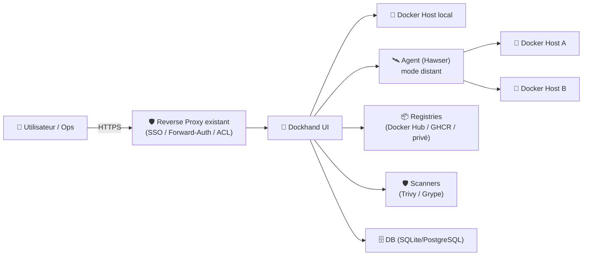
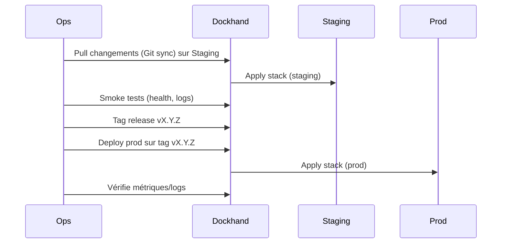

# 🧰 Dockhand — Présentation & Exploitation Premium (Docker Management moderne)

### UI Docker “tout-en-un” : containers, stacks Compose, registres, vuln-scan, logs, shell, multi-environnements
Optimisé pour reverse proxy existant • Sécurité & gouvernance • Exploitation durable

---

## TL;DR

- **Dockhand** est une interface web moderne pour **gérer Docker** : start/stop/restart/remove, création de containers, **stacks Docker Compose**, gestion d’images/registries, **logs**, **terminal**, **file browser**, etc. :contentReference[oaicite:0]{index=0}  
- Il vise une approche “ops-friendly” avec **multi-environnements** (hosts locaux/distants) et un mode agent (mentionné comme **Hawser agent**). :contentReference[oaicite:1]{index=1}  
- En version “premium ops” : **contrôle d’accès**, **scopes par environnement**, **politique de stacks**, **vuln-scanning** (Grype/Trivy), **validation/rollback**.

---

## ✅ Checklists

### Pré-usage (avant ouverture aux équipes)
- [ ] Définir environnements : `prod`, `staging`, `lab` (séparation nette)
- [ ] Définir une stratégie d’accès : SSO/forward-auth via reverse proxy existant OU users locaux Dockhand
- [ ] Définir conventions : naming containers/stacks + labels (`env=`, `team=`, `app=`)
- [ ] Définir politique stacks : “GitOps light” (repo + webhook) ou “UI only”
- [ ] Définir politique vuln-scan : fréquence, seuils, qui corrige

### Post-configuration (qualité opérationnelle)
- [ ] Un utilisateur non-admin ne peut pas gérer `prod` (test réel)
- [ ] Une stack peut être mise à jour et rollbackée proprement
- [ ] Les logs sont exploitables (filtres, couleurs ANSI, recherche)
- [ ] Le scan vulnérabilités est compris (ce que ça signifie / ce que ça ne signifie pas)

---

> [!TIP]
> Dockhand est particulièrement utile si tu veux **orchestrer Compose** + **viewer logs** + **gestion d’images** dans une seule UI, sans passer en permanence par le terminal. :contentReference[oaicite:2]{index=2}

> [!WARNING]
> Une UI Docker est un **point de contrôle puissant** : si elle est compromise, l’attaquant peut souvent agir comme un “root” logique sur l’hôte Docker. Traite l’accès comme critique.

> [!DANGER]
> Ne donne pas l’accès “admin” par défaut. Sépare `prod` des autres environnements et impose une authent solide (SSO/VPN/ACL).

---

# 1) Dockhand — Vision moderne

Dockhand se positionne comme une UI de gestion Docker “moderne” :
- ⚡ **Gestion temps réel** des containers (start/stop/restart/remove)
- 🧱 **Stacks Docker Compose** (édition visuelle, orchestration)
- 🔁 **Intégration Git** pour stacks (webhooks / auto-sync)
- 📦 Gestion images + navigation registries
- 🛡️ **Vulnerability scanning** via **Grype** et **Trivy** (option)
- 🧾 Viewer logs (rendu ANSI + auto-refresh)
- 🖥️ Terminal interactif (xterm.js)
- 📂 File browser (containers & volumes)
- 🌐 Multi-environnements (hosts locaux et distants) :contentReference[oaicite:3]{index=3}

---

# 2) Architecture globale (référence)



Multi-environnement + agent + DB support : :contentReference[oaicite:4]{index=4}

---

# 3) Gouvernance “Premium” (ce qui évite le chaos)

## 3.1 Séparer les environnements
- `prod` : accès restreint, changements contrôlés
- `staging` : terrain d’essai (mêmes stacks que prod)
- `lab` : expérimentation

## 3.2 Convention labels (recommandée)
- `env=prod|staging|lab`
- `team=core|data|support`
- `app=api|worker|frontend`
- `tier=critical|standard`

Bénéfices :
- 🔎 Recherche & filtrage naturel
- 🧠 Lecture rapide en incident
- 🧱 Base pour scopes d’accès

---

# 4) Stacks Compose & GitOps “light”

Dockhand met en avant la gestion de stacks Compose, y compris :
- éditeur visuel
- intégration dépôt Git
- webhooks / auto-sync (approche GitOps allégée) :contentReference[oaicite:5]{index=5}

## Politique recommandée
- **Staging** suit la branche `main`
- **Prod** suit des tags `vX.Y.Z` (ou une branche `release/`)
- Toute modification UI “one-off” doit être reportée au repo (sinon drift)

> [!WARNING]
> Si tu mélanges “UI edits” + “Git sync” sans règle, tu crées du drift (prod ≠ repo) et tu perds la traçabilité.

---

# 5) Logs, Shell & File Browser (les 3 outils “incident”)

## 5.1 Viewer logs
Dockhand annonce un viewer logs avec **rendu ANSI** et **auto-refresh**. :contentReference[oaicite:6]{index=6}

Bonnes pratiques :
- en incident : filtre `env=prod` + `tier=critical`
- capture : timestamp + service + corrélation (request id si dispo)
- éviter d’exposer secrets dans logs (masking côté app)

## 5.2 Shell interactif
Utile pour :
- vérifier variables env
- tester connectivité inter-services
- diagnostiquer volumes/montages

## 5.3 File browser
Utile pour :
- inspecter configs générées
- vérifier présence/permissions de fichiers
- audit rapide de volumes (sans ssh)

> [!TIP]
> Un runbook “logs-first” + “shell second” + “changes last” réduit drastiquement les actions risquées sous stress.

---

# 6) Vulnerability scanning (Trivy / Grype) — usage mature

Dockhand mentionne l’intégration **Trivy** et **Grype**. :contentReference[oaicite:7]{index=7}

## Comment l’exploiter correctement
- Scanner = **signal**, pas verdict absolu
- Prioriser :
  1) images exposées (reverse proxy, API publiques)
  2) images privilegiées (capabilities, mounts sensibles)
  3) images “core” (db, queue, auth)

## Politique premium
- Fix : patch weekly (staging), monthly (prod)
- Exceptions documentées (CVE non exploitable / faux positifs)
- Pin versions d’images en prod (éviter “latest” en critique)

---

# 7) Workflows premium (opérations quotidiennes)

## 7.1 Mise à jour contrôlée d’une stack


## 7.2 Incident “quick triage”
- ouvrir logs sur `tier=critical`
- isoler service fautif
- vérifier derniers changements stack/image
- corriger via rollback si nécessaire

---

# 8) Validation / Tests / Rollback (section opérable)

## Validation (smoke tests)
```bash
# 1) La page Dockhand répond (depuis le réseau autorisé)
curl -I https://dockhand.example.tld | head

# 2) Vérification d’un service critique (si tu exposes un endpoint health)
curl -fsS https://api.example.tld/health || echo "health failed"
```

## Tests fonctionnels (dans l’UI)
- un user “team” ne voit pas `prod`
- une stack staging peut être “apply” sans erreur
- logs s’affichent + recherche fonctionne
- scan vuln donne un résultat (même vide) et est compris

## Rollback (principes)
- **Rollback stack** : revenir au tag précédent (`vX.Y.(Z-1)`)
- **Rollback image** : repinner l’ancienne version
- **Rollback config** : restaurer la config de stack depuis Git

> [!DANGER]
> Sans versionning (tags) + historique, un rollback devient improvisation. C’est là que les incidents s’aggravent.

---

# 9) Sources — Images Docker (y compris LinuxServer)

```bash
# Dockhand — site / docs / repo
https://dockhand.pro/
https://github.com/Finsys/dockhand

# Images Dockhand (références)
https://hub.docker.com/r/fnsys/dockhand
https://hub.docker.com/r/fnsys/dockhand/tags

# LinuxServer.io — catalogue d’images (pour vérifier s’il existe une image LSIO Dockhand)
https://www.linuxserver.io/our-images
https://hub.docker.com/u/linuxserver
```

📌 Note : à ce jour, Dockhand est distribué via `fnsys/dockhand` (Docker Hub). :contentReference[oaicite:8]{index=8}  
Le catalogue LinuxServer.io ne liste pas Dockhand comme image dédiée (la référence à conserver est donc l’image `fnsys/dockhand`). :contentReference[oaicite:9]{index=9}

---

# ✅ Conclusion

Dockhand est une UI Docker “haut niveau” qui prend tout son sens quand tu poses :
- une **gouvernance** (environnements + scopes),
- une **discipline stacks** (Git/tags),
- une **exploitation** (logs/shell/file browser),
- et une **hygiène sécurité** (auth forte + séparation prod).

Tu obtiens un cockpit unique, beaucoup plus “ops-friendly”, sans sacrifier la traçabilité.