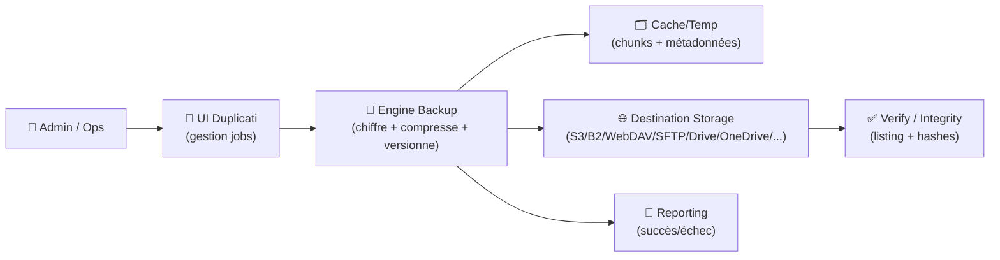
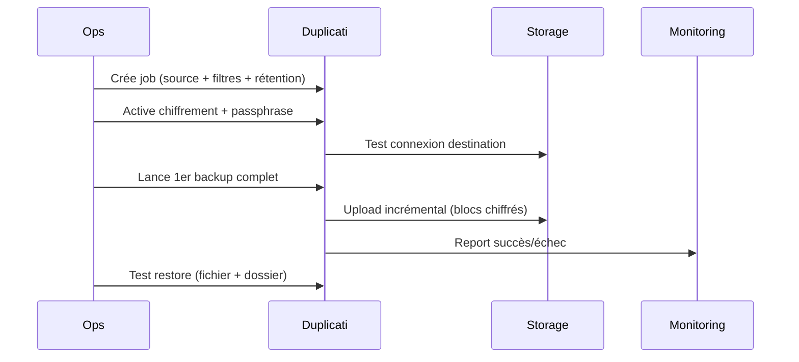

# 🗄️ Duplicati — Présentation & Exploitation Premium (Backups chiffrés, incrémentaux, durables)

### Backups “zero-trust” : chiffrement côté client • rétention intelligente • multi-destinations
Optimisé pour reverse proxy existant • BYOS (S3/B2/WebDAV/SFTP/OneDrive/Drive…) • Exploitation durable

---

## TL;DR

- **Duplicati** est un client de sauvegarde **chiffrée côté client** (tu chiffreras *avant* d’envoyer vers le stockage).
- Il fait des backups **incrémentaux** + **compressés**, avec **rétention** et **vérification**.
- Valeur “premium ops” = **stratégie**, **nomenclature**, **rétention**, **tests restore**, **observabilité**, **runbooks**.

---

## ✅ Checklists

### Pré-configuration (avant le 1er backup)
- [ ] Définir **RPO/RTO** (perte acceptable / temps de restauration)
- [ ] Choisir **destinations** (1 primaire + 1 offsite si critique)
- [ ] Définir **jeu de données** (dossiers inclus/exclus + secrets)
- [ ] Fixer **politique de rétention** (ex: 30j quotidiens + 12 mois mensuels)
- [ ] Valider **chiffrement** (passphrase forte + stockage sécurisé)
- [ ] Décider de la stratégie **versioning** (VSS/permissions/symlinks selon OS)

### Post-configuration (qualité opérationnelle)
- [ ] 1er backup complet terminé sans erreurs
- [ ] **Test de restauration** (fichier + dossier + restauration bare-minimum)
- [ ] Vérification backend activée (ou run périodique)
- [ ] Alertes email / monitoring (au moins sur échec backup)
- [ ] Runbook “incident backup” prêt (que faire si échec / quota / auth expirée)

---

> [!TIP]
> La règle qui sauve des vies : **“Un backup non restauré n’existe pas.”**  
> Automatise des tests de restore (même partiels).

> [!WARNING]
> Les logs de backup peuvent contenir des chemins, noms de fichiers, parfois des erreurs révélant des infos.  
> Traite-les comme sensibles.

> [!DANGER]
> **Ne perds jamais la passphrase** : sans elle, le backup chiffré est inutilisable.  
> Stocke-la dans un gestionnaire de secrets + procédure de récupération.

---

# 1) Duplicati — Vision moderne

Duplicati n’est pas juste “copier des fichiers”.

C’est :
- 🔐 **Chiffrement côté client** (zero-trust)
- 🧱 **Incrémental** (optimise bande passante et stockage)
- 🧠 **Rétention intelligente** (rotation, purge, versions)
- 🌐 **Bring Your Own Storage** (S3/B2/WebDAV/SFTP/Clouds)
- 🧪 **Vérification + restore** (contrôles d’intégrité)

---

# 2) Architecture globale



---

# 3) Concepts clés (pour éviter les pièges)

## 3.1 “Zero-trust” en pratique
- Le chiffrement se fait **avant** l’envoi au stockage
- Le fournisseur (S3/B2/etc.) voit des **blobs chiffrés**
- Sécurité réelle = **passphrase + gestion des accès au stockage**

## 3.2 Incrémental & volume de petites fichiers
- Beaucoup de petits fichiers = coûts en listing/metadata plus élevés
- Certaines destinations (SFTP/WebDAV) peuvent être plus lentes pour l’énumération
- Stratégie premium : segmenter les jobs (ex: “photos”, “documents”, “configs”)

---

# 4) Stratégie de sauvegarde “premium” (modèle pro)

## 4.1 Séparer par criticité (3 jobs types)
1. **Tier 1 (Critique)** : configs, secrets, DB dumps, docs, clés (RPO faible)
2. **Tier 2 (Important)** : home, projets, médias non-regénérables
3. **Tier 3 (Volumineux)** : archives, caches, datasets (RPO plus large)

> [!TIP]
> Plus un job est critique, plus tu veux : fréquence élevée, vérification fréquente, destination rapide, restore testé.

## 4.2 Nomenclature des jobs (qui fait gagner du temps)
- `T1-configs-prod`
- `T1-db-dumps-prod`
- `T2-home-alice`
- `T3-archives`

Et tags/labels :
- `env=prod|staging`
- `owner=team-x`
- `tier=1|2|3`

---

# 5) Politique de rétention (exemples robustes)

Objectif : avoir de la granularité récente + historique long, sans exploser le stockage.

## Exemple A — “Classique pro”
- 30 backups quotidiens
- 12 backups mensuels
- 3 backups annuels

## Exemple B — “Critique”
- 14 quotidiens
- 8 hebdos
- 12 mensuels

> [!WARNING]
> Les rétentions “trop simples” (ex: “garder 7 backups”) deviennent inutiles au premier incident découvert tard.

---

# 6) Chiffrement & secrets (sans drama)

## Recommandations
- Passphrase **longue** (phrase + séparateurs) ou générée
- Stockage dans :
  - un password manager
  - + une copie “break glass” chiffrée (procédure d’urgence)
- Rotation des identifiants stockage (S3 keys / tokens) documentée

> [!TIP]
> Documente explicitement : *où est la passphrase*, *qui y a accès*, *comment récupérer en astreinte*.

---

# 7) Destinations (BYOS) — choix stratégique

## Guides de décision (très pratique)
- **S3/B2** : scalable, fiable, listing OK, bon pour offsite
- **WebDAV** : pratique (NAS/Nextcloud), attention perf listing
- **SFTP** : simple, mais listing/latence peuvent coûter cher sur gros volumes
- **Drive/OneDrive** : pratique perso/PME, attention quotas & tokens

> [!WARNING]
> Les échecs fréquents viennent souvent de : **quota**, **token expiré**, **latence**, **listing trop lourd**.

---

# 8) Workflows premium (runbook-ready)

## 8.1 Création d’un job (séquence)


## 8.2 “Incident : backup en échec”
Checklist rapide :
- [ ] Lire l’erreur (auth/quota/network/locks)
- [ ] Vérifier espace destination + permissions
- [ ] Vérifier horloge/temps (certains backends/tokens)
- [ ] Relancer avec un “test connection”
- [ ] Si suspect : lancer une vérification backend
- [ ] Si critique : déclencher plan B (2e destination / export local)

---

# 9) Validation / Tests / Rollback

## Tests minimum (à faire systématiquement)
- **Restore fichier** : 1 doc au hasard
- **Restore dossier** : un sous-répertoire avec arborescence
- **Restore “bare minimum”** : ce qui permet de redémarrer un service (configs + secrets + DB dump)
- **Verify** : vérifier l’intégrité des backups côté destination

## Rollback (si changement casse tout)
- Revenir à la config précédente du job (export/import config si tu l’utilises)
- Restaurer depuis la destination secondaire si la primaire est en panne
- Si provider cloud change API/token : basculer sur destination alternative (prévue à l’avance)

> [!TIP]
> Le rollback le plus efficace est celui prévu : **2 destinations** ou **export des configs** + procédure claire.

---

# 10) Erreurs fréquentes (et fixes)

- ❌ **Trop de données dans un seul job** → scinder par tiers/volumes
- ❌ **Pas d’exclusions** (cache, node_modules, thumbnails) → explosion volume
- ❌ **Rétention trop courte** → incident découvert trop tard = aucun point de restauration
- ❌ **Jamais de test restore** → surprise le jour J
- ❌ **Tokens expirés** (Drive/OneDrive) → prévoir re-auth + alerting

---

# 11) Sources — Images Docker (comme demandé) + docs officielles

```bash
# Duplicati — site & documentation (officiel)
https://duplicati.com/
https://docs.duplicati.com/
https://github.com/duplicati/duplicati

# Duplicati — docs utiles (exemples)
https://docs.duplicati.com/getting-started/set-up-a-backup-in-the-ui
https://docs.duplicati.com/platform-specific-guides/using-duplicati-from-docker

# LinuxServer.io (image Docker Duplicati)
https://docs.linuxserver.io/images/docker-duplicati/
https://hub.docker.com/r/linuxserver/duplicati
https://www.linuxserver.io/our-images
```

---

# ✅ Conclusion

Duplicati “premium” = une approche **ingénierie** :
- stratégie (tiers + rétention),
- sécurité (zero-trust + secrets),
- fiabilité (verify + alerting),
- et surtout **restore testé**.

Si tu me donnes ton contexte (OS, volumes, destinations, criticité), je peux te sortir un modèle de jobs + conventions + runbooks adaptés — toujours sans section “install”.