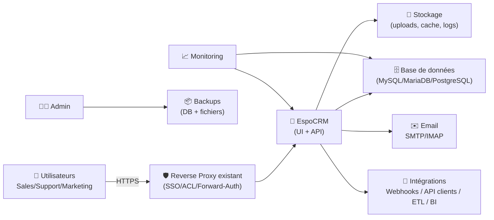
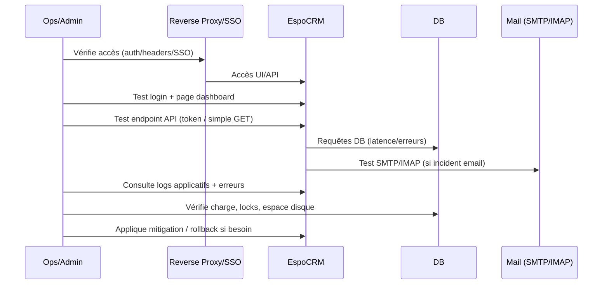

# 🧠 EspoCRM — Présentation & Exploitation Premium (Architecture • Gouvernance • Sécurité • Runbooks)

### CRM open-source modulable : ventes, support, marketing, automatisations, API
Optimisé pour reverse proxy existant • Permissions fines • Intégrations • Exploitation durable

---

## TL;DR

- **EspoCRM** est un **CRM open-source** orienté “entités” (Accounts, Contacts, Leads, Opportunities…) avec une UI moderne et une **API REST** complète. :contentReference[oaicite:0]{index=0}  
- Une config premium repose sur : **modèle de données propre**, **rôles & équipes**, **process de qualité (workflows)**, **email/Calendrier**, **audit & sauvegardes**, **tests & rollback**.
- Côté conteneurs : il existe une **image Docker officielle** `espocrm/espocrm`. :contentReference[oaicite:1]{index=1}  
- Côté LinuxServer.io : EspoCRM **n’apparaît pas** dans la liste des images LSIO (donc pas d’image LSIO “officielle” dédiée). :contentReference[oaicite:2]{index=2}  

---

## ✅ Checklists

### Pré-usage (avant d’ouvrir aux équipes)
- [ ] Définir le périmètre : Sales / Support / Marketing / Projets
- [ ] Définir le modèle : pipeline, statuts, champs obligatoires, règles
- [ ] Définir la gouvernance : Teams, Roles, ACL, owners
- [ ] Définir les intégrations : SMTP/IMAP, calendriers, webhooks, API
- [ ] Définir la conformité : rétention, export, anonymisation (si besoin)
- [ ] Définir l’exploitation : sauvegardes, monitoring, procédures incident

### Post-configuration (qualité)
- [ ] Pipeline “Opportunités” cohérent + critères de passage
- [ ] Champs clés obligatoires + validations (qualité des données)
- [ ] Rôles/ACL testés (un commercial ne voit pas tout)
- [ ] Email inbound/outbound OK + signatures
- [ ] Tests API (token, endpoints) + journalisation
- [ ] Procédure de rollback documentée + restaurations testées

---

> [!TIP]
> Le “secret” d’un CRM qui tient : **moins de champs**, mais **mieux gouvernés** (obligatoires, normalisés, contrôlés).

> [!WARNING]
> Un CRM devient vite un “cimetière à leads” si tu n’imposes pas : pipeline clair, champs obligatoires, ownership, et revues régulières.

> [!DANGER]
> Les données CRM sont sensibles (clients, contrats, échanges). Ne l’expose pas sans contrôle d’accès solide et politique de logs/exports.

---

# 1) EspoCRM — Vision moderne

EspoCRM, c’est :
- 🧩 Un **modèle d’entités** extensible (standard + custom)
- 🔐 Une **gestion fine des droits** (rôles, équipes, ownership)
- 🔄 Des **automatisations** (workflows, règles, notifications)
- ✉️ Une **brique email** (suivi, cases/support selon usage)
- 🔌 Une **API REST** (intégrations, BI, synchronisations) :contentReference[oaicite:3]{index=3}  

Références : site & doc officielles. :contentReference[oaicite:4]{index=4}  

---

# 2) Architecture globale (référence)



EspoCRM supporte MySQL/MariaDB/PostgreSQL (exigences standard). :contentReference[oaicite:5]{index=5}  

---

# 3) Modèle métier premium (ce qui évite le chaos)

## 3.1 Pipelines & statuts (exemples)
### Ventes (Opportunities)
- Qualification → Proposition → Négociation → Gagné/Perdu

### Support (Cases)
- Nouveau → En cours → En attente → Résolu → Clos

> [!TIP]
> Ta “définition de Done” : chaque étape doit avoir un **critère objectif** (champ rempli, document attaché, validation).

## 3.2 Champs obligatoires (qualité des données)
Recommandations :
- Normaliser : industrie, source lead, taille client, pays, owner
- Rendre obligatoire : email/phone (selon usage), source, owner, étape pipeline
- Éviter : 40 champs “au cas où”

---

# 4) Gouvernance & Permissions (ACL)

## Stratégie simple (efficace)
- 👑 **Admins** : config, sécurité, extensions
- 🧑‍💼 **Managers** : visibilité équipe + reporting
- 🧑‍💻 **Agents/Commercials** : accès limité à leurs comptes/records
- 👀 **Read-only / Auditeurs** : consultation

## Principes premium
- Ownership (propriétaire) = règle par défaut
- Team scopes = segmentation (par région, BU, produit)
- Exceptions = rares, documentées

---

# 5) Automatisations & Process (workflows)

Cas d’usage “premium” :
- Quand une opportunité passe à “Proposition” → créer tâche “Relance J+3”
- Quand un case est “En attente client” → relancer automatiquement
- Quand un lead est “qualifié” → conversion + notification manager

> [!TIP]
> Commence par 5 automatisations “haute valeur”, pas 50. Ajuste après 2 semaines de feedback.

---

# 6) API & Intégrations (le pont vers le SI)

EspoCRM est une SPA qui s’appuie sur une **API REST** (les actions UI sont traçables et reproductibles via API). :contentReference[oaicite:6]{index=6}  

Cas d’usage :
- Sync ERP / facturation
- Push leads depuis formulaires
- Enrichissement (company data)
- Export BI (pipeline, forecast, SLA support)

---

# 7) Exploitation premium (quotidien)

## 7.1 Observabilité “CRM”
- Taux de conversion par étape
- Âge moyen d’une opportunité par étape
- SLA support (temps première réponse, temps résolution)
- Volume d’emails ingérés / erreurs SMTP/IMAP
- Erreurs applicatives (logs) + performance DB

## 7.2 Hygiène & gouvernance
- “Data hygiene day” mensuel : doublons, champs vides, statuts incohérents
- Revue des automatisations : supprimer celles qui génèrent du bruit
- Revue des droits : moindre privilège (accès “par défaut” minimal)

---

# 8) Runbook incident (séquence premium)



---

# 9) Validation / Tests / Rollback

## 9.1 Tests de validation (smoke)
```bash
# 1) UI répond (adapter URL)
curl -I https://crm.example.tld | head

# 2) Vérifier un signal “app” (réponse HTML)
curl -s https://crm.example.tld | head -n 5

# 3) Test API basique (conceptuel)
# - obtenir un token selon ta méthode
# - appeler un endpoint "GET" simple
# (réf API EspoCRM)
```

Doc API : :contentReference[oaicite:7]{index=7}  

## 9.2 Rollback (principes)
- Rollback “app” : revenir à une version précédente (binaire/image/package)
- Rollback “data” : restaurer DB + fichiers (uploads) depuis backup
- Rollback “config” : revenir à une conf reverse proxy/SSO connue stable

> [!WARNING]
> Le rollback “data” doit être **testé** (restauration sur environnement de test), sinon ce n’est pas un rollback.

---

# 10) Images Docker & Sources (URLs en bash)

> Tu m’as demandé les **adresses des sources** sous forme de commandes bash (sans marqueurs “contentReference”).

```bash
# EspoCRM — Docs officielles
https://docs.espocrm.com/
https://docs.espocrm.com/administration/server-configuration/
https://docs.espocrm.com/development/api/

# EspoCRM — Code source officiel
https://github.com/espocrm/espocrm

# EspoCRM — Image Docker officielle (référence)
https://hub.docker.com/r/espocrm/espocrm
https://github.com/espocrm/espocrm-docker

# LinuxServer.io — Liste officielle des images (vérifier si EspoCRM existe)
https://www.linuxserver.io/our-images
```

---

# ✅ Conclusion

EspoCRM devient “premium” quand :
- ton modèle (pipelines + champs) est **simple et gouverné**,
- tes droits (teams/roles) sont **testés et minimisés**,
- tes automatisations sont **utiles, pas bruyantes**,
- tes intégrations via API sont **documentées**,
- et tu as **tests + rollback** prêts à l’emploi.
