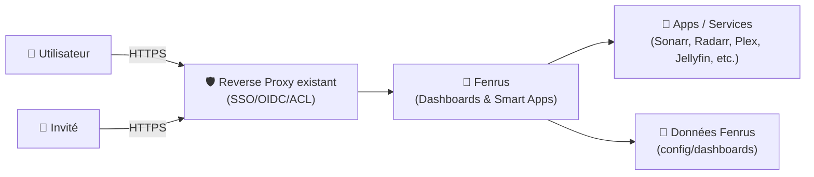
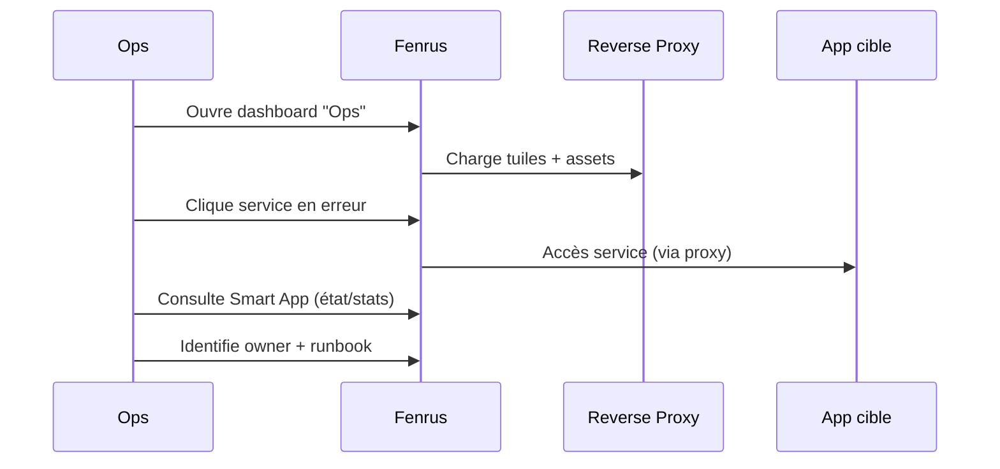

# 🧙 Fenrus — Présentation & Exploitation Premium (Dashboard multi-utilisateurs)

### Page d’accueil “intelligente” : dashboards par utilisateur, accès invité, Smart Apps (live data)
Optimisé pour reverse proxy existant • Multi-dashboards • Gouvernance par équipes • Exploitation durable

---

## TL;DR

- **Fenrus** est une **homepage/dashboard** auto-hébergeable, orientée “accès rapide” à tes apps/services.
- Points forts : **multi-utilisateurs**, **accès invité**, **plusieurs dashboards par user**, et **Smart Apps** (tuiles avec données live, pas juste des icônes).
- En “premium ops” : **naming + groupes**, **scoping par rôles**, **reverse proxy propre (HTTPS, base path)**, **tests + rollback**, **hygiène des secrets**.

---

## ✅ Checklists

### Pré-usage (avant d’ouvrir aux équipes)
- [ ] Définir la structure : équipes → dashboards → groupes → tuiles
- [ ] Définir les rôles : admin / éditeurs / lecteurs / invités
- [ ] Définir une convention de naming (app, env, owner)
- [ ] Valider la stratégie d’accès (SSO/OIDC ou comptes locaux)
- [ ] Choisir la “policy” Smart Apps (lesquelles, quelles permissions/API)

### Post-configuration (qualité opérationnelle)
- [ ] Un utilisateur voit uniquement ce qui lui est destiné (test réel)
- [ ] Un invité a un périmètre strict (dashboard “Guest”)
- [ ] Smart Apps critiques affichent des données correctes (tokens/API OK)
- [ ] Les dashboards sont exportables / reconstructibles (plan de continuité)
- [ ] Procédure “incident dashboard” (panne proxy / redirections / assets) documentée

---

> [!TIP]
> Fenrus est excellent quand tu veux une **homepage vivante** (tuiles avec stats), pas juste un lanceur de favoris.

> [!WARNING]
> Les Smart Apps peuvent nécessiter des **tokens/API** : traite-les comme des secrets (rotation, moindre privilège).

> [!DANGER]
> Les problèmes #1 en prod : **reverse proxy mal déclaré** (HTTP/HTTPS, base path) → redirections incorrectes, assets qui cassent, OIDC instable.

---

# 1) Fenrus — Vision moderne

Fenrus n’est pas juste un “tableau d’icônes”.

C’est :
- 👥 un **dashboard multi-utilisateurs** (plusieurs tableaux par user)
- 🎛️ un système de **groupes** et de disposition
- ✨ des **Smart Apps** (“spell casts”) qui affichent des infos live (carousel, livestats, etc.)
- 🚪 un **mode invité** pour un accès contrôlé “lecture seule”

---

# 2) Architecture globale



---

# 3) Modèle d’organisation “premium” (qui scale)

## 3.1 Structure recommandée
- **Un dashboard par contexte**
  - “Ops”
  - “Médias”
  - “Maison”
  - “Dev”
  - “Guest” (strict)
- **Groupes** = sous-domaines : “Download”, “Streaming”, “Infra”, “Monitoring”
- **Tuiles** = liens / Smart Apps

## 3.2 Conventions de naming (effet immédiat)
- Titre : `App — env` (ex: `Plex — prod`, `Grafana — prod`)
- Description : owner + objectif (ex: `owner: ops • dashboards`)
- Tags (si tu les utilises) : `env:prod`, `team:ops`, `tier:critical`

> [!TIP]
> Si tu standardises naming + groupes, tu gagnes énormément en onboarding : “où cliquer” devient évident.

---

# 4) Smart Apps (la vraie valeur ajoutée)

Fenrus distingue généralement :
- **Apps “Basic”** : lien + icône (et parfois URL par défaut)
- **Apps “Smart”** : tuiles qui récupèrent des données pour afficher du contexte (stats, état, carousel, etc.)

## 4.1 Stratégie premium pour Smart Apps
- Activer Smart Apps **uniquement** là où le gain est réel :
  - disponibilité / état
  - compteurs (downloads, items, alertes)
  - carousel média (si pertinent)
- Principe : **moindre privilège**
  - tokens limités
  - lecture seule si possible
  - éviter de réutiliser des clés “admin”

## 4.2 “Règles d’or” anti-dérive
- Un secret = un usage (pas de clé partagée partout)
- Rotation planifiée (mensuel/trimestriel selon criticité)
- Logs/proxy : éviter de leak des tokens via URLs

---

# 5) Gouvernance & Accès (multi-user propre)

## 5.1 Rôles minimalistes (recommandé)
- 👑 **Admin** : gestion utilisateurs / auth / global
- ✍️ **Editor** : gérer ses dashboards + tuiles
- 👀 **Reader** : lecture seule
- 🚪 **Guest** : accès à un unique dashboard “Guest” strict

## 5.2 Dashboard “Guest” (pattern sûr)
- Uniquement des services publics internes (status page, docs, catalogue, etc.)
- Pas de Smart Apps nécessitant des tokens
- Aucun lien vers panels d’admin (Portainer, Proxmox, etc.)

> [!WARNING]
> Si tu relies Fenrus à OIDC/SSO, valide les redirections et l’URL externe : les erreurs de schéma (http vs https) cassent l’auth.

---

# 6) Reverse proxy existant — points d’attention (sans recettes)

## 6.1 HTTPS & redirections
- Fenrus doit “comprendre” l’URL publique (schéma + host)
- Sinon :
  - redirections en `http://...` au lieu de `https://...`
  - OIDC redirect_uri incorrecte
  - cookies/sessions instables

## 6.2 Subpath (ex: `/fenrus`) : prudence
- Certains dashboards ont des soucis si l’app génère des assets en chemins absolus (`/assets` au lieu de `/fenrus/assets`).
- Reco premium :
  - privilégier **un sous-domaine** si possible
  - sinon, tester à fond le mode subpath (login, assets, navigation, OIDC)

> [!TIP]
> Si ton proxy fait terminaison TLS, assure-toi que les headers “forwarded” (proto/host) sont corrects pour que Fenrus sache qu’il est en HTTPS.

---

# 7) Workflows premium (usage réel en équipe)

## 7.1 Onboarding d’un nouveau service
- Ajouter le lien basique (icône + URL)
- Valider l’accès (permissions)
- Option : convertir en Smart App si valeur ajoutée
- Documenter : owner, SLA, contact, runbook court

## 7.2 Triage incident (Fenrus comme “cockpit”)


---

# 8) Validation / Tests / Rollback

## 8.1 Smoke tests (réseau + rendu)
```bash
# HTTP status (adapter l'URL)
curl -I https://fenrus.example.tld | head

# Vérifier qu'une ressource statique répond (si tu connais un chemin d'asset)
# (sinon, utilise l'onglet réseau du navigateur et copie une URL d'asset)
curl -I https://fenrus.example.tld/<asset_path> | head
```

## 8.2 Tests fonctionnels (indispensables)
- Login (local/SSO) OK
- Redirections en HTTPS OK
- Dashboard “Guest” : accès restreint OK
- Smart Apps : données cohérentes (pas d’erreurs d’API, pas de timeouts)

## 8.3 Rollback (simple)
- Revenir à une config d’accès “safe” :
  - désactiver temporairement SSO/OIDC si ça bloque
  - repasser en accès admin local (plan d’urgence)
- Restaurer la configuration/données Fenrus depuis une sauvegarde
- Si mise à jour : revenir au tag/version précédente (si applicable)

> [!WARNING]
> Documente un “break-glass account” (admin local) pour éviter de te verrouiller si SSO casse.

---

# 9) Erreurs fréquentes (et diagnostic)

## “OIDC redirect URL en http”
Symptômes :
- redirect_uri rejetée
- boucle login
- erreurs certificat

Actions :
- vérifier headers forwarded (proto/host)
- vérifier URL publique réellement utilisée
- tester en sous-domaine plutôt qu’en subpath si possible

## “Assets cassés en subpath”
Symptômes :
- page blanche
- console navigateur : 404 sur `/assets/...`

Actions :
- préférer sous-domaine
- sinon : ajuster base path si supporté + re-tester tout le parcours

---

# 10) Sources (en bash, URLs brutes)

```bash
# Repo officiel Fenrus (docs, concepts "Smart Apps", etc.)
https://github.com/revenz/Fenrus

# Image Docker officielle (publisher Fenrus)
https://hub.docker.com/r/revenz/fenrus

# Informations "multi-users / guest / multiple dashboards / smart apps" (références secondaires)
https://awesome-docker-compose.com/apps/personal-dashboards/fenrus
https://hostedsoftware.org/tools/fenrus/

# Problèmes reverse proxy / OIDC / schéma http vs https (utile pour diagnostic)
https://github.com/revenz/Fenrus/issues/204

# LinuxServer.io — liste des images (pour vérifier si une image LSIO Fenrus existe)
# (À ce jour, Fenrus n’y apparaît pas comme image dédiée.)
https://www.linuxserver.io/our-images
https://hub.docker.com/u/linuxserver
```

---

# ✅ Conclusion

Fenrus devient “premium” quand tu le traites comme un **portail gouverné** :
- multi-utilisateurs propre,
- dashboard invité strict,
- Smart Apps utilisées avec parcimonie,
- reverse proxy maîtrisé (HTTPS + base path),
- tests + rollback documentés.

Résultat : une homepage qui accélère le quotidien sans créer de dette opérationnelle.