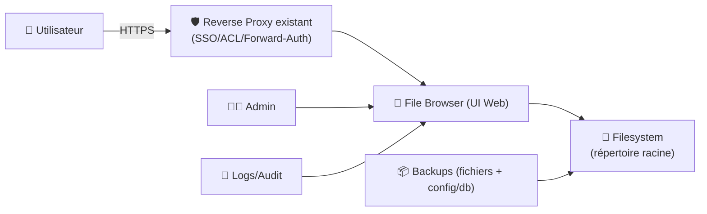
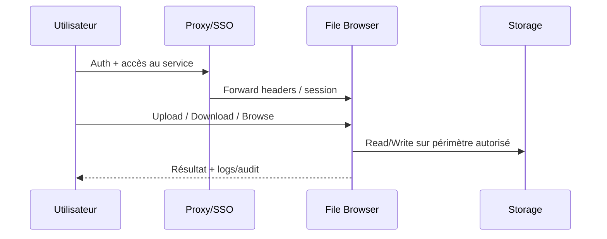

# 📂 File Browser — Présentation & Configuration Premium (Gouvernance + Sécurité + Exploitation)

### Gestionnaire de fichiers web auto-hébergeable : upload, partage, édition, rôles & permissions
Optimisé pour reverse proxy existant • Contrôle d’accès • Partage maîtrisé • Exploitation durable

---

## TL;DR

- **File Browser** fournit une **UI web** pour gérer des fichiers dans un répertoire donné : parcourir, upload, renommer, supprimer, prévisualiser, éditer. :contentReference[oaicite:0]{index=0}  
- Points forts : **simple**, **léger**, **multi-utilisateurs**, **rôles/permissions**, **partages**.
- Point d’attention : le projet indique être en **maintenance-only mode** (fonctionnel, mais évolution limitée) → approche “production” = **tests + gouvernance + plan de rollback**. :contentReference[oaicite:1]{index=1}

---

## ✅ Checklists

### Avant mise en prod (préflight)
- [ ] Définir le **périmètre** (quel répertoire, quels usages : partage / upload / édition)
- [ ] Définir les **rôles** (admin / éditeur / lecteur) + règles d’habilitation
- [ ] Valider la **politique de partage** (liens publics interdits ? expirations ? mot de passe ?)
- [ ] Poser une stratégie **anti-fuites** (masquer fichiers sensibles, interdictions par chemin)
- [ ] Définir une stratégie de **logs** (quoi conserver, où, combien de temps)
- [ ] Tester l’accès via reverse proxy existant (headers, base path si subpath)

### Après configuration (go-live)
- [ ] Un user “lecteur” ne peut **pas** modifier / uploader (test réel)
- [ ] Un user “éditeur” ne peut **pas** sortir de son répertoire (test réel)
- [ ] Partage : liens, expiration, mot de passe (si autorisé) testés
- [ ] Audit rapide : droits filesystem, chemins exposés, comptes admins minimisés
- [ ] Procédure “validation / rollback” documentée

---

> [!TIP]
> Pour une instance durable : **naming** + **répertoires propres** + **permissions explicites** + **règles de partage strictes** = 90% du “premium”.

> [!WARNING]
> File Browser peut exposer des fichiers sensibles si tu pointes trop haut (ex: `/` ou `/home` entier).  
> Le bon réflexe : **un répertoire racine dédié** (ex: `/data/share`) + sous-dossiers gouvernés.

> [!DANGER]
> N’active pas les **partages publics** sans politique (expiration + mot de passe + périmètre).  
> Une URL partagée “à vie” = fuite de données quasi garantie.

---

# 1) File Browser — Vision moderne

File Browser n’est pas un “NAS”.

C’est :
- 🧭 une **porte web** vers un périmètre de fichiers
- 👥 un **outil de collaboration légère** (partages, upload)
- 🔐 un **contrôle d’accès** (comptes, rôles, permissions)
- 🧰 un **outil d’exploitation** (logs, dépannage, procédures)

Description officielle : interface de gestion de fichiers (upload, delete, preview, edit). :contentReference[oaicite:2]{index=2}

---

# 2) Architecture globale



---

# 3) Philosophie premium (5 piliers)

1. 🎯 **Périmètre minimal** (une racine dédiée, pas “tout le disque”)
2. 👥 **Rôles & permissions** simples, testés, reproductibles
3. 🔗 **Partage gouverné** (expiration, mots de passe, pas de liens permanents)
4. 🧾 **Traçabilité** (logs utiles, règles de conservation)
5. 🧪 **Validation / rollback** (tests d’accès, restauration, retour arrière)

---

# 4) Gouvernance : comptes, rôles, permissions

## Modèle “3 rôles” recommandé
- 👑 **Admin** : config, utilisateurs, paramètres globaux
- ✍️ **Editor** : upload/édition dans son périmètre
- 👀 **Reader** : lecture seule (download si autorisé)

## Règles premium (qui évitent les dérives)
- **Admins** : 1–2 personnes max (principe du moindre privilège)
- **Un compte = un besoin** : pas de comptes partagés
- **Périmètre par équipe** : chaque équipe a son dossier racine dédié
- **Interdiction par défaut** : on ouvre explicitement, on ne “laisse pas parce que ça marche”

> [!TIP]
> Si tu veux éviter les erreurs humaines : structure ton partage par “espaces” (ex: `team-a/`, `team-b/`, `public/`) et attache les permissions à ces dossiers.

---

# 5) Partage (links) — “propre” ou “interdit”

## Deux stratégies sûres

### Stratégie A — “Partage contrôlé”
- Liens avec **expiration**
- **Mot de passe** obligatoire
- Partage limité à un sous-dossier “publicable”
- Pas de partage de racines d’équipe

### Stratégie B — “Pas de partage public”
- Partage par **comptes** uniquement (auth obligatoire)
- Tout accès passe via reverse proxy/SSO

> [!WARNING]
> Ne mélange pas “espace de travail interne” et “zone partageable” : sépare physiquement les dossiers.

---

# 6) Base path / subpath derrière reverse proxy existant

Si ton reverse proxy expose File Browser sur un **subpath** (ex: `/files`), valide :
- que les redirections reviennent bien sur `/files/...`
- que les assets (JS/CSS) sont servis correctement
- que les cookies/session ne cassent pas

> [!TIP]
> En cas d’anomalies (assets 404, redirections), le problème est presque toujours : base path / headers `X-Forwarded-*` / URL externe.

---

# 7) Sécurité (sans recettes UFW)

## Périmètre & filesystem
- Racine dédiée : **un dossier spécifique** pour File Browser
- Droits stricts : File Browser ne doit pas avoir RW partout
- Évite de pointer vers des chemins contenant des secrets (SSH keys, `.env`, backups bruts, etc.)

## Auth & exposition
- Accès via reverse proxy existant + SSO/ACL si possible
- Désactiver toute exposition directe non contrôlée
- Mots de passe forts + rotation si nécessaire
- Journaliser les actions critiques (uploads/suppressions/partages)

> [!DANGER]
> Si un token/secret apparaît dans des fichiers accessibles, File Browser devient un “extracteur de secrets” involontaire. Traite le périmètre comme sensible.

---

# 8) Workflows premium (usage & exploitation)

## 8.1 Onboarding documentaire
- Un dossier “START-HERE” (read-only)
- Un dossier “INBOX” (upload autorisé) + tri périodique
- Un dossier “PUBLISHED” (contenu final, versionné si besoin)

## 8.2 “Incident / debug” (avec capture utile)
- Identifier l’utilisateur, l’heure, le chemin
- Exporter :
  - extrait de logs (timestamp)
  - captures d’écran (permissions / erreur)
  - reproduction minimale



---

# 9) Validation / Tests / Rollback

## Tests fonctionnels (check rapide)
```bash
# Test HTTP (adapter URL interne/externe)
curl -I https://files.example.tld | head

# Test navigation (manuel)
# - user Reader : browse + download (si autorisé) OK ; upload/delete KO
# - user Editor : upload/rename OK dans son dossier ; accès hors périmètre KO
# - partage (si activé) : expiration + mot de passe OK
```

## Tests de sécurité (indispensables)
- Un user d’équipe A ne voit **aucun** dossier équipe B
- Un lecteur ne peut pas :
  - supprimer
  - renommer
  - uploader
- Les liens partagés (si autorisés) :
  - expirent
  - ne donnent pas accès “au-dessus” du dossier partagé

## Rollback (logique)
- Revenir à une config “safe” :
  - désactiver partages publics
  - restreindre périmètre racine
  - revenir à auth SSO stricte
- Restaurer config/db + vérifier droits filesystem
- Documenter “retour arrière en 5 minutes” (qui fait quoi)

---

# 10) Notes importantes (pérennité)

- Le site officiel mentionne un mode **maintenance-only** : privilégie une approche prudente (tests avant changements). :contentReference[oaicite:3]{index=3}
- Si tu as besoin de fonctionnalités avancées “cloud drive” (sync, versioning, collaboration forte), considère des alternatives (Nextcloud, Seafile) — mais plus lourdes.

---

# 11) Sources (URLs) + Images Docker (dont LinuxServer si existant)

```bash
# Site officiel File Browser
https://filebrowser.org/index.html

# Documentation (installation, dont références aux images Docker officielles)
https://filebrowser.org/installation.html

# CLI / administration (utile pour comprendre config & opérations)
https://filebrowser.org/cli/filebrowser.html

# Repo GitHub (source de vérité)
https://github.com/filebrowser/filebrowser

# Releases (suivi versions)
https://github.com/filebrowser/filebrowser/releases

# Image Docker officielle (Docker Hub)
https://hub.docker.com/r/filebrowser/filebrowser

# LinuxServer.io — catalogue d’images (pour vérifier si une image "filebrowser" existe côté LSIO)
https://www.linuxserver.io/our-images
https://hub.docker.com/u/linuxserver
```

> Note LSIO : je n’ai pas trouvé de page documentation LinuxServer dédiée à une image “filebrowser” lors de la recherche ; la référence la plus fiable pour File Browser reste l’image officielle `filebrowser/filebrowser` + la doc officielle. :contentReference[oaicite:4]{index=4}