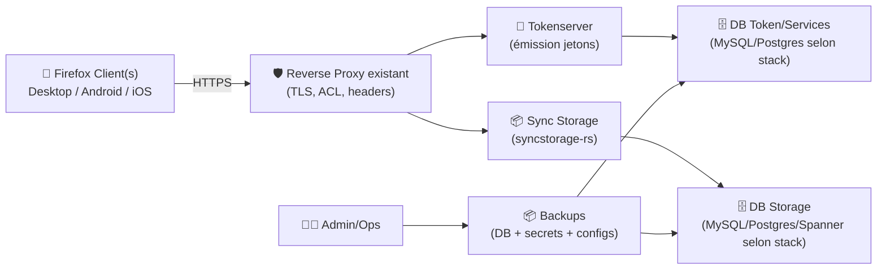
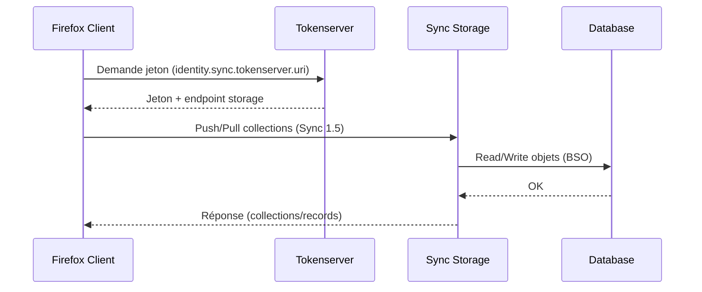

# 🦊 Firefox Sync Server — Présentation & Configuration Premium (syncstorage-rs / Sync 1.5)

### Synchronisation “self-hosted” des données Firefox (marque-pages, onglets, historique, mots de passe selon config)
Optimisé pour reverse proxy existant • DB robuste • Gouvernance • Backups & Rollback • Exploitation durable

---

## TL;DR

- Un “Firefox Sync Server” moderne, côté Mozilla, s’appuie sur **syncstorage-rs** (Rust) + une couche **tokenserver** (auth/jetons). :contentReference[oaicite:0]{index=0}  
- L’ancien **syncserver (all-in-one)** existe encore, mais le dépôt indique clairement qu’il **n’est pas maintenu** et qu’un remplacement est en cours/actif. :contentReference[oaicite:1]{index=1}
- Le réglage côté client passe (au minimum) par `identity.sync.tokenserver.uri` dans `about:config`, et l’URL exacte dépend de l’implémentation (voir section “Connexion clients”). :contentReference[oaicite:2]{index=2}
- En “premium ops”, le vrai sujet = **URL stables**, **éviter le subpath**, **backups DB + blobs**, **tests**, **rollback**.

---

## ✅ Checklists

### Pré-configuration (avant de brancher des clients)
- [ ] Choisir la branche **moderne** (syncstorage-rs) vs **legacy** (syncserver)
- [ ] Choisir DB (MySQL/MariaDB ou PostgreSQL selon ton choix)
- [ ] Définir une URL publique stable (idéalement **sous-domaine**)
- [ ] Définir le modèle d’auth (souvent : Firefox Accounts standard + tokenserver côté sync, ou infra plus complète si souveraineté totale)
- [ ] Définir la stratégie de rétention/backup (RPO/RTO)

### Post-configuration (avant prod)
- [ ] 2 clients synchronisent (Desktop ↔ Mobile) sur un profil test
- [ ] Les endpoints tokenserver + storage répondent sans erreurs (401/404) en usage normal
- [ ] Backups restaurables (test de restore réel)
- [ ] Logs exploitables (corrélation par timestamp, erreurs proxy, erreurs DB)

---

> [!TIP]
> Traite Firefox Sync comme une **brique d’infra** : la valeur est énorme, mais la stabilité repose sur URL, DB, et backups.

> [!WARNING]
> Évite le **subpath** (ex: `/ffsync`) : plusieurs retours terrain montrent que c’est source d’ennuis (paths, 401, rewriting). Préfère un **subdomain dédié**. :contentReference[oaicite:3]{index=3}

> [!DANGER]
> Les données Sync peuvent inclure des éléments sensibles (mots de passe/notes selon usage). Ton modèle sécurité/backup doit être au niveau “vault-like”.

---

# 1) Vision moderne (ce que “Sync” fait vraiment)

Firefox Sync synchronise des “collections” de données (onglets, bookmarks, etc.) via une API de stockage (BSO/collections) + un mécanisme de jetons (tokenserver). :contentReference[oaicite:4]{index=4}

Deux réalités coexistent :
- **Legacy : `mozilla-services/syncserver`** (bundle tokenserver + syncstorage “historique”) — *non maintenu*. :contentReference[oaicite:5]{index=5}  
- **Moderne : `mozilla-services/syncstorage-rs`** (Rust), documentation maintenue côté service docs. :contentReference[oaicite:6]{index=6}

---

# 2) Architecture globale (référence)



> [!TIP]
> Même si “ça marche” sans discipline, une démarche premium impose :
> - une DB fiable (latence + intégrité),
> - des URLs immuables,
> - des backups restaurables.

---

# 3) Connexion des clients Firefox (le point qui casse le plus)

## 3.1 Préférence clé (Desktop)
Dans Firefox : `about:config` → régler **`identity.sync.tokenserver.uri`** vers ton serveur. :contentReference[oaicite:7]{index=7}

### Important : le chemin dépend de l’implémentation
- **syncstorage-rs (moderne)** : la doc officielle d’exemple montre un tokenserver URI du type :  
  `http://localhost:8000/1.0/sync/1.5` :contentReference[oaicite:8]{index=8}
- **syncserver (legacy “Sync-1.5”)** : la doc “Run your own Sync-1.5 Server” décrit un URI du type :  
  `http(s)://sync.example.com/token/1.0/sync/1.5` :contentReference[oaicite:9]{index=9}

> [!WARNING]
> Si tu mets le mauvais chemin (ex: tu oublies `/token/...` côté legacy, ou tu ajoutes `/token` côté syncstorage-rs), tu obtiens des 404/401 et des sync “fantômes”.

## 3.2 Android (piège classique)
Certains clients Android ignorent les changements de `identity.sync.tokenserver.uri` **après** création du compte : il faut “Disconnect” le compte Sync puis reconfigurer et se reconnecter. :contentReference[oaicite:10]{index=10}

## 3.3 iOS (réalité terrain)
La doc historique indique que les chemins/paramètres diffèrent selon versions et modes avancés. :contentReference[oaicite:11]{index=11}  
En pratique : valide iOS sur un profil test avant migration complète.

---

# 4) Gouvernance (comptes, souveraineté, attentes réalistes)

## 4.1 “Je veux juste que ça sync chez moi”
Beaucoup d’installations self-hostées visent surtout à **héberger la partie Sync** tout en gardant un usage standard côté “Firefox Accounts”.  
La doc Mozilla mentionne explicitement l’option de faire tourner **son propre Firefox Accounts server** si tu veux contrôler les deux côtés (accounts + sync), mais c’est un projet à part entière. :contentReference[oaicite:12]{index=12}

> [!TIP]
> Décide tôt :
> - **Mode A** : autonomie partielle (Sync self-hosted, comptes standard)
> - **Mode B** : souveraineté forte (accounts + sync) — plus complexe (SMTP, flows, maintenance)

---

# 5) Données, rétention, et backups (ce qui protège vraiment)

## 5.1 Ce qu’il faut sauvegarder (minimum sérieux)
- DB “storage”
- DB “token/services” (si séparée)
- secrets / clés / variables de config (sinon restore impossible)
- preuves de config client (modèle d’URL, chemins)

## 5.2 Stratégie de backup premium
- Snapshots DB réguliers (logiques) + rotation
- Une copie offsite
- Test de restauration mensuel (sur instance de test)

> [!DANGER]
> Un backup non testé = un backup imaginaire.

---

# 6) Observabilité (logs & symptômes typiques)

## Symptômes fréquents
- **401 sur `/1.5/...`** derrière proxy : souvent rewriting/headers/URL node mal résolue (retours dans issues). :contentReference[oaicite:13]{index=13}
- Instabilité subpath : évite, passe en subdomain. :contentReference[oaicite:14]{index=14}

## Ce que tu veux voir dans les logs
- Requêtes tokenserver OK (200)
- Requêtes storage OK (200/204) sur collections
- Erreurs DB explicites (timeouts, migrations, connexions)

---

# 7) Validation / Tests / Rollback (opérationnel)

## 7.1 Tests de validation (fonctionnels)
```bash
# 1) Vérifier que ton tokenserver URI répond (adapter le chemin selon ta stack)
# legacy:  https://sync.example.com/token/1.0/sync/1.5
# moderne: https://sync.example.com/1.0/sync/1.5
curl -I "https://sync.example.com/1.0/sync/1.5" | head

# 2) Test utilisateur
# - Connecter 2 clients sur un profil test
# - Ajouter un bookmark + ouvrir un onglet
# - Vérifier la réplication
```

## 7.2 Rollback (plan simple)
- Revenir à l’ancienne URL (si tu changes de domaine/chemin, c’est souvent le plus destructeur)
- Restaurer DB(s) + secrets
- Rebrancher un seul client test avant réouverture globale

> [!TIP]
> Le rollback le plus “safe” = restaurer l’état précédent **sans changer l’URL publique**.

---

# 8) Mermaid — Workflow sync (vision simplifiée)



---

# 9) Sources — documentation & images Docker (URLs en bash)

```bash
# Documentation & upstream (Mozilla)
https://github.com/mozilla-services/syncstorage-rs
https://mozilla-services.github.io/syncstorage-rs/
https://mozilla-services.readthedocs.io/en/latest/howtos/run-sync-1.5.html
https://github.com/mozilla-services/syncserver

# Exemples / retours terrain utiles (proxy, subpath)
https://forum.yunohost.org/t/solved-firefox-sync-storage-mozilla-syncserver-rs-not-syncing/27986
https://github.com/mozilla-services/syncstorage-rs/issues/1217

# Images Docker (officielles/connues)
https://hub.docker.com/r/mozilla/syncstorage-rs
https://hub.docker.com/r/mozilla/syncserver/tags

# Images Docker (tiers historiques - à évaluer avec prudence)
https://hub.docker.com/r/crazymax/firefox-syncserver
https://github.com/crazy-max/docker-firefox-syncserver
https://hub.docker.com/r/sunx/mozilla-syncserver

# LinuxServer.io (vérification catalogue : pas d’image “Firefox Sync Server” dédiée connue ici)
https://www.linuxserver.io/our-images
https://docs.linuxserver.io/images/
```

---