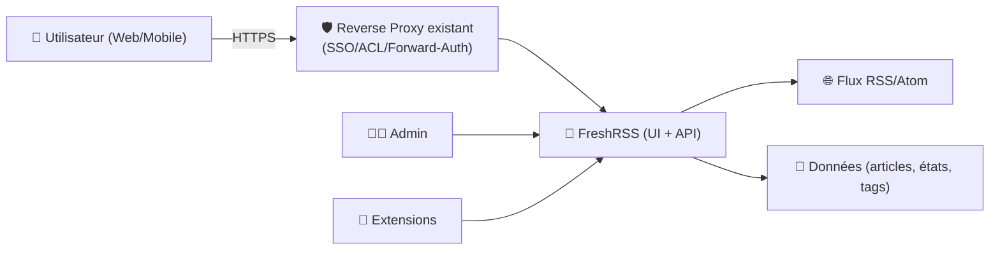
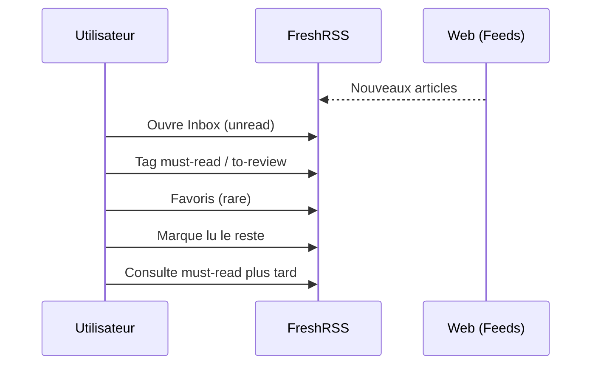

# 📰 FreshRSS — Présentation & Configuration Premium (Sans install / Sans Docker / Sans Nginx)

### Agrégateur RSS auto-hébergé : lecture rapide, filtres puissants, tags, API, extensions
Optimisé pour reverse proxy existant • Contrôle d’accès • Qualité de lecture • Exploitation durable

---

## TL;DR

- **FreshRSS** centralise tes flux RSS/Atom avec une UI rapide, des **filtres**, **tags**, **recherche**, et une logique “à lire / favoris”.
- Objectif “premium” : **structure** (catégories + tags), **hygiène** (nettoyage & rétention), **accès** (auth adaptée), **API** (apps mobiles), **extensions** (avec gouvernance).
- À ne pas confondre avec un moteur de logging/archivage : FreshRSS = **lecture & organisation**.

---

## ✅ Checklists

### Pré-configuration (avant d’ouvrir à d’autres)
- [ ] Définir une taxonomie : catégories (hautes) + tags (fins)
- [ ] Définir la stratégie de lecture : “unread-first”, favoris, “read later”
- [ ] Définir la rétention : combien d’articles garder (global + exceptions)
- [ ] Définir l’accès : mode auth (form, HTTP auth, etc.) + politique de partage
- [ ] Définir l’usage mobile : API + méthode d’auth compatible (apps)

### Post-configuration (qualité)
- [ ] Les flux critiques sont normalisés (titre/emoji/ordre cohérent)
- [ ] Les filtres/labels rendent l’inbox “vide” facilement
- [ ] Les performances restent bonnes après import massif
- [ ] Un runbook “incident” existe (sync, auth, feed en erreur, etc.)
- [ ] Un rollback fonctionnel est documenté (conf + données)

---

> [!TIP]
> La meilleure expérience FreshRSS vient d’une **inbox minimaliste** : 10–20 sources “high signal”, filtres, et nettoyage agressif.

> [!WARNING]
> L’ouverture “publique” sans contrôle d’accès est une mauvaise idée : contenus privés, habitudes de lecture, endpoint API.

> [!DANGER]
> Le problème #1 côté reverse proxy/SSO : **base URL / schéma HTTPS** incohérents → redirections/callbacks cassés. Vérifie toujours l’URL “canonique”.

---

# 1) FreshRSS — Vision moderne

FreshRSS n’est pas “un lecteur de flux”.

C’est :
- 🧠 Un **moteur de tri** (filtres, recherche, marquage)
- 🗂️ Un **organisateur** (catégories, tags, favoris)
- 🔁 Un **synchroniseur** (rafraîchissement, erreurs, retries)
- 🔌 Une **plateforme extensible** (extensions)
- 📱 Une **source API** (clients mobiles)

---

# 2) Architecture globale



---

# 3) Philosophie de configuration (5 piliers)

1. 🧱 **Taxonomie** (catégories + tags) = lisibilité long terme  
2. 🧹 **Rétention & hygiène** = performance durable  
3. 🔐 **Contrôle d’accès** = sécurité + UX cohérente  
4. 📱 **Mobile/API** = usage quotidien fluide  
5. 🧩 **Extensions gouvernées** = valeur sans dette

---

# 4) Organisation Premium (catégories, tags, conventions)

## Catégories (niveau “shelf”)
Exemples :
- Tech
- Sécurité
- Business
- Dev
- Ops
- Veille (faible priorité)

## Tags (niveau “signal”)
- `must-read`
- `to-review`
- `howto`
- `idea`
- `watchlist`
- `incident`

> [!TIP]
> Règle simple : **catégories = domaine**, **tags = intention**.

---

# 5) Filtres & Règles (inbox zéro)

## Filtres utiles (patterns)
- Sources bruyantes → tag `veille` + lecture “quand j’ai le temps”
- Articles “how-to” → tag `howto`
- Sécurité → tag `sec` + “must-read”
- Mots-clés : `CVE`, `incident`, `post-mortem`, `release`, `breaking`

## Routine “inbox zéro”
1) Parcours unread  
2) Tag `must-read` / `to-review` / `watchlist`  
3) Favoris seulement si action réelle  
4) Marquer lu en masse sans culpabilité

---

# 6) Contrôle d’accès & Auth (propre)

FreshRSS propose plusieurs modes d’accès (form auth, HTTP-based, etc.).  
Objectif premium : **un seul point d’entrée** (reverse proxy existant) + **méthode d’auth stable** (web + mobile).

## Recommandations
- Si tu as un SSO/forward-auth : privilégier un mode compatible “proxy auth”
- Pour mobile : vérifier la compatibilité de l’app choisie (certaines méthodes d’auth posent problème selon le proxy)

> [!WARNING]
> Teste **web + mobile** avant de “standardiser” une méthode d’auth. Le web peut marcher et le mobile échouer (ou inversement).

---

# 7) Base URL / Subpath / Reverse proxy existant (sans recettes)

Cas fréquents :
- Sous-domaine : `https://rss.example.tld`
- Subpath : `https://example.tld/rss`

Points premium à valider :
- URL “canonique” cohérente (schéma https, host, path)
- Cookies / callbacks SSO corrects
- Pas de double redirection http↔https
- En subpath : chemins relatifs & base_url corrects

---

# 8) Mobile & API (usage quotidien)

## Principes
- Active l’API uniquement si tu l’utilises
- Utilise un mot de passe/app-password dédié si la plateforme le permet
- Limite les comptes : un compte par humain, pas de partage “à l’arrache”

## Bonnes pratiques
- Créer un utilisateur “lecture” si tu as un device partagé (tablette)
- Ne pas réutiliser ton mdp principal partout
- Audit : si une app mobile dysfonctionne, vérifier logs + méthode d’auth

---

# 9) Extensions (valeur + gouvernance)

Les extensions apportent :
- UI/UX améliorée
- intégrations
- automatisations

Gouvernance premium :
- 1) inventaire des extensions
- 2) justification (“quel problème ça résout”)
- 3) procédure upgrade (compat)
- 4) rollback (désactivation)

> [!TIP]
> “Moins mais mieux” : 3–5 extensions utiles valent mieux qu’un zoo ingérable.

---

# 10) Workflows premium (lecture & ops)

## 10.1 Flux “veille quotidienne”


## 10.2 Flux “veille sécurité”
- Dossier “Sécurité” dédié
- Tags : `sec`, `cve`, `incident`
- Lecture obligatoire : `must-read`
- Option : exporter vers un canal interne (si vous avez une pratique de veille)

---

# 11) Validation / Tests / Rollback

## Smoke tests (réseau & HTTP)
```bash
# 1) Réponse HTTP
curl -I https://rss.example.tld | head

# 2) Contenu attendu (page login / accueil)
curl -s https://rss.example.tld | head -n 30
```

## Tests fonctionnels (manuel)
- Ajouter 1 flux “known good” (ex: un blog stable)
- Forcer un refresh
- Vérifier :
  - article arrive
  - marquer lu/favori fonctionne
  - tag & filtre fonctionnent
  - mobile se connecte (si activé)

## Rollback (opérationnel)
- Rollback “soft” : désactiver la nouvelle méthode d’auth (retour à l’ancienne)
- Rollback “feature” : désactiver une extension problématique
- Rollback “config” : restaurer config applicative (et vérifier base_url/auth)

> [!WARNING]
> Un rollback utile est **testé**. Documente le chemin “retour arrière” comme une procédure exécutable.

---

# 12) Erreurs fréquentes (et fix)

- ❌ “Je suis coincé en redirection” → base_url / schéma https incohérent
- ❌ “Mobile ne s’auth pas” → méthode d’auth incompatible / headers proxy
- ❌ “Feeds en erreur” → user-agent / rate limit / TLS / flux mort
- ❌ “Lent après import” → rétention trop haute / trop de flux bruyants / extensions excessives

---

# 13) Sources des images Docker (URLs en bash)

```bash
# Images & docs officielles FreshRSS
echo "https://hub.docker.com/r/freshrss/freshrss"
echo "https://hub.docker.com/r/freshrss/freshrss/tags"
echo "https://github.com/FreshRSS/FreshRSS"
echo "https://freshrss.github.io/FreshRSS/en/"

# Image LinuxServer.io (existe pour FreshRSS)
echo "https://hub.docker.com/r/linuxserver/freshrss"
echo "https://docs.linuxserver.io/images/docker-freshrss/"
echo "https://github.com/linuxserver/docker-freshrss"

# Docs FreshRSS utiles (auth, reverse proxy, extensions)
echo "https://freshrss.github.io/FreshRSS/en/admins/09_AccessControl.html"
echo "https://freshrss.github.io/FreshRSS/en/admins/Caddy.html"
echo "https://github.com/FreshRSS/Extensions"
```

---

# ✅ Conclusion

FreshRSS “premium”, c’est :
- une **taxonomie** qui rend la lecture simple,
- une **hygiène** qui garde l’outil rapide,
- un **contrôle d’accès** cohérent (web + mobile),
- des **extensions gouvernées**,
- et une section **tests/rollback** exécutable.

Résultat : une veille lisible, durable, et réellement utilisée au quotidien.