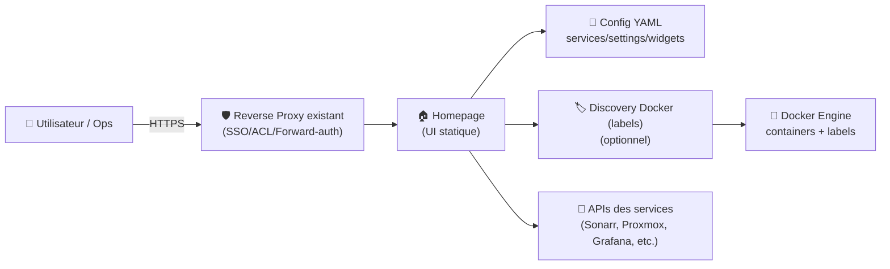
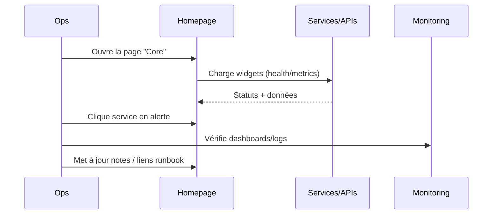

# 🏠 Homepage (gethomepage) — Présentation & Configuration Premium

### Dashboard statique, rapide et ultra personnalisable pour ton homelab / infra
Optimisé pour reverse proxy existant • Découverte Docker par labels • Widgets API • Gouvernance & exploitation

---

## TL;DR

- **Homepage** = une page d’accueil “single pane of glass” pour **regrouper tes services**, leur état, et des **widgets** (100+ intégrations).
- Config en **YAML** (lisible, versionnable Git) + **service discovery** via **labels Docker** (optionnel).
- Version “premium” = **structure stable**, **naming + labels**, **proxies/widgets propres**, **validation & rollback**.

---

## ✅ Checklists

### Pré-configuration (avant de remplir des centaines de tuiles)
- [ ] Définir la taxonomie : Groupes (Infra / Media / Apps / SecOps / Dev)
- [ ] Définir conventions : `app`, `env`, `team`, `tier`
- [ ] Décider discovery : YAML only **ou** YAML + labels Docker
- [ ] Définir politique secrets : `.env` / variables / fichiers non versionnés
- [ ] Définir UX : thème, background, layout, bookmarks

### Post-configuration (qualité “ops-ready”)
- [ ] Les services critiques sont visibles en 1 écran (pas de scroll infini)
- [ ] Les widgets ne saturent pas les APIs (timeouts/retry/proxy bien réglés)
- [ ] Le dashboard reste lisible sur mobile
- [ ] Une procédure “Validation / Rollback” existe et a été testée

---

> [!TIP]
> La réussite d’Homepage dépend plus de **ta structure** (groupes, conventions, labels) que du nombre de widgets.

> [!WARNING]
> Les widgets interrogent des APIs : si tu actives tout partout, tu peux créer du bruit, du throttling, et des pages lentes.

> [!DANGER]
> Ne mets jamais des tokens/API keys en clair dans un repo public. Sépare **secrets** (env/secret manager) et **config** (YAML).

---

# 1) Homepage — Vision moderne

Homepage n’est pas juste un “menu d’applis”.

C’est :
- 🧭 Un **portail** (navigation, bookmarks, regroupements)
- 📊 Un **tableau de bord** (statuts, métriques, widgets)
- 🧩 Un **agrégateur** (Docker discovery + intégrations)
- 🧠 Un **outil d’exploitation** (vue d’ensemble, triage incident)

---

# 2) Architecture globale



---

# 3) Philosophie de configuration Premium (5 piliers)

1. 🧱 **Structure stable** (groupes, hiérarchie, ordre)
2. 🏷️ **Conventions** (naming, labels, tags)
3. 🔌 **Widgets propres** (timeouts, proxies, refresh)
4. 🔐 **Secrets & accès** (tokens hors repo, RBAC via reverse proxy existant)
5. 🧪 **Validation & rollback** (pas de “prod au hasard”)

---

# 4) Structure recommandée (lisible, maintenable)

## Groupes “qui tiennent dans le temps”
- **Core / Infra** : reverse proxy, DNS, auth, monitoring
- **Compute** : Proxmox, Docker hosts, Kubernetes
- **Storage** : NAS, S3, backups
- **Media** : Plex/Jellyfin, *arr, downloaders
- **SecOps** : CrowdSec, WAF, Vault, scanners
- **Apps** : apps internes, CI/CD

## Conventions (pratiques)
- Nom service court + stable : `grafana`, `proxmox`, `jellyfin`
- Tags : `prod`, `staging`, `internal`, `public`
- Icônes : cohérentes (même style)

---

# 5) Config YAML — patterns Premium

Homepage s’appuie sur plusieurs fichiers YAML (ex: `services.yaml`, `settings.yaml`, etc.).
L’objectif “premium” : **zéro duplication**, **clarté**, **versionnage**, **secrets séparés**.

## 5.1 Services (services.yaml) — exemple de pattern propre
```yaml
# services.yaml
- Core:
    - Reverse Proxy:
        icon: traefik.svg
        href: https://proxy.example.tld/
        description: Entrée HTTPS + routage
        siteMonitor: https://proxy.example.tld/
        tags: [core, prod]

    - Auth:
        icon: authelia.svg
        href: https://auth.example.tld/
        description: SSO / MFA
        tags: [core, prod]

- Observability:
    - Grafana:
        icon: grafana.svg
        href: https://grafana.example.tld/
        tags: [observability, prod]
        widget:
          type: grafana
          url: https://grafana.example.tld
          # apiKey: utiliser une variable/secret plutôt que du clair
          # (voir section Secrets)
```

> [!TIP]
> Ne mets pas 200 tuiles au même niveau. Mets des **groupes** + garde “Core” visible sans scroller.

---

## 5.2 Settings (settings.yaml) — lisibilité & UX
```yaml
# settings.yaml
title: "Home"
background:
  image: https://images.example.tld/bg.jpg
  blur: sm
  saturate: 50
  brightness: 70
  opacity: 20

theme: dark
color: slate

layout:
  Core:
    style: row
    columns: 3
  Observability:
    style: row
    columns: 3
  Media:
    style: row
    columns: 4
```

> [!WARNING]
> Les backgrounds lourds + trop de widgets = page lente. Optimise images + limite widgets critiques.

---

## 5.3 Widgets — règles de pro
- Préférer les widgets **vraiment utiles** (état, backlog, health)
- Limiter le refresh si APIs fragiles
- Centraliser les endpoints (même domaine, proxy, etc.)
- Documenter les tokens (où ils vivent, rotation)

---

# 6) Discovery Docker par labels (optionnel, mais puissant)

Si tu utilises la découverte automatique :
- Tu gardes une config “minimale” côté YAML
- Les services se déclarent via **labels** (pratique si tu déploies beaucoup)

Exemple de labels (pattern lisible) :
```bash
# Exemple conceptuel (labels)
# homepage.group=Media
# homepage.name=Jellyfin
# homepage.icon=jellyfin.svg
# homepage.href=https://jellyfin.example.tld
# homepage.description=Media Server
# homepage.widget.type=jellyfin
# homepage.widget.url=https://jellyfin.example.tld
```

> [!DANGER]
> Les labels peuvent contenir des infos sensibles si tu y mets des URLs internes/token. Garde les secrets hors labels.

---

# 7) Workflow “Ops” (triage incident)



---

# 8) Secrets & Bonnes pratiques (indispensable)

## Stratégie recommandée
- Config YAML versionnée (Git)
- Secrets via :
  - variables d’environnement
  - fichiers `.env` non commités
  - secret manager (si dispo)

## Règles
- ✅ Tokens en **read-only** quand possible
- ✅ Rotation régulière (trimestrielle ou lors d’incident)
- ✅ Documenter “qui possède” le token (owner)

---

# 9) Validation / Tests / Rollback

## Smoke tests (rapides)
```bash
# 1) Le serveur répond
curl -I https://homepage.example.tld | head

# 2) Vérifier que le HTML est servi
curl -s https://homepage.example.tld | head -n 20

# 3) Vérifier que les YAML sont valides (si tu as yq)
# yq e '.' services.yaml >/dev/null && echo "services.yaml OK"
```

## Tests fonctionnels (qualité)
- Les groupes s’affichent dans le bon ordre
- Les liens ouvrent les bons endpoints
- Les widgets critiques chargent sans erreurs (pas de timeout)
- Les icônes sont cohérentes (pas de “missing icon”)

## Rollback (simple)
- Garder une copie du répertoire config versionnée (Git)
- Rollback = revenir au commit précédent + recharger/redémarrer le service Homepage
- Toujours : **tag** avant gros changement (`v-homepage-YYYYMMDD`)

---

# 10) Erreurs fréquentes (et fixes)

- ❌ Trop de widgets → page lente  
  ✅ Réduire widgets, augmenter cache/refresh, optimiser images

- ❌ Conventions inexistantes → dashboard illisible  
  ✅ Standardiser `group/app/env/team` + trier “Core” en premier

- ❌ Secrets en clair dans YAML  
  ✅ Déporter tokens vers env/secret store, documenter la rotation

- ❌ Icônes incohérentes  
  ✅ Choisir une librairie d’icônes + règles de nommage

---

# 11) Sources — Images Docker & Docs (en bash, comme demandé)

```bash
# Docs officielles Homepage
https://gethomepage.dev/
https://gethomepage.dev/configs/
https://gethomepage.dev/configs/services/
https://gethomepage.dev/configs/settings/
https://gethomepage.dev/configs/docker/        # discovery labels & options liées à Docker
https://github.com/gethomepage/homepage

# Image Docker officielle (GitHub Container Registry)
# (Page "Packages" du repo, image: ghcr.io/gethomepage/homepage)
https://github.com/orgs/gethomepage/packages/container/package/homepage

# Releases (versions)
https://github.com/gethomepage/homepage/releases

# LinuxServer.io (vérification catalogue)
# (Homepage n’apparaît pas comme image LSIO dédiée dans le catalogue d’images)
https://www.linuxserver.io/our-images
https://docs.linuxserver.io/
```

---

# ✅ Conclusion

Homepage (gethomepage) devient “premium” quand :
- tu stabilises la structure (groupes + conventions),
- tu limites les widgets aux vrais signaux,
- tu gères secrets proprement,
- et tu as une routine de validation + rollback.

Résultat : un portail rapide, propre, maintenable, qui sert vraiment en prod.