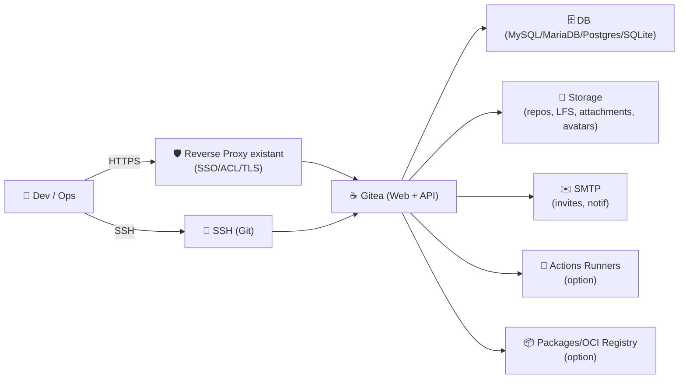
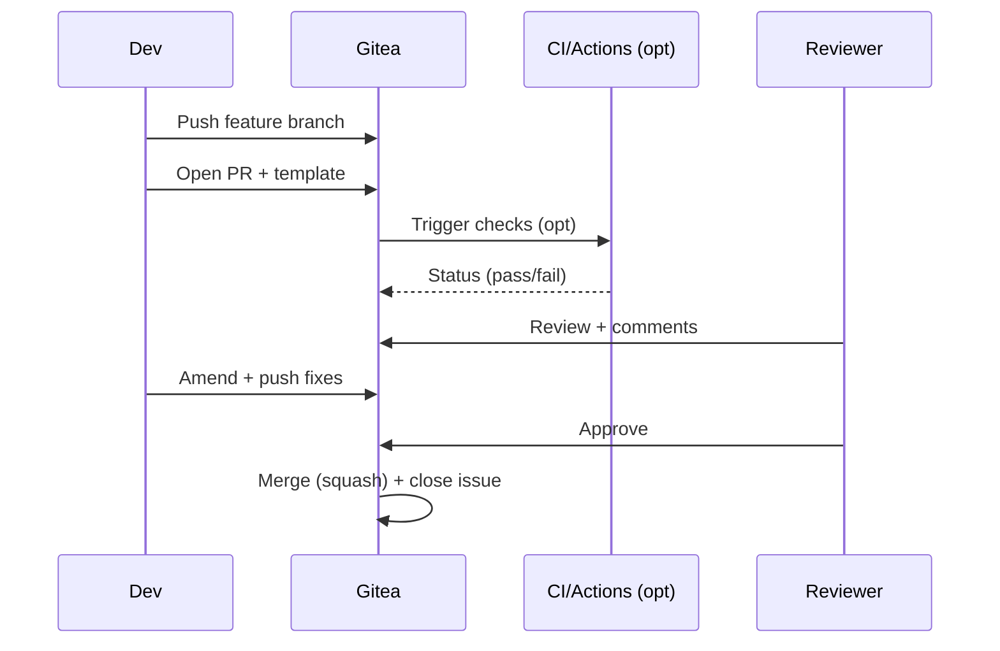

# ☕ Gitea — Présentation & Configuration Premium (Sans install / Sans reverse-proxy recipes)

### Forge Git légère et complète : dépôts, PR, issues, wiki, packages, actions
Optimisé pour reverse proxy existant • Gouvernance & permissions • Sécurité • Exploitation durable

---

## TL;DR

- **Gitea** = une **forge Git** auto-hébergeable (repos, PR, issues, wiki, releases) avec un **vrai modèle d’organisation** (org/teams/permissions).
- “Premium” = **ROOT_URL correct**, **SSH propre**, **registrations maîtrisées**, **LFS/Packages/Actions** selon besoin, **logs & sauvegardes**, **tests + rollback**.
- Objectif : une forge **stable**, **prédictible**, **sécurisée**, utilisable par une équipe sans surprises.

Docs clés : reverse-proxy/ROOT_URL et configuration globale. :contentReference[oaicite:0]{index=0}

---

## ✅ Checklists

### Pré-configuration (avant ouverture aux utilisateurs)
- [ ] Choisir le modèle : **Org/Teams** vs comptes individuels
- [ ] Définir l’URL canonique (**ROOT_URL**) et les endpoints clone (HTTPS/SSH)
- [ ] Fixer la politique d’inscription : fermé / approval / invite-only
- [ ] Décider : **LFS** (oui/non), **Packages** (oui/non), **Actions** (oui/non)
- [ ] Définir une convention : noms de repos, branches, protections, templates PR/Issues

### Post-configuration (qualité ops)
- [ ] Connexion web OK, liens corrects (pas de redirect loop)
- [ ] Clone HTTPS/SSH OK (selon stratégie)
- [ ] Permissions : une team ne voit pas ce qu’elle ne doit pas voir
- [ ] Logs exploitables (niveau, rotation) + runbook d’incident
- [ ] Sauvegarde testée + restauration testée (au moins une fois)

---

> [!TIP]
> La clé d’une forge “pro” n’est pas la UI : c’est la **gouvernance** (org/teams), la **stabilité des URLs** (ROOT_URL), et la **discipline repo** (protections + templates).

> [!WARNING]
> **ROOT_URL** mal réglé = callbacks OAuth cassés, liens/clone URLs incohérents, problèmes derrière reverse proxy. :contentReference[oaicite:1]{index=1}

> [!DANGER]
> Les logs/attachments peuvent contenir des secrets (tokens, traces). Traite Gitea comme un **service sensible** : contrôle d’accès fort + audit des permissions.

---

# 1) Gitea — Vision moderne

Gitea n’est pas “juste un serveur Git”.

C’est :
- 🧑‍🤝‍🧑 **Collaboration** : PR, reviews, commentaires, protections de branches
- 🧾 **Gestion projet** : issues, labels, milestones, boards (selon usage)
- 📦 **Distribution** : releases + registry de packages (selon config)
- ⚙️ **Automatisation** : actions (selon usage) et webhooks
- 🔐 **Gouvernance** : organisations, équipes, droits fins

---

# 2) Architecture globale (référence)



---

# 3) Gouvernance & Modèle d’accès (ce qui évite le chaos)

## Modèle recommandé “Org-first”
- 1 **Organisation** par domaine (ex: `platform`, `data`, `product`)
- 1 **Team** par périmètre (ex: `platform-core`, `platform-sre`)
- Droits par team :
  - `read` pour visibilité
  - `write` pour contribution
  - `admin` réservé (très rare)

## Règles premium
- Repos “prod” : protections strictes (PR obligatoire, reviews, CI required)
- Convention branches :
  - `main` protégée
  - `release/*` si nécessaire
- Templates :
  - `ISSUE_TEMPLATE/`
  - `PULL_REQUEST_TEMPLATE.md`

---

# 4) Points de configuration critiques (app.ini mindset)

Référence exhaustive : configuration cheat sheet. :contentReference[oaicite:2]{index=2}

## 4.1 URL canonique (ROOT_URL) derrière reverse proxy
- Gitea doit connaître son URL publique via `[server] ROOT_URL`.
- Le reverse proxy doit passer les bons headers (Host / X-Forwarded-Proto) pour que Gitea “voie” l’URL réelle. :contentReference[oaicite:3]{index=3}

> [!WARNING]
> Si tu utilises un **subpath**, il y a des implications pour certaines features (ex: registry `/v2` côté racine). :contentReference[oaicite:4]{index=4}

## 4.2 Politique d’inscription (anti-spam)
Stratégies :
- **Invite-only** (souvent meilleur)
- **Approval** (si tu veux ouvrir mais filtrer)
- **Open** (rarement recommandé)

## 4.3 SSH : “internal SSH” vs OpenSSH
- Certains modes “rootless container” s’appuient sur le **SSH interne** de Gitea et ne supportent pas OpenSSH. :contentReference[oaicite:5]{index=5}
- Décide clairement :
  - SSH interne (simple, intégré)
  - OpenSSH externe (plus classique, plus contrôlable par l’OS)

## 4.4 Stockage : repos, LFS, attachments
- Clarifie où vivent :
  - repos Git
  - LFS (si gros binaires)
  - attachments (captures, docs)
- Règle premium : quotas / règles d’upload + politique de rétention.

## 4.5 Mailer (notifications & onboarding)
- SMTP = invitations, resets, notifications
- Définis :
  - From, TLS, retries
  - politique notifications (ne pas spammer)

## 4.6 Packages / Registry (option)
- Si tu actives la registry/Packages, tu dois prévoir :
  - Auth (tokens)
  - URL stable
  - Contraintes reverse proxy (ex: `/v2` pour la registry) :contentReference[oaicite:6]{index=6}

## 4.7 Actions (option)
- Actions = surface d’exécution : pense **isolation**, **secrets**, **permissions**
- Bonne pratique : runners dédiés par env (prod/staging) + secrets minimaux.

---

# 5) Workflows premium (collaboration sans friction)

## PR “propre”
- Branch protection : PR obligatoire
- 1–2 reviews minimum selon criticité
- CI required (lint/tests)
- Squash merge (souvent) + convention de messages



---

# 6) Observabilité & Exploitation (ce qui sauve en incident)

## Logs : ce que tu veux voir vite
- Auth : tentatives suspectes, tokens, erreurs OAuth
- Git : erreurs clone/push, SSH
- DB : latence, verrous, erreurs
- Web : 5xx, timeouts, upload failures

## “Runbook incident” minimal
- Identifier : user impacté / repo / timeframe
- Reproduire : web vs git clone vs ssh
- Corréler : logs app + db + proxy
- Mitiger : désactiver feature (actions/packages) si elle explose, réduire charge, rollback

---

# 7) Validation / Tests / Rollback

## Tests fonctionnels (à faire après chaque changement “sensible”)
```bash
# Web : page répond
curl -I https://git.example.com | head

# API : version / ping (si exposée)
curl -s https://git.example.com/api/v1/version || true

# Git HTTPS : clone d'un repo public/test
git clone https://git.example.com/org/repo-test.git

# SSH : test handshake (si SSH activé)
ssh -T git@git.example.com || true
```

## Tests de gouvernance (indispensable)
- Compte “team-a” :
  - ✅ voit repos A
  - ❌ ne voit pas repos B
- Un repo “critical” :
  - ✅ PR required
  - ✅ CI required (si activé)
  - ✅ push direct refusé

## Rollback (pratique)
- Rollback “config” : revenir à `app.ini` précédent
- Rollback “feature” : désactiver packages/actions temporairement
- Rollback “données” : restaurer DB + storage (repos/LFS/attachments) depuis backup validé

---

# 8) Sources — Images Docker (et docs associées)

> Tu voulais les **adresses** en `bash` (sans marqueurs bizarres). Voilà.

```bash
# Image officielle Gitea (Docker Hub)
https://hub.docker.com/r/gitea/gitea
https://hub.docker.com/r/gitea/gitea/tags

# Docs Gitea (reverse proxy / ROOT_URL)
https://docs.gitea.com/administration/reverse-proxies

# Cheat sheet configuration (app.ini)
https://docs.gitea.com/administration/config-cheat-sheet

# Rootless docker (note SSH interne)
https://docs.gitea.com/installation/install-with-docker-rootless

# Registry/Packages (usage)
https://docs.gitea.com/usage/packages/container

# Note forum (contexte SSH interne/rootless)
https://forum.gitea.com/t/how-do-i-enable-ssh-on-a-gitea-self-hosted-instance/10044

# LinuxServer.io (vérifier s'il existe une image dédiée : à ce jour, pas d'officielle LSIO référencée ici)
https://www.linuxserver.io/our-images
https://docs.linuxserver.io/
```

---

# ✅ Conclusion

Gitea “premium” = une forge **prévisible** :
- URLs canoniques propres (ROOT_URL + proxy headers) :contentReference[oaicite:7]{index=7}
- gouvernance org/teams + protections
- features activées **par besoin** (LFS/Packages/Actions)
- tests après changements + rollback documenté

Si tu me donnes ton contexte (SSO ? subpath ? SSH interne ou OpenSSH ? packages/actions oui/non), je peux te produire une “version profilée” avec tes choix — toujours sans sections d’install.