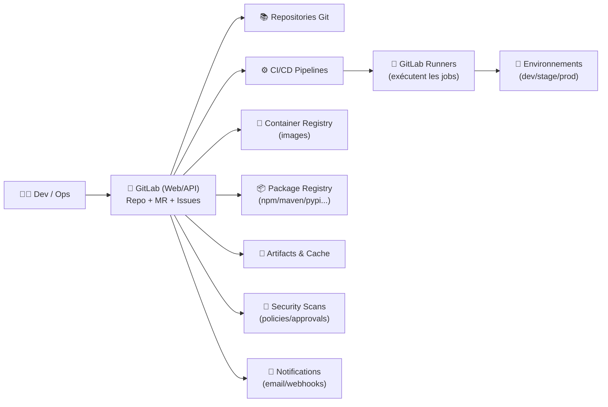
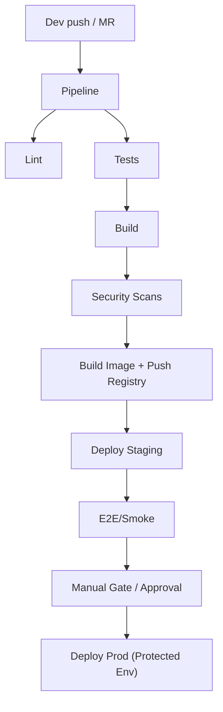
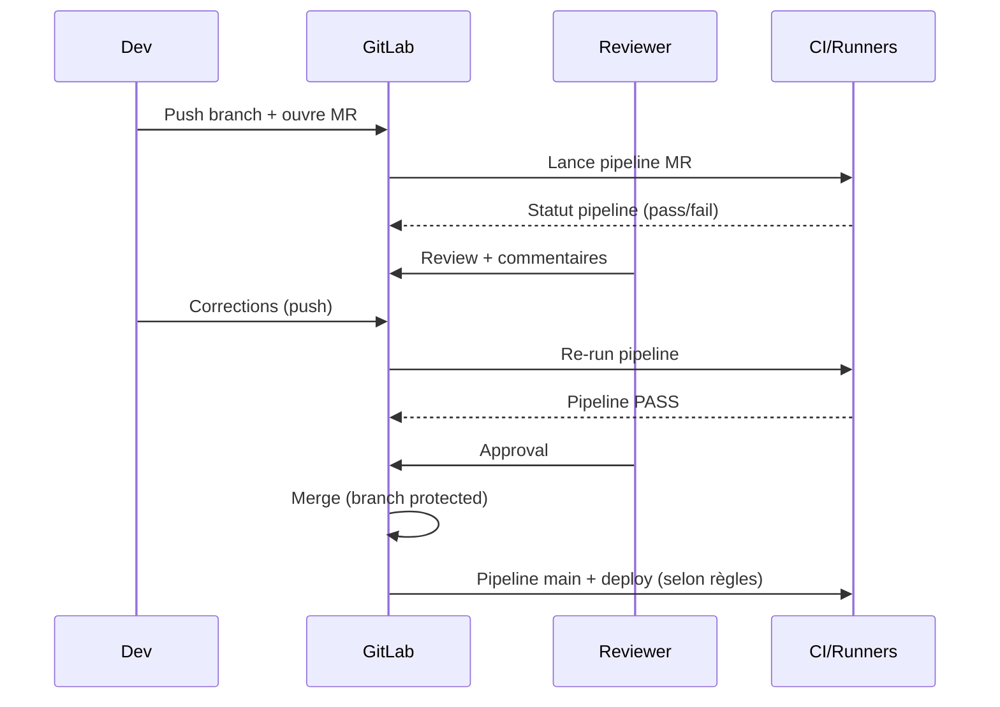

# 🦊 GitLab — Présentation & Exploitation Premium (Plateforme DevSecOps)

### Code • CI/CD • Sécurité • Registry • Observabilité • Gouvernance
Optimisé pour reverse proxy existant • SSO/LDAP/OIDC/SAML possible • RBAC • Workflows pro • Exploitation durable

---

## TL;DR

- **GitLab** = une plateforme **tout-en-un** : dépôt Git + MRs + CI/CD + registry + sécurité + packages.
- Un usage “premium” repose sur : **gouvernance** (groupes/roles), **workflow MR**, **CI standardisée**, **secrets maîtrisés**, **runners bien gérés**, **politiques de sécurité**.
- Ce doc te donne une **vue complète** : architecture, concepts, bonnes pratiques, checklists, tests, rollback, et sources officielles.

---

## ✅ Checklists

### Pré-usage (avant d’ouvrir à une orga)
- [ ] Définir la structure : **Groupes → Sous-groupes → Projets**
- [ ] Définir les rôles : Owners/Maintainers/Developers/Reporters
- [ ] Activer **2FA** + politique mots de passe + verrouillage sessions
- [ ] Choisir auth : local vs **SSO** (SAML/OIDC/LDAP)
- [ ] Standardiser : conventions branches/tags, templates MR, labels, milestones
- [ ] Stratégie runners : shared vs group vs specific + capacité + isolation
- [ ] Politique secrets : variables CI masquées/protégées + rotation

### Post-configuration (qualité opérationnelle)
- [ ] MR obligatoires sur branches protégées + approvals définis
- [ ] Pipelines “must pass” pour merge + règles de déploiement
- [ ] Registry/Packages gouvernés (qui pousse quoi, retention)
- [ ] Audits/Logs : visibilité admin + traçabilité actions sensibles
- [ ] Procédures incident : CI down, runners saturés, registry en erreur
- [ ] Tests de validation + rollback documentés (voir section dédiée)

---

> [!TIP]
> GitLab devient “game-changer” quand tu **standardises** les pipelines (templates, includes) et que tu imposes un workflow MR propre.

> [!WARNING]
> Les runners sont souvent le point faible : droits trop larges, exécution non isolée, capacité sous-dimensionnée → risques sécurité + instabilité CI.

> [!DANGER]
> Ne confonds pas “tout-en-un” avec “tout-ouvert” : protège branches/environnements, cloisonne les projets, masque les secrets, active l’audit.

---

# 1) GitLab — Vision moderne

GitLab n’est pas “juste un Git + CI”.

C’est :
- 🧑‍🤝‍🧑 **Collaboration** : Issues, Boards, MRs, Reviews, Code Owners
- ⚙️ **CI/CD** : pipelines, environnements, releases, auto-devops (selon besoins)
- 🔐 **DevSecOps** : scan (SAST/DAST/Dependency…), policies, approval rules
- 📦 **Supply chain** : Container Registry, Package Registry, artifacts
- 🧭 **Gouvernance** : RBAC, groupes, audits, compliance (selon edition/features)

---

# 2) Architecture globale (référence)



---

# 3) Modèle d’organisation (ce qui évite le chaos)

## Structure recommandée
- **Groupes** = domaines (ex: `platform`, `product`, `data`)
- **Sous-groupes** = équipes/services (ex: `platform/observability`)
- **Projets** = repo applicatif, infra, libs

## Conventions premium
- Un projet “**templates**” par groupe : `.gitlab-ci.yml` réutilisables via `include:`
- Labels standard :
  - `type::bug`, `type::feature`, `type::chore`
  - `prio::p0/p1/p2`
  - `status::blocked/in-review/ready`
- Milestones par release (ex: `2026-W10`, `v1.12`)

> [!TIP]
> Mets “la norme” dans des templates : moins de débats, moins d’incohérences, onboarding plus rapide.

---

# 4) Workflow Merge Request (MR) — Standard pro

## Règles recommandées
- **Branches protégées** : `main` / `release/*`
- Merge uniquement via MR
- Pipeline doit **passer** avant merge
- **Approvals** :
  - 1 approval minimum (2 si code sensible)
  - CODEOWNERS pour composants critiques
- Squash & merge (souvent) + conventions de commit

## Stratégies branches
- Simple : `main` + branches feature + tags releases
- Release train : `main` → `release/x.y` (si cadence stricte)
- Hotfix : branche dédiée + MR urgent avec approvals renforcés

---

# 5) CI/CD — “Premium mindset” (stable, rapide, gouverné)

## 5.1 Principes
- Pipelines **déterministes** : lock versions, cache propre, artifacts minimaux
- Jobs **idempotents** : relançables sans effet de bord
- Environnements protégés : prod = règles strictes
- Sécrets :
  - variables **masked**
  - variables **protected** (uniquement branches protégées)
  - rotation régulière

## 5.2 Standardisation par templates
- Centraliser :
  - lint/test/build
  - scan sécurité
  - build image + push registry
  - déploiement (staging/prod) avec garde-fous

## 5.3 Gouvernance runners
- “Shared runners” : pratique, mais attention au multi-tenant
- “Group runners” : compromis idéal pour équipes
- “Project runners” : pour workloads sensibles/spécifiques

> [!WARNING]
> Un runner avec accès prod + secrets non protégés = escalade facile. Cloisonne et protège.

---

# 6) Sécurité & Compliance (pragmatique)

## Contrôles essentiels
- 2FA obligatoire (si possible)
- Sessions/jetons :
  - durée limitée
  - rotation
  - révocation en offboarding
- Branch protection + MR approvals
- Secrets :
  - interdiction secrets en clair dans repo
  - secret scanning (si dispo) + règles de blocage

## “Shift-left” minimal viable
- SAST/Dependency scanning sur `main`
- Scan image (si tu build des containers)
- DAST sur staging (si applicable)
- Security approvals pour composants critiques

---

# 7) Observabilité & Exploitation (ce qui évite la panique)

## Indicateurs à surveiller (conceptuels)
- Santé web/API : latence, erreurs 5xx
- Files de jobs : backlog CI
- Saturation runners : CPU/RAM/disque, concurrence
- Registry : stockage, erreurs push/pull
- DB/Storage (selon déploiement) : latence, espace, locks

## Runbook “CI en panne” (diagnostic rapide)
- Les pipelines ne démarrent pas :
  - queue runner saturée ?
  - runners offline ?
  - tokens runners invalides ?
- Les jobs échouent :
  - secrets manquants ?
  - registry down ?
  - dépendances externes (npm/pypi) ?

---

# 8) Mermaid — Workflow CI/CD typique



---

# 9) Mermaid — Séquence “MR propre” (avec garde-fous)



---

# 10) Validation / Tests / Rollback

## Tests de validation (fonctionnels)
- Auth :
  - login OK
  - 2FA enforced (si activée)
- Repo :
  - clone/push ok (SSH/HTTPS selon standard)
- MR :
  - pipeline obligatoire
  - approvals obligatoires
  - merge bloqué si fail
- CI :
  - runner disponible
  - job simple “hello” passe
- Registry/Packages (si utilisés) :
  - push/pull autorisés selon permissions

## Tests “sécurité”
- Un Developer ne peut pas :
  - modifier protections `main`
  - lire variables protégées (si non autorisé)
  - déployer sur environnement protégé (sans droits)

## Rollback (stratégies conceptuelles)
- CI/CD :
  - rollback via version précédente (tag/release)
  - environnements : redeploy n-1
- Code :
  - revert MR (ou revert commit)
  - hotfix branch + MR urgent
- Policies :
  - revenir à règles approvals antérieures si blocage complet (procédure admin)

> [!TIP]
> Le rollback le plus fiable est celui que tu testes. Ajoute un “exercice rollback” périodique sur staging.

---

# 11) Sources officielles (adresses en bash, comme demandé)

```bash
# GitLab Docs (général)
https://docs.gitlab.com/

# GitLab CI/CD
https://docs.gitlab.com/ee/ci/
https://docs.gitlab.com/ee/ci/yaml/

# Runners
https://docs.gitlab.com/runner/

# Merge Requests
https://docs.gitlab.com/ee/user/project/merge_requests/

# Protected branches & environments
https://docs.gitlab.com/ee/user/project/protected_branches.html
https://docs.gitlab.com/ee/ci/environments/protected_environments.html

# Variables CI (masked/protected)
https://docs.gitlab.com/ee/ci/variables/

# CODEOWNERS
https://docs.gitlab.com/ee/user/project/codeowners/

# Container Registry
https://docs.gitlab.com/ee/user/packages/container_registry/

# Package Registry
https://docs.gitlab.com/ee/user/packages/

# Security (overview)
https://docs.gitlab.com/ee/user/application_security/

# Images Docker officielles GitLab (si tu dois référencer les sources d’images)
https://hub.docker.com/r/gitlab/gitlab-ee
https://hub.docker.com/r/gitlab/gitlab-ce
https://hub.docker.com/r/gitlab/gitlab-runner

# Repos GitLab (référence upstream)
https://gitlab.com/gitlab-org/gitlab
https://gitlab.com/gitlab-org/gitlab-runner
```

---

# ✅ Conclusion

GitLab “premium”, c’est moins une question de features qu’une question de **discipline** :
- gouvernance claire (groupes/roles),
- workflow MR strict,
- CI standardisée,
- secrets maîtrisés,
- runners cloisonnés,
- tests + rollback documentés.

Tu obtiens une plateforme DevSecOps fiable, auditable, et agréable au quotidien.