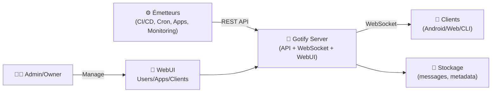
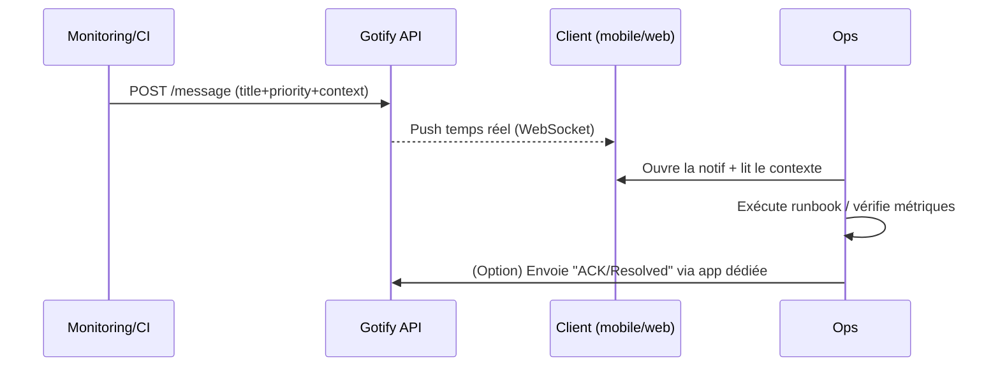

# 📣 Gotify — Présentation & Exploitation Premium (Notifications self-hosted)

### Push notifications en temps réel (WebSocket) + API REST + clients multi-plateformes
Optimisé pour reverse proxy existant • Tokens & apps • Fiable en production • Observabilité & rollback

---

## TL;DR

- **Gotify** est un service **self-hosted** pour **envoyer/recevoir des notifications** (temps réel via **WebSocket**) avec une **API REST**.
- Le modèle est simple et puissant :
  - **Applications** = émetteurs (peuvent envoyer)
  - **Clients** = récepteurs (peuvent lire/recevoir, pas envoyer)
  - **Users** = gèrent leurs apps/clients et l’historique des messages
- “Premium ops” = **tokens propres**, **catégories/priorités**, **anti-fuite de secrets**, **templates**, **tests**, **rollback**.

---

## ✅ Checklists

### Avant mise en service
- [ ] Définir les cas d’usage (monitoring, CI/CD, homelab, alerting applicatif)
- [ ] Définir la gouvernance : qui crée les apps, qui consomme, qui admin
- [ ] Définir la convention des messages (titre, priorité, tags)
- [ ] Choisir la stratégie tokens (rotation, scope, séparation par app)
- [ ] Valider la confidentialité (ne jamais envoyer de secrets en clair)

### Après mise en service
- [ ] Création d’au moins 2 apps (ex: `infra-alerts`, `ci-notify`)
- [ ] 1 client mobile + 1 client web testés
- [ ] Tests API (envoi OK, WS OK, filtres OK)
- [ ] Runbook “incident” (que vérifier, où regarder, quoi rollback)
- [ ] Politique de purge / rétention (si applicable) validée

---

> [!TIP]
> Gotify est excellent pour remplacer les “webhooks vers Slack/Discord” quand tu veux **garder la donnée chez toi** et **contrôler l’accès**.

> [!WARNING]
> Les messages peuvent contenir des infos sensibles (stack traces, URLs internes, IDs). Considère Gotify comme un **canal semi-sensible**.

> [!DANGER]
> Ne mets **jamais** de mots de passe, tokens, clés API, cookies ou liens de reset dans une notif.  
> Préfère : “incident #1234” + lien interne authentifié + détails côté logs.

---

# 1) Gotify — Vision moderne

Gotify n’est pas “juste une app mobile”.

C’est :
- 🧠 Un **bus de notification** simple (API REST)
- ⚡ Un **temps réel** fiable (WebSocket)
- 🧩 Un **connecteur universel** (scripts, cron, CI/CD, services)
- 🔐 Un système propre de **tokens** et séparation par émetteur

---

# 2) Architecture globale



---

# 3) Concepts clés (à maîtriser)

## 3.1 Applications (émetteurs)
- Une **application** représente un système qui envoie des messages.
- Elle possède un **token** dédié (à limiter et à pouvoir révoquer).

Bonnes pratiques :
- 1 app = 1 domaine fonctionnel (ex: `backup`, `uptime`, `deploy`)
- Tokens séparés par environnement (prod/staging) si nécessaire

## 3.2 Clients (récepteurs)
- Un **client** s’abonne et reçoit les notifications (WS).
- Exemple : app Android Gotify, ou un client web.

## 3.3 Priorité & sémantique
- Utilise une **priorité** cohérente (ex: 1=info, 5=warning, 10=critique)
- Standardise les titres :
  - `[PROD] API latency high`
  - `[CI] Build failed`
  - `[BACKUP] Snapshot OK`

---

# 4) Modèle de message premium (format & conventions)

## 4.1 Convention recommandée
- **Title** : court, triable, stable
- **Message** : contexte minimal + action + identifiant (runbook/inc)
- **Priority** : numérique (échelle interne)
- **Tags (dans le texte)** : `env=prod`, `app=api`, `team=core` (ou via structure si ton tooling le permet)

Exemple (lisible & actionnable) :
- Title: `[PROD][API] 5xx spike`
- Message:
  - `env=prod app=api route=/v1/orders`
  - `rate=12% over 5m`
  - `runbook=RUN-API-005`

> [!TIP]
> Le meilleur message est celui qui **déclenche une action** en 10 secondes, sans noyer l’opérateur.

---

# 5) Workflows premium (incident & exploitation)

## 5.1 Triage d’incident (séquence)


## 5.2 Patterns gagnants
- **Une app “ack”** : un script peut envoyer “résolu” (même canal)
- **Une app par outil** : `grafana`, `ci`, `backups`, `security`
- **Rotation tokens** : mensuelle/trimestrielle selon criticité

---

# 6) API & automatisation (exemples bash)

> Objectif : des appels simples, reproductibles, sans dépendances lourdes.

## 6.1 Envoyer une notification
```bash
# Variables
GOTIFY_URL="https://gotify.example.tld"
APP_TOKEN="REDACTED_TOKEN"

# Envoi
curl -sS \
  -X POST "$GOTIFY_URL/message?token=$APP_TOKEN" \
  -F "title=[PROD][API] Healthcheck failed" \
  -F "message=env=prod app=api endpoint=/health status=500 runbook=RUN-API-001" \
  -F "priority=10"
```

## 6.2 Envoyer depuis un script (exit code)
```bash
#!/usr/bin/env bash
set -euo pipefail

GOTIFY_URL="https://gotify.example.tld"
APP_TOKEN="REDACTED_TOKEN"

if ! curl -fsS https://api.example.tld/health >/dev/null; then
  curl -sS -X POST "$GOTIFY_URL/message?token=$APP_TOKEN" \
    -F "title=[PROD][API] Down" \
    -F "message=env=prod app=api check=health action=page_oncall" \
    -F "priority=10" >/dev/null
  exit 1
fi
```

> [!WARNING]
> Évite de mettre le token en clair dans l’historique shell.  
> Préfère variables d’environnement / secrets manager / fichiers avec permissions strictes.

---

# 7) Sécurité & hygiène (sans recettes reverse-proxy)

## 7.1 Tokens (règles simples)
- Un token **par application** (jamais partagé)
- Révocation immédiate si fuite suspectée
- Rotation planifiée (au minimum sur les apps “critique”)

## 7.2 Réduction des risques “contenu”
- Interdire secrets dans les messages (policy)
- Remplacer par identifiants : incident ID, trace ID, lien interne authentifié
- Pour les erreurs : **résumer** + “voir logs” plutôt que tout coller

## 7.3 Contrôle d’accès
- Gotify doit être derrière ton contrôle d’accès existant (SSO/ACL/VPN/forward-auth)
- Limiter qui peut créer des apps/tokens

---

# 8) Validation / Tests / Rollback

## 8.1 Tests de validation
```bash
# 1) Test envoi (doit créer une notif)
curl -sS -X POST "https://gotify.example.tld/message?token=REDACTED_TOKEN" \
  -F "title=[TEST] Gotify OK" \
  -F "message=smoke test" \
  -F "priority=1"

# 2) Test doc API (si accessible)
curl -I https://gotify.example.tld/api-docs | head
```

## 8.2 Rollback (principes)
- Si souci d’accès : revenir à la config “safe” (accès restreint, pas public)
- Si souci tokens : révoquer tokens récents, en régénérer, rebrancher les émetteurs
- Si bruit/alert fatigue : baisser priorités, regrouper messages, ajouter “rate limit” côté émetteurs

> [!TIP]
> Le rollback le plus rapide = **révoquer le token** de l’app fautive : tu coupes le spam instantanément.

---

# 9) Erreurs fréquentes (et corrections)

- ❌ “Trop de notifications” → regrouper, ajouter déduplication côté scripts, limiter fréquence
- ❌ “Messages non actionnables” → ajouter runbook/trace-id/route/env
- ❌ “Token leak” → rotation + stockage secret + revocation immédiate
- ❌ “Ops noyé” → priorité stricte + 1 canal critique + le reste en info

---

# 10) Sources (URLs) — à copier (et images Docker si besoin)

```bash
# Site & documentation
echo "https://gotify.net/"
echo "https://gotify.net/docs/"
echo "https://gotify.net/docs/config"
echo "https://gotify.net/api-docs"

# GitHub (org + serveur)
echo "https://github.com/gotify"
echo "https://github.com/gotify/server"

# Images Docker officielles Gotify
echo "https://hub.docker.com/r/gotify/server"
echo "https://hub.docker.com/r/gotify/server/tags"
echo "https://gotify.net/docs/install"   # mentionne aussi ghcr.io/gotify/server

# LinuxServer.io (statut)
echo "https://www.linuxserver.io/our-images"
echo "https://discourse.linuxserver.io/t/gotify-no-image/2084"
```

---