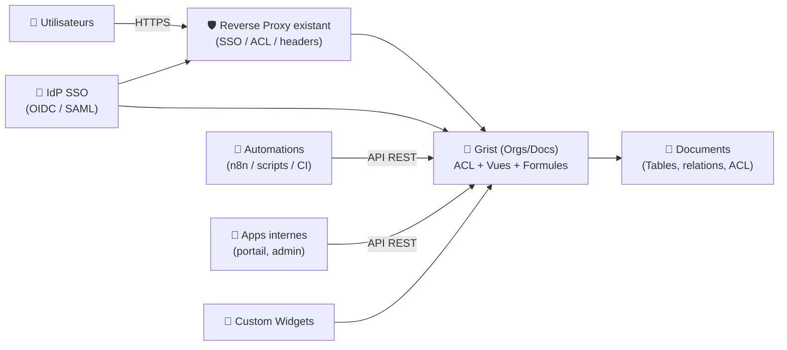
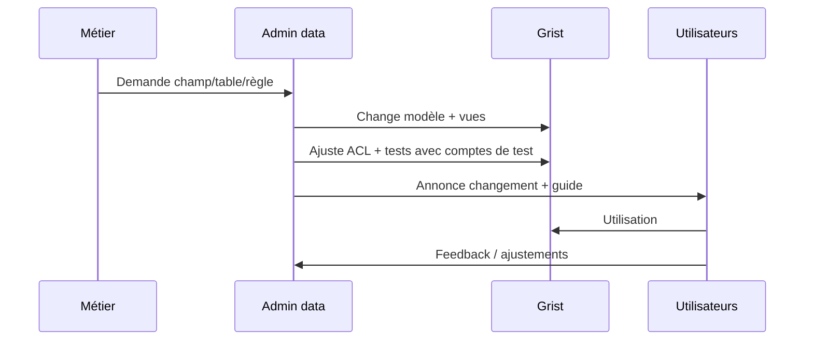

# 🧠 Grist — Présentation & Configuration Premium (Gouvernance + ACL + API + Intégrations)

### Le tableur relationnel qui se comporte comme une base de données, avec partage maîtrisé et automatisation
Optimisé pour reverse proxy existant • SSO (OIDC/SAML) • ACL fines • API REST • Widgets • Exploitation durable

---

## TL;DR

- **Grist** = “tableur relationnel” : tables liées, vues, formules, et **contrôle d’accès au niveau des lignes/colonnes**.
- Il sert autant de **base opérationnelle** (tickets, inventaires, CRM léger) que de **backend no-code** pour apps internes.
- Une config premium = **auth centralisée (OIDC/SAML)** + **ACL propres** + **conventions de données** + **API** + **validation/rollback**.

Docs officielles (self-managed, auth, API) : :contentReference[oaicite:0]{index=0}

---

## ✅ Checklists

### Avant mise en prod (préflight)
- [ ] Choisir le modèle d’orgas : 1 org unique vs multi-org (équipes)
- [ ] Définir l’auth : comptes locaux vs **SSO OIDC/SAML**
- [ ] Fixer conventions : tables, clés, “ID”, statuts, dates, référentiels
- [ ] Définir une stratégie ACL (rôles + règles “row-level”)
- [ ] Définir stratégie widgets (liste blanche) + provenance
- [ ] Définir politique d’exports (CSV, API) et données sensibles

### Après configuration (go-live)
- [ ] Test “utilisateur lecteur” : ne voit que ce qu’il doit
- [ ] Test “éditeur” : ne peut pas modifier hors périmètre
- [ ] Test API : token OK, endpoints clés OK
- [ ] Logs : pas de fuite d’infos sensibles, pas d’erreurs auth
- [ ] Procédure de rollback validée (auth/ACL)

---

> [!TIP]
> Le secret d’un Grist “qui tient” : **référentiels propres (tables de lookup)** + **ACL simples** + **vues dédiées** (lecture/édition/export).

> [!WARNING]
> Les ACL trop “créatives” deviennent ingérables. Garde des règles lisibles, versionnées, et testées avec des comptes de test.

> [!DANGER]
> Les formules peuvent être puissantes (et donc risquées). En self-managed, Grist recommande une stratégie de **sandbox** pour borner l’exécution des formules selon ton contexte. :contentReference[oaicite:1]{index=1}

---

# 1) Grist — Vision moderne

Grist n’est pas un simple tableur.

C’est :
- 🗃️ un **modèle relationnel** (tables + liens)
- 🔐 un moteur d’**ACL** (jusqu’au **niveau ligne/colonne**)
- 🧩 une plateforme d’**interfaces** (vues, formulaires, widgets)
- 🔗 un backend **API-first** pour automatisations et apps internes

Repo & présentation technique : :contentReference[oaicite:2]{index=2}

---

# 2) Architecture globale



SSO & Auth : :contentReference[oaicite:3]{index=3}  
API REST : :contentReference[oaicite:4]{index=4}

---

# 3) Concepts clés (pour parler Grist)

## 3.1 Orgs / Workspaces / Docs
- **Org** (site d’équipe / espace) : regroupement logique d’utilisateurs et documents
- **Workspace** : regroupement de documents
- **Doc** : le fichier “vivant” (tables, vues, ACL, etc.)

Terminologie API (“orgs”) : :contentReference[oaicite:5]{index=5}

## 3.2 Tables relationnelles (le vrai super-pouvoir)
- Tables de “faits” (ex: `Tickets`, `Commandes`, `Incidents`)
- Tables de “référentiels” (ex: `Statuts`, `Services`, `Priorités`)
- Colonnes de référence (liens) → cohérence, filtrage, contrôles

> [!TIP]
> “Premium data design” : 1) référentiels, 2) clés stables, 3) champs calculés, 4) vues par usage (édition vs lecture vs export).

---

# 4) ACL & Gouvernance (propre et testable)

## 4.1 Approche recommandée (simple)
- **Rôles** (lecture / édition / admin)
- **Vues** dédiées (ce que chaque rôle doit voir/éditer)
- **Règles** row-level pour limiter le périmètre (ex: “mes tickets”, “mon équipe”)

## 4.2 Patterns d’ACL utiles
- **Ownership** : une colonne `Owner` (référence vers users) → chacun voit ses lignes
- **Team scoping** : `Team` + appartenance → visibilité par équipe
- **Workflow** : `Status` verrouille certains champs selon état

> [!WARNING]
> Évite les ACL qui dépendent de 10 colonnes calculées. Préfère des colonnes “source de vérité” (Team, Owner, Confidential).

---

# 5) Authentification (SSO) & Gestion des comptes

Grist supporte des méthodes d’auth générales pour sécuriser l’accès : :contentReference[oaicite:6]{index=6}

## 5.1 OIDC (souvent le plus simple)
- Intégration avec un IdP (Keycloak, Authelia, Okta, etc.)
- Standard moderne, ergonomique

Doc OIDC : :contentReference[oaicite:7]{index=7}

## 5.2 SAML (souvent en environnements “enterprise”)
- Très courant en SI existants
- Requiert certificats/IdP config

Doc SAML : :contentReference[oaicite:8]{index=8}

## 5.3 SCIM (provisioning)
- Utile quand tu veux automatiser création/suppression/mises à jour des comptes
- Complémentaire au SSO (SSO ≠ provisioning)

Doc SCIM : :contentReference[oaicite:9]{index=9}

---

# 6) API REST (automatisation “premium”)

Grist fournit une API pour manipuler orgs/workspaces/docs/tables. :contentReference[oaicite:10]{index=10}

## 6.1 Auth API (Bearer)
```bash
# Exemple générique : remplace TOKEN, ORG, DOC_ID
TOKEN="GRIST_API_KEY"
BASE="https://grist.example.tld"

curl -sS \
  -H "Authorization: Bearer ${TOKEN}" \
  "${BASE}/api/orgs" | jq .
```

## 6.2 Lire des enregistrements (table)
```bash
TOKEN="GRIST_API_KEY"
BASE="https://grist.example.tld"
DOC="DOC_ID"
TABLE="Tickets"

curl -sS \
  -H "Authorization: Bearer ${TOKEN}" \
  "${BASE}/api/docs/${DOC}/tables/${TABLE}/records" | jq .
```

## 6.3 Ajouter un enregistrement
```bash
TOKEN="GRIST_API_KEY"
BASE="https://grist.example.tld"
DOC="DOC_ID"
TABLE="Tickets"

curl -sS -X POST \
  -H "Authorization: Bearer ${TOKEN}" \
  -H "Content-Type: application/json" \
  "${BASE}/api/docs/${DOC}/tables/${TABLE}/records" \
  -d '{
    "records": [
      { "fields": { "Title": "Incident 502", "Status": "New", "Priority": "P2" } }
    ]
  }' | jq .
```

> [!TIP]
> Pour des intégrations “pro” : mets un **compte technique** + token dédié + permissions minimales (doc/workspace spécifique).

---

# 7) Widgets & Extensions (puissance contrôlée)

Grist supporte des **custom widgets** (composants UI intégrés aux vues).
- Avantage : dashboards, visualisations, composants de saisie
- Risque : dépendances externes, sécurité, maintenabilité

Un exemple récent illustre l’importance des sources/widgets et des versions. :contentReference[oaicite:11]{index=11}

> [!WARNING]
> Gouvernance widgets : liste blanche, revue de code (si interne), documentation de la provenance, et environnement de test.

---

# 8) Workflows premium (collab + qualité)

## 8.1 Cycle “changement de modèle”


## 8.2 Pattern “vues par usage”
- **Vue édition** : champs nécessaires, validations, tri
- **Vue lecture** : propre, filtrée, exportable
- **Vue export/API** : stable, colonnes figées, utilisée par automatisations

---

# 9) Validation / Tests / Rollback

## 9.1 Tests fonctionnels (must-have)
```bash
# 1) Accès HTTP (réponse attendue)
curl -I https://grist.example.tld | head

# 2) Test API (orgs)
TOKEN="GRIST_API_KEY"
curl -sS -H "Authorization: Bearer ${TOKEN}" \
  "https://grist.example.tld/api/orgs" | jq '.[0] // .'
```

## 9.2 Tests ACL (scénarios)
- Compte “Reader” :
  - ✅ peut ouvrir doc
  - ❌ ne peut pas éditer
  - ✅ ne voit pas les lignes “Confidential”
- Compte “Team A Editor” :
  - ✅ édite Team A
  - ❌ n’édite pas Team B
- Compte “Service account API” :
  - ✅ endpoints nécessaires
  - ❌ pas de visibilité globale

## 9.3 Rollback (pratique)
- Rollback **ACL** : conserver une “version connue bonne” des règles (copie/documentation)
- Rollback **modèle** : restaurer structure (tables/colonnes) si changement cassant
- Rollback **widgets** : revenir à la source précédente / désactiver widget

> [!TIP]
> Évite les changements cassants en prod : teste dans un doc “staging”, puis reproduis.

---

# 10) Sources — Images Docker (officielles) + LinuxServer (si dispo)

Grist documente les images docker officielles utilisées en self-managed, dont :
- `gristlabs/grist` (Core + Enterprise packagé)
- `gristlabs/grist-oss` (uniquement OSS / Core)

Doc self-managed : :contentReference[oaicite:12]{index=12}  
Docker Hub (images) : :contentReference[oaicite:13]{index=13}

Concernant **LinuxServer.io (lscr.io/linuxserver/...)** :
- Je n’ai pas trouvé d’image **officielle** “Grist” listée côté docs LinuxServer via recherche documentaire (pas de page dédiée identifiée). :contentReference[oaicite:14]{index=14}

---

# 📌 Sources (URLs) — format demandé “en bash”

```bash
# Docs officielles Grist
https://support.getgrist.com/self-managed/
https://support.getgrist.com/install/authentication-overview/
https://support.getgrist.com/install/oidc/
https://support.getgrist.com/install/saml/
https://support.getgrist.com/install/scim/
https://support.getgrist.com/api/

# Repos / code
https://github.com/gristlabs/grist-core
https://github.com/gristlabs/grist-core/releases

# Images Docker officielles Grist (sources)
https://hub.docker.com/r/gristlabs/grist
https://hub.docker.com/r/gristlabs/grist-ee

# LinuxServer (vérification catalogue / docs)
https://www.linuxserver.io/our-images
```