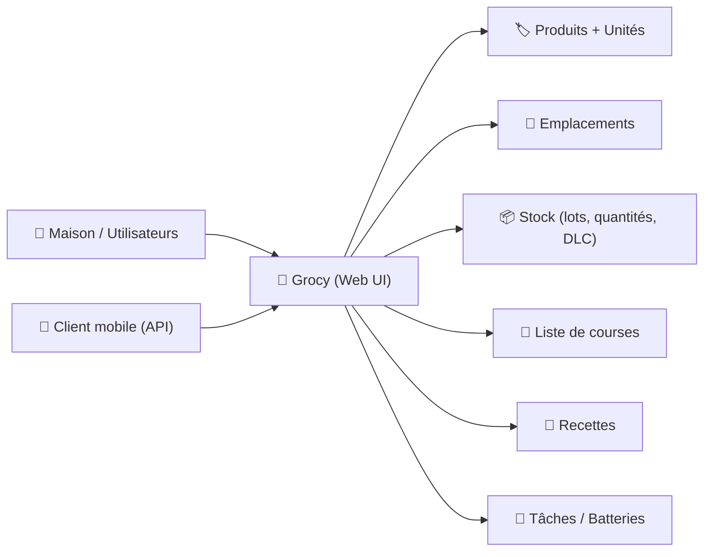

# 🥫 Grocy — Présentation & Usage Premium (ERP au-delà du frigo)

### Gestion “maison” des courses, stocks, DLC, recettes, tâches & inventaires
Optimisé pour reverse proxy existant • Gouvernance familiale • Barcode-friendly • Exploitation durable

---

## TL;DR

- **Grocy** = application web auto-hébergeable pour gérer **stocks**, **achats**, **DLC/DLUO**, **recettes**, **tâches**, **inventaire**, **batteries**, etc.
- La valeur “premium” vient d’une **modélisation propre** (unités, emplacements, produits), d’un **workflow** (purchase → stock → consumption) et d’une **discipline** (barcode + règles).
- Objectif : **moins de gaspillage**, **achats plus simples**, **inventaire fiable**, **habitudes durables**.

---

## ✅ Checklists

### Pré-usage (avant d’onboard la maison)
- [ ] Définir les **zones** (cuisine, cellier, congélateur, garage…)
- [ ] Fixer 1 convention simple : **barcodes** + **unité par défaut** par produit
- [ ] Décider la stratégie DLC : “toujours” vs “quand pertinent”
- [ ] Créer 10–20 produits “socle” (ceux qui tournent tout le temps)
- [ ] Définir une règle de saisie : “on scanne à l’entrée, on consomme à la sortie”

### Post-config (stabilité opérationnelle)
- [ ] Un achat test → stock → consommation fonctionne sans friction
- [ ] Une alerte DLC s’affiche correctement
- [ ] Les emplacements et quantités sont cohérents après 1 semaine
- [ ] Un runbook “quoi faire quand ça diverge” existe (réconciliation simple)

---

> [!TIP]
> Le secret d’un Grocy qui marche : **friction minimale**.  
> Si ajouter un article prend 30 secondes, personne ne l’utilise. Vise 5–10 secondes (scan + quantité).

> [!WARNING]
> Le piège #1 : vouloir tout modéliser dès le jour 1 (recettes, macros, batteries, tâches, inventaire complet).  
> Commence par **Stock + Achats + DLC** puis ajoute le reste.

> [!DANGER]
> Si tu laisses des doublons produits (même article avec 3 noms), ton inventaire devient faux.  
> Une petite gouvernance au début évite le chaos.

---

# 1) Grocy — Vision moderne

Grocy n’est pas une simple “liste de courses”.

C’est :
- 🧾 Un **moteur d’achats** (liste, planification, magasins)
- 📦 Un **inventaire** (stocks, emplacements, quantités, lots)
- ⏳ Un **système DLC/DLUO** (alertes, rotation)
- 🍲 Un **assistant cuisine** (recettes, ingrédients, quantités)
- 🧹 Un **gestionnaire du quotidien** (tâches, batteries, ménager)

Site & projet : voir “ERP beyond your fridge”.  

---

# 2) Architecture globale (fonctionnelle)



---

# 3) Le “modèle mental” premium (ce qui fait réussir)

## 3.1 Les 4 objets qui comptent
1. **Produit** (nom + catégorie + unité par défaut)
2. **Emplacement** (où ça vit)
3. **Stock** (combien + quel lot + quelle DLC)
4. **Flux** (purchase → stock → consume)

## 3.2 Règles simples (qui évitent 90% des problèmes)
- 1 produit = 1 nom stable (pas “Lait”, “Lait 1L”, “Lait demi-écrémé” partout)
- 1 unité par défaut (ex: pièce, g, ml, pack)
- Emplacements limités (3–6 max) au début
- DLC : obligatoire pour périssables, optionnel pour le reste

---

# 4) Workflow premium (usage quotidien)

## 4.1 Entrée (Achats → Stock)
- Scanne (barcode) ou recherche produit
- Saisis quantité + emplacement
- Mets une DLC quand pertinent
- Option : associe à un magasin / prix (si tu veux du reporting)

## 4.2 Sortie (Consommation)
- Consomme “à la sortie” (cuisiner/ouvrir/finir)
- Laisse Grocy gérer les lots (FIFO) si activé

## 4.3 Rotation / anti-gaspillage
- Consulte l’écran “DLC à venir”
- Remonte en priorité ce qui expire bientôt
- “Recettes” : transforme le stock en idées

---

# 5) Barcodes (l’accélérateur d’adoption)

## Pourquoi c’est crucial
- 📌 Réduction de friction
- 🧠 Moins d’erreurs de saisie
- ⚡ Onboard famille/colocs beaucoup plus facilement

## Stratégie recommandée
- Barcode = clé unique par produit “du quotidien”
- Mets d’abord :
  - lait, œufs, pâtes, riz, farine
  - conserves, boissons, céréales
  - surgelés récurrents

> [!TIP]
> Si tu utilises un client mobile avec scan, tu transformes Grocy en “caisse rapide” pour le foyer.

---

# 6) DLC / DLUO (config “premium réaliste”)

## Stratégie “suffisante”
- Périssables : DLC obligatoire
- Produits secs : DLUO optionnelle (ou non renseignée)
- Congélateur : DLC utile si tu veux une rotation stricte

## Routine hebdomadaire (5 minutes)
- Ouvre la vue “DLC”
- Planifie 2–3 repas autour des urgences
- Ajuste stock si divergences

> [!WARNING]
> Si tu mets des DLC partout, tu vas te lasser. Mets-les où ça a un impact.

---

# 7) Recettes (option premium, mais à introduire au bon moment)

## Approche “pragmatique”
- Commence par 10 recettes “pilier”
- Lie-les à des ingrédients “stockables”
- Utilise Grocy pour convertir recette → liste de courses

---

# 8) Gouvernance multi-utilisateurs (famille/colocs)

## Modèle simple
- 1–2 “maintainers” (création produits, nettoyage doublons)
- Tous les autres : scan + entrée/sortie

## Conventions de nommage (qui changent tout)
- Produits : `Marque – Produit – Variante` (si nécessaire)
- Emplacements : `Cuisine`, `Cellier`, `Congélateur`, `Salle de bain`
- Catégories : 10–15 max au début

---

# 9) Observabilité & exploitation (sans lourdeur)

## “Savoir quand ça déraille”
Signaux d’alerte :
- Stock négatif / incohérent
- Doublons produits
- Achats non “stockés”
- DLC ignorées

## Routine mensuelle (10–15 min)
- Nettoyage doublons
- Ajustement unités par défaut
- Vérification emplacements
- Export (si tu fais des backups réguliers)

---

# 10) Validation / Tests / Rollback

## Tests fonctionnels (scénarios)
```bash
# Scénario 1 : Produit -> Achat -> Stock -> Consommation
# - créer/choisir un produit
# - enregistrer un achat
# - ajouter au stock (emplacement + quantité + DLC)
# - consommer 1 unité
# Attendu : stock décrémente, pas d'erreur, DLC visible si proche.
```

```bash
# Scénario 2 : Barcode
# - associer un code-barres à un produit
# - scanner via client mobile (ou saisie)
# Attendu : produit reconnu immédiatement.
```

```bash
# Scénario 3 : Réconciliation
# - ajuster stock d'un produit (inventaire réel)
# Attendu : correction enregistrée, historique cohérent.
```

## Rollback (concept opérationnel)
- Si une config de workflow ou une convention casse l’adoption :
  - revenir au **minimum** : Stock + Achats + DLC
  - supprimer les champs “non utilisés” (complexité)
  - nettoyer doublons puis relancer sur 10 produits pilier

> [!TIP]
> Un rollback “usage” vaut souvent mieux qu’un rollback technique : simplifier l’expérience ramène les utilisateurs.

---

# 11) Sources (URLs en bash, comme demandé)

```bash
# Projet / docs / démo
https://grocy.info/
https://github.com/grocy/grocy
https://en.demo.grocy.info/
https://github.com/grocy/docs

# Client Android (optionnel)
https://f-droid.org/en/packages/xyz.zedler.patrick.grocy/
https://play.google.com/store/apps/details?id=xyz.zedler.patrick.grocy

# Images Docker (sources officielles / communautaires)
# LinuxServer.io (très utilisé dans l'écosystème self-hosted)
https://docs.linuxserver.io/images/docker-grocy/
https://hub.docker.com/r/linuxserver/grocy
https://hub.docker.com/r/linuxserver/grocy/tags

# Note : le repo "grocy-docker" historique est archivé (référence)
https://github.com/grocy/grocy-docker

# Alternative communautaire
https://hub.docker.com/r/bbx0/grocy
```