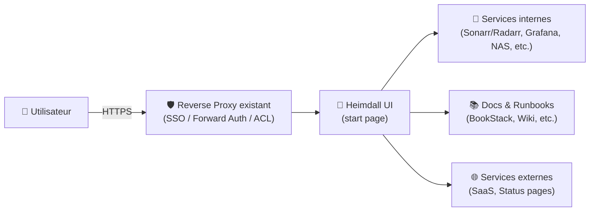
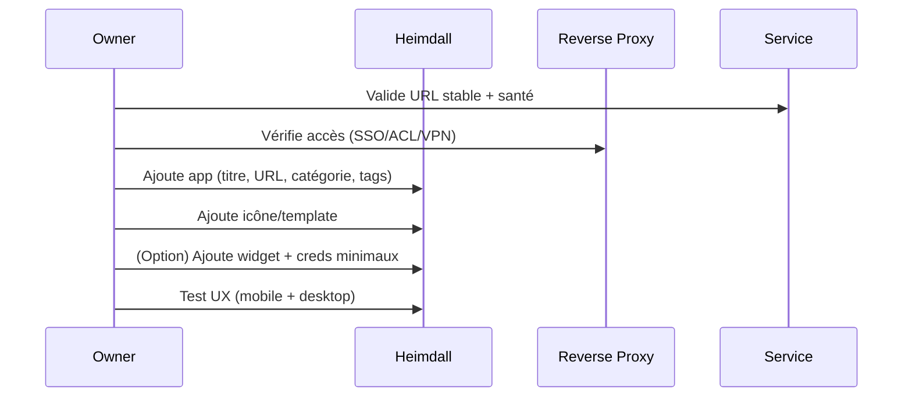

# 🧭 Heimdall — Présentation & Configuration Premium (Dashboard d’applications)

### Portail “start page” élégant : liens, widgets, recherche intégrée, gouvernance par tags
Optimisé pour reverse proxy existant • Organisation durable • UX rapide • Exploitation propre

---

## TL;DR

- **Heimdall** est un **dashboard** pour centraliser tes services (self-hosted, SaaS, docs, infra).
- Valeur : **navigation instantanée**, **catégories**, **recherche**, et (selon apps) **widgets**.
- En “premium” : conventions de nommage, structuration (teams/env), templates d’apps, règles d’accès, tests & rollback.

---

## ✅ Checklists

### Pré-usage (avant d’ouvrir à une équipe)
- [ ] Convention de catégories (Infra / Media / Dev / Docs / Admin)
- [ ] Convention de labels/tags (env=prod|staging, team=core|home, tier=critical)
- [ ] Règles de “qualité de lien” (HTTPS, favicon, nom court, description utile)
- [ ] Source d’icônes/templates décidée (apps intégrées + templates)
- [ ] Stratégie d’accès (SSO/forward-auth/VPN) via ton reverse proxy existant

### Post-configuration (qualité UX)
- [ ] Les apps critiques sont accessibles en < 2 clics
- [ ] Les catégories ne se chevauchent pas (pas de “fourre-tout”)
- [ ] Une page “Runbook” existe : comment ajouter une app, corriger un widget, standardiser une icône
- [ ] Export/sauvegarde de la config validé (backup + restauration testée)
- [ ] Un plan de rollback est documenté

---

> [!TIP]
> Heimdall marche mieux si tu le traites comme un **produit** : conventions, cohérence visuelle, et “UX first”.

> [!WARNING]
> Les widgets peuvent nécessiter des accès/API vers tes services : garde ça **interne** et limite l’exposition.

> [!DANGER]
> Ne confonds pas “dashboard” et “sécurité” : Heimdall ne remplace pas ton contrôle d’accès. Protège l’accès via ton reverse proxy existant.

---

# 1) Heimdall — Vision moderne

Heimdall n’est pas juste une page de favoris.

C’est :
- 🧠 Un **catalogue** de services
- 🧭 Une **surface de navigation** stable (onboarding, ops, famille/équipe)
- 🧩 Un **hub d’applications** (templates, icônes, widgets)
- 🔎 Un **point d’entrée** (start page navigateur)

---

# 2) Architecture globale



---

# 3) Philosophie premium (5 piliers)

1. 🧱 **Structure** : catégories nettes, pas de doublons
2. 🏷️ **Gouvernance** : tags/labels (env/team/tier)
3. 🎛️ **Templates** : cohérence des apps + icônes
4. ⚡ **Performance UX** : noms courts, descriptions utiles, tri logique
5. 🧪 **Exploitation** : validation, sauvegarde, rollback, hygiene régulière

---

# 4) Design de l’information (structure qui tient dans le temps)

## Catégories recommandées (exemple)
- 🛡️ Admin (reverse proxy, auth, DNS, backups)
- 📈 Observabilité (Grafana, Prometheus, Uptime Kuma, logs)
- 🧱 Infra (Proxmox, NAS, Docker, CI/CD)
- 📚 Documentation (BookStack, runbooks, inventaires)
- 🎬 Media (Plex/Jellyfin, *arr stack)
- 🧑‍💻 Dev (Git, registry, pipelines, secrets)
- 🌐 Externe (status pages, SaaS)

## Convention de nommage (rapide et lisible)
- Titre : `Produit` (ex: “Grafana”, “Plex”, “BookStack”)
- Sous-titre : `Rôle + environnement` (ex: “Observabilité — prod”)
- URL : HTTPS dès que possible
- Description : 1 phrase actionnable (“Dashboards infra + alertes”)

> [!TIP]
> Mets les liens “break-glass” (accès urgence) dans **Admin** avec un badge “CRIT”.

---

# 5) Apps, Templates & Widgets (ce qui fait la différence)

## Stratégie premium “templates-first”
1. Cherche si l’app existe déjà (template officiel)
2. Si non : crée une app custom mais respecte :
   - icône carrée (fond transparent si possible)
   - titre court
   - URL stable
   - description utile
3. Documente “comment ajouter une app” dans ta doc interne

## Widgets (bon usage)
- ✅ Widgets pour services où l’info live a du sens (ex: monitoring, uptime, download clients)
- ❌ Évite les widgets partout : ça alourdit l’UX et augmente la surface “API/credentials”

> [!WARNING]
> Si un widget nécessite un token/API, privilégie des scopes minimaux et garde l’accès strictement contrôlé.

---

# 6) Workflows premium (onboarding & ops)

## 6.1 Onboarding d’un nouveau service


## 6.2 Triage incident “navigation”
- Si une app ne répond pas :
  - vérifier URL (base path, domaine)
  - vérifier reverse proxy (route/ACL)
  - vérifier service (health)
- Objectif : Heimdall reste une **boussole**, pas un point de panne

---

# 7) Exploitation : validation / tests / rollback

## Tests rapides (smoke)
```bash
# 1) Heimdall répond (depuis ton réseau)
curl -I https://heimdall.example.tld | head

# 2) Vérifie qu’un lien critique est joignable
curl -I https://grafana.example.tld | head

# 3) Vérifie une URL interne (si applicable)
curl -I http://service-interne:port | head
```

## Tests fonctionnels (manuel, 2 minutes)
- recherche Heimdall : trouver “Grafana” en tapant “gra”
- navigation : catégorie Observabilité → ouvrir 3 apps
- mobile : vérifier lisibilité + clics

## Rollback (principe)
- restaurer la config Heimdall depuis le dernier backup/export
- revenir aux icônes/templates précédents si régression UX
- si un widget casse l’expérience : le désactiver et documenter la raison

> [!TIP]
> Fais un “snapshot config” avant toute grosse refonte (catégories/tags/widgets).

---

# 8) Erreurs fréquentes (et fixes)

- ❌ Catégories “fourre-tout” → ✅ limiter à 6–8 catégories max, sinon sous-catégories via tags
- ❌ Noms trop longs → ✅ titre court + description
- ❌ Icônes incohérentes → ✅ source unique (templates/app store) + format standard
- ❌ Widgets partout → ✅ widgets uniquement là où l’info live est utile
- ❌ Accès non contrôlé → ✅ protéger via reverse proxy existant (SSO/VPN/ACL)

---

# ✅ Conclusion

Heimdall devient une **porte d’entrée** fiable quand tu appliques :
- une structure simple,
- des conventions cohérentes,
- des templates propres,
- et une exploitation sérieuse (tests + sauvegarde + rollback).

---

# 🔗 Sources (adresses) — en bash comme demandé

```bash
# Site officiel Heimdall
https://heimdall.site/

# Référence images & documentation LinuxServer.io (image Heimdall)
https://docs.linuxserver.io/images/docker-heimdall/
https://hub.docker.com/r/linuxserver/heimdall
https://hub.docker.com/r/linuxserver/heimdall/tags

# Repo LinuxServer (implémentation Heimdall + packaging)
https://github.com/linuxserver/Heimdall

# Templates / Apps (catalogue d'applications Heimdall)
https://apps.heimdall.site/
https://github.com/linuxserver/Heimdall-Apps
```