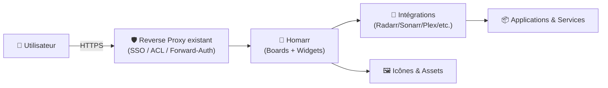
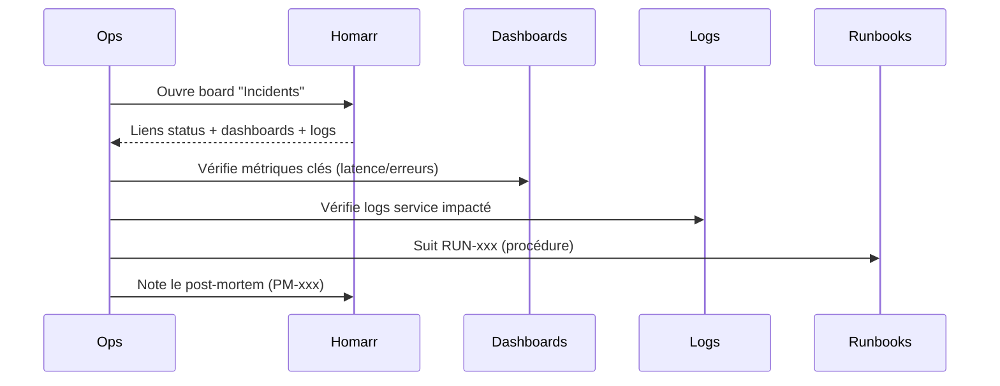

# 🧭 Homarr — Présentation & Configuration Premium (Dashboard “command center”)

### Portail unifié pour tes services : widgets, intégrations, contrôle, et vues par équipe
Optimisé pour reverse proxy existant • Drag & Drop • Auth intégrée • +10k icônes • 30+ intégrations

---

## TL;DR

- **Homarr** = un **dashboard moderne** pour centraliser tes apps/services avec **widgets** et **intégrations**.
- Objectif “premium” : **boards propres**, **naming/labels**, **intégrations minimalistes mais fiables**, **droits & accès** (selon ton modèle), **validation + rollback**.
- Homarr n’est pas un système de logs/metrics : c’est un **cockpit** (navigation + actions + vues).

---

## ✅ Checklists

### Pré-configuration (qualité)
- [ ] Définir la structure : 1 board global + boards par équipe (ou par environnement)
- [ ] Définir une convention de naming (apps, widgets, sections)
- [ ] Lister les intégrations réellement utiles (éviter la “collection”)
- [ ] Décider du modèle d’accès : admin / utilisateurs / lecture seule (selon ton org)
- [ ] Définir ce qui est “critique” (prod) vs “confort” (nice-to-have)

### Post-configuration (validation)
- [ ] Un nouvel arrivant trouve 90% des infos en < 30 secondes
- [ ] Un incident “prod” : accès direct aux dashboards, status, logs, runbooks
- [ ] Les widgets affichent des données cohérentes (pas de faux positifs)
- [ ] Les intégrations sensibles (tokens/API) sont gérées proprement (rotation/documentation)
- [ ] Plan de rollback documenté (restaurer config / revenir en arrière sur une modif)

---

> [!TIP]
> Le meilleur Homarr, c’est celui qui **réduit le temps de décision** : “où cliquer”, “quoi vérifier”, “qui alerter”, “quelle procédure”.

> [!WARNING]
> Trop de widgets tue la lisibilité. Vise un **dashboard actionnable**, pas une vitrine.

> [!DANGER]
> Les intégrations utilisent souvent des **tokens/API keys**. Traite Homarr comme une **surface sensible** (mêmes exigences que tes outils d’admin).

---

# 1) Homarr — Vision moderne

Homarr, c’est :
- 🧱 Un **hub** (accès rapide à tes apps)
- 🧩 Un **agrégateur d’infos** (versions, statuts, compteurs, médias, etc.)
- 🕹️ Un **centre de contrôle** via widgets/intégrations (selon apps)
- 🎨 Une **UI “drag & drop”** (pas besoin de YAML pour la base)

Principes mis en avant par la doc :
- Drag & drop, pas de config YAML obligatoire
- Beaucoup d’icônes intégrées
- Intégrations “first-class”
- Auth “out of the box”

---

# 2) Architecture globale



---

# 3) Philosophie de configuration Premium (5 piliers)

1. 🧭 **Information architecture** (boards/sections lisibles)
2. 🧩 **Intégrations utiles** (moins, mais fiables)
3. 🧠 **Design orienté action** (SLO, incidents, routine)
4. 🔐 **Accès maîtrisé** (auth + séparation)
5. 🧪 **Validation & rollback** (tests rapides, retour arrière clair)

---

# 4) Organisation des boards (méthode qui tient dans le temps)

## Modèle recommandé (simple & scalable)
- **Board “Ops / Global”** : tout ce qui est transversal
- **Board par équipe** : “Core”, “Media”, “Data”, “Support”
- **Board par environnement** (option) : “Prod”, “Staging”, “Lab”

## Sections “premium” (ordre de lecture)
1. **Incidents / Santé**
   - Status page, uptime, alerting, dashboards
2. **Services critiques**
   - Reverse proxy, auth, DNS, DB, stockage
3. **Pipelines & Automations**
   - CI/CD, backups, jobs, scheduled tasks
4. **Médias / Apps**
   - Arr stack, media servers, download clients
5. **Docs**
   - BookStack, runbooks, post-mortems

> [!TIP]
> Si tu ne sais pas où mettre un widget : il ne doit probablement pas exister.

---

# 5) Widgets & Intégrations (le “cœur” Homarr)

## Intégrations : règle d’or
- Une intégration = une source de données/action
- Tu la crées une fois, puis tu l’utilises dans les widgets compatibles

Homarr explique la gestion des intégrations (création, champs requis, etc.).  
Certaines pages doc détaillent aussi l’ajout d’intégrations dans les widgets.

### Stratégie premium
- **Commence** par 3–5 intégrations clés (pas 30)
- **Valide** la fiabilité (latence, quotas, tokens)
- **Documente** : où est le token, qui le rotate, fréquence

## Widgets : ce qui marche vraiment bien
- “Status / Health” (si tu as une source)
- “Releases / Updates” (pour suivre versions)
- Widgets “apps” (Radarr/Sonarr/Plex etc. selon besoins)
- Liens rapides (runbooks, dashboards, consoles)

> [!WARNING]
> Les widgets qui font des appels externes en boucle peuvent dégrader l’UX (latence, timeouts). Garde un œil sur le “bruit”.

---

# 6) Auth & Gouvernance d’accès (sans recette proxy)

Homarr met en avant l’**authentification intégrée**.  
En entreprise/homelab sérieux, on combine souvent :
- auth Homarr (simple)
- OU auth via reverse proxy existant (SSO/forward-auth)
- OU accès restreint réseau (VPN/LAN)

## Politique d’accès recommandée
- **Admin** : configure boards & intégrations
- **Editor** : modifie widgets/sections selon périmètre
- **Viewer** : lecture seule (si ton modèle le permet)

> [!TIP]
> Si tu exposes Homarr à d’autres personnes : préfère un modèle “Viewer par défaut” + “Editors limités”.

---

# 7) Design “ops-ready” (ce qui aide vraiment en prod)

## 7.1 Mode routine (check quotidien)
- “Tout est vert ?”
- “Backups OK ?”
- “Mises à jour critiques ?”
- “Stockage / DB : signaux faibles ?”

## 7.2 Mode incident (triage)


> [!TIP]
> Ajoute des liens “**RUN-xxx**” et “**PM-xxx**” directement dans Homarr : ton cockpit devient actionnable.

---

# 8) Validation / Tests / Rollback

## Validation (smoke tests)
- [ ] Les boards chargent rapidement
- [ ] Les intégrations clés répondent (pas de timeout)
- [ ] Les widgets affichent des données plausibles
- [ ] Les liens “incident” sont corrects (dashboards/logs/runbooks)

Exemples de tests simples (si tu veux vérifier l’accès HTTP) :
```bash
# Remplace par ton URL
curl -I https://homarr.example.tld | head
```

## Rollback (retour arrière “propre”)
- Sauvegarder/exporter la configuration (ou snapshot du volume de data selon ton mode)
- Revenir à une version précédente (si upgrade a cassé l’UI)
- Restaurer l’état “stable” et documenter l’incident (PM)

> [!WARNING]
> Le rollback doit être **plus simple** que le fix sous stress.

---

# 9) Erreurs fréquentes (et comment les éviter)

- ❌ “Board surchargé” → sections trop nombreuses, widgets redondants  
  ✅ Fix : 1 écran = 1 intention (incident / routine / navigation)

- ❌ “Intégrations partout” → tokens non gérés, widgets cassés  
  ✅ Fix : whitelist d’intégrations + doc + rotation

- ❌ “Tout le monde admin” → chaos et dérive du cockpit  
  ✅ Fix : rôle editor limité + conventions

- ❌ “Widgets lents” → UX pénible  
  ✅ Fix : réduire widgets lourds, limiter appels externes, grouper l’essentiel

---

# 10) Sources & Images Docker (URLs en bash)

```bash
# --- Homarr : docs & repo officiels ---
echo "Homarr (site/doc)        : https://homarr.dev/"
echo "Homarr docs - Integrations: https://homarr.dev/docs/management/integrations/"
echo "Homarr docs - Widgets     : https://homarr.dev/docs/category/widgets/"
echo "Homarr repo GitHub        : https://github.com/homarr-labs/homarr"

# --- Image officielle Homarr (référencée par la doc) ---
echo "Image officielle (GHCR)   : ghcr.io/homarr-labs/homarr:latest"
echo "Doc Docker (référence image): https://homarr.dev/docs/getting-started/installation/docker/"

# --- Ancien dépôt/ancienne ère Homarr (historique) ---
echo "Ancien repo (ajnart)      : https://github.com/ajnart/homarr"
echo "Note Docker Hub ancien (ajnart): https://hub.docker.com/r/ajnart/homarr"

# --- Docker Hub (homarr/homarr) : existe mais peut être historique/ancien selon périodes ---
echo "Docker Hub (homarr/homarr): https://hub.docker.com/r/homarr/homarr"

# --- LinuxServer.io (LSIO) : vérifier la présence d'une image Homarr ---
echo "Catalogue images LSIO     : https://www.linuxserver.io/our-images"
echo "Note: aucune image Homarr LSIO n'est explicitement listée dans le catalogue au moment de la rédaction."
```

---

# ✅ Conclusion

Homarr devient un **poste de pilotage** :
- 🧭 navigation instantanée
- 🧩 intégrations utiles (pas décoratives)
- 🔐 accès maîtrisé
- 🧪 validation + rollback

Un Homarr premium ne “montre” pas ton homelab : il **fait gagner du temps**.