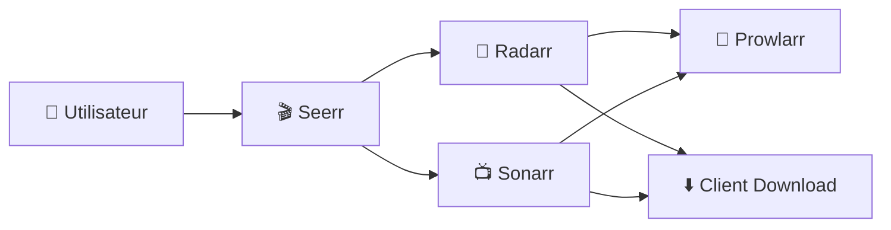

# 🎬 Applications Média

> Cette catégorie regroupe l’ensemble des applications dédiées à la gestion, l’automatisation et la distribution de contenu multimédia.

---

## 🧠 Objectif

Les applications Média permettent :

- 📥 La gestion des téléchargements automatisés
- 🔎 L’indexation intelligente des contenus
- 🎞 La gestion des films et séries
- 👥 La gestion des demandes utilisateurs
- 🔄 L’automatisation complète du flux média

Elles fonctionnent généralement ensemble au sein d’un écosystème cohérent.

---

## 🏗 Architecture Type

---

## 📦 Applications Disponibles

### 🎥 Radarr
Gestion automatisée des films.

### 📺 Sonarr
Gestion automatisée des séries.

### 🔎 Prowlarr
Centralisation des indexeurs.

### 🎬 Seerr
Gestion des demandes utilisateurs.

---

## 🔗 Intégration

Ces applications s’intègrent avec :

- 📥 Téléchargement (qBittorrent, RdtClient)
- 🔐 Sécurité (Authelia, CrowdSec)
- 🌐 Reverse Proxy (Traefik)

---

# 🎯 Résumé

La catégorie Média constitue le cœur de l’écosystème SSDv2.

Elle permet une automatisation complète, contrôlée et évolutive de la gestion multimédia.