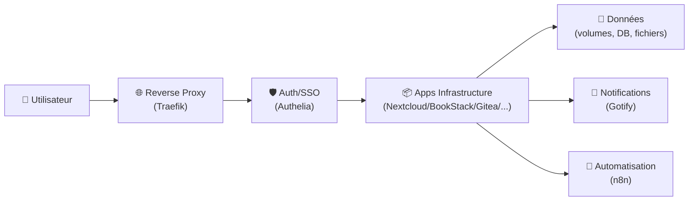

# 📦 Applications Infrastructure

> Cette catégorie regroupe l’ensemble des applications “socle” qui construisent ton environnement SSDv2 : services internes, plateformes web, stockage, collaboration, automatisation, outils d’administration et de productivité.

---

## 🧠 Objectif

Les applications Infrastructure permettent :

- 🗄️ L’hébergement de services essentiels (cloud, mails, fichiers, DB, etc.)
- 👥 La collaboration (wiki, chat, CRM, gestion de projets)
- 📁 La gestion documentaire & stockage (Nextcloud, Paperless, Seafile…)
- 🧰 L’administration & l’accès (Portainer, Webtop, Guacamole…)
- 🔔 Les notifications & automatisations (Gotify, n8n…)
- 🌐 La publication web (WordPress, PrestaShop…)
- 🧱 La “colonne vertébrale” sur laquelle s’appuie l’écosystème Média/Téléchargement

Elles forment généralement un ensemble cohérent : **services + données + accès + gouvernance**.

---

## 🏗 Architecture Type

---

## 📦 Applications Disponibles

### ☁️ Nextcloud
Cloud personnel : fichiers, calendrier, contacts, partage, extensions.

### 📚 BookStack
Documentation structurée “books-first” (runbooks, procédures, KB).

### 🧾 Paperless
Dématérialisation : ingestion, OCR, classement et recherche documentaire.

### 🗂 Seafile
Stockage/synchronisation orienté performance et bibliothèques.

### 🧑‍💻 Gitea / GitLab
Forge Git : dépôts, issues, CI/CD (selon besoin et ressources).

### 🧰 Portainer / Yacht
Administration Docker : gestion, stacks, logs, ressources (selon préférence).

### 🧭 Homepage / Heimdall / Homarr / Organizr / Fenrus
Dashboards & portails pour centraliser l’accès à tes services.

### 🔔 Gotify
Notifications internes (push) pour alertes, automatisations, monitoring.

### 🔄 n8n
Automatisation / workflows : webhooks, intégrations, orchestration.

### 🧑‍🤝‍🧑 Mattermost
Messagerie d’équipe (alternative self-hosted type Slack).

### 🧾 Vikunja
Gestion de tâches / projets (to-do, kanban) simple et efficace.

### 🧾 NocoDB / Baserow / Grist
“Bases de données no-code” (tableur + API + vues) pour internal tools.

### 🌍 WordPress / PrestaShop
Publication web / e-commerce self-hosted.

### 🧩 Baïkal
CalDAV/CardDAV (agenda/contacts) léger, idéal pour besoins simples.

### 🧰 Filebrowser / CloudCmd / AutoIndex
Exploration/gestion de fichiers via web (selon usage).

### 🔁 Syncthing
Synchronisation P2P fiable entre machines (réplication, offsite, etc.).

### 🧊 Webtop
Bureau Linux dans le navigateur (outil d’accès “couteau suisse”).

### 🔗 Firefox Sync Server
Synchronisation Firefox (bookmarks, tabs) en self-hosted.

### 🧠 Grocy
Gestion maison (stocks, courses, recettes, inventaire), très complet.

### 🗃 Duplicati
Sauvegardes chiffrées vers cibles multiples (S3, WebDAV, etc.).

### 📡 Jitsi
Visioconférence self-hosted (selon ressources serveur).

### 🧪 Autres (selon ton stack)
Linkding, Mango, Microbin, Shaarli, Piwigo, TT-RSS, The Lounge, Pure-FTPd, etc.

---

## 🔗 Intégration

Ces applications s’intègrent avec :

- 🌐 Reverse Proxy : Traefik (routage HTTPS, subdomains, middlewares)
- 🔐 Sécurité : Authelia (SSO), CrowdSec (protection), Vaultwarden (secrets)
- 📥 Téléchargement : stockage “downloads” + services de gestion
- 🎬 Média : bibliothèques, metadata, accès utilisateurs
- 📊 Monitoring : Dozzle/Netdata/Plausible, alerting via Gotify
- 🔄 Automatisation : n8n (webhooks, intégrations, notifications)

---

# 🎯 Résumé

La catégorie Infrastructure est le **socle** de SSDv2.

Elle assure :
- la disponibilité des services,
- la persistance des données,
- la collaboration et la documentation,
- et l’administration quotidienne.

Bien structurée, elle rend l’écosystème **stable, gouvernable et évolutif**.