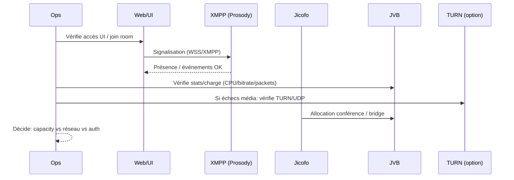

# 🎥 Jitsi Meet — Présentation & Exploitation Premium (Architecture • Sécurité • Qualité • Ops)

### Visioconférence open-source : souveraineté, extensibilité, contrôle d’accès
Optimisé pour reverse proxy existant • Auth (Secure Domain / JWT) • Scaling (JVB/OCTO) • Exploitation durable

---

## TL;DR

- **Jitsi Meet** = stack de visioconférence open-source basée sur **WebRTC**.
- Cœur technique : **Web UI** + **XMPP (Prosody)** + **Focus (Jicofo)** + **Media (Jitsi Videobridge / JVB)**.
- “Premium ops” = **contrôle d’accès**, **protection des salons**, **règles réseau WebRTC**, **observabilité**, **tests** + **rollback**.

---

## ✅ Checklists

### Pré-prod (avant d’ouvrir à des utilisateurs)
- [ ] Domaine & certificats OK (HTTPS côté reverse proxy existant)
- [ ] STUN/TURN défini si clients derrière NAT strict / mobile / enterprise
- [ ] Ports WebRTC validés (UDP principalement) + QoS si possible
- [ ] Stratégie d’accès : **Secure Domain** ou **JWT** (ou les deux)
- [ ] Politique de salons : lobby, mots de passe, modération, participants max
- [ ] Politique d’enregistrements (Jibri) si nécessaire + stockage + rétention

### Post-go-live (qualité & sécurité)
- [ ] Test appel 1–1 + 1–N (audio/vidéo/screen share)
- [ ] Test derrière 4G/5G + Wi-Fi + réseau “corporate”
- [ ] Vérif : pas de création de salon non autorisée (si Secure Domain/JWT activé)
- [ ] Logs & métriques consultables (JVB stats, erreurs XMPP, latence)
- [ ] Runbook incident (pannes audio, écho, black screen, bridging)

---

> [!TIP]
> Le **facteur #1 de qualité WebRTC** = réseau (NAT, UDP, TURN) + capacité CPU JVB.
> Une bonne infra “se sent” immédiatement : latence basse, peu de freezes, audio stable.

> [!WARNING]
> Sans TURN, certains réseaux d’entreprise / mobiles peuvent **bloquer** l’audio/vidéo (UDP filtré, NAT symétrique).
> Anticiper TURN = moins de “ça marche chez moi” / “ça marche pas chez eux”.

> [!DANGER]
> Un Jitsi exposé sans contrôle d’accès (Secure Domain / JWT / protections) devient une cible :
> salons publics, abus, scraping, charge volontaire. Verrouille la création et ajoute des garde-fous.

---

# 1) Jitsi — Vision moderne

Jitsi Meet n’est pas “juste une visio”.

C’est :
- 🌐 Un frontend WebRTC (join, audio/vidéo, screen share)
- 💬 Un plan de contrôle XMPP (salles, présence, modération)
- 🎛️ Un orchestrateur de conférence (Jicofo)
- 🎥 Un moteur média scalable (JVB, avec possibilités multi-bridges / OCTO)
- 🧩 Des extensions (enregistrement, SIP gateway, transcription, etc.)

---

# 2) Architecture globale (composants)

```mermaid
flowchart LR
    U["👤 Utilisateurs\nWeb / Mobile"] -->|HTTPS/WSS| WEB["🌐 Frontend Jitsi Meet\n(reverse proxy existant)"]

    WEB -->|XMPP| P["💬 Prosody\n(XMPP)"]
    WEB -->|Conference control| F["🎛️ Jicofo\n(Focus)"]

    F -->|Bridge selection| B["🎥 Jitsi Videobridge (JVB)\n(Media SFU)"]
    U -->|SRTP/DTLS\n(WebRTC media)| B

    subgraph Optional["🧩 Extensions"]
      R["📼 Jibri (recording/streaming)"]
      S["☎️ Jigasi (SIP gateway)"]
    end

    WEB --- Optional
    P --- Optional
    F --- Optional
```

**Référence architecture officielle** : composants & rôles (Prosody/Jicofo/JVB).  

---

# 3) Comment ça marche (vue “signalisation vs média”)

## Deux plans séparés
- **Signalisation (XMPP/WSS)** : rejoindre une salle, permissions, modération, événements
- **Média (WebRTC)** : audio/vidéo/screen share entre clients ↔ JVB

Pourquoi c’est important :
- si “page charge mais pas d’audio” → souvent **réseau média (UDP/TURN)**, pas la signalisation
- si “ne peut pas créer/join” → souvent **auth / XMPP / config domaines**

---

# 4) Sécurité & contrôle d’accès (les 2 stratégies clés)

## 4.1 Secure Domain (contrôle de création)
Objectif : **seuls les utilisateurs authentifiés peuvent créer** des salons.
Les invités peuvent rejoindre ensuite (domaine “guest”/anonyme).

Bénéfice :
- stoppe la création libre de rooms
- modèle très efficace pour usage “entreprise / orga”

## 4.2 JWT (tokens) (contrôle fin)
Objectif : exiger un **token signé** pour rejoindre/créer, avec claims (room, exp, user…).

Bénéfices :
- intégration SSO/portail
- contrôle très précis (room autorisée, durée, identité, groupes)

> [!TIP]
> Pattern premium fréquent :
> - **Secure Domain** pour empêcher la création sauvage
> - **JWT** pour contrôler l’accès côté portail/produit (liens signés, expiration)

---

# 5) Garde-fous “premium” pour des salons propres

## Modération & anti-abus
- 🔐 Mot de passe de salle (si workflow “ad-hoc”)
- 🚪 Lobby / salle d’attente (admissions)
- 🙋 Désigner des modérateurs (host)
- 👥 Limites participants (soft/hard via gouvernance + capacité infra)

## Confidentialité pratique
- éviter de logguer des infos sensibles
- réduire l’exposition : accès via reverse proxy existant + authent/SSO
- politique d’enregistrement claire (si Jibri)

---

# 6) Qualité média (ce qui fait la différence)

## 6.1 WebRTC & NAT : la réalité du terrain
- Le média préfère **UDP**
- Certains réseaux imposent TCP/443, proxys, filtrage strict
- **TURN** améliore drastiquement le taux de réussite des connexions

## 6.2 JVB (SFU) : capacity planning mental
- JVB route le média : plus il y a de flux HD, plus ça consomme (CPU/NET)
- Les grands meetings gagnent à :
  - limiter la vidéo (par défaut off dans certains contextes)
  - ajuster la résolution (720p vs 1080p)
  - scaler (multi-JVB) + interconnexion (OCTO) si besoin

> [!WARNING]
> “Ça lag à 15+ personnes” = souvent **capacité** (CPU/NET) ou **mauvaise connectivité** (TURN absent / UDP bloqué).
> Ne debug pas “au hasard” : mesure, puis ajuste.

---

# 7) Scaling (quand tu dépasses une seule machine)

## Multi-bridge
- Un “controller” (signalisation + focus) peut répartir les conférences vers plusieurs JVB
- **OCTO** permet d’interconnecter des bridges (multi-région / multi-sites) selon les besoins

> [!TIP]
> Pour scaler proprement : commence par fiabiliser TURN + mesurer JVB, puis scale horizontal si nécessaire.

---

# 8) Workflows premium (exploitation)

## 8.1 Triage incident (séquence)


## 8.2 Patterns de pannes (diagnostic rapide)
- **UI OK mais pas d’audio/vidéo** : UDP bloqué / TURN manquant / ports média
- **Impossible de créer une room** : Secure Domain / auth / XMPP
- **One-way audio** : NAT, firewall, TURN, MTU, UDP partiel
- **Freeze vidéo** : CPU JVB saturé, bitrate trop haut, réseau instable

---

# 9) Validation / Tests / Rollback

## 9.1 Tests fonctionnels (à exécuter à chaque changement)
```bash
# Tests "réalité terrain" (à faire)
# 1) 1–1 (2 navigateurs) : audio + vidéo + screen share
# 2) 1–N (5 à 10 participants) : stabilité + latence
# 3) Réseau mobile (4G/5G) : join + média OK
# 4) Réseau corporate : join + média (TURN si nécessaire)
```

## 9.2 Tests sécurité (si Secure Domain / JWT)
```bash
# Scénarios attendus
# A) Utilisateur non-auth : ne peut PAS créer de room (Secure Domain)
# B) Lien JWT expiré : join refusé
# C) Token room=ABC : ne doit pas joindre room=XYZ
```

## 9.3 Rollback (principe)
- Toujours garder une config “last-known-good”
- Revenir en arrière en priorité sur :
  - règles d’auth (Secure Domain/JWT)
  - modifications TURN/ICE
  - changements de paramètres vidéo (résolution/bitrate)
- Après rollback : refaire les tests 9.1 + 9.2

> [!TIP]
> La meilleure stratégie rollback : une **checklist de tests** stable + un “diff” minimal entre versions.

---

# 10) Sources (docs & images Docker) — fournis en bash (URLs brutes)

```bash
# Documentation officielle Jitsi (Handbook)
https://jitsi.github.io/handbook/docs/architecture/
https://jitsi.github.io/handbook/docs/devops-guide/secure-domain/
https://jitsi.github.io/handbook/docs/devops-guide/devops-guide-docker/

# Repo officiel docker-jitsi-meet (référence des images publiées)
https://github.com/jitsi/docker-jitsi-meet

# Images officielles Jitsi sur Docker Hub (profil)
https://hub.docker.com/u/jitsi/

# JWT / tokens côté lib-jitsi-meet (doc technique)
https://github.com/jitsi/lib-jitsi-meet/blob/master/doc/tokens.md

# LinuxServer.io (vérification catalogue d’images)
https://www.linuxserver.io/our-images
```

> Note : LinuxServer.io ne liste pas, à date, une image “Jitsi Meet” dédiée dans son catalogue public (voir page “our-images” ci-dessus).

---

# ✅ Conclusion

Jitsi en “premium ops”, c’est :
- une **architecture comprise** (signalisation vs média)
- un **contrôle d’accès clair** (Secure Domain / JWT)
- une **stratégie NAT/TURN** solide
- des **tests systématiques** après chaque changement
- un **rollback** simple et reproductible

Résultat : visios stables, gouvernées, et réellement exploitables au quotidien.