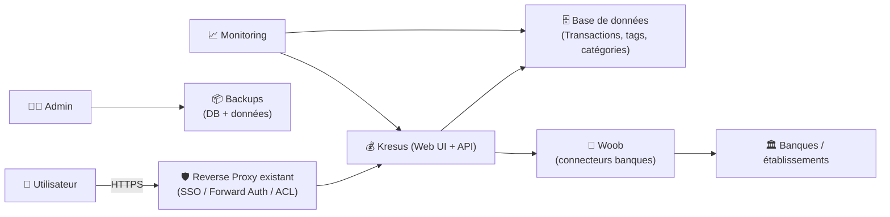
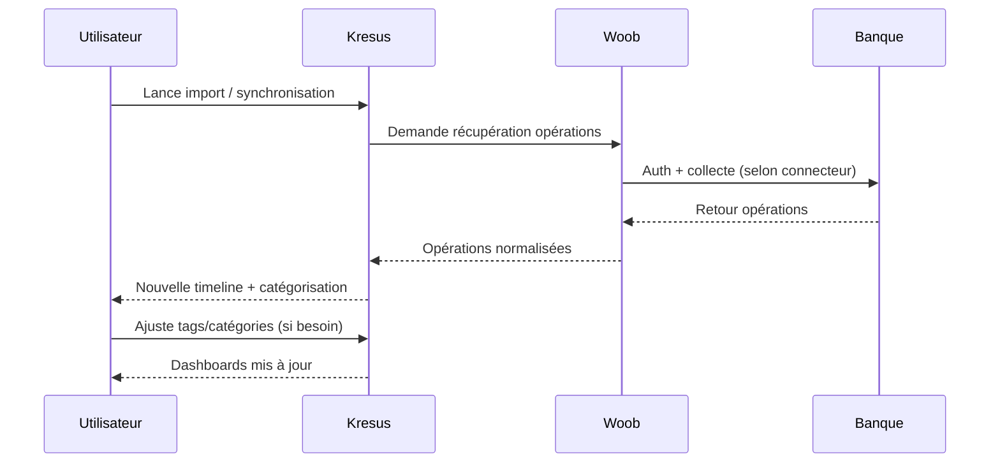

# 💰 Kresus — Présentation & Exploitation Premium (Finance personnelle auto-hébergée)

### Agrégation bancaire + catégorisation + tags + insights — en “source de vérité” personnelle
Optimisé pour reverse proxy existant • Données sensibles • Gouvernance & backups • Exploitation durable

---

## TL;DR

- **Kresus** est un gestionnaire de finances personnelles **self-hosted** : import/agrégation d’opérations, catégorisation, tags, visualisations. :contentReference[oaicite:0]{index=0}  
- Il s’appuie sur **Woob** (connecteurs bancaires) dans sa stack, et l’usage “premium” consiste à traiter l’outil comme une app **hautement sensible** (accès, logs, sauvegardes, tests de restauration). :contentReference[oaicite:1]{index=1}  
- Ce doc se concentre sur **architecture, sécurité d’exploitation, configuration logique, validation & rollback** (sans parties install / docker / nginx / ufw, comme demandé).

---

## ✅ Checklists

### Pré-usage (avant d’y mettre tes comptes)
- [ ] Choisir une stratégie d’accès (SSO/forward-auth/VPN) via ton reverse proxy existant
- [ ] Définir un modèle de données : comptes, tags, catégories, règles d’auto-tagging
- [ ] Décider la politique d’import (manuel / planifié / hybride)
- [ ] Définir une stratégie de sauvegarde (DB + données applicatives) + test de restauration
- [ ] Définir un “niveau de logs” acceptable (éviter de logguer du sensible)

### Post-configuration (qualité opérationnelle)
- [ ] Un import de test sur un compte “non critique” est OK
- [ ] Les catégories/tags sont cohérents (pas de doublons, conventions claires)
- [ ] Les dashboards donnent des insights sans bruit (périodes, budgets, filtres)
- [ ] Une restauration complète a été validée (DB + fichiers)
- [ ] Un plan de rollback est documenté

---

> [!TIP]
> Kresus devient vraiment utile quand tu investis dans une **taxonomie** (tags/catégories) et des **règles** : tu passes de “j’ai des opérations” à “je comprends mes dépenses”.

> [!WARNING]
> Les données financières sont **sensibles** : accès, sessions, exports, backups, logs, captures d’écran… traite ça comme un coffre, pas comme un media manager.

> [!DANGER]
> Ne laisse pas Kresus accessible publiquement sans contrôle d’accès fort. Une fuite = historique bancaire, habitudes, identifiants indirects (IBAN, libellés, commerçants).

---

# 1) Kresus — Vision moderne

Kresus n’est pas juste un “tableur amélioré”.  
C’est :
- 🧾 Une **timeline** d’opérations consolidées
- 🧠 Un **moteur de compréhension** (tags, catégories, règles)
- 📊 Un **outil d’insight** (tendances, budgets, analyse par période)
- 🔌 Un **pont** vers des connecteurs bancaires via Woob (selon tes usages / banques) :contentReference[oaicite:2]{index=2}

---

# 2) Architecture globale (logique)



Docs Docker mentionnant Woob dans l’image et recommandations associées : :contentReference[oaicite:3]{index=3}

---

# 3) Philosophie “premium” (5 piliers)

1. 🔐 **Accès & sessions** (auth forte via reverse proxy existant)
2. 🧭 **Modèle de données** (catégories/tags/règles cohérentes)
3. 🏦 **Import fiable** (connecteurs Woob + traitement des échecs)
4. 📦 **Backups & restauration** (tests réguliers)
5. 🧪 **Validation & rollback** (avant/après chaque changement majeur)

---

# 4) Modèle de données (la partie qui fait la différence)

## 4.1 Conventions tags (recommandé)
- `type:` → `type:abonnement`, `type:ponctuel`
- `canal:` → `canal:cb`, `canal:virement`, `canal:prelevement`
- `projet:` → `projet:vacances2026`, `projet:travaux`
- `meta:` → `meta:pro`, `meta:perso`

> [!TIP]
> Les tags “préfixés” évitent l’anarchie. Tu peux filtrer vite et faire des vues stables dans le temps.

## 4.2 Catégories (structure)
Garde un nombre limité de catégories “macro” :
- Logement
- Alimentation
- Transports
- Abonnements
- Santé
- Loisirs
- Impôts
- Épargne / Invest
- Revenus

Puis affine via tags (`meta:`, `projet:`…) au lieu de créer 70 catégories.

---

# 5) Règles & auto-classification (stratégie robuste)

## 5.1 Règles de matching (ordre de priorité)
1. **IBAN/Identifiant** (quand disponible)
2. **Commerçant normalisé**
3. **Motifs stables** (regex sur libellés)
4. **Fallback manuel** + apprentissage

## 5.2 Exemple logique (pseudo)
- Si libellé contient `NETFLIX` → catégorie `Abonnements`, tag `type:abonnement`
- Si commerçant = `CARREFOUR` → catégorie `Alimentation`
- Si libellé contient `LOYER` → catégorie `Logement`

> [!WARNING]
> Les libellés bancaires changent. Évite les règles trop fragiles (“contient 3 mots exacts”). Préfère des motifs courts et stables.

---

# 6) Import & fiabilité (sans “recette d’install”)

Kresus peut fonctionner avec des imports et/ou des récupérations via Woob (selon environnement). La doc Docker insiste sur l’intégration Woob et sur le fait qu’un simple redémarrage peut résoudre certains soucis de modules Woob. :contentReference[oaicite:4]{index=4}

## 6.1 Stratégie “zéro surprise”
- Un import planifié + une vérif hebdo manuelle
- Journaliser les échecs d’import (sans données sensibles)
- Définir un seuil : “si 3 échecs consécutifs, on stoppe et on analyse”

> [!DANGER]
> Ne transforme pas un échec de connecteur en “boucle de retries agressive”. Tu risques des blocages côté banque / connecteur.

---

# 7) Workflows premium (audit & correction)



---

# 8) Validation / Tests / Rollback

## 8.1 Tests de validation (fonctionnels)
- Import sur une période courte (ex: 7 jours)
- Vérifier :
  - doublons (0)
  - solde cohérent (à tolérance près selon banque)
  - règles appliquées (tags/catégories attendus)

## 8.2 Tests de sécurité (minimum)
- Un utilisateur non-admin ne peut pas exporter/voir ce qu’il ne doit pas
- L’accès sans authentification est impossible via ton reverse proxy existant
- Les logs ne contiennent pas :
  - identifiants
  - tokens
  - IBAN complets (si évitable)

## 8.3 Rollback (principe)
- **Rollback data** : restaurer DB + données applicatives depuis backup
- **Rollback logique** : revenir à l’ancien set de règles/tags (export/import de config si tu le pratiques)
- **Rollback accès** : revenir à une politique d’accès plus stricte (VPN only) en cas de doute

> [!TIP]
> Fais un “game day” trimestriel : restauration sur une instance de test + validation de cohérence.

---

# 9) Erreurs fréquentes (et fixes)

- ❌ **Trop de catégories** → dashboards illisibles  
  ✅ Revenir à 8–12 catégories max + tags structurés

- ❌ **Règles trop fragiles** → mauvaise classification  
  ✅ Motifs courts & stables, priorité commerçant/identifiant si possible

- ❌ **Imports instables** (connecteur)  
  ✅ stratégie de retry raisonnable + analyse, et redémarrage si recommandé côté Woob dans l’environnement Docker :contentReference[oaicite:5]{index=5}

---

# 10) Sources — Images Docker (URLs en bash)

```bash
# Kresus — docs officielles (Docker)
https://kresus.org/en/install-docker.html
https://kresus.org/install-docker.html

# Kresus — dépôt officiel (référence produit)
https://github.com/kresusapp/kresus

# Images Docker Hub liées à Kresus (références publiques)
https://hub.docker.com/r/bnjbvr/kresus
https://hub.docker.com/r/klutchell/kresus

# LinuxServer.io — catalogue images (vérifier si une image Kresus existe)
https://www.linuxserver.io/our-images
https://hub.docker.com/u/linuxserver
```

Notes :
- Image Docker “bnjbvr/kresus” (Docker Hub) : :contentReference[oaicite:6]{index=6}  
- Documentation Docker officielle Kresus : :contentReference[oaicite:7]{index=7}  
- Catalogue LinuxServer.io (pour constater l’absence/presence) : :contentReference[oaicite:8]{index=8}  

---

# ✅ Conclusion

Kresus “premium” = **moins de features**, plus de **rigueur** :
- un accès béton,
- une taxonomie stable (catégories + tags),
- des imports fiables,
- et surtout des backups/restores réellement testés.

C’est comme ça que tu obtiens une vision de tes finances **fiable**, **exploitable**, et durable.