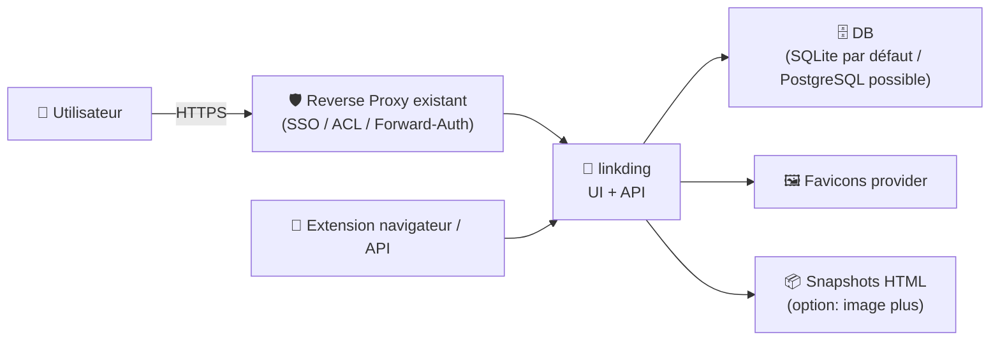
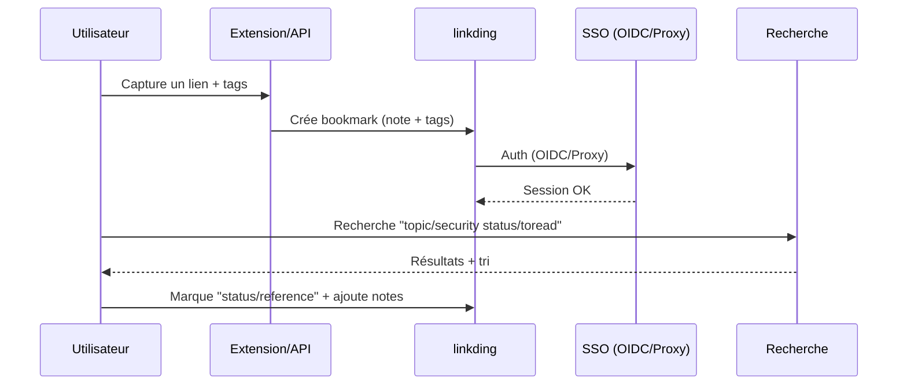

# 🔖 linkding — Présentation & Configuration Premium (Gouvernance + SSO + Exploitation)

### Gestionnaire de bookmarks auto-hébergeable : minimal, rapide, structurable, extensible
Optimisé pour reverse proxy existant • SSO (OIDC) / Auth Proxy • Tagging & recherche • Exploitation durable

---

## TL;DR

- **linkding** = gestionnaire de **signets** auto-hébergeable, pensé pour rester **simple** et **rapide**. :contentReference[oaicite:0]{index=0}  
- En mode “premium”, tu le traites comme une **brique de connaissance** : conventions de tags, ingestion (extensions/API), SSO, snapshots (variant *plus*), contrôle d’accès et runbooks.
- Les points critiques : **auth** (OIDC ou proxy), **context path** si subpath, **limites requêtes** si imports massifs, et une **stratégie de tags** stable. :contentReference[oaicite:1]{index=1}

---

## ✅ Checklists

### Pré-usage (avant d’ouvrir aux équipes)
- [ ] Conventions de tags (naming + “tag system”) validées
- [ ] Décision auth : **OIDC** (SSO) ou **Auth Proxy** (Authelia/Authentik/Cloudflare Access)
- [ ] Politique d’accès : qui peut créer/modifier/supprimer
- [ ] Décider si tu veux l’archivage HTML (image **plus**)
- [ ] Conventions d’import/export (Netscape HTML, API, extension navigateur)

### Post-configuration (qualité opérationnelle)
- [ ] Login SSO/Proxy OK + création auto de users si choisi
- [ ] Imports volumineux OK (timeout/size ajustés si nécessaire)
- [ ] Recherche rapide + tags cohérents (pas de dérive)
- [ ] Snapshots (si activés) validés (stockage & perf)
- [ ] Procédures de tests + rollback documentées

---

> [!TIP]
> La valeur de linkding explose quand tu standardises les **tags** et que tu imposes un petit “système” (ex: `topic/`, `stack/`, `status/`, `src/`).

> [!WARNING]
> Les bookmarks peuvent contenir des données sensibles (URLs internes, tokens, liens d’admin). Traite linkding comme un **outil d’accès privilégié**.

> [!DANGER]
> Éviter l’accès public sans contrôle d’accès solide. Si tu actives OIDC/Auth-Proxy, **teste** les scénarios (logout, session, redirections, subpath) avant d’ouvrir plus large. :contentReference[oaicite:2]{index=2}

---

# 1) linkding — Vision moderne

linkding n’est pas juste “un dossier de favoris”.

C’est :
- 🧠 un **hub de connaissance personnelle/équipe** (liens + tags + notes)
- 🔎 un moteur de **recherche** et de **récupération** (“retrieval”)
- 🔗 un point d’entrée pour **capturer** depuis navigateur / mobile / API
- 🗃️ une base pour **archiver** (selon image “plus”) :contentReference[oaicite:3]{index=3}

---

# 2) Architecture globale



Base DB + variantes d’images (plus/alpine) + options : :contentReference[oaicite:4]{index=4}

---

# 3) “Premium config mindset” (5 piliers)

1. 🔐 **Auth propre** : OIDC (SSO) ou Auth Proxy (headers)
2. 🏷️ **Taxonomie de tags** stable (évite le chaos)
3. 🧰 **Ingestion fluide** : extension + API + imports
4. 📦 **Archivage maîtrisé** : activer seulement si besoin (image *plus*)
5. 🧪 **Validation / Rollback** : tests post-change + retour arrière simple

---

# 4) Auth & SSO (propre)

linkding propose deux approches majeures : :contentReference[oaicite:5]{index=5}

## 4.1 OIDC (SSO)
- Active le support OIDC via l’option dédiée
- Association utilisateur basée sur l’email (par défaut) + claims configurables :contentReference[oaicite:6]{index=6}

✅ Idéal si tu as déjà : Authentik / Keycloak / Azure AD / etc.  
⚠️ À valider : redirections, cookies, logout, subpath.

## 4.2 Auth Proxy (SSO via headers)
- Active le mode “auth proxy”
- linkding authentifie l’utilisateur via un header (ex: `Remote-User`) et peut auto-créer les users :contentReference[oaicite:7]{index=7}

✅ Idéal si tu es déjà en : Authelia / Authentik / Cloudflare Access.  
⚠️ Critique : ne jamais laisser un client forger ce header (doit venir du proxy de confiance).

---

# 5) Subpath / Context path (si tu sers sous `/linkding/`)

Si tu exposes linkding sous un chemin (subpath), configure le **context path** (terminé par `/`). :contentReference[oaicite:8]{index=8}

> [!TIP]
> Recommandation pratique : privilégier un **sous-domaine** (souvent plus simple), sinon subpath + context path bien posé.

---

# 6) Taxonomie de tags (ce qui fait la différence)

## 6.1 Convention “tag system” (simple, efficace)
- `topic/<sujet>` : `topic/security`, `topic/docker`
- `stack/<tech>` : `stack/python`, `stack/traefik`
- `status/<etat>` : `status/toread`, `status/reference`
- `src/<source>` : `src/blog`, `src/github`, `src/vendor`

Bénéfices :
- 🔎 recherche prédictible (tu sais quoi taper)
- 🧼 moins de doublons/synonymes (“docker”, “Docker”, “containers”…)
- 🧠 tri mental rapide

## 6.2 Règles anti-chaos (premium)
- Pas d’espaces, pas de majuscules
- Préfixes réservés (`topic/`, `stack/`, `status/`, `src/`)
- “one concept = one tag” (pas de tags-phrases)

---

# 7) Archivage & “image plus” (snapshots)

linkding a des variantes d’image ; la variante **plus** ajoute la création de snapshots HTML et embarque Chromium (plus lourd). :contentReference[oaicite:9]{index=9}

Quand l’activer :
- tu veux figer des pages qui changent/suppriment
- tu fais de la veille “référence long terme”

Quand l’éviter :
- ressources limitées (RAM/disque)
- tu veux juste gérer des bookmarks, sans archive

---

# 8) Options “premium” à connaître (sans recettes d’install)

Options utiles (sélection) : :contentReference[oaicite:10]{index=10}

- **Bootstrap admin**
  - `LD_SUPERUSER_NAME`, `LD_SUPERUSER_PASSWORD`
- **Performance / stabilité**
  - `LD_REQUEST_TIMEOUT` (imports volumineux)
  - `LD_REQUEST_MAX_CONTENT_LENGTH` (limite uploads)
- **SSO**
  - `LD_ENABLE_OIDC`
  - `LD_ENABLE_AUTH_PROXY` + headers associés
- **Subpath**
  - `LD_CONTEXT_PATH`
- **DB**
  - `LD_DB_ENGINE` (SQLite défaut, PostgreSQL possible) :contentReference[oaicite:11]{index=11}

> [!WARNING]
> Si tu actives l’auth proxy, la logique “login form” peut devenir secondaire. Vérifie aussi les options liées à la désactivation du formulaire si tu veux forcer SSO. :contentReference[oaicite:12]{index=12}

---

# 9) Workflows premium (capture → tri → exploitation)



---

# 10) Validation / Tests / Rollback

## 10.1 Tests de validation (smoke tests)
```bash
# 1) Page répond (à adapter à ton URL)
curl -I https://linkding.example.tld | head

# 2) Si subpath
curl -I https://example.tld/linkding/ | head

# 3) Vérifier redirection login/SSO attendue (doit être cohérente)
curl -s -o /dev/null -w "%{http_code} %{redirect_url}\n" https://linkding.example.tld/login || true
```

## 10.2 Tests fonctionnels (qualité)
- Créer un bookmark test + tags `topic/test status/toread`
- Rechercher par tag, vérifier tri et affichage
- Tester import (petit fichier), puis import “gros volume” si tu en as besoin (timeout)

## 10.3 Rollback (simple)
- Revenir aux réglages précédents (OIDC/proxy/context path)
- Désactiver l’archivage si surcharge (variante *plus* → revenir à *latest* si nécessaire)
- Restaurer DB/volume depuis ton mécanisme de sauvegarde (selon ton infra)

---

# 11) Sources — Images Docker (format demandé)

## 11.1 Image officielle la plus citée
- `sissbruecker/linkding` (Docker Hub) : https://hub.docker.com/r/sissbruecker/linkding  
- Doc linkding “Installation” (référence `sissbruecker/linkding` et variantes `latest-plus`, `latest-alpine`, etc.) : https://linkding.link/installation/  
- Tags (variantes `latest`, `latest-plus`, `latest-alpine`, `latest-plus-alpine`) : https://hub.docker.com/r/sissbruecker/linkding/tags  

## 11.2 Image officielle alternative (registry GitHub)
- `ghcr.io/sissbruecker/linkding` (GitHub Container Registry) : https://github.com/users/sissbruecker/packages/container/linkding  
- Doc linkding “Installation” (mention GHCR) : https://linkding.link/installation/  
- Repo (source de vérité) : https://github.com/sissbruecker/linkding  

## 11.3 LinuxServer.io (si elle existe)
- Liste officielle des images LinuxServer.io (linkding n’y apparaît pas comme image dédiée) : https://www.linuxserver.io/our-images  
- Index docs LinuxServer (catalogue) : https://docs.linuxserver.io/images/  

---

# ✅ Conclusion

linkding “premium”, c’est :
- 🔐 SSO propre (OIDC ou Auth Proxy)
- 🏷️ Taxonomie de tags stable (anti-chaos)
- 🧩 Capture fluide (extension/API/imports)
- 📦 Archivage activé seulement si utile (image *plus*)
- 🧪 Tests & rollback prêts (pour changer sans stress)

Si tu m’envoies ton style de tags + ton mode d’auth (OIDC vs proxy), je peux te générer un **standard interne** (STD-*) prêt à coller dans ton BookStack.