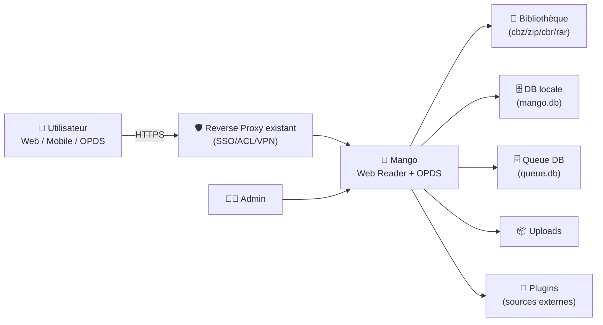
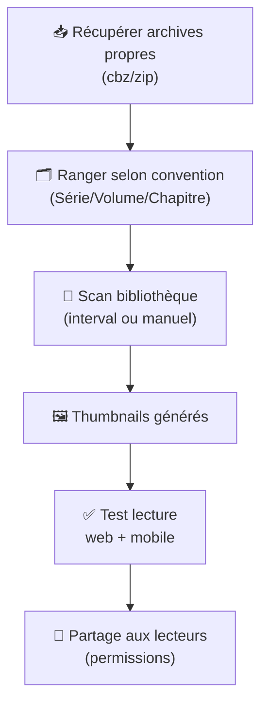
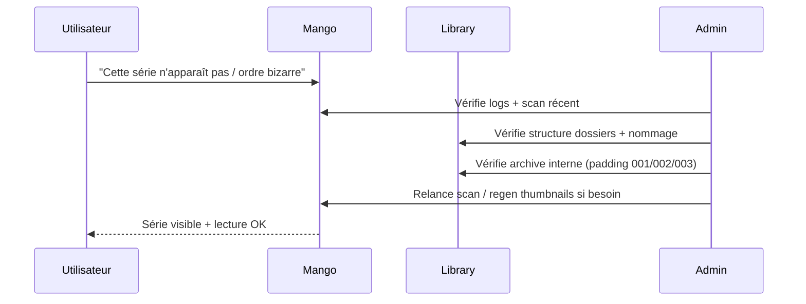

# 🥭 Mango — Présentation & Configuration Premium (Manga Server / Web Reader)

### Bibliothèque manga self-hosted : lecture web + OPDS + multi-utilisateurs + plugins
Optimisé pour reverse proxy existant • Qualité de bibliothèque • Gouvernance & sécurité • Exploitation durable

---

## TL;DR

- **Mango** est un **serveur manga auto-hébergé** avec **lecteur web** (mobile-friendly), **multi-user**, **OPDS**, **progression de lecture**, **thumbnails**, et **plugins**.  
- Il lit des archives **`.cbz`, `.zip`, `.cbr`, `.rar`** et supporte des **dossiers imbriqués** dans la bibliothèque.
- ⚠️ **Statut important** : le projet indique être **non maintenu depuis mars 2025** → à traiter avec prudence (risque sécurité) et idéalement derrière un accès strict.

---

## ✅ Checklists

### Pré-usage (avant de le proposer à d’autres)
- [ ] Accès **non public** (SSO/ACL/VPN/forward-auth via reverse proxy existant)
- [ ] Chemins de bibliothèque **stables** + permissions lecture/écriture maîtrisées
- [ ] Convention de rangement validée (séries/volumes/chapitres)
- [ ] Stratégie “plugins” : liste autorisée + cycle de review
- [ ] Backups (DB + config + uploads) et restauration testée
- [ ] Plan “contenu sensible” : pas de tokens/infos privées dans les logs

### Post-configuration (qualité)
- [ ] Création utilisateurs + rôles “mini” (admin / lecteurs)
- [ ] OPDS testé (client OPDS externe si utilisé)
- [ ] Scan bibliothèque OK (pas de boucles / pas d’erreurs d’archives)
- [ ] Thumbnails générés dans un délai acceptable
- [ ] Accès mobile validé (réseau + UX)
- [ ] Procédure “Validation / Rollback” documentée

---

> [!TIP]
> Mango donne ses meilleurs résultats quand ta bibliothèque est **proprement structurée** (séries → volumes → archives).  
> Moins tu “bricoles” le rangement, plus l’expérience est fluide.

> [!WARNING]
> Mango annonce être **non maintenu depuis mars 2025**.  
> Utilise-le uniquement **dans un périmètre maîtrisé** (accès restreint, patching OS, surveillance).

> [!DANGER]
> Ne l’expose pas tel quel sur Internet. Un webapp non maintenue + accès public = risque élevé.  
> Préfère : VPN / ACL réseau / SSO via reverse proxy existant.

---

# 1) Mango — Vision moderne

Mango n’est pas juste un “viewer d’images”.

C’est :
- 📚 Une **bibliothèque** (indexation, navigation)
- 👥 Un **système multi-user** (progression individuelle)
- 🌐 Un **point d’accès OPDS** (si tu utilises des clients externes)
- 🧩 Un **mécanisme de plugins** (téléchargement depuis des sources tierces)
- 🖼️ Un **générateur de thumbnails** (pour la navigation visuelle)

---

# 2) Architecture globale



---

# 3) Philosophie premium (5 piliers)

1. 📁 **Bibliothèque propre** (structure + conventions)
2. 👥 **Gouvernance** (users, accès, périmètres)
3. 🧩 **Plugins maîtrisés** (liste blanche + review)
4. ⚙️ **Tâches planifiées saines** (scan, thumbnails, update plugins)
5. 🛡️ **Accès restreint** (non public, authentification, segmentation réseau)

---

# 4) Structure de bibliothèque (le “game changer”)

Mango supporte les dossiers imbriqués : tu peux organiser par série, puis volumes/chapitres.

## Exemple recommandé (simple & robuste)
```text
Library/
  One Piece/
    Volume 01.cbz
    Volume 02.cbz
  Berserk/
    Deluxe/
      Volume 01.cbz
      Volume 02.cbz
  Chainsaw Man/
    Vol. 01/
      Ch.01.zip
      Ch.02.zip
```

## Règles de qualité (pragmatiques)
- **1 archive = 1 unité de lecture** (volume ou chapitre)
- Noms réguliers : `Volume 01`, `Ch.01` (tri stable)
- Évite les archives “fourre-tout” avec des structures bizarres
- Si tu mixes `.cbz` et `.zip`, reste cohérent par série

> [!TIP]
> Si un lecteur se plaint de l’ordre des pages : c’est presque toujours un souci de **naming** à l’intérieur de l’archive (ex: `1.jpg, 10.jpg, 2.jpg`).  
> Utilise un padding (`001.jpg`, `002.jpg`, …).

---

# 5) Configuration — réglages premium (sans recette d’installation)

Mango utilise une configuration YAML (ex: `config.yml`).  
Voici une base “premium” (à adapter) :

```yaml
# config.yml — exemple premium
host: 0.0.0.0
port: 9000
base_url: /
session_secret: "CHANGE_ME_LONG_RANDOM"

library_path: "/path/to/library"
db_path: "/path/to/mango.db"
queue_db_path: "/path/to/queue.db"
upload_path: "/path/to/uploads"
plugin_path: "/path/to/plugins"

# Tâches périodiques
scan_interval_minutes: 10
thumbnail_generation_interval_hours: 24
plugin_update_interval_hours: 24

# Observabilité
log_level: info

# Perf (feature expérimentale de cache)
cache_enabled: true
cache_size_mbs: 100
cache_log_enabled: false

# Auth
disable_login: false
default_username: ""
auth_proxy_header_name: ""
download_timeout_seconds: 30
library_cache_path: "/path/to/library.yml.gz"
```

## Recommandations “sans regrets”
- `session_secret` : long, aléatoire, unique
- `scan_interval_minutes` : évite le trop agressif (5–15 min)
- `thumbnail_generation_interval_hours` : 12–24h (selon taille)
- `cache_enabled` : utile si grosse bibliothèque (à tester)

> [!WARNING]
> Si tu utilises un **subpath** via reverse proxy (ex: `/mango`), `base_url` doit être cohérent, sinon assets et liens peuvent casser.

---

# 6) Auth, multi-user & gouvernance

## Stratégie minimale (efficace)
- **1 admin** (compte nominatif, pas “admin/admin”)
- **lecteurs** : comptes individuels (progression propre)
- Option “proxy auth” : si tu as déjà SSO/forward-auth, tu peux déléguer l’identité via `auth_proxy_header_name`

## Bonnes pratiques
- Ne pas désactiver le login (`disable_login: true`) sauf contexte très contrôlé + `default_username` défini
- Si proxy auth :
  - verrouille l’accès au service derrière SSO/ACL
  - teste le header côté proxy (pas de spoof)

> [!DANGER]
> Ne considère pas un “header auth” comme sûr si Mango est accessible sans barrière : un client pourrait forger le header.

---

# 7) Plugins (puissant, mais à gouverner)

Les plugins peuvent télécharger depuis des sites tiers → c’est une **surface de risque**.

## Politique premium (simple)
- ✅ Liste blanche de plugins autorisés
- ✅ Review mensuelle (changelog / comportement)
- ✅ Limiter les permissions du dossier plugins
- ✅ Journaliser l’activité plugin (erreurs, timeouts)

> [!TIP]
> Si tu veux une instance “familiale”, garde les plugins au minimum.  
> Si tu veux une instance “power user”, documente un process d’ajout.

---

# 8) Workflows premium (bibliothèque & incidents)

## 8.1 “Ajout de nouvelle série” (flow)


## 8.2 Triage d’incident (sequence)


---

# 9) Validation / Tests / Rollback

## Validation (smoke tests)
```bash
# HTTP répond (local / LAN)
curl -I http://MANGO_HOST:9000 | head

# Si exposé via URL reverse proxy existant
curl -I https://mango.example.tld | head
```

## Tests fonctionnels (manuel mais rapide)
- Login OK (admin + lecteur)
- Une série test :
  - visible
  - tri correct
  - progression sauvegardée
- OPDS (si utilisé) :
  - catalogue accessible
  - téléchargement/lecture via client OPDS OK

## Rollback (principe)
- Restaurer **DB** (`mango.db` + `queue.db`) + **config** + **uploads**
- Revenir à une version précédente (si tu gères des versions)
- Désactiver plugins récemment ajoutés (si suspicion)

> [!TIP]
> Fais un rollback “propre” : restaure un snapshot cohérent (DB + config + uploads), pas seulement un morceau.

---

# 10) Erreurs fréquentes (et fixes)

## “Ordre des pages incorrect”
Cause typique : noms d’images non paddés (`1.jpg`, `10.jpg`, `2.jpg`)  
Fix : renommer en `001.jpg`, `002.jpg`, …

## “Scan trop lent / CPU élevé”
- scan trop fréquent
- thumbnails trop rapprochés
Fix :
- augmenter `scan_interval_minutes`
- thumbnails 24h
- activer/tuner cache (si utile)

## “Téléchargement plugin timeout”
Fix :
- augmenter `download_timeout_seconds`
- réduire la fréquence d’updates plugins
- vérifier connectivité DNS/réseau

---

# 11) Sources — Images Docker (format demandé)

## 11.1 Image officielle la plus citée (projet Mango)
- `hkalexling/mango` (Docker Hub) : https://hub.docker.com/r/hkalexling/mango  
- Doc / README Mango (mention “official docker images available on Dockerhub”) : https://github.com/getmango/Mango  
- Repo upstream (référence produit) : https://github.com/getmango/Mango  

## 11.2 LinuxServer.io (si disponible)
- Liste des images LinuxServer.io (recherche/validation) : https://www.linuxserver.io/our-images  
- Profil Docker Hub LinuxServer.io : https://hub.docker.com/u/linuxserver  
- Statut : **pas d’image LSIO dédiée “Mango”** listée dans leur catalogue public au moment de la vérification (voir page “our-images”).  

---

# ✅ Conclusion

Mango est excellent pour une lecture web simple, multi-user, et une bibliothèque structurée — **mais** son statut “non maintenu” impose une posture premium :
- accès strict (non public),
- gouvernance (users/plugins),
- discipline bibliothèque,
- backups & rollback testés.

Si tu veux, pour le prochain fichier, je peux aussi te faire une section “Alternatives modernes” (en gardant ton format premium).