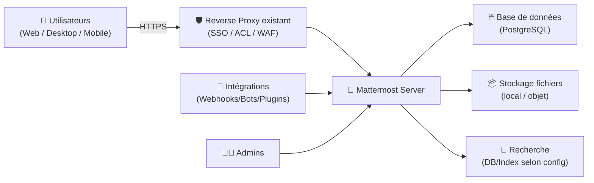
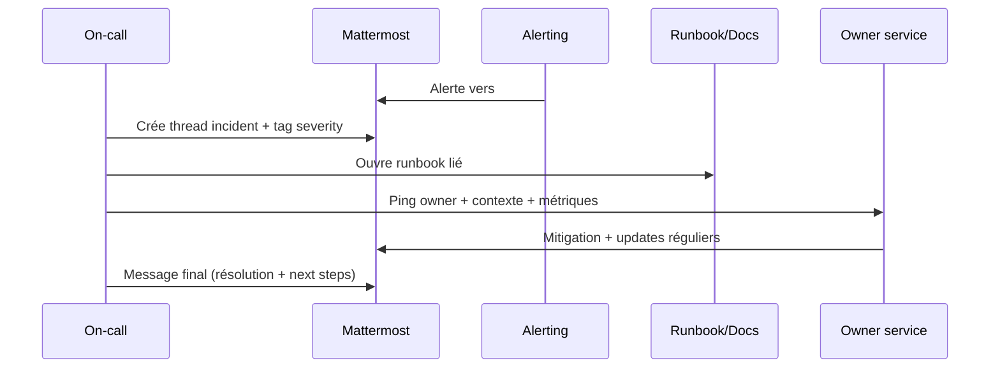

# 💬 Mattermost — Présentation & Exploitation Premium (Sans install / Sans Nginx / Sans Docker / Sans UFW)

### Collaboration “mission-critical” : chat d’équipe, workflows, intégrations, gouvernance
Optimisé pour reverse proxy existant • SSO/LDAP • Permissions & conformité • Exploitation durable

---

## TL;DR

- **Mattermost** = plateforme de collaboration orientée **sécurité**, **contrôle**, **souveraineté des données**.
- Couvre : **messagerie**, **canaux**, **mentions**, **threads**, **recherche**, **webhooks**, **intégrations**, **permissions**.
- Une config “premium” = **gouvernance**, **SSO**, **rétention**, **audits**, **runbooks**, **monitoring**, **tests** + **rollback**.

---

## ✅ Checklists

### Avant ouverture aux utilisateurs
- [ ] Définir **structure** : équipes / canaux / conventions de nommage
- [ ] Définir **rôles** : System Admins / Team Admins / Channel Admins / Members / Guests
- [ ] Décider l’auth : **SSO/LDAP** vs login local (et politique MFA si applicable)
- [ ] Poser politique : **rétention**, **exports**, **eDiscovery** (si besoin), **journalisation**
- [ ] Définir modèle d’onboarding : 10 canaux “socle” + templates
- [ ] Définir politique d’intégrations (webhooks, bots, plugins)

### Après configuration (qualité opérationnelle)
- [ ] Permissions testées (un user standard ne peut pas admin)
- [ ] Canaux “socle” prêts + conventions appliquées
- [ ] Notifications & mentions validées (éviter le spam)
- [ ] Logs et audits accessibles aux admins (procédures incident)
- [ ] Procédure **backup/restore** + **rollback** validée

---

> [!TIP]
> Mattermost est excellent quand tu le traites comme un **outil de production** : règles claires, canaux structurés, automatisations mesurées, et runbooks.

> [!WARNING]
> Sans gouvernance, un Mattermost devient vite un “fourre-tout” : canaux duplicats, onboarding confus, recherche moins utile.

> [!DANGER]
> Les messages peuvent contenir des secrets (tokens, URLs internes, stack traces). Mets une politique “**no secrets in chat**” + rotation si fuite.

---

# 1) Mattermost — Vision moderne

Mattermost n’est pas juste un Slack-like.

C’est :
- 🧭 Un **hub opérationnel** (incidents, astreinte, support, change)
- 🔐 Une **plateforme contrôlable** (SSO/LDAP, permissions, conformité)
- 🧩 Un **orchestrateur d’intégrations** (webhooks, bots, plugins)
- 🧠 Un **outil d’historique utile** (recherche, threads, structuration)

---

# 2) Architecture globale (référence)

---

# 3) Philosophie Premium (5 piliers)

1. 🏗️ **Gouvernance** (équipes/canaux/standards)
2. 🔐 **Identité & accès** (SSO/LDAP, moindre privilège)
3. 🧾 **Conformité** (rétention, audit, exports selon besoin)
4. 🔌 **Automatisation** (webhooks/bots sans “bruit”)
5. 🧪 **Exploitation** (monitoring, tests, rollback)

---

# 4) Gouvernance : structure qui tient dans le temps

## 4.1 Convention d’équipes (Teams)
Modèle simple :
- `company` (transverse)
- `ops` (production / infra)
- `product` (produit)
- `support` (support client/interne)

## 4.2 Convention de canaux (Channels)
Préfixes recommandés :
- `ann-` annonces (lecture majoritaire)
- `ops-` opérations (prod)
- `proj-` projets (temporaire)
- `sup-` support (tickets/triage)
- `rnd-` discussion (limiter)

Exemples :
- `ann-company`
- `ops-incidents`
- `ops-changes`
- `sup-triage`
- `proj-migration-x`

> [!TIP]
> Fais un canal “**START-HERE**” (pinned) avec : règles, liens, standards, FAQ, escalade.

---

# 5) Modèle d’accès : rôles & permissions

## Rôles typiques
- **System Admin** : config globale, sécurité, policies
- **Team Admin** : gouverne une équipe
- **Channel Admin** : modère / organise un canal
- **Member** : usage standard
- **Guest** (si activé) : accès limité (partenaires)

## Stratégie recommandée
- Peu de System Admins (2–3)
- Team Admins par domaine
- Channel Admins pour les canaux critiques (incidents/annonces)
- Guests : seulement si besoin, et strictement cantonnés

> [!WARNING]
> Donne les droits “admin” par **espace** (team/channel) plutôt qu’en global, dès que possible.

---

# 6) Threads, mentions, signal vs bruit (qualité de collaboration)

## Règles anti-bruit (effet “premium” immédiat)
- `@channel` / `@here` : réservé aux canaux ops/incidents
- “Questions” dans `sup-triage`, réponses en thread
- “Décisions” dans `ann-*` avec template décision
- Liens vers runbooks au lieu de pavés de texte

## Template “Annonce”
- Contexte
- Impact
- Action requise
- Deadline
- Owner
- Lien doc / runbook

---

# 7) Intégrations : utiles, mesurées, gouvernées

## Patterns recommandés
- Alerting (monitoring) → **un canal dédié** (ex: `ops-alerts`)
- Incidents → `ops-incidents` (avec format)
- CI/CD → `ops-deployments` (résumé, pas spam)
- Tickets → `sup-triage` (assign/labels)

## Bonnes pratiques
- Un bot = un “scope” clair (pas admin global)
- Webhooks signés si possible (ou proxy interne)
- Définir une politique : qui peut créer webhooks/bots

> [!TIP]
> La règle d’or : **moins d’intégrations**, mais **bien filtrées** (seuils, agrégation, déduplication).

---

# 8) Workflows premium (incident & change)

## 8.1 Incident — séquence opérationnelle

## 8.2 Change — “announce + validate”
- `ops-changes` : annonce structurée
- lien vers plan de rollback
- validation post-change (checks)
- clôture (OK/KO + lessons learned)

---

# 9) Exploitation : observabilité & hygiène

## Ce que tu veux voir facilement
- Santé application (latence, erreurs)
- DB : connexions, slow queries, disque
- Stockage fichiers : croissance, erreurs
- Auth (SSO/LDAP) : erreurs de login, sessions
- Plugins/bots : erreurs, rate limits

## Hygiène
- Cadence de mise à jour (mensuelle ou trimestrielle selon contraintes)
- Revue permissions (mensuelle)
- Revue canaux (trimestrielle) : archive/merge

---

# 10) Validation / Tests / Rollback

## Tests fonctionnels (quick)
- Connexion user standard (SSO/LDAP si applicable)
- Création message + thread + mention
- Upload fichier (si autorisé) + téléchargement
- Recherche (mot clé) sur historique
- Intégration (webhook) : message reçu dans canal cible

## Tests de sécurité (minimum)
- Un member ne peut pas :
  - modifier les settings système
  - gérer plugins/webhooks si non autorisé
- Un guest ne voit que les canaux explicitement partagés

## Rollback (principe)
- Avoir un “point de retour” :
  - config exportée
  - procédure de restauration DB + fichiers
  - plan de retour version/config (si upgrade)
- Smoke test après rollback (login + messages + upload)

> [!DANGER]
> Un rollback non testé = pas un rollback. Teste au moins une restauration complète sur environnement de test.

---

# 11) Erreurs fréquentes (et comment les éviter)

- ❌ Trop de canaux dès le jour 1 → commence avec un socle, puis évolue
- ❌ Notifications non maîtrisées → règles claires sur @channel/@here
- ❌ Intégrations “spam” → filtre/agrège, 1 canal = 1 type de signal
- ❌ Trop d’admins globaux → moindre privilège
- ❌ Pas de politique rétention → dette légale + stockage incontrôlé

---

# 12) Sources — Images Docker (format demandé)

## 12.1 Images officielles Mattermost (les plus citées)
- `mattermost/mattermost-team-edition` (Docker Hub) : https://hub.docker.com/r/mattermost/mattermost-team-edition  
- Tags (versions) `mattermost/mattermost-team-edition` : https://hub.docker.com/r/mattermost/mattermost-team-edition/tags  
- Guide officiel “Deploy Mattermost using Containers” (référence images) : https://docs.mattermost.com/deployment-guide/server/deploy-containers.html  
- Liste “official images / repositories” (référence) : https://developers.mattermost.com/contribute/more-info/containers/  
- Repo “mattermost/docker” (packaging / déploiement) : https://github.com/mattermost/docker  

## 12.2 Édition Enterprise (officielle)
- `mattermost/mattermost-enterprise-edition` (Docker Hub) : https://hub.docker.com/r/mattermost/mattermost-enterprise-edition  
- Profil Docker Hub Mattermost (liste d’images officielles) : https://hub.docker.com/u/mattermost  

## 12.3 LinuxServer.io (LSIO)
- Liste officielle des images LinuxServer.io (Mattermost n’y apparaît pas) : https://www.linuxserver.io/our-images  
- Site LinuxServer.io (référence) : https://www.linuxserver.io/  

---

# ✅ Conclusion

Mattermost “premium”, c’est :
- une structure (teams/canaux) lisible,
- des accès maîtrisés (SSO + moindre privilège),
- des intégrations utiles (pas bruyantes),
- et une exploitation sérieuse (tests + rollback).

Si tu veux, donne-moi ton contexte (PME/asso, nb d’équipes, besoin SSO, incident management, exigences rétention) et je te sors un **blueprint de canaux + rôles + templates** ultra clean.