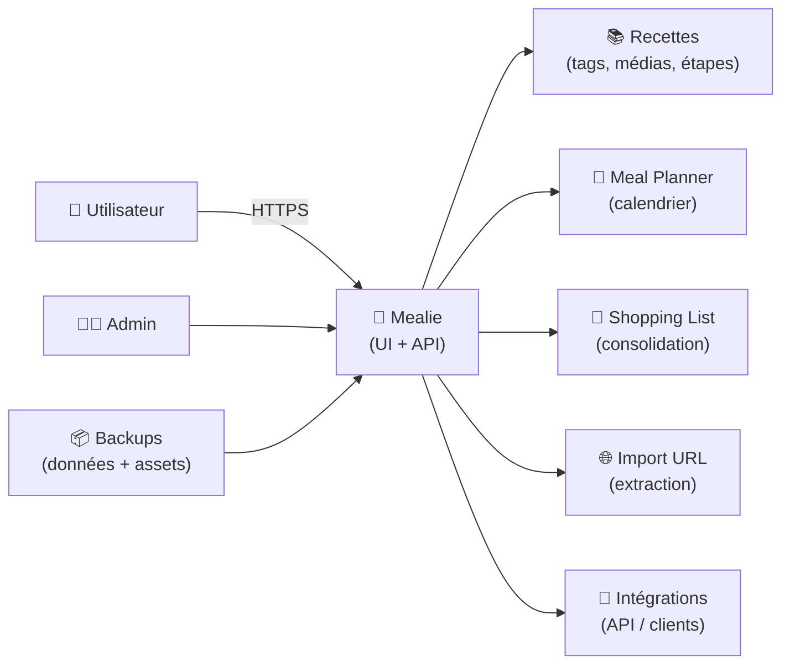
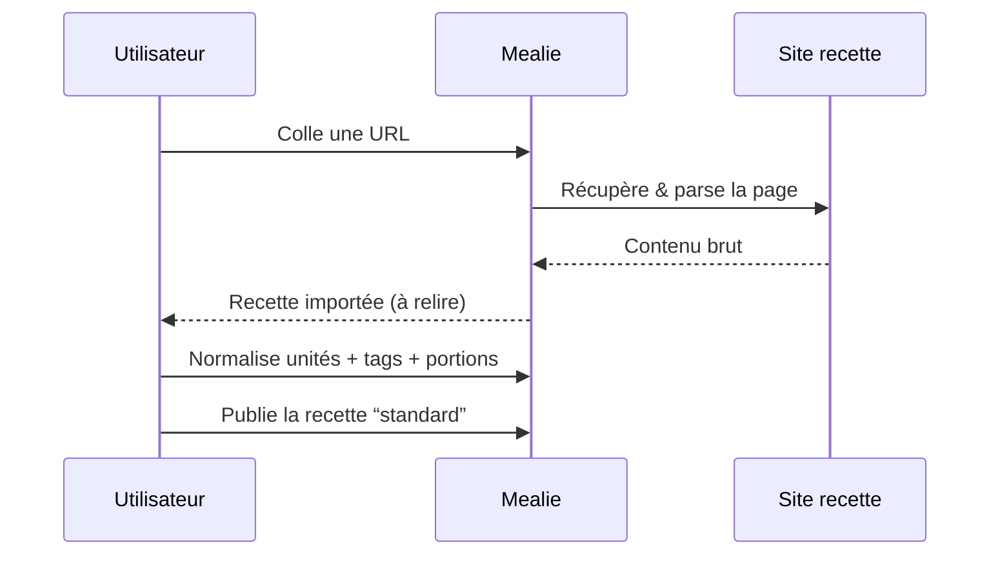
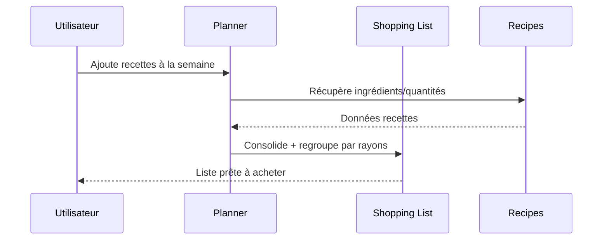

# 🍲 Mealie — Présentation & Exploitation Premium (Recettes • Menus • Courses)

### Gestionnaire de recettes “moderne” orienté famille, avec planification des repas et liste de courses
Optimisé pour reverse proxy existant • Import de recettes • Multi-utilisateurs • API • Exploitation durable

---

## TL;DR

- **Mealie** centralise tes **recettes**, **plans de repas** et **listes de courses** avec une UX moderne.
- Points forts : **import depuis URL**, **édition propre**, **multi-users**, **tags/catégories**, **meal planner**, **shopping list**, **API**.
- Version “premium ops” : **gouvernance**, **permissions**, **modèles de contenu**, **sauvegardes**, **tests**, **rollback**, **intégrations**.

---

## ✅ Checklists

### Pré-usage (avant ouverture aux utilisateurs)
- [ ] Définir le périmètre : famille / équipe / communauté
- [ ] Définir la gouvernance : qui crée, qui valide, qui administre
- [ ] Définir la taxonomie : tags, catégories, cuisines, régimes, allergènes
- [ ] Définir les règles médias : images, unités, portions, langues
- [ ] Définir le modèle “planification” : semaine type, templates, rotations
- [ ] Définir le standard recette : structure et champs obligatoires

### Post-configuration (qualité opérationnelle)
- [ ] Import URL fiable (tests sur 10 sites de recettes)
- [ ] Recherche pertinente (tags, ingrédients, temps)
- [ ] Listes de courses exploitables (groupement, unités, rayons)
- [ ] Droits/roles validés (tests utilisateurs réels)
- [ ] Procédure sauvegarde + restauration testée
- [ ] Runbook incident : “l’app répond mais import KO”, “images absentes”, “lenteurs”

---

> [!TIP]
> Mealie devient excellent quand tu standardises **la structure des recettes** + **la taxonomie** (tags/catégories/allergènes) dès le départ.

> [!WARNING]
> Sans conventions (unités, portions, tags), tu obtiens une base “wiki-chaos” : recherche pauvre, courses incohérentes, menus difficiles à réutiliser.

> [!DANGER]
> Les contenus “alimentaires” contiennent souvent des infos personnelles (habitudes, régimes, allergies). Gère Mealie comme une **appli de données privées** (accès contrôlé, backups chiffrés).

---

# 1) Mealie — Vision moderne

Mealie n’est pas juste un “carnet de recettes”.

C’est :
- 🧠 Un **référentiel culinaire** (recettes structurées, médias, tags)
- 📅 Un **outil de planification** (menus, répétitions, templates)
- 🧾 Un **générateur de courses** (liste consolidée, groupements)
- 🔗 Une **plateforme intégrable** (API, imports, clients tiers)

Cas d’usage typiques :
- Famille : menu semaine + courses + recettes favorites
- Coloc : planification partagée + gestion des achats
- Équipe/asso : documentation recettes + contraintes (allergènes/régimes)
- Meal prep : batch cooking + rotation + quantités ajustées

---

# 2) Architecture globale (fonctionnelle)

---

# 3) Modèle de données “premium” (ce qui rend l’app durable)

## 3.1 Les entités qui comptent
- **Recette** : titre, description, temps, portions, étapes, ingrédients, notes
- **Ingrédient** : nom + quantité + unité + (option) rayon/épicerie
- **Tags** : cuisine, régime, difficulté, “kid-friendly”, “batch”, etc.
- **Catégories** : entrées, plats, desserts, boissons…
- **Médias** : image, éventuellement assets liés
- **Planification** : recettes posées sur des dates (menus)
- **Liste de courses** : consolidation depuis le plan + ajout manuel

## 3.2 Les champs “pro” à standardiser
- Unités : g, kg, ml, l, càs, càc (ou ta norme)
- Portions : toujours renseignées (sinon courses incohérentes)
- Temps : prep/cook/total si possible
- Allergènes : tag dédié (gluten, arachide, lactose…)
- Source : lien d’origine + notes de modifications

---

# 4) Taxonomie & conventions (la vraie différence “premium”)

## 4.1 Stratégie tags recommandée
**Cuisine**
- `cuisine:italien`, `cuisine:indien`, `cuisine:français`

**Régimes / contraintes**
- `diet:végétarien`, `diet:vegan`, `diet:sans-gluten`

**Usage**
- `use:batch-cooking`, `use:semaine`, `use:weekend`

**Complexité**
- `lvl:facile`, `lvl:moyen`, `lvl:avancé`

**Qualité pratique**
- `kid:friendly`, `freezer:ok`, `leftovers:ok`

> [!TIP]
> Préfixer tes tags (`cuisine:`, `diet:`, `use:`) rend la recherche et les filtres beaucoup plus propres, surtout à grande échelle.

---

# 5) Gouvernance & permissions (multi-users sans chaos)

## Modèle simple (recommandé)
- 👑 **Admins** : settings, users, maintenance
- ✍️ **Editors** : créer/éditer recettes + planifier
- 👀 **Readers** : lecture + utilisation (selon ton besoin)

## Règles d’or
- Une recette “publique interne” doit respecter le **standard recette** (voir section 6)
- Les variantes personnelles passent en **notes** ou tags `variant:*`
- Toute recette importée doit être **relue** (imports ≠ qualité garantie)

> [!WARNING]
> Sans “review light”, tu accumules des recettes importées mal parsées (unités, étapes, ingrédients) qui cassent la liste de courses.

---

# 6) Standard recette (template pro prêt à appliquer)

## Template (structure recommandée)
1) **Résumé** (1–2 lignes)
2) **Portions** (obligatoire)
3) **Temps** (prep/cook/total)
4) **Tags** (cuisine / diet / usage / lvl)
5) **Ingrédients** (unités standardisées)
6) **Étapes** (courtes, actionnables)
7) **Notes** (substitutions, cuisson alternative)
8) **Source** (URL + ce qui a été adapté)

## Exemples de bonnes pratiques
- Toujours écrire “oignon” plutôt que “1 oignon” *dans le nom* (quantité séparée)
- Éviter “un peu de” : remplacer par une unité approximative ou note
- Normaliser : “huile d’olive” vs “olive oil” (choisir une langue)

---

# 7) Workflows premium (ce que l’équipe/la famille va réellement faire)

## 7.1 Import URL → recette “clean”

## 7.2 Plan de repas → liste de courses consolidée

---

# 8) Exploitation & qualité (sans parler “install”)

## 8.1 Routines d’entretien (simple)
- Hebdo : corriger 3 recettes importées “sales”
- Mensuel : audit tags (doublons, fautes, incohérences)
- Trimestriel : nettoyage images/assets obsolètes si besoin

## 8.2 Observabilité “pragmatique”
- Latence UI : lenteur = vérifier DB/stockage (assets)
- Import URL : suivre les sites qui cassent souvent et adapter les attentes
- Courses : surveiller incohérences d’unités (ex: “1 g farine”)

---

# 9) Validation / Tests / Rollback

## 9.1 Tests de validation (fonctionnels)
- Importer 5 URLs de sources différentes :
  - ✅ ingrédients extraits correctement
  - ✅ étapes en ordre
  - ✅ image récupérée (si prévu)
- Créer 1 menu semaine :
  - ✅ la liste de courses consolide correctement
  - ✅ groupements/rayons cohérents
- Recherche :
  - ✅ “diet:sans-gluten” + “use:semaine” trouve des recettes pertinentes

## 9.2 Tests de sécurité (logiques)
- Compte Reader :
  - ✅ lecture OK
  - ❌ pas d’édition
- Compte Editor :
  - ✅ création/édition OK
  - ❌ pas d’accès aux paramètres sensibles

## 9.3 Rollback (principe)
- A) Revenir à une sauvegarde de données (contenu) si corruption logique
- B) Revenir à une sauvegarde d’assets (images) si pertes médias
- C) Revenir à un état antérieur si changement de config casse imports/permissions

> [!TIP]
> Un rollback “pro” = tu sais exactement **quoi restaurer** (données vs assets) selon le symptôme.

---

# 10) Sources — Images Docker (format demandé)

## 10.1 Image officielle (GitHub Container Registry)
- `ghcr.io/mealie-recipes/mealie` (GitHub Packages) : https://github.com/orgs/mealie-recipes/packages/container/package/mealie  
- Repo Mealie (référence upstream) : https://github.com/mealie-recipes/mealie  
- Doc Mealie “Installation Checklist” (mentionne `ghcr.io/mealie-recipes/mealie`) : https://docs.mealie.io/documentation/getting-started/installation/installation-checklist/  

## 10.2 Image Docker Hub historiquement très utilisée
- `hkotel/mealie` (Docker Hub) : https://hub.docker.com/r/hkotel/mealie  
- Tags `hkotel/mealie` (versions) : https://hub.docker.com/r/hkotel/mealie/tags  
- Repo Mealie (référence doc liée dans Docker Hub) : https://github.com/mealie-recipes/mealie  

## 10.3 LinuxServer.io (si existe)
- Demande communautaire LSIO (indique que Mealie a été “request”) : https://discourse.linuxserver.io/t/request-mealie/3222  
- Catalogue des images LSIO (vérification) : https://www.linuxserver.io/our-images  

> Note : d’après les sources ci-dessus, **Mealie n’apparaît pas comme image LSIO dédiée** dans le catalogue officiel au moment de la vérification.

---

# ✅ Conclusion

Mealie “premium”, c’est :
- une base de recettes **propre** (standard + taxonomie),
- une planification **réutilisable** (menus, templates),
- des courses **exploitables** (unités, consolidation),
- une gouvernance **simple** (rôles),
- une exploitation **fiable** (tests + sauvegardes + rollback).

Si tu me donnes tes conventions (langue, unités, tags), je peux te générer un **kit complet de templates** (recette, runbook meal prep, audit tags, checklist import).