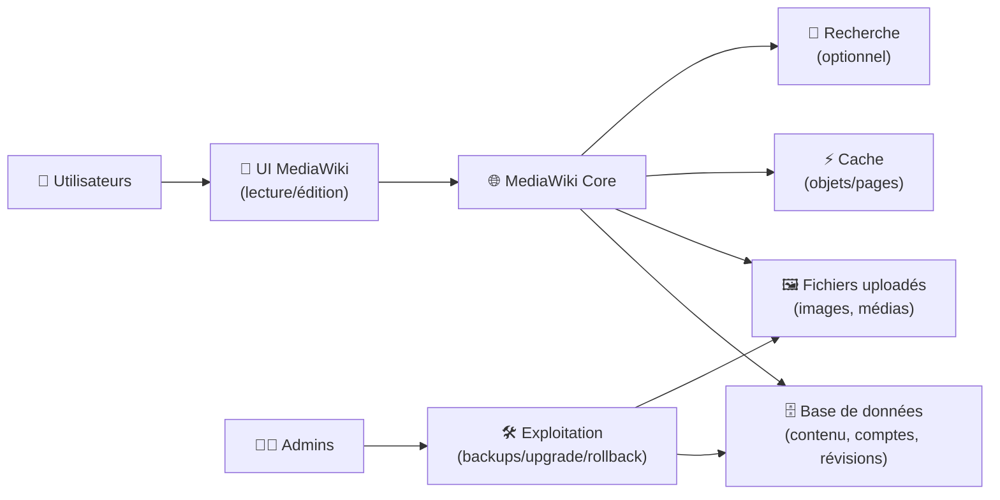
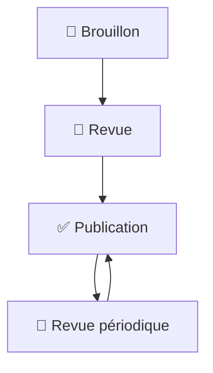

# 🌐 MediaWiki — Présentation & Exploitation Premium (Gouvernance + Performance + Extensions)

### Le moteur wiki “enterprise-grade” derrière Wikipédia
Structuration & droits avancés • Extensions puissantes • Templates • Recherche • Exploitation durable

---

## TL;DR

- **MediaWiki** est un moteur wiki très mature, pensé pour des bases de connaissance volumineuses, structurées et fortement collaboratives.
- Sa force = **templates**, **catégories**, **pages spéciales**, **workflows**, **permissions**, **extensions**.
- Une approche premium = **gouvernance**, **qualité éditoriale**, **maintenance d’extensions**, **sauvegardes**, **tests**, **rollback**, **observabilité**.

---

## ✅ Checklists

### Pré-configuration (avant d’ouvrir aux contributeurs)
- [ ] Définir la **taxonomie** (catégories, espaces de nom, conventions)
- [ ] Définir les **rôles** (admins, éditeurs, lecteurs, reviewers)
- [ ] Activer une stratégie anti-spam (CAPTCHA / ConfirmEdit / throttling)
- [ ] Fixer un “Definition of Done” pour les pages critiques (sources, validation, owner)
- [ ] Définir la stratégie d’extensions (liste blanche + cycle d’update)

### Post-configuration (qualité opérationnelle)
- [ ] Un nouveau contributeur comprend où écrire en < 2 minutes
- [ ] Les pages critiques ont un owner et une date de revue
- [ ] Les templates clés existent (RUN/STD/REF/PM)
- [ ] Sauvegarde + restauration testées (DB + images/uploads)
- [ ] Procédure d’upgrade documentée + rollback prêt

---

> [!TIP]
> MediaWiki devient “premium” quand tu le traites comme un **produit** : conventions, modèles, gouvernance, et discipline sur les extensions.

> [!WARNING]
> La vraie dette sur MediaWiki vient de l’**anarchie éditoriale** et des **extensions non-maintenu(e)s**. La gouvernance est une feature.

> [!DANGER]
> Ne laisse pas les pages critiques sans owner/review. Sans règles, tu obtiens un “wiki cimetière” : vrai contenu introuvable, doublons, procédures obsolètes.

---

# 1) MediaWiki — Vision moderne

MediaWiki n’est pas un wiki “simple”.

C’est :
- 🧱 Un **moteur de connaissance** très structurable (templates, catégories, infobox)
- 👥 Un système **collaboratif** (historique, diff, patrouille, watchlists)
- 🔐 Une plateforme **gouvernable** (droits fins, groupes, protections)
- 🧩 Un écosystème **d’extensions** (auth, visual editor, anti-spam, search)

---

# 2) Architecture globale (fonctionnelle)

---

# 3) Modèle de contenu “qui tient”

## 3.1 Espaces de nom (Namespaces)
Recommandation premium :
- Contenu “produit” : `Main`
- Documentation technique : `Tech:`
- Process / Runbooks : `Ops:`
- Standards : `Std:`
- Références : `Ref:`
- Brouillons : `Draft:` (purgés régulièrement)

> [!TIP]
> Les namespaces évitent le chaos. Ils permettent aussi des règles de recherche et de permissions plus propres.

## 3.2 Catégories & conventions
- Catégories par domaine : `Category:Infrastructure`, `Category:Sécurité`, `Category:Support`
- Catégories transverses : `Category:Runbook`, `Category:Standard`, `Category:Postmortem`
- Préfixes titres :
  - `RUN-` (procédure actionnable)
  - `STD-` (norme)
  - `REF-` (référence)
  - `PM-` (post-mortem)

---

# 4) Gouvernance & permissions (simple, efficace)

## 4.1 Rôles (base saine)
- 👑 **sysop** (admins) : config, droits, protections
- ✍️ **editors** : création/édition dans les espaces autorisés
- 👀 **readers** : lecture (ou lecture publique si voulu)
- 🧹 **patrollers** : contrôle qualité / anti-spam (si communauté active)

## 4.2 Protection & qualité
- Pages “golden” (runbooks prod, sécurité, architecture) :
  - protection contre édition anonyme
  - revue obligatoire (workflow humain)
  - bandeau “Dernière revue” + owner

> [!WARNING]
> Sans protection minimale, l’anti-spam devient un job à temps plein (surtout si public).

---

# 5) Templates premium (ce qui change tout)

## 5.1 Template “RUN- Procédure”
Sections recommandées :
- Contexte
- Impact
- Prérequis
- Étapes
- Validation
- Rollback
- Liens & owners
- Historique des changements

## 5.2 Template “STD- Standard”
- Règle
- Rationale (pourquoi)
- Exemples acceptés / refusés
- Exceptions
- Owner + date de revue

## 5.3 Template “PM- Post-mortem”
- Timeline
- Cause racine
- Facteurs contributifs
- Correctifs immédiats
- Actions 30/60/90… (si tu veux, mais optionnel)
- Leçons apprises

---

# 6) Extensions — stratégie premium (liste blanche)

## 6.1 Règle d’or
- **Peu d’extensions**, mais **bien choisies**, **maintenues**, **mises à jour**.
- Toute extension = un coût :
  - upgrade plus complexe
  - surface d’attaque
  - dette de compatibilité

## 6.2 Familles d’extensions typiques
- ✍️ Édition : VisualEditor (si tu veux WYSIWYG)
- 🔐 Auth : LDAP / SSO (selon ton SI)
- 🛡️ Anti-spam : ConfirmEdit, AbuseFilter (si public)
- 🔎 Search : CirrusSearch (stack plus lourde) ou alternatives selon besoin
- 🧭 UX : MobileFrontend (selon usage)

> [!TIP]
> Mets en place un “Extension RFC” : pourquoi, owner, risques, plan de rollback.

---

# 7) Performance (sans magie, juste les bons leviers)

## 7.1 Cache
- Cache applicatif + cache parser : énorme gain sur wikis à templates lourds
- Purges contrôlées (ne pas purger “à tout va”)

## 7.2 Images & médias
- Standardiser : tailles, formats, compression
- Gouverner les uploads (quotas, types autorisés, droits)

## 7.3 DB hygiene
- Index/optimisations (selon charge)
- Nettoyage des révisions si nécessaire (politique de rétention)

> [!WARNING]
> Les templates/infobox mal conçus explosent le coût de rendu. Le “design wiki” a un impact direct sur les performances.

---

# 8) Sécurité (principes, sans recettes réseau)

## 8.1 Anti-spam & abuse
- limiter création de comptes
- CAPTCHA / ConfirmEdit
- throttling et filtres
- modération (patrollers)

## 8.2 Hygiène applicative
- mises à jour régulières (core + extensions)
- moindre privilège (droits par groupes)
- audit périodique des comptes admins

> [!DANGER]
> L’attaque la plus fréquente = spam + comptes compromis + extensions vulnérables. La défense = gouvernance + updates + restrictions.

---

# 9) Validation / Tests / Rollback

## 9.1 Validation (fonctionnelle)
- Créer/éditer une page test
- Vérifier template + catégories + liens
- Upload image test (droits + affichage)
- Vérifier recherche (au minimum interne)

## 9.2 Tests (qualité)
- Pages critiques : checklist “Definition of Done”
  - owner
  - date de revue
  - rollback documenté si procédure
  - références (liens, sources internes)

## 9.3 Rollback (pratique)
- Rollback “contenu” : restaurer DB + uploads
- Rollback “app” : revenir à la version précédente (core/extension)
- Rollback “feature” : désactiver extension fautive (plan prévu à l’avance)

---

# 10) Sources — Images Docker (format URLs brutes)

## 10.1 Image Docker “Official” la plus citée
- `mediawiki` (Docker Hub — Official Image) : https://hub.docker.com/_/mediawiki  
- Tags `mediawiki` (Docker Hub) : https://hub.docker.com/_/mediawiki/tags  
- Repo GitHub associé à l’image Docker officielle : https://github.com/wikimedia/mediawiki-docker  
- Doc MediaWiki “Docker / Docker Hub” (contexte et liens) : https://www.mediawiki.org/wiki/Docker/Docker_Hub  

## 10.2 Images Wikimedia (historiques / alternatives)
- `wikimedia/mediawiki` (Docker Hub) : https://hub.docker.com/r/wikimedia/mediawiki/  

## 10.3 LinuxServer.io (LSIO) — existence d’image
- Liste des images LinuxServer.io : https://www.linuxserver.io/our-images  
- À date, aucune image `lscr.io/linuxserver/mediawiki` n’est référencée comme image officielle LSIO (MediaWiki apparaît plutôt en demandes/threads communautaires). Exemple de demande : https://discourse.linuxserver.io/t/request-mediawiki-wiki/2332  

---

# ✅ Conclusion

MediaWiki est un excellent choix quand tu veux :
- une documentation à grande échelle,
- des pages structurées (templates/catégories),
- une gouvernance et des droits solides,
- et une exploitation durable.

Le “premium” vient moins de la technique pure… et plus de :
**conventions + templates + gouvernance + discipline sur les extensions + backups/test/rollback**.