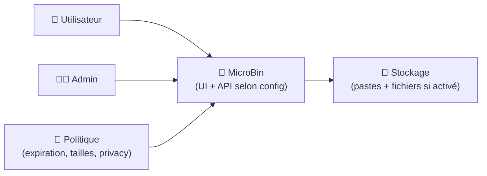
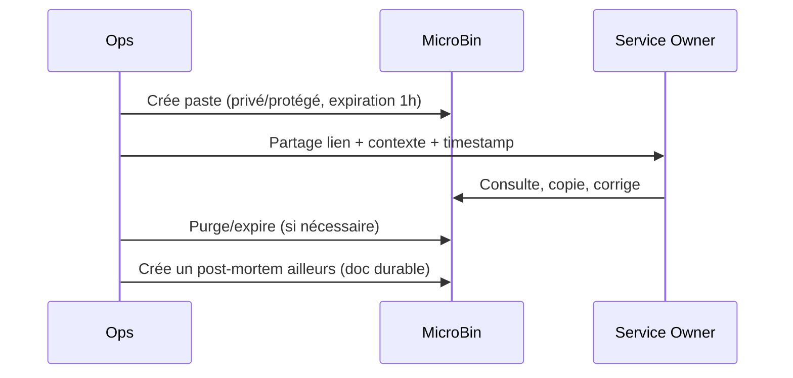

# 📌 MicroBin — Présentation & Configuration Premium (Sans install / sans proxy / sans firewall / sans 30-60-90)

### Pastebin moderne, léger, sécurisé, riche (texte + fichiers) — parfait pour partage interne & runbooks
Qualité maîtrisée • Gouvernance • Sécurité applicative • Exploitation durable

---

## TL;DR

- **MicroBin** = “pastebin” auto-hébergeable **très léger** (Rust), orienté partage rapide (snippets, notes, fichiers selon config).
- La version “premium” repose sur : **privacy levels**, **auth**, **expiration**, **limites**, **chiffrement**, **règles de partage**, **modération**.
- Doit être considéré comme un **outil sensible** : les pastes peuvent contenir secrets/logs.

Docs officielles : https://microbin.eu/docs/

---

## ✅ Checklists

### Pré-usage (avant d’ouvrir aux équipes)
- [ ] Définir les cas d’usage autorisés (snippets, logs, fichiers, liens)
- [ ] Décider : public / interne / restreint (et quelles privacy levels)
- [ ] Activer une auth (au minimum **admin** + idéalement **basic auth** si exposé)
- [ ] Fixer une politique d’expiration (par défaut) + limites de taille
- [ ] Définir une politique “secrets” (interdit / masquage / purge)
- [ ] Choisir si l’upload fichiers est autorisé et avec quelles limites

### Post-configuration (qualité opérationnelle)
- [ ] Création/accès admin OK (`/admin` si activé)
- [ ] Test paste : création, lecture, suppression, expiration
- [ ] Test privacy : public vs privé vs protégé
- [ ] Test limites : taille max, type de fichier (si applicable)
- [ ] Logs propres (pas de boucle d’erreurs)
- [ ] Runbook “incident paste leak” prêt (purge + rotation creds)

---

> [!TIP]
> MicroBin excelle comme “**tampon temporaire**” (partage rapide), pas comme stockage long terme.
>
> Utilise-le avec une politique d’expiration par défaut.

> [!WARNING]
> Un paste = souvent **secret involontaire** (token, IP, stack trace).
>
> Applique une **discipline** : redaction, expiration courte, accès restreint.

> [!DANGER]
> Si MicroBin est accessible publiquement et que l’upload est activé sans limites strictes, tu crées un point d’abus (spam, stockage, contenu illégal).
>
> Mets des limites + auth + règles claires.

---

# 1) MicroBin — Vision moderne

MicroBin n’est pas “juste un pastebin”.

C’est :
- 🧠 Un **moteur de partage** configurable (privacy, expiration, mot de passe)
- 🔐 Un **outil de contrôle** (admin console, options d’accès)
- 🧰 Un **outil d’équipe** (incidents, support, dev, ops)
- ⚙️ Un service **ultra léger** (excellent pour homelab/VPS)

Référence produit / repo : https://github.com/szabodanika/microbin

---

# 2) Architecture globale (logique)



---

# 3) Philosophie premium (5 piliers)

1. 🔐 **Contrôle d’accès** (admin + auth utilisateur si nécessaire)
2. 🕒 **Expiration par défaut** (réduit la surface de fuite)
3. 📏 **Limites strictes** (taille paste/fichier, types, quotas)
4. 🧊 **Privacy levels cohérents** (public / non listé / privé / protégé)
5. 🧪 **Validation & rollback** (tests simples, retour arrière rapide)

---

# 4) Modèle de sécurité (ce que tu veux “vraiment” obtenir)

## 4.1 Politique “anti-fuite”
- Expiration par défaut : courte (ex: 1h / 24h selon usage)
- Interdire les secrets “long terme” (tokens, clés privées, dumps)
- Encourager :
  - masquage partiel
  - partages privés/protégés
  - paste “one-time” si dispo dans ta stratégie

## 4.2 Stratégies d’accès (3 modèles)
- **Interne uniquement** (LAN/VPN) : simple et efficace
- **Internet + auth** : acceptable si règles strictes
- **Public** : déconseillé sauf cas très cadré (et durci)

> [!TIP]
> Le meilleur durcissement = **réduire l’exposition** + **réduire la durée de vie** des pastes.

---

# 5) Configuration premium (principes + options clés)

MicroBin se configure via **variables d’environnement** et/ou **arguments CLI**.
Référence complète : https://microbin.eu/docs/installation-and-configuration/configuration/

## 5.1 Auth (minimale mais sérieuse)
Objectif :
- un compte **admin**
- une **basic auth** (si exposition externe)
- une séparation claire : admin ≠ usage courant

Variables typiques à connaître (exemples conceptuels, adapte à ta politique) :
- `MICROBIN_ADMIN_USERNAME`
- `MICROBIN_ADMIN_PASSWORD`
- `MICROBIN_BASIC_AUTH_USERNAME`
- `MICROBIN_BASIC_AUTH_PASSWORD`

> [!WARNING]
> Évite de mettre des identifiants faibles : MicroBin est souvent exposé “pour dépanner”, donc attaqué “par opportunité”.

## 5.2 Privacy levels (gouvernance)
Objectif :
- choisir un **mode par défaut**
- empêcher les surprises (pastes indexables / visibles)

Approche recommandée :
- défaut = **non listé** ou **protégé**
- public = volontaire (pas accidentel)

## 5.3 Expiration & rétention
Objectif :
- expiration par défaut
- limites max (empêche l’archivage implicite)

Bon sens :
- incidents/support : 1h → 24h
- dev/review : 24h → 7j
- “à garder” : migrer vers ta doc (BookStack) ou un dépôt (Git)

## 5.4 Uploads (si activés)
Objectif :
- limiter taille & types
- limiter surface d’abus

Checklist :
- taille max fichiers
- types autorisés (si option)
- quota/stockage surveillé
- politique de purge (expiration)

---

# 6) Workflows premium (équipe)

## 6.1 Incident “partage de logs” (séquence)


## 6.2 “Du paste vers la doc”
Règle premium :
- Tout ce qui doit survivre > 7 jours → **migration vers BookStack / Git / KB**
- MicroBin sert de **sas** : rapide, temporaire, contrôlé

---

# 7) Validation / Tests / Rollback

## 7.1 Smoke tests (fonctionnels)
```bash
# Page répond
curl -I http://MICROBIN_HOST:PORT | head

# Vérifie qu’une page de base s’affiche
curl -s http://MICROBIN_HOST:PORT | head -n 20
```

Tests manuels (UI) :
- créer un paste
- tester expiration
- tester privacy
- tester auth (admin / basic)
- supprimer un paste

## 7.2 Tests de sécurité (must-have)
- sans auth : pas d’accès (si tu l’exiges)
- un utilisateur non-admin ne peut pas accéder aux fonctions admin
- un paste “privé/protégé” n’est pas visible au mauvais périmètre

## 7.3 Rollback (simple)
- revenir à la config précédente (env/args)
- désactiver uploads temporairement si abus
- raccourcir expiration par défaut
- tourner les mots de passe (admin/basic) si suspicion

> [!DANGER]
> Si tu suspectes une fuite : **rotation immédiate** des secrets potentiellement exposés dans les pastes (tokens/API keys).

---

# 8) Erreurs fréquentes (et comment les éviter)

- ❌ “MicroBin devient une archive”  
  ✅ Fix : expiration par défaut + migration vers doc durable

- ❌ “On colle des secrets”  
  ✅ Fix : politique + redaction + modèle de paste “safe” + rotation si incident

- ❌ “Uploads abusés”  
  ✅ Fix : limiter tailles/types + désactiver temporairement + auth stricte

- ❌ “Trop de visibilité”  
  ✅ Fix : privacy par défaut non-public + auth + exposition minimale

---

# 9) Modèle de page “Paste Premium” (à copier dans tes habitudes)

**Titre** : `[INC] api-timeouts — logs nginx upstream`  
**Contexte** : incident #1234, prod, 2026-03-01 14:05 CET  
**Contenu** : extrait minimal (redaction tokens)  
**Durée** : expiration 1h  
**Visibilité** : protégé (pwd partagé hors canal public)  
**Actions** : lien runbook + hypothèse + next step

---

# 10) Sources — Images Docker (format demandé : URLs brutes)

## 10.1 Image communautaire la plus citée (officielle)
- `danielszabo99/microbin` (Docker Hub) : https://hub.docker.com/r/danielszabo99/microbin  
- Tags (vérifier versions) : https://hub.docker.com/r/danielszabo99/microbin/tags  
- Doc MicroBin “Docker” (référence l’image DockerHub) : https://microbin.eu/docs/installation-and-configuration/docker/  

## 10.2 Références upstream (source de vérité)
- Repo MicroBin (code, releases, issues) : https://github.com/szabodanika/microbin  
- Releases MicroBin : https://github.com/szabodanika/microbin/releases  
- Configuration (env/CLI) : https://microbin.eu/docs/installation-and-configuration/configuration/  

## 10.3 LinuxServer.io (si une image existe, elle est listée ici)
- Catalogue des images LinuxServer.io : https://www.linuxserver.io/our-images  
- Documentation LinuxServer.io (général) : https://docs.linuxserver.io/  