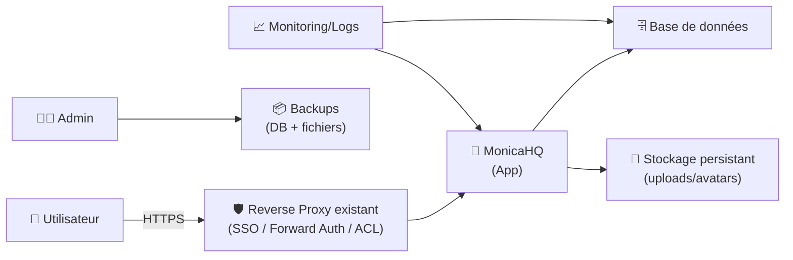
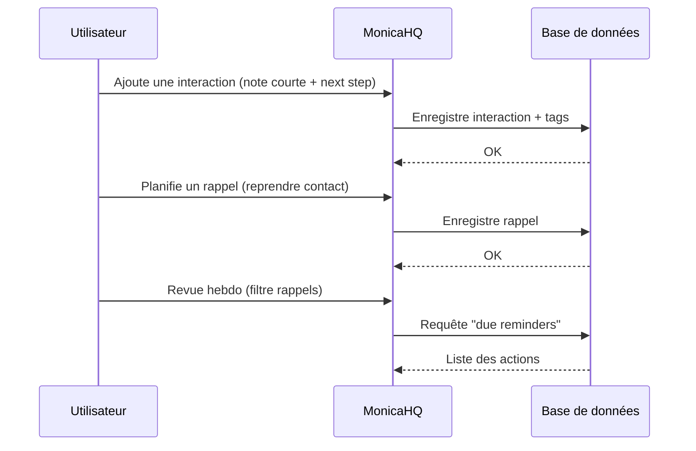

# 👥 MonicaHQ — Présentation & Exploitation Premium (PRM / “Personal CRM”)

### Gérer tes relations comme une mémoire augmentée : contacts, interactions, rappels, journal, événements
Optimisé pour reverse proxy existant • Permissions & rôles • SMTP • Backups & Rollback • Exploitation durable

---

## TL;DR

- **MonicaHQ** = un **PRM** (Personal Relationship Manager) : tu documentes tes relations (famille, amis, collègues) et tes interactions.
- Objectif : **ne plus “oublier”** ce qui compte (dernière discussion, sujets, dates, préférences, contexte).
- Une utilisation premium = **structure**, **hygiène des données**, **rappels**, **champs personnalisés**, **sécurité d’accès**, **backups testés**.

---

## ✅ Checklists

### Pré-usage (avant d’embarquer d’autres personnes)
- [ ] Décider du périmètre : perso / couple / équipe (petite org)
- [ ] Définir conventions de saisie : tags, champs, événements, notes
- [ ] Activer SMTP (invitations + notifications si utilisées)
- [ ] Définir accès : SSO/forward-auth/VPN via reverse proxy existant
- [ ] Définir une routine : “mise à jour hebdo” + “revue mensuelle”

### Post-configuration (qualité opérationnelle)
- [ ] Contacts importés (CSV si besoin) + dédoublonnage OK
- [ ] Champs personnalisés validés (pas 50 dès le jour 1)
- [ ] Rappels fonctionnels (anniversaires, “reprendre contact”)
- [ ] Backups automatiques + test de restauration validé
- [ ] Runbook “incident / maintenance” écrit (simple)

---

> [!TIP]
> MonicaHQ est plus puissant quand tu t’imposes une **hygiène** : une note courte après un échange important, et une revue hebdomadaire.

> [!WARNING]
> Les données sont **hautement personnelles**. Traite l’instance comme un coffre : accès strict, sauvegardes chiffrées, logs prudents.

> [!DANGER]
> Évite d’y stocker des informations ultra sensibles (mots de passe, secrets, détails médicaux très précis) si tu n’as pas un modèle de sécurité mature.

---

# 1) MonicaHQ — Vision moderne

MonicaHQ n’est pas un carnet d’adresses.

C’est :
- 🧠 Une **mémoire structurée** (faits + contexte)
- 🔁 Un **moteur de suivi** (interactions, tâches, rappels)
- 🗓️ Un **journal relationnel** (événements, conversations, timeline)
- 🧩 Un **système extensible** (champs personnalisés, tags, API)

Cas d’usage typiques :
- Onboarding social / pro (nouvelle ville, nouveau job)
- Suivi client léger (TPE/solo) sans CRM lourd
- Gestion familiale (anniversaires, préférences, événements)
- Réseau (communautés, associations)

---

# 2) Architecture globale (concept)



---

# 3) Modèle de données (pour bien structurer)

## Entités clés
- **Contact** : fiche centrale (infos, tags, relations)
- **Interaction** : note / appel / rencontre / message (timestamp + contexte)
- **Activité / Journal** : timeline d’événements
- **Rappels** : anniversaires + “reprendre contact”
- **Champs personnalisés** : adapter à ton besoin (projets, préférences, etc.)

## Taxonomie premium (simple, durable)
- Tags “rôle” : `famille`, `amis`, `travail`, `asso`
- Tags “intérêt” : `sport`, `tech`, `voyage`
- Tags “action” : `follow-up`, `cadeau-idée`, `à-revoir`
- Convention interactions :
  - 1–3 phrases max
  - un point “next step” si nécessaire

---

# 4) Gouvernance & Permissions (si plusieurs utilisateurs)

Stratégie recommandée :
- 👑 **Admin** : gestion instance, utilisateurs, paramètres
- ✍️ **Contributeurs** : création/édition
- 👀 **Lecture** : si tu veux un mode “consultation”

Bonnes pratiques :
- Moindre privilège (least privilege)
- Séparer “perso” et “partagé” si l’instance sert à plusieurs personnes
- Éviter les exports non chiffrés

---

# 5) Configuration premium (sans recettes d’installation)

## 5.1 URL & reverse proxy
- L’URL externe doit être stable (cookies, liens, redirections)
- Si tu utilises un **subpath** (ex: `/monica`), respecte les recommandations de la doc (base URL, rewriting) et teste tous les liens.

## 5.2 SMTP (confort + fiabilité)
Objectifs :
- invitations
- notifications (si activées)
- reset password

Checklist :
- From address cohérente
- DKIM/SPF/DMARC côté domaine (si envoi externe)
- Test d’envoi validé

## 5.3 Champs personnalisés (éviter l’usine à gaz)
Commencer avec 5–10 champs max, puis itérer :
- “Comment on s’est rencontrés”
- “Dernier sujet important”
- “Préférences cadeaux”
- “Allergies” (si pertinent)
- “Projets en commun”

> [!TIP]
> Les champs personnalisés doivent rester rares et stables ; le reste va dans les **interactions**.

---

# 6) Workflows premium (usage “qui marche”)

## 6.1 Routine hebdomadaire (10 minutes)
- Trier “à reprendre contact”
- Ajouter 1 interaction pour les échanges importants
- Planifier 1–3 rappels

## 6.2 Routine mensuelle (30 minutes)
- Dédoublonner contacts
- Nettoyer tags
- Export/backup vérifié
- Revue des rappels (éviter l’inflation)

---

# 7) Observabilité & “ops”

Ce que tu veux surveiller (simple) :
- disponibilité HTTP (page login)
- latence (si grosse base)
- erreurs applicatives
- santé DB
- espace disque (uploads + DB)

Runbook minimal :
- comment récupérer les logs
- comment diagnostiquer un 500
- comment vérifier DB
- comment restaurer un backup

---

# 8) Validation / Tests / Rollback

## Tests de validation (smoke tests)
```bash
# 1) Service répond (via URL externe)
curl -I https://monica.example.tld | head

# 2) Vérifier page login (contenu basique)
curl -s https://monica.example.tld | head -n 30
```

## Tests fonctionnels (manuel)
- création contact
- ajout interaction
- ajout rappel
- upload avatar
- export (si utilisé)

## Rollback (concept)
- Restaurer **DB + fichiers** depuis le dernier backup validé
- Vérifier intégrité : login + consultation + timeline
- Documenter “retour arrière” en 5 étapes maximum

> [!WARNING]
> Un backup non testé = un backup imaginaire. Le test de restauration est obligatoire (mensuel idéalement).

---

# 9) Diagramme “cycle d’une interaction” (séquence)



---

# 10) Sources — Images Docker (comme ton format demandé)

## 10.1 Image officielle “Docker Official Image” (la plus standard)
- `monica` (Docker Hub, Official Image) : https://hub.docker.com/_/monica  
- Repo de packaging (source indiquée dans les métadonnées OCI) : https://github.com/monicahq/docker  
- Doc MonicaHQ “Docker” (contexte sur les images) : https://docs.monicahq.com/developers/docker  

## 10.2 Image MonicaHQ historique (à connaître)
- `monicahq/monicahq` (Docker Hub) : https://hub.docker.com/r/monicahq/monicahq  
- Tags `monicahq/monicahq` (montrent l’ancienneté) : https://hub.docker.com/r/monicahq/monicahq/tags  

## 10.3 Image LinuxServer.io (LSIO) si tu préfères l’écosystème LSIO
- `lscr.io/linuxserver/monica` (Docker Hub) : https://hub.docker.com/r/linuxserver/monica  
- Doc LinuxServer “docker-monica” : https://docs.linuxserver.io/images/docker-monica/  
- Annonce “New Container: Monica” (LSIO) : https://info.linuxserver.io/issues/2024-01-22-monica/  

## 10.4 Images GHCR (dev / next-gen selon branches)
- Packages GitHub (monica-next / chandler) : https://github.com/monicahq/chandler/pkgs/container/monica-next  
- Exemple image dev (monica-dev) : https://github.com/orgs/monicahq/packages/container/monica-dev  

---

# ✅ Conclusion

MonicaHQ devient “premium” quand :
- tu imposes une **structure minimale** (tags + interactions courtes),
- tu actives une **routine** (hebdo + mensuelle),
- tu sécurises l’accès (reverse proxy existant + auth),
- et tu traites les backups comme un produit (tests + rollback).