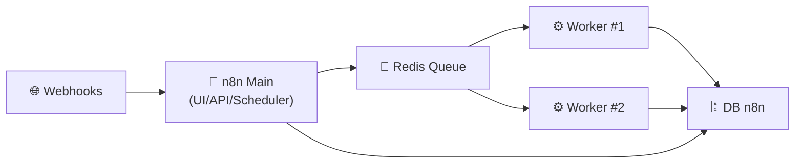

# 🔁 n8n — Présentation & Exploitation Premium (Automatisation “dev-friendly”)

### Workflow automation pour équipes techniques : low-code + code, webhooks, files, IA, intégrations
Optimisé pour reverse proxy existant • Gouvernance • Sécurité secrets • Scalabilité (queue mode) • Exploitation durable

---

## TL;DR

- **n8n** = plateforme d’automatisation **orientée workflows** (nodes + données), pensée pour les équipes techniques.
- Points forts : **webhooks**, **intégrations**, **expressions**, **code node**, **sub-workflows**, **erreurs gérées**, **API**.
- En prod : vise **gouvernance**, **gestion des secrets**, **observabilité**, et **scaling** via **queue mode** (Redis + workers) quand la charge augmente.

Références : docs n8n https://docs.n8n.io/ • repo https://github.com/n8n-io/n8n

---

## ✅ Checklists

### Pré-usage (avant d’ouvrir n8n à une équipe)
- [ ] Conventions de naming (workflows, creds, variables, tags)
- [ ] Gouvernance : qui peut créer / activer / modifier ?
- [ ] Stratégie secrets : rotation, stockage, accès minimal
- [ ] Politique “prod” : review + versioning + promotion (dev → staging → prod)
- [ ] Stratégie webhooks : endpoints stables, auth, anti-replay, rate limit (au niveau proxy/gateway)
- [ ] Procédure incident : logs, retries, DLQ/queue (si queue mode), rollback

### Post-configuration (qualité opérationnelle)
- [ ] “Error workflows” configurés (capture erreurs + alerting)
- [ ] Gestion de credentials : pas de secrets en clair dans les nodes
- [ ] Backups & restore testés (DB + données n8n)
- [ ] Monitoring minimal : disponibilité + latence webhook + taux d’échec
- [ ] Tests “smoke” sur workflows critiques (1 exécution nominale + 1 exécution erreur)

---

> [!TIP]
> n8n excelle quand tu formalises des **patterns** : ingestion → validation → transformation → action → notification → audit.

> [!WARNING]
> Le piège n°1 : transformer n8n en “spaghetti” de nodes sans conventions ni gouvernance.  
> Fais simple : conventions + sub-workflows + erreurs gérées.

> [!DANGER]
> Ne mets jamais des secrets (tokens, mots de passe) en dur dans un node ou un champ texte.  
> Utilise les **Credentials**, des variables, et/ou des méthodes de configuration prévues pour les secrets.

---

# 1) n8n — Vision moderne

n8n n’est pas “un Zapier self-host”.

C’est :
- 🧠 Un **orchestrateur** de logique (conditions, boucles, transformations)
- 🧩 Un **connecteur** d’applications (HTTP, SaaS, DB, queues, fichiers)
- ⚙️ Un **moteur d’exécutions** (triggers, retries, erreurs, sub-workflows)
- 🧪 Un **bac à sable dev** (expressions, code node, tests rapides)

---

# 2) Architecture globale

```mermaid
flowchart LR
    User["👤 Utilisateurs / Admins"] --> UI["🖥️ UI n8n (Editor)"]
    Systems["🌐 Services externes\n(SaaS, APIs, DB, Files)"] --> Triggers["⏱️ Triggers\n(Webhook/Cron/Poll)"]

    Triggers --> Engine["⚙️ Execution Engine"]
    UI --> Engine

    Engine --> Integrations["🔌 Nodes / Integrations"]
    Integrations --> Systems

    Engine --> Data["🗄️ Persistance\n(executions, creds, workflows)"]
    Alert["🚨 Alerting"] <-- Engine
    Logs["📜 Logs"] <-- Engine
```

---

# 3) Concepts clés (à maîtriser pour une config “premium”)

## 3.1 Data model n8n
- Chaque node manipule des **items** (objets JSON).
- Les **Expressions** te permettent de référencer le output d’un node précédent.
- Une “bonne pratique” = normaliser tôt (validation + mapping) pour éviter la dette.

## 3.2 Triggers
- **Webhook** : temps réel, idéal prod (avec auth/rate-limit côté gateway/proxy).
- **Cron** : batch planifié.
- **Polling** : utile quand l’app ne supporte pas webhooks.

## 3.3 Error handling (maturité)
- Définir un workflow d’erreur (ex : notif + création ticket + capture payload).
- Utiliser les stratégies de retry/backoff (selon nodes) + idempotence.

Doc “Error handling” (concepts & pratiques) : https://docs.n8n.io/flow-logic/error-handling/

---

# 4) Gouvernance “pro” (évite le chaos)

## Stratégie simple et efficace
- 🧑‍💻 **Builders** : créent/modifient en dev/staging
- 🧯 **Operators** : gèrent activations, scheduling, incidents en prod
- 👀 **Auditors** : lecture + contrôle + post-mortems

## Règles d’or
- Un workflow “prod” = **review** + **naming** + **tags** + **owner**.
- Centralise les patterns en **sub-workflows** (réutilisables).

---

# 5) Sécurité & Secrets (sans recettes d’install)

## 5.1 Principes
- Secrets uniquement via **Credentials** / mécanismes dédiés.
- Limiter l’exposition des webhooks (auth, signatures, allowlist IP si possible).
- Séparer environnements (dev/staging/prod) au minimum logiquement.

## 5.2 “Secrets in files” (bonne pratique prod)
n8n supporte une méthode qui permet de fournir des valeurs sensibles via des fichiers (utile avec secrets managers / orchestrateurs).
Doc : https://docs.n8n.io/hosting/configuration/configuration-methods/

---

# 6) Scalabilité — quand passer en “queue mode”

Quand tu as :
- beaucoup de webhooks simultanés,
- des workflows lourds,
- besoin de résilience/throughput,

➡️ **Queue mode** sépare :
- un nœud “main” (UI/API + orchestration),
- des **workers** (exécution),
- et un **Redis** (queue/broker).



Docs queue mode :
- https://docs.n8n.io/hosting/scaling/queue-mode/
- env vars queue mode : https://docs.n8n.io/hosting/configuration/environment-variables/queue-mode/

---

# 7) Task Runners (Code node “external”)

Si tu utilises fortement le **Code node** (JS/Python) et que tu veux isoler l’exécution :
- tu peux déporter l’exécution dans des **task runners** (sidecar / service dédié),
- ce qui améliore l’isolation, la scalabilité et la stabilité.

Docs task runners :
- https://docs.n8n.io/hosting/configuration/task-runners/
- env vars task runners : https://docs.n8n.io/hosting/configuration/environment-variables/task-runners/

> [!WARNING]
> En mode externe, la compatibilité de version est importante : **runners** et **n8n** doivent correspondre (voir doc task runners).

---

# 8) Workflows premium (patterns éprouvés)

## 8.1 Pattern “Ingestion robuste”
1) Trigger (Webhook/Cron)  
2) Validation (schema, champs requis)  
3) Normalisation (mapping)  
4) Action (API/DB)  
5) Notification (succès/échec)  
6) Audit (trace ID, payload minimal, statut)

## 8.2 Pattern “Idempotence”
- Générer une clé unique (hash payload + timestamp arrondi + source id)
- Stocker la clé côté DB/kv
- Rejeter/ignorer les doublons

## 8.3 Pattern “Sub-workflow”
- Encapsuler : auth API, pagination, retry/backoff, transformation standard
- Appeler depuis plusieurs workflows

---

# 9) Validation / Tests / Rollback

## 9.1 Tests de validation (smoke)
```bash
# UI/API répond
curl -I https://N8N_URL | head

# Webhook répond (si endpoint public connu)
curl -i -X POST https://N8N_URL/webhook/mon-endpoint -H 'Content-Type: application/json' -d '{"ping":"ok"}'
```

## 9.2 Tests fonctionnels (à faire “réellement”)
- 1 exécution nominale (happy path) sur workflow critique
- 1 exécution erreur (payload invalide) → doit déclencher le workflow d’erreur
- vérifier : temps d’exécution, retries, absence de secrets dans logs

## 9.3 Rollback (méthode opérationnelle)
- Rollback “logique” : désactiver le workflow, re-router vers version précédente (si versioning interne/backup)
- Rollback “config” : revenir à la config/variables précédentes (secrets inclus)
- Rollback “release” : repasser à une version d’image/tag précédents (si tu utilises Docker/K8s)

> [!TIP]
> Une release “safe” = backup + upgrade + smoke tests + plan de retour immédiat.

---

# 10) Erreurs fréquentes (et comment les éviter)

- ❌ Workflows sans conventions → impossible à maintenir  
  ✅ tags + naming + owners + sub-workflows
- ❌ Webhooks sans auth → exposition directe  
  ✅ auth/signature côté gateway + rate limit
- ❌ Secrets dans les nodes → fuite inévitable  
  ✅ Credentials + méthodes de configuration dédiées
- ❌ Pas d’error workflow → “silence radio” en incident  
  ✅ error workflow + alerting + ticketing
- ❌ Charge croissante en mode “single” → latence + timeouts  
  ✅ queue mode (Redis + workers)

---

# 11) Sources — Images Docker (format demandé, URLs brutes)

## 11.1 Image officielle la plus citée (n8n)
- `n8nio/n8n` (Docker Hub) : https://hub.docker.com/r/n8nio/n8n  
- Tags `n8nio/n8n` (Docker Hub) : https://hub.docker.com/r/n8nio/n8n/tags  
- Doc n8n “Docker Installation” (référence image officielle) : https://docs.n8n.io/hosting/installation/docker/  
- Package GHCR `ghcr.io/n8n-io/n8n` (GitHub Packages) : https://github.com/orgs/n8n-io/packages/container/n8n  

## 11.2 Image officielle Task Runners (Code node external)
- `n8nio/runners` (Docker Hub) : https://hub.docker.com/r/n8nio/runners  
- Tags `n8nio/runners` (Docker Hub) : https://hub.docker.com/r/n8nio/runners/tags  
- Doc n8n “Task runners” (mentionne `n8nio/runners`) : https://docs.n8n.io/hosting/configuration/task-runners/  
- Package GHCR `ghcr.io/n8n-io/runners` (GitHub Packages) : https://github.com/n8n-io/n8n/pkgs/container/runners  

## 11.3 Registry n8n (mention communauté / hosting repo)
- Mention `docker.n8n.io/n8nio/n8n:latest` (thread communauté) : https://community.n8n.io/t/runner-image-missing-from-n8ns-docker-registry/233717  
- Repo “n8n-hosting” (références d’environnements d’hébergement) : https://github.com/n8n-io/n8n-hosting  

## 11.4 LinuxServer.io (LSIO) — statut
- Pas d’image officielle `linuxserver/n8n` identifiée ; exemple d’image tierce “style LSIO” : `xawtor/linuxserver-n8n` : https://hub.docker.com/r/xawtor/linuxserver-n8n  

---

# ✅ Conclusion

n8n devient “premium” quand :
- tu imposes des **conventions** (naming/tags/owners),
- tu industrialises **erreurs + audit + idempotence**,
- tu traites les **secrets** correctement,
- et tu scales proprement (queue mode + task runners si besoin).

Résultat : une plateforme d’automatisation maintenable, gouvernée et exploitable en production.